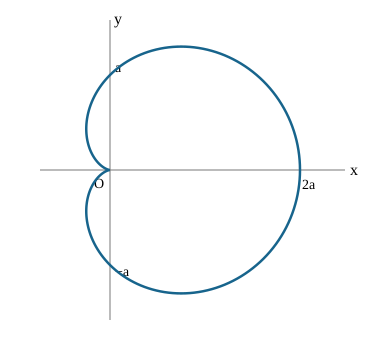

# 力学官方题库逐题解答

按本次下载原图逐题核对，保留原文件编号。每节链接指向官方原图，题意用中文摘要，解答由本资料重新推导；它与另册“教学自编题”不同。图中未明说而解题需要的理想化假设会在对应题内说明。取向量、角速度正方向后，带符号量与大小分别交代。

## 1-1T2｜剪断一根悬绳后的瞬时张力

[官方原图](官方题库/1-1T2.png)。质量 $M$ 的物体由距质心各 $a$ 的两根竖直绳静止悬挂，关于左悬点 $A$ 的惯量为 $I_A=3Ma^2/2$；剪断右绳，求左绳张力。

剪断瞬间角速度为零。左绳不可伸长且初始静止，故 $A$ 沿绳方向的加速度为零；质心与 $A$ 高度相同，质心竖直向下加速度为 $a\alpha$。用平行轴定理，$I_C=I_A-Ma^2=Ma^2/2$。质心平动与转动方程为

$$
Mg-T=Ma\alpha,\qquad Ta=I_C\alpha.
$$

消去 $\alpha$ 得 $Mg-T=2T$，故 $T=Mg/3$，$a_C=2g/3$，$\alpha=2g/(3a)$。只在这一瞬间可利用上述绳约束；不必把悬点误当永久固定铰链。张力小于原来的 $Mg/2$，符合物体开始下落。

## 1-1T3｜旋转曲面上的粒子与圆轨道

[官方原图](官方题库/1-1T3.png)。粒子质量 $m$，光滑定常曲面 $z=Ar^n$，$A>0$，重力向下，总能量 $E$；要求能量、拉格朗日量、共轭动量、哈密顿量及稳定圆轨道。

**(a)(b)** 柱坐标速度平方为 $\dot r^2+r^2\dot\theta^2+\dot z^2$；约束给 $\dot z=Anr^{n-1}\dot r$。记 $f(r)=1+A^2n^2r^{2n-2}$，则

$$
T=\frac m2[f(r)\dot r^2+r^2\dot\theta^2],\qquad V=mgAr^n,\qquad L=T-V.
$$

**(c)** $p_r=mf\dot r$，$p_\theta=mr^2\dot\theta=\ell$。$\theta$ 循环，$\ell$ 守恒。

**(d)** $H=p_r^2/(2mf)+\ell^2/(2mr^2)+mgAr^n=T+V=E$。理由是约束定常、动能对速度二次齐次、势能不依赖速度，且 $L$ 无显含时间。

**(e)** 固定 $\ell\ne0$ 时 $V_{\rm eff}=mgAr^n+\ell^2/(2mr^2)$。圆轨道要求 $mgAnr_0^{n-1}=\ell^2/(mr_0^3)$，所以

$$
r_0=\left(\frac{\ell^2}{m^2gAn}\right)^{1/(n+2)},\quad
E=mgA\left(1+\frac n2\right)r_0^n,
\quad r_0=\left[\frac{2E}{mgA(n+2)}\right]^{1/n}.
$$

对 $A,g>0$ 的非静止圆运动，需 $n>0$；$n=0$ 没有径向恢复作用，$n<0$ 的重力沿面分力不能提供所需向心趋势。圆轨道曲率 $V_{\rm eff}''(r_0)=mgAn(n+2)r_0^{n-2}>0$，故稳定；径向频率平方为该曲率除以 $mf(r_0)$。最后一个半径表达使用的是圆轨道能量，不能把任意同能量轨迹都当成圆轨道。

## 1-1T4｜电磁波正入射欧姆导体

[官方原图](官方题库/1-1T4.png)。本图虽放在力学题库，实际要求导出真空平面波正入射非磁性导体的反射振幅，并检查理想导体极限。

取时间因子 $e^{-i\omega t}$，导体介电常数 $\varepsilon$、电导率 $\sigma$、磁导率 $\mu_0$。由安培—麦克斯韦方程，复介电常数为 $\widetilde\varepsilon=\varepsilon+i\sigma/\omega$；向导体内部传播的波数取满足衰减的支

$$
k=\omega\sqrt{\mu_0\widetilde\varepsilon},\qquad \operatorname{Im}k\ge0.
$$

真空中 $H_i=E_i/Z_0$、$H_r=-E_r/Z_0$，$Z_0=\sqrt{\mu_0/\varepsilon_0}$；导体内 $H_t=kE_t/(\mu_0\omega)$。界面切向场连续给 $E_i+E_r=E_t$、$(E_i-E_r)/Z_0=kE_t/(\mu_0\omega)$。因此

$$
\frac{E_r}{E_i}=\frac{1-\beta}{1+\beta},\qquad
\beta=\frac{kZ_0}{\mu_0\omega}=\sqrt{\frac{\varepsilon+i\sigma/\omega}{\varepsilon_0}}.
$$

这是复振幅关系，不是仅大小关系。$\sigma\to\infty$ 时 $|\beta|\to\infty$，反射系数趋于 $-1$，反射率趋于 1，电场相位差为 $\pi$。$\sigma=0,\varepsilon=\varepsilon_0$ 时反射为零，也与同一介质无界面的极限一致。

## 1-1T5｜贯穿地心的隧道

[官方原图](官方题库/1-1T5.png)。求仅受重力的小球运动、往返时间、最大速度、空气声速估计，以及带电后辐射的定性影响。

原题未给地球内部密度剖面。为得到所问数量估计，采用均匀密度球、忽略地球自转和隧道挖去的质量。取 $R=6.4\times10^6\,\mathrm m$、$g_s=9.8\,\mathrm{m/s^2}$。一般非均匀模型应先用 $M(r)=4\pi\int_0^r\rho(s)s^2ds$ 求引力，不能保证简谐。

**(a)(b)** 沿隧道取有符号坐标 $x$，球壳定理给 $\ddot x=-GMx/R^3=-\omega^2x$，$\omega=\sqrt{g_s/R}$。初始 $x(0)=R,\dot x(0)=0$，所以 $x=R\cos\omega t$：在两端地表之间往复振荡。

**(c)** 回到出发端的往返时间 $T=2\pi\sqrt{R/g_s}\simeq5.08\times10^3\,\mathrm s\simeq84.6\,\mathrm{min}$；到另一端是 $T/2$。

**(d)** 地心处速率最大，$v_{\max}=\omega R=\sqrt{g_sR}\simeq7.9\times10^3\,\mathrm{m/s}$。

**(e)** 地表常温空气声速取一位有效数字 $3\times10^2\,\mathrm{m/s}$，介质若指岩石则不是这个数；本问通常按地表空气解释。

**(f)** 带电体的加速运动会激发电磁辐射，在介质中具体辐射还取决于介电响应与是否达到切伦科夫条件。辐射带走机械能，使振幅逐渐衰减、最大速度下降，最终趋向中心平衡。题目未给电荷与介质响应，不能定量断言辐射阻尼必可忽略；若阻尼弱，每一周期仍近似上述简谐运动。

## 1-1T6｜两根串联弹簧

[官方原图](官方题库/1-1T6.png)。无质量弹簧 $k_1,k_2$ 串联，连接点位移为 $x_1$，物块质量 $m$、总位移 $x$；两位移均从无受力位置计。

**(a)** 无质量连接点每时刻合力为零，$k_1x_1=k_2(x-x_1)$，所以 $x_1=k_2x/(k_1+k_2)$。物块受力为 $-k_2(x-x_1)$，因此

$$
m\ddot x+\frac{k_1k_2}{k_1+k_2}x=0.
$$

**(b)** $k_{\rm eff}=k_1k_2/(k_1+k_2)$，故 $T=2\pi\sqrt{m(k_1+k_2)/(k_1k_2)}$。若 $k_2\to\infty$，第二根近似刚性，恢复 $T=2\pi\sqrt{m/k_1}$；串联等效刚度小于任一有限刚度。

## 1-1T7｜二维三次势的哈密顿方程与可积性

[官方原图](官方题库/1-1T7.png)。势能 $U=k_0(x^2+y^2)/2+k_1x^2y-k_2y^3$，题干说明 $k_0,k_1,k_2>0$；求动量、哈密顿量、方程及可积条件。

**(a)(b)** 取通常直角动能 $T=m(v_x^2+v_y^2)/2$，得到 $p_x=mv_x,p_y=mv_y$，

$$
H=\frac{p_x^2+p_y^2}{2m}+\frac{k_0}2(x^2+y^2)+k_1x^2y-k_2y^3.
$$

**(c)** $\dot x=p_x/m,\dot y=p_y/m$，$\dot p_x=-k_0x-2k_1xy$、$\dot p_y=-k_0y-k_1x^2+3k_2y^2$。等价地 $m\dot v_x=-k_0x-2k_1xy$、$m\dot v_y=-k_0y-k_1x^2+3k_2y^2$。

**(d) 先说明“可积”的含义。** 二自由度系统的 Liouville 可积性要求除 $H$ 外，还有一个独立的第一积分 $I$，且 $\{H,I\}=0$。本问讨论通常复解析延拓后以亚纯第一积分表述的可积性；这比“某些初始条件有特殊解”强得多。**若坚持题干 $k_0,k_1,k_2>0$，本系统没有使完整非线性运动可积的参数组合。** 这是一条需要引用进阶理论的结论，不能只凭“势能有耦合”证明。

具体地，把三次势写为广义 Hénon–Heiles 形式 $\alpha q_1q_2^2-\beta q_1^3/3$，取 $q_1=y,q_2=x$，得到 $\beta/\alpha=3k_2/k_1$；质量归一化不改变此比值。已知非零耦合的可积族及本题对应条件为：

| 标准三次系数比 | 对二次势系数的要求 | 本题的对应条件 |
|---|---|---|
| $\beta/\alpha=-1$ | 两方向二次系数相等 | $k_1=-3k_2$ |
| $\beta/\alpha=-6$ | 两方向二次系数任意 | $k_1=-k_2/2$ |
| $\beta/\alpha=-16$ | $q_1$ 的二次系数为 $q_2$ 的16倍 | $k_1=-3k_2/16$，且本题等系数形式要求 $k_0=0$ |

因此正比值 $3k_2/k_1>0$ 被排除。此处引用完整分类，不要求本科生在考场重做不可积性证明；可核对 Li 与 Shi 的 [Non-integrability of Hénon-Heiles system, 2011](https://doi.org/10.1007/s10569-010-9315-1)。该文采用三次项 $cx_1^2x_2+dx_2^3/3$ 的加号约定，故其 $d/c=1,6,16$ 对应这里 $\beta/\alpha=-1,-6,-16$，不要漏掉符号转换。

**本科课程可以直接验证的情形。** 若题目允许把参数条件放宽，取 $k_1=0$，则 $H=H_x+H_y$，各自的一维能量分别守恒；$x$ 为谐振子，$y$ 可由 $t-t_0=\int dy/\sqrt{2[E_y-k_0y^2/2+k_2y^3]/m}$ 求积。这是可积的边界情形。另一个可直接验证的非线性例子是 $k_1=-3k_2$：令 $u=(y+x)/\sqrt2,v=(y-x)/\sqrt2$，势能化为

$$
U=\frac{k_0}{2}(u^2+v^2)+\frac{\sqrt2k_1}{3}(u^3+v^3),
$$

动能也保持无交叉项，故系统分成两个一维系统。以上两例均不满足原题“所有参数严格为正”。在原题的小振幅近似中舍去三次项，也能得到可积的二维谐振子，但那是近似模型，不能作为原非线性系统的精确可积条件。

## 1-1T8｜在可移动斜面上滚动的圆柱

[官方原图](官方题库/1-1T8.png)。楔块质量 $m_1$，水平坐标 $q_1$；圆柱质量 $m_2$、半径 $r$、惯量 $I_2$，沿坡向下相对位移 $q_2$；坡角 $\alpha$，纯滚动且保持接触。

**(a)** 以 $q_2=0$ 时圆柱的高度为势能零点，$U=-m_2gq_2\sin\alpha$，楔块的重力势能只有可舍去的常数。

**(b)** 圆柱质心速度为 $(\dot q_1+\dot q_2\cos\alpha,-\dot q_2\sin\alpha)$，角速率 $\dot q_2/r$，故

$$
T=\frac12(m_1+m_2)\dot q_1^2+m_2\cos\alpha\dot q_1\dot q_2
+\frac12\left(m_2+\frac{I_2}{r^2}\right)\dot q_2^2.
$$

**(c)(d)** $L=T+m_2gq_2\sin\alpha$，拉格朗日方程为

$$
(m_1+m_2)\ddot q_1+m_2\cos\alpha\ddot q_2=0,
$$
$$
m_2\cos\alpha\ddot q_1+\left(m_2+\frac{I_2}{r^2}\right)\ddot q_2=m_2g\sin\alpha.
$$

消元后 $\ddot q_2=m_2g\sin\alpha/[m_2+I_2/r^2-m_2^2\cos^2\alpha/(m_1+m_2)]$，$\ddot q_1=-m_2\cos\alpha\ddot q_2/(m_1+m_2)$。楔块向左退，满足水平总动量守恒；$m_1\to\infty$ 恢复固定斜面滚动结果。纯滚动依赖足够静摩擦，这是题干给定约束。

## 1-1T9｜相对地面静止的通信卫星

[官方原图](官方题库/1-1T9.png)。题干使用 geosynchronous，但进一步要求始终位于地面固定点上方，因此具体求的是 geostationary 地球静止轨道。

**(a)** 近似地球为球对称质量 $M_E$，忽略其他天体摄动。卫星需赤道面圆轨道，与地球自转同向，角速度等于自转角速度 $\Omega_E=2\pi/T_{\rm sid}$。引力提供向心力：$GM_E/r^2=\Omega_E^2r$，所以

$$
r=\left(\frac{GM_ET_{\rm sid}^2}{4\pi^2}\right)^{1/3}
\simeq4.22\times10^7\,\mathrm m,
\qquad T_{\rm sid}=86164\,\mathrm s.
$$

相对地表高度约为 $r-R_E=3.58\times10^7\,\mathrm m$。$r$ 是到地心的距离，不能直接称高度。

**(b)** 纬度唯一为 $\lambda=0$。引力中心轨道平面必须过地心；绕地轴保持固定纬度且与地球同步的圆只有赤道圆能同时满足。仅同周期的其他倾斜或椭圆同步轨道不会固定在一个地面点上方。

## 1-1T10｜火星上火箭悬停时间

[官方原图](官方题库/1-1T10.png)。火星重力 $g_m=3.7\,\mathrm{m/s^2}$，干质量 $m_s=1000\,\mathrm{kg}$，初始燃料 $m_F=500\,\mathrm{kg}$，相对火箭喷气速率 $v_E=2000\,\mathrm{m/s}$。

悬停要求推力等于瞬时重量，$-v_E\dot m=mg_m$。质量随时间下降，所需质量流率也下降，不能取恒定初始燃料消耗率。积分得 $m(t)=(m_s+m_F)e^{-g_mt/v_E}$，燃料耗尽时 $m=m_s$，故

$$
t_h=\frac{v_E}{g_m}\ln\frac{m_s+m_F}{m_s}
=\frac{2000}{3.7}\ln1.5\simeq219\,\mathrm s\simeq3.65\,\mathrm{min}.
$$

$v_E/g_m$ 的单位为秒，对数无量纲。$m_F\ll m_s$ 时 $t_h\simeq v_Em_F/(g_mm_s)$，恢复近似恒定质量的推力耗油估计。

## 1-1T11｜相同带电粒子的最近接近距离

[官方原图](官方题库/1-1T11.png)。两个相同质量 $m$、电荷 $q$ 的粒子，一个初始静止，另一个以 $v$ 正面接近，初距离足够远；忽略辐射的经典库仑模型。

**(a)** $E_i=mv^2/2$、$p_i=mv$，势能在无限远取零。

**(b)** 距离为 $r$ 时设瞬时速度为 $u_A,u_B$，则 $E_s=m(u_A^2+u_B^2)/2+q^2/(4\pi\varepsilon_0r)=E_i$，$p_s=m(u_A+u_B)=mv$。不要把瞬时动能继续写成初始动能，否则会重复加上已经由动能转来的势能。

**(c)** 最近时相对速度为零，故 $u_A=u_B=v/2$。此时质心平动动能仍为 $mv^2/4$，有

$$
\frac12mv^2=\frac14mv^2+\frac{q^2}{4\pi\varepsilon_0r_{\min}},
\qquad r_{\min}=\frac{q^2}{\pi\varepsilon_0mv^2}.
$$

这也等于用约化质量 $m/2$ 和相对初速 $v$ 算得的转向点。不可将全部实验室动能转成势能，所得距离会少一倍。

## 1-1T12｜光滑滑块上的摆

[官方原图](官方题库/1-1T12.png)。滑块质量 $m_1$、坐标 $x_1$，摆球质量 $m_2$、杆长 $b$，摆角 $\theta$ 从向下竖直量起；求能量、拉格朗日量、方程和守恒动量。

**(a)** 舍去滑块恒定高度项，$U=-m_2gb\cos\theta$。**(b)** 球位置为 $(x_1+b\sin\theta,-b\cos\theta)$，求导平方后

$$
T=\frac12(m_1+m_2)\dot x_1^2+m_2b\dot x_1\dot\theta\cos\theta+\frac12m_2b^2\dot\theta^2.
$$

**(c)(d)** $L=T+m_2gb\cos\theta$。对 $x_1,\theta$ 分别使用拉格朗日方程，得到

$$
(m_1+m_2)\ddot x_1+m_2b(\ddot\theta\cos\theta-\dot\theta^2\sin\theta)=0,
\qquad b\ddot\theta+\ddot x_1\cos\theta+g\sin\theta=0.
$$

**(e)** $x_1$ 为循环坐标，$P_x=(m_1+m_2)\dot x_1+m_2b\dot\theta\cos\theta$ 守恒。竖直方向受地面支持与重力，$P_y$ 不一般守恒。$m_1\to\infty$ 且滑块初始静止时恢复固定悬点单摆。

## 1-1T13｜四弹簧支承矩形板的三种小振动

[官方原图](官方题库/1-1T13.png)。均匀板质量 $M$、边长 $a,b$，四角各由刚度 $k$ 的竖直弹簧支承；坐标为板心高度 $z$、绕平行 $a$ 边中心轴的角度 $\theta$、绕平行 $b$ 边中心轴的角度 $\phi$。

**(a)** 设弹簧无变形时板心高度为 $z_0$。四角竖直位移线性为 $(z-z_0)\pm b\theta/2\pm a\phi/2$。将四个弹性能相加，交叉项抵消：

$$
U=2k(z-z_0)^2+\frac12kb^2\theta^2+\frac12ka^2\phi^2+Mgz.
$$

静平衡高度 $z_e=z_0-Mg/(4k)$。令 $\zeta=z-z_e$，舍去常数后 $U_2=2k\zeta^2+kb^2\theta^2/2+ka^2\phi^2/2$。

**(b)(c)** 板的中心惯量为 $I_a=Mb^2/12$、$I_b=Ma^2/12$，小振动动能 $T_2=M\dot\zeta^2/2+Mb^2\dot\theta^2/24+Ma^2\dot\phi^2/24$，$L_2=T_2-U_2$。

**(d)** 三条方程是 $M\ddot\zeta+4k\zeta=0$、$(Mb^2/12)\ddot\theta+kb^2\theta=0$、$(Ma^2/12)\ddot\phi+ka^2\phi=0$。

**(e)** 升降模态 $\omega_z=\sqrt{4k/M}$，两个倾斜模态简并，$\omega_\theta=\omega_\phi=\sqrt{12k/M}$；若用 Hz 则各除以 $2\pi$。板长宽约去，是转动惯量与弹簧力臂平方同尺度的结果，非任意板形都如此。

## 1-1T14｜质点撞击自由细杆后停下

[官方原图](官方题库/1-1T14.png)。杆质量 $m$、长度 $L$，水平面无摩擦；质量 $m_p$ 的粒子以 $V\mathbf e_y$ 撞击杆心左侧距离 $d$ 处，弹性碰撞后粒子静止。

**(a)** 水平面线动量守恒给 $m\mathbf v_C=m_pV\mathbf e_y$，故 $\mathbf v_C=(m_p/m)V\mathbf e_y$。

**(b)** 均匀杆 $I_C=(m/L)\int_{-L/2}^{L/2}x^2dx=mL^2/12$。

**(c)** 杆获得冲量 $J=m_pV$，对质心的角冲量为 $-dJ\mathbf e_z$，因此 $\omega_z=-m_pVd/I_C=-12m_pVd/(mL^2)$。负号为顺时针；只取大小则省去负号。

**(d)** 弹性条件给 $m_pV^2/2=mv_C^2/2+I_C\omega^2/2$。代入并约去得到

$$
\frac m{m_p}=1+\frac{md^2}{I_C}=1+\frac{12d^2}{L^2}.
$$

$d=0$ 时只平移，需等质量；$d\le L/2$ 时允许质量比在 $[1,4]$。没有弹性条件，仅动量与角动量不能确定这个质量比。

## 1-1T15｜橡胶垫的共振与隔振

[官方原图](官方题库/1-1T15.png)。电机总质量 $m$ 把橡胶垫压缩 $\Delta x$，把垫近似为有阻尼弹簧；估计共振频率并判断与 60 Hz 电机频率的关系。

**(a)** 静力平衡 $k\Delta x=mg$，自然角频率 $\omega_0=\sqrt{k/m}=\sqrt{g/\Delta x}$，所以弱阻尼共振频率估计为 $f_0\simeq\sqrt{g/\Delta x}/(2\pi)$。若阻尼不可忽略，峰值还依赖阻尼系数和所指的传递量，原题未给阻尼数值，不能由静压缩量精确确定峰位。

**(b)** 应使自然频率显著低于 60 Hz，从而工作频率位于隔振区。对线性黏性阻尼 $c_d$ 的力传递率，令 $r=\omega/\omega_0$、$\zeta=c_d/(2m\omega_0)$，有 $\mathcal T=\sqrt{[1+(2\zeta r)^2]/[(1-r^2)^2+(2\zeta r)^2]}$；$r>\sqrt2$ 时才有 $\mathcal T<1$。因此至少要求 $f_0<60/\sqrt2\,\mathrm{Hz}$，实际常留更大间隔。把共振频率调到 60 Hz 附近反而会放大振动。

## 1-1T16｜吸引与排斥势下的分子解体角动量

[官方原图](官方题库/1-1T16.png)。两粒子质量 $m_1,m_2$，相对势 $V(r)=a^2/(4r^4)-b^2/(3r^3)$，求约化质量、角动量、稳定圆轨道极限与无旋转间距。以下取 $a,b\ne0$。

**(a)(b)** 题给只含相对速度的总拉格朗日量适用于质心静止系，$\mu=m_1m_2/(m_1+m_2)$，即 $1/\mu=1/m_1+1/m_2$。

**(c)** 势只依赖两粒子间距，力为中心力，对相对力心转矩为零，所以 $\boldsymbol\ell=\mu\mathbf r\times\dot{\mathbf r}$ 守恒，运动局限在平面。

**(d)** 用能量有效势 $V_{\rm eff}=\ell^2/(2\mu r^2)+V(r)$，圆轨道满足

$$
\frac{\ell^2}{\mu}r^2-b^2r+a^2=0.
$$

原图将循环速度代回 $L$ 后出现的正角动能项不能直接当作固定 $\ell$ 的约化拉格朗日量；正确径向方程由上述有效势或劳斯函数得到。两根存在需 $b^4-4a^2\ell^2/\mu\ge0$。在圆轨道处曲率 $V_{\rm eff}''=(2a^2-b^2r)/r^6$，较小根稳定、较大根不稳定。因此稳定圆轨道的角动量上限（严格稳定集合的上确界）为 $\ell_c=b^2\sqrt\mu/(2|a|)$；等号处为临界，不再有正曲率。

**(e)** $\ell\to\ell_c^-$ 时两根合并，$r\to2a^2/b^2$。

**(f)** 不旋转时 $V'=0$ 给 $r_{\rm eq}=a^2/b^2$，为正曲率的稳定极小值；它恰为解体极限间距的一半。也可将稳定分支有理化为 $r_-=2a^2/[b^2+\sqrt{b^4-4a^2\ell^2/\mu}]$，直接检查 $\ell\to0$ 极限。

## 1-1T17｜两垂直导轨上的耦合振子

[官方原图](官方题库/1-1T17.png)。两质量 $m$ 分别沿 $x,y$ 轴运动，各与原点用原长 $a$ 的弹簧相连，两者间再接原长 $\sqrt2a$ 的弹簧，刚度均为 $k$。小位移 $q=x-a,r=y-a$。

**(a)** 精确势能为 $U=k(q^2+r^2)/2+k[\sqrt{(a+q)^2+(a+r)^2}-\sqrt2a]^2/2$。斜弹簧一阶伸长为 $(q+r)/\sqrt2$，故二次势能

$$
U_2=\frac k4(3q^2+2qr+3r^2).
$$

**(b)(c)** $T=m(\dot q^2+\dot r^2)/2$；方程为 $m\ddot q+k(3q+r)/2=0$、$m\ddot r+k(q+3r)/2=0$。

**(d)(e)** 振型 $(q,r)\propto(1,-1)$ 不在一阶伸长斜弹簧，$\omega_-^2=k/m$；振型 $(1,1)$ 使斜弹簧同时伸缩，$\omega_+^2=2k/m$。简正坐标可取 $(q-r)/\sqrt2$ 与 $(q+r)/\sqrt2$，质量矩阵对角且均为 $m$。所有频率平方为正，平衡稳定。

## 1-1T18｜缓慢收绳使圆周半径减半

[官方原图](官方题库/1-1T18.png)。质量 $m$ 在水平光滑面以速率 $v_0$、半径 $R_0$ 作圆周运动，绳穿过中心孔；逐渐收紧到半径 $R_0/2$。

**(a)(b)(c)** 初张力 $T_0=mv_0^2/R_0$；关于孔的角动量大小 $\ell=mR_0v_0$，方向垂直桌面按右手定则；动能 $K_0=mv_0^2/2$。

**(d)** 张力始终沿径向，对孔转矩为零。终态圆运动有 $mR_0v_0=m(R_0/2)v_f$，故 $v_f=2v_0$。终态张力变为 $8T_0$，动能为 $4K_0$，增加能量来自拉绳者做功。

**(e)** 缓慢拉动保证径向速度和径向振荡很小，系统近似经过一系列圆运动，最后可把速度当作纯切向。角动量守恒本身并不需要缓慢；快速拉绳时在半径 $R_0/2$ 处切向速度仍是 $2v_0$，但可能还有径向速度，所以总速率与圆运动张力不能直接照搬。

## 1-1T19｜台球杆的最佳击打高度

[官方原图](官方题库/1-1T19.png)。半径 $R$、质量 $m$ 的球由水平球杆在离桌面高度 $h$ 处瞬时击打，求初速与角速关系及立即纯滚动的高度。

采用冲量近似，球原来静止，击打时桌面摩擦冲量相对球杆冲量忽略；球视为均匀实心球，$I=2mR^2/5$。取平移向右、顺时针角速率为正。

**(a)** 球杆冲量为 $J$，则 $mv_0=J$、$I\omega_0=J(h-R)$，所以 $\omega_0=5v_0(h-R)/(2R^2)$。若 $h<R$，角速度为负，即初始后旋。

**(b)** 击后立即不滑动需 $v_0=R\omega_0$，故 $h=R+I/(mR)=7R/5$。一般惯量 $I$ 的球对应前一个通式；实心球的 $7R/5$ 位于球的实际高度范围内。之后是否保持滚动还需桌面接触条件，但最初此高度不需要靠滑动摩擦再调整速率。

## 1-1T20｜弹簧小车与摆的耦合频率

[官方原图](官方题库/1-1T20.png)。小车质量 $M$ 与劲度 $k$ 的水平弹簧相连，其上悬挂质量 $m$、长 $l$ 的摆。题给位置为车 $(x,l)$、球 $(x+l\sin\theta,l(1-\cos\theta))$。

**(a)** 从给定位置求速度，得到 $T=(M+m)\dot x^2/2+ml\dot x\dot\theta\cos\theta+ml^2\dot\theta^2/2$，$U=kx^2/2+mgl(1-\cos\theta)$。$L=T-U$ 给

$$
(M+m)\ddot x+ml(\ddot\theta\cos\theta-\dot\theta^2\sin\theta)+kx=0,
\qquad l\ddot\theta+\ddot x\cos\theta+g\sin\theta=0.
$$

**(b)** 小振动线性化后令 $(x,\theta)=(X,\Theta)e^{i\omega t}$，系数行列式为 $(k-(M+m)\omega^2)(mgl-ml^2\omega^2)-m^2l^2\omega^4=0$，即

$$
Ml\omega^4-[kl+(M+m)g]\omega^2+kg=0.
$$

两频率平方为

$$
\omega_\pm^2=\frac{kl+(M+m)g\pm\sqrt{[kl+(M+m)g]^2-4Mlkg}}{2Ml}.
$$

振型比可由 $X=(g-l\omega^2)\Theta/\omega^2$ 求得。$k\to0$ 时一个频率归零，对应整体水平平移；另一个趋于 $\sqrt{(M+m)g/(Ml)}$，与自由小车摆一致。

## 1-1T21｜三质量两弹簧的自由链

[官方原图](官方题库/1-1T21.png)。三个相同质量 $m$ 在一维无摩擦运动，两根质量可忽略、刚度 $k$ 的弹簧按图连接为一条自由链，求简正模式及频率。

设三粒子从平衡相对位置的位移为 $x_1,x_2,x_3$。$T=m\sum_i\dot x_i^2/2$，$U=k[(x_2-x_1)^2+(x_3-x_2)^2]/2$，因此

$$
m\ddot{\mathbf x}+k\begin{pmatrix}1&-1&0\\-1&2&-1\\0&-1&1\end{pmatrix}\mathbf x=0.
$$

直接作用矩阵可得三个正交振型：$(1,1,1)$ 的本征值 0，$\omega_0=0$，是质心匀速平移；$(1,0,-1)$ 的本征值 1，$\omega_1=\sqrt{k/m}$；$(1,-2,1)$ 的本征值 3，$\omega_2=\sqrt{3k/m}$。后两模态各自质心不动，零模态不是漏掉的一种振动，而是无外界固定端造成的平移自由度。

## 1-1T22｜棒的打击中心

[官方原图](官方题库/1-1T22.png)。握住棒的一端不使其滑动，用转动的棒击打岩石，希望手受到的瞬时冲量为零；不计重力。

设握点 $O$ 到棒质心距离为 $a$，击打点距 $O$ 为 $b$，棒质量 $M$，关于握点惯量为 $I_O$。岩石给棒垂直于棒的冲量 $-J$，手的冲量记为 $J_H$。冲量瞬间棒仍绕 $O$ 转动，$\Delta v_C=a\Delta\omega$。角冲量方程为 $I_O\Delta\omega=-Jb$；平动为 $Ma\Delta\omega=J_H-J$，故 $J_H=J[1-Mab/I_O]$。令其为零，得到打击中心

$$
b=\frac{I_O}{Ma}=a+\frac{I_C}{Ma}.
$$

若棒为均匀细棒长 $L$，$a=L/2,I_O=ML^2/3$，故应在距手 $2L/3$ 处打击。原图没给质量分布，通用答案是前式；$2L/3$ 需要均匀细棒假设。它控制的是冲量，不保证材料不会断或瞬时所有方向的峰值力均小。

## 1-1T23｜子弹压缩可移动靶内弹簧

[官方原图](官方题库/1-1T23.png)。完整题干为 A2：子弹质量 $m$、初速 $v$，进入质量 $M$ 的可无摩擦滑动靶内，压缩劲度 $k$ 的弹簧，求最大压缩量。图下方 A3 是截断的相邻题，不把缺失题干猜成另一道完整题。

假设子弹与弹簧间无塑性嵌入或其他耗散，最大压缩时子弹与靶的相对速度为零，共同速度由总动量给出 $V=mv/(m+M)$。能量为

$$
\frac12mv^2=\frac12(m+M)V^2+\frac12k(\Delta x)^2.
$$

所以 $\Delta x=v\sqrt{mM/[k(m+M)]}=v\sqrt{\mu/k}$，其中 $\mu=mM/(m+M)$。只有相对动能压入弹簧；$M\to\infty$ 恢复固定靶结果 $v\sqrt{m/k}$。若把“射入”另解释为先发生非弹性嵌入，则需要说明损失机制，不能同时沿用这里的机械能守恒。

## 1-1T24｜圆柱纯滚动的临界斜角

[官方原图](官方题库/1-1T24.png)。均匀实心圆柱质量 $m$、半径 $R$，斜面倾角 $\theta$，静摩擦系数取题给 $\mu$，求纯滚动临界角与加速度。

沿面向下 $mg\sin\theta-f=ma$；关于质心 $fR=I\alpha$，$I=mR^2/2$；无滑动约束 $a=R\alpha$。因此 $f=ma/2$，$a=2g\sin\theta/3$，$f=mg\sin\theta/3$。

**(i)** 静摩擦必须满足 $f\le\mu mg\cos\theta$，所以 $\tan\theta\le3\mu$，临界角为 $\theta_c=\arctan(3\mu)$。**(ii)** $\theta<\theta_c$ 时加速度就是 $a=2g\sin\theta/3$。这里 $\mu$ 应指最大静摩擦系数；滑动后需另外给滑动摩擦系数，不再用纯滚动约束。

## 1-1T25｜同时跳车与依次跳车

[官方原图](官方题库/1-1T25.png)。车质量 $M$，初始连同 $N$ 个质量为 $m$ 的人静止；人都向同一方向离车，每人离车瞬间相对车速度为 $v_r$，忽略水平外力。

取人离开的方向为正，车最终反向。**(a)** 同时跳时，所有人地面速度为 $V_a+v_r$，守恒式 $MV_a+Nm(V_a+v_r)=0$，因此 $V_a=-Nmv_r/(M+Nm)$。

**(b)** 当尚有 $j$ 人在车上、包括准备离开的一个时，跳前整体速度为 $V_j$，跳后车及剩余人的速度为 $V_{j-1}$。该次动量守恒给

$$
(M+jm)V_j=(M+(j-1)m)V_{j-1}+m(V_{j-1}+v_r),
$$

所以 $V_{j-1}-V_j=-mv_r/(M+jm)$。从 $j=N$ 迭代到 1，初值 $V_N=0$，得到 $V_b=-mv_r\sum_{j=1}^N1/(M+jm)$。

**(c)** 每项分母不大于 $M+Nm$，故 $|V_b|\ge Nmv_r/(M+Nm)=|V_a|$，当 $N>1,m>0$ 时严格大于。依次跳车时后续的人在更轻的剩余系统上起跳，对车速度贡献更大。这里固定的是相对离车速度，不是每人投入相同机械功。

## 1-1T26｜滚动球弹性相碰后的摩擦调整

[官方原图](官方题库/1-1T26.png)。两相同均匀实心球，第一球以 $v$ 纯滚动正碰静止第二球；碰撞中摩擦冲量忽略且完全弹性，随后地面摩擦使各球恢复纯滚动。

**(a)** 碰撞瞬间两球平动速度交换，转速因中心法向冲量不变：第一球 $(u_1,\omega_1)=(0,v/R)$，第二球 $(u_2,\omega_2)=(v,0)$，取顺时针正。随后对单球设水平摩擦冲量 $J$，有 $u_f=u+J/M$、$\omega_f=\omega-RJ/I$，纯滚动条件 $u_f=R\omega_f$。消去 $J$ 得

$$
u_f=\frac{Mu+(I/R)\omega}{M+I/R^2}=
\frac{5u+2R\omega}{7}.
$$

因此第一球 $u_{1f}=2v/7$，第二球 $u_{2f}=5v/7$，均向原来运动方向滚动。

**(b)** 初总能量 $E_i=7Mv^2/10$；末总能量 $E_f=(7M/10)[(2v/7)^2+(5v/7)^2]=29Mv^2/70$，所以转为热的比例

$$
\frac{E_i-E_f}{E_i}=1-\frac{29}{49}=\frac{20}{49}.
$$

碰撞本身不损失能量，损失来自之后接触点滑动；过程中两球与地面交换动量，但本题两段相反摩擦冲量的总和恰为零，不应把这一巧合当作任意摩擦系统的总动量守恒。

## 1-1T27｜固定墙之间的双质量三弹簧

[官方原图](官方题库/1-1T27.png)。两个质量 $M$ 的振子由三根相同刚度 $k$ 的弹簧连接成墙—物块—物块—墙，求方程与正常模式。原图下方手写内容不采用，直接按题图推导。

从平衡位置计位移 $x,y$，势能 $U=k[x^2+(y-x)^2+y^2]/2$，动能 $T=M(\dot x^2+\dot y^2)/2$。求导得

$$
M\ddot x+2kx-ky=0,\qquad M\ddot y+2ky-kx=0.
$$

相加得 $\ddot{x+y}+(k/M)(x+y)=0$，对应同相振型 $(1,1)$、$\omega_1=\sqrt{k/M}$；相减得 $\ddot{x-y}+(3k/M)(x-y)=0$，对应反相 $(1,-1)$、$\omega_2=\sqrt{3k/M}$。墙打破整体平移对称性，所以没有零频平移模态。

## 1-1T28｜幂律中心力与守恒量

[官方原图](官方题库/1-1T28.png)。质量 $m$ 受中心力 $F_r=-Ar^{\alpha-1}$，$A>0$、$\alpha\ne0,1$，要求运动方程、能量与角动量守恒，并要求原点势能为零。

由 $F_r=-dV/dr$，在 $r>0$ 得 $V=Ar^\alpha/\alpha+C$。**当 $\alpha>0$ 时**可取 $C=0$ 使 $V(0)=0$；若 $\alpha<0$，原点势发散，题给零点要求不可实现，应改在某个 $r_*>0$ 处定零，$V=A(r^\alpha-r_*^\alpha)/\alpha$。这不会改变运动方程。

在运动平面使用 $(r,\theta)$，$L=m(\dot r^2+r^2\dot\theta^2)/2-V(r)$，所以

$$
m(\ddot r-r\dot\theta^2)=-Ar^{\alpha-1},\qquad
\frac d{dt}(mr^2\dot\theta)=0.
$$

势能无显含时间，因此 $E=m(\dot r^2+r^2\dot\theta^2)/2+V(r)$ 守恒。力矩 $\mathbf r\times\mathbf F=0$，所以角动量矢量守恒。结论适用于未遭遇奇点的经典轨道；中心力大小随位置变并不破坏能量守恒。

## 1-1T29｜悬点沿竖直方向运动的摆

[官方原图](官方题库/1-1T29.png)。轻杆长 $\ell$，球质量 $m$，悬点距固定原点的向下距离为给定函数 $\gamma(t)$，图中 $y$ 轴向上。

**(a)** 只有一个独立广义坐标，可取向下竖直摆角 $\theta$；$\gamma(t)$ 已被外界指定，不是第二自由度。

**(b)** 位置为 $x=\ell\sin\theta$、$y=-\gamma(t)-\ell\cos\theta$，因此

$$
L=\frac m2[\ell^2\dot\theta^2+\dot\gamma^2-2\ell\dot\gamma\dot\theta\sin\theta]
+mg[\gamma+\ell\cos\theta].
$$

求 $d(\partial L/\partial\dot\theta)/dt-\partial L/\partial\theta$，包含 $\dot\gamma\dot\theta\cos\theta$ 的两项抵消，得到 $\ell\ddot\theta+(g-\ddot\gamma)\sin\theta=0$。悬点向下自由落体 $\ddot\gamma=g$ 时恢复力消失，验证符号；若改用向上的悬点坐标 $Y=-\gamma$，同式写为 $\ell\ddot\theta+(g+\ddot Y)\sin\theta=0$。

## 1-1T31｜旋转圆环的平衡与分岔

[官方原图](官方题库/1-1T31.png)。珠子沿竖直圆环运动，半径 $R$，环绕其竖直直径以给定角频率 $\omega$ 转动；求拉格朗日量、平衡、小振动和不存在稳定平衡的频率范围。

**(a)** 以最低点为 $\theta=0$，$L=mR^2\dot\theta^2/2+mR^2\omega^2\sin^2\theta/2+mgR\cos\theta$，因此 $\ddot\theta=(\omega^2\cos\theta-g/R)\sin\theta$。

**(b)** 平衡包括最低点 $0$、最高点 $\pi$；当 $\omega^2\ge g/R$，还有 $\cos\theta_*=g/(R\omega^2)$ 的两个对称点。最高点始终不稳定；最低点在 $\omega^2<g/R$ 稳定、$\omega^2>g/R$ 不稳定；高转速时新的两点稳定。

**(c)** 最低点的微振动频率为 $\Omega_0=\sqrt{g/R-\omega^2}$；新平衡的频率为 $\Omega_*=\omega\sqrt{1-g^2/(R^2\omega^4)}$，这里取 $\omega\ge0$。

**(d)** 不存在题目暗示的“所有平衡都不稳定”的角频率区间：低速最低点稳定，高速新平衡稳定。临界 $\omega^2=g/R$ 时二次曲率为零，但有效势 $V_{\rm eff}=-mgR\cos\theta-mR^2\omega^2\sin^2\theta/2$ 在最低点展开有正的四次项 $mgR\theta^4/8$，仍非线性稳定，只是线性频率为零。若要求严格正的线性振动频率，临界单点不满足，不能说成一个频率区间。

## 1-1T32｜竖直平面中叠加重力与中心力

[官方原图](官方题库/1-1T32.png)。质量 $m$ 在 $xz$ 平面受重力 $-mg\mathbf e_z$ 与中心力 $-Ar^{-1/2}\mathbf e_r$，$r^2=x^2+z^2$。

**(a)** 取 $x=r\cos\phi,z=r\sin\phi$。重力势 $mgr\sin\phi$，中心势由积分得 $2A\sqrt r$（加常数不影响方程）。因此

$$
L=\frac m2(\dot r^2+r^2\dot\phi^2)-mgr\sin\phi-2A\sqrt r,
$$
$$
\ddot r=r\dot\phi^2-g\sin\phi-\frac A{m\sqrt r},\qquad
\frac d{dt}(mr^2\dot\phi)=-mgr\cos\phi.
$$

**(b)** 关于原点的平面有符号角动量 $\ell=mr^2\dot\phi$ 一般不守恒，因为重力产生转矩 $-mgr\cos\phi=-mgx$。额外中心力自身不产生转矩，但不能因此忽略另一真实力。$g\to0$ 时才恢复一般中心力角动量守恒。

## 1-1T33｜两端轻、中间重的三原子链

[官方原图](官方题库/1-1T33.png)。一维三个粒子质量依次为 $m,M,m$，相邻由刚度 $k$ 的弹簧连接，求正常频率并说明振型。

**(a)** 位移 $x_1,x_2,x_3$ 满足 $m\ddot x_1=-k(x_1-x_2)$、$M\ddot x_2=-k(2x_2-x_1-x_3)$、$m\ddot x_3=-k(x_3-x_2)$。整体平移 $(1,1,1)$ 给 $\omega_0=0$。反对称端点运动 $(1,0,-1)$ 使中心受力抵消，给 $\omega_1=\sqrt{k/m}$。另一个非零模态须质心不动，取 $x_1=x_3=A$，则 $x_2=-2mA/M$，代入端点方程得到 $\omega_2=\sqrt{k/m+2k/M}$。

**(b)** 第一模态是质心自由平移；第二模态中两端反向、中心静止；第三模态中两端同向、中心反向，且质量加权位移和为零。$M=m$ 时恢复频率 $0,\sqrt{k/m},\sqrt{3k/m}$；$M\to\infty$ 时两个非零频率简并为固定中心弹簧振子的频率。

## 1-1T34｜椭圆彗星轨道的近日点和远日点

[官方原图](官方题库/1-1T34.png)。绕太阳周期 86 年，离心率 $e=0.8$，求两极端日距，以 AU 表示。

忽略彗星质量与行星摄动，开普勒第三定律 $T^2=4\pi^2a^3/(GM_\odot)$。与地球 $T_E=1\,\mathrm{yr},a_E=1\,\mathrm{AU}$ 相除，$a=86^{2/3}\,\mathrm{AU}\simeq19.5\,\mathrm{AU}$。椭圆焦点到两顶点距离为

$$
r_p=a(1-e)\simeq3.90\,\mathrm{AU},\qquad
r_a=a(1+e)\simeq35.1\,\mathrm{AU}.
$$

可检查 $r_p+r_a=2a$、$(r_a-r_p)/(r_a+r_p)=e$。题给 $1\,\mathrm{AU}=1.5\times10^{13}\,\mathrm{cm}$ 只在需要换算绝对单位时使用。

## 1-1T35｜两名滑冰者抓住杆后的角速度

[官方原图](官方题库/1-1T35.png)。两人各 40 kg，沿相隔 2 m 的平行线相向各以 10 m/s 运动，在杆恰好横跨两路径时抓住一根长 2 m 的无质量杆两端。

总动量为零，质心为杆中点，每人距质心 $d=1\,\mathrm m$。初总角动量大小为 $2mvd$，末惯量为 $2md^2$，因此

$$
\omega=\frac{2mvd}{2md^2}=\frac vd=10\,\mathrm{rad/s}.
$$

两个初速度在抓杆瞬间已垂直杆，几何上与同一刚体瞬时转动相容，理想情形下无需损失切向动能；末端速率 $\omega d=10\,\mathrm{m/s}$ 再次核对。原图“ANSWER: 5 rad/s”与题给杆长不符；同图最下方推导也得到 10 rad/s。这里保留原题并明确采用守恒推导的 10 rad/s。

## 1-1T36｜滑块使光滑楔块反向加速

[官方原图](官方题库/1-1T36.png)。楔块质量 $M$，小滑块质量 $m$，坡角 $\theta$，两处接触均光滑，求楔块水平加速度。题中“无外力”应理解为无额外水平外力，重力和地面支持力仍存在。

令楔块向右位移为 $X$，滑块沿坡向右下位移为 $s$。速度平方为 $\dot X^2+2\dot X\dot s\cos\theta+\dot s^2$，故 $L=(M+m)\dot X^2/2+m\dot X\dot s\cos\theta+m\dot s^2/2+mgs\sin\theta$。

两方程为 $(M+m)\ddot X+m\cos\theta\ddot s=0$、$\ddot s+\ddot X\cos\theta=g\sin\theta$。消元给

$$
\ddot X=-\frac{mg\sin\theta\cos\theta}{M+m\sin^2\theta}.
$$

即向左的大小 $a=mg\tan\theta/[M+(M+m)\tan^2\theta]$，与图给形式等价。$M\to\infty$、$\theta\to0$ 或 $\theta\to\pi/2$ 时楔块水平加速度趋零。

## 1-1T37｜有摩擦竖直圆环的最低入射速度

[官方原图](官方题库/1-1T37.png)。质量 $M$ 的车从最低点以 $v_0$ 进入半径 $R$ 的内侧圆环；(a)无摩擦保持接触；(b)沿圆轨道摩擦为 $-\mu N$，求到达顶点而保持接触的最低速度积分式；(c)检验零摩擦极限。

**(a)** 最高点临界 $N_t=0$ 给 $v_t^2=gR$；能量跨越高度 $2R$ 给 $v_0^2=v_t^2+4gR=5gR$，所以 $v_{0,\min}=\sqrt{5gR}$。

**(b)** 从最低点起角度为 $\theta$，沿上行方向增大。法向方程 $N=M(v^2/R+g\cos\theta)$。切向方程 $Mv,dv/(R,d\theta)=-Mg\sin\theta-\mu N$。令 $y=v^2$，得到 $y'+2\mu y=-2gR(\sin\theta+\mu\cos\theta)$。再令 $z=y+gR\cos\theta=RN/M$，则

$$
z'+2\mu z=-3gR\sin\theta.
$$

临界顶点条件是 $z(\pi)=0$，积分因子 $e^{2\mu\theta}$ 给

$$
v_{0,\min}^2=gR\left[3\int_0^\pi e^{2\mu\theta}\sin\theta\,d\theta-1\right]
=gR\left[\frac{3(e^{2\pi\mu}+1)}{1+4\mu^2}-1\right].
$$

沿途 $z(\theta)=3gR e^{-2\mu\theta}\int_\theta^\pi e^{2\mu u}\sin u\,du\ge0$，所以该速度确实全程满足接触条件。

**(c)** $\mu\to0$ 时积分为 2，得 $v_0^2=5gR$。原图附印的 $2gR\int_0^\pi\sin\theta e^{2\mu\theta}d\theta$ 在此极限给 $4gR$，不满足(a)的最高点接触条件，不能采用。上式也区分了“到达顶点高度”与“沿轨道接触地到达顶点”。

## 1-1T38｜实心圆柱滚下斜面后的角速度

[官方原图](官方题库/1-1T38.png)。实心圆柱关于质心惯量为 $I$，从质心高度差 $h$ 静止释放，无滑动滚到水平面。

引入其质量 $M$、半径 $R$。纯滚动给 $v=R\omega$，无耗散时能量 $Mgh=Mv^2/2+I\omega^2/2$，因此

$$
\omega=\sqrt{\frac{2Mgh}{MR^2+I}}.
$$

均匀实心圆柱 $I=MR^2/2$，进一步得 $\omega=\sqrt{2Mgh/(3I)}=\sqrt{4gh/(3R^2)}$。斜角改变下落所需时间，不改变给定高度差的末态能量。题中“忽略摩擦”需理解为忽略摩擦耗散；若连提供滚动转矩的静摩擦也严格设零，从静止释放便不会自发产生所要求的无滑动转动。斜面到水平面的过渡也按无碰撞损失处理。

## 1-1T39｜异核双原子分子的纵向振动

[官方原图](官方题库/1-1T39.png)。两种不同质量的原子沿一直线运动，求正常模式频率。题目未给具体相互作用，记平衡键长 $r_0$ 处的势能曲率为 $k=V''(r_0)>0$，这是求数值频率还需的材料参数。

设质量为 $m_1,m_2$，平衡位移 $x_1,x_2$，小振动 $U_2=k(x_2-x_1)^2/2$。方程 $m_1\ddot x_1=k(x_2-x_1)$、$m_2\ddot x_2=-k(x_2-x_1)$。改为质心 $X=(m_1x_1+m_2x_2)/(m_1+m_2)$ 和键长改变量 $q=x_2-x_1$，有 $\ddot X=0$、$\mu\ddot q+kq=0$，$\mu=m_1m_2/(m_1+m_2)$。

故频率为 $\omega_0=0$（整体平移）与 $\omega_v=\sqrt{k/\mu}=\sqrt{k(1/m_1+1/m_2)}$（伸缩振动）。后者振型满足 $m_1x_1+m_2x_2=0$，振幅与质量成反比；若问题只把“振动”算作内部模式，就只报非零频率，并说明平移零模态。

## 1-1T40｜径向哑铃卫星收缩与潮汐做功

[官方原图](官方题库/1-1T40.png)。两点质量各为 $m$，由长 $2L$ 的无质量杆相连，质心初处半径 $R_c$ 的圆轨道，杆保持径向；电机将两质量拉到一起，问角速度、做功及哪些量保持恒定。忽略点质量间的相互引力及电机损耗，地球质量 $M\gg m$。

**(a)** 两点距地心 $R_c\pm L$。两点重力之和为质心提供向心力：

$$
2mR_c\omega_i^2=GMm\left[\frac1{(R_c-L)^2}+\frac1{(R_c+L)^2}\right],
\qquad
\omega_i^2=\frac{GM(R_c^2+L^2)}{R_c(R_c^2-L^2)^2}.
$$

当 $L\ll R_c$ 时 $\omega_i\simeq\sqrt{GM/R_c^3}[1+3L^2/(2R_c^2)]$，点卫星近似取首项。

**(b)** 原题未给收缩时间过程，严格有限长度下，末质心半径与径向速度不能由“保持径向”单独确定。因此先给可直接用于任何指定过程的端点能量关系。若姿态机构最后无残余自转储能，总初角动量 $J=2m(R_c^2+L^2)\omega_i$，初机械能

$$
E_i=m(R_c^2+L^2)\omega_i^2-GMm\left(\frac1{R_c-L}+\frac1{R_c+L}\right).
$$

收缩结束两质量重合，质心状态为 $(R_f,\dot R_f)$ 时，$E_f=m\dot R_f^2+J^2/(4mR_f^2)-2GMm/R_f$，无耗散电机净功为 $W=E_f-E_i$。这给出了缺少时程时的明确依赖量，而不是擅自令 $R_f=R_c$ 且末轨道仍圆。

通常本题按 $L/R_c\ll1$ 的局部潮汐近似求最低必要功。在随初圆轨道转动的局部系中，径向分离 $s$ 的有效外拉力对每个端点约为 $3m\Omega^2s$，$\Omega^2=GM/R_c^3$，两个端点各移动 $ds$，故慢速收拢需

$$
W_{\rm tidal}=2\int_0^L3m\Omega^2s\,ds
=\frac{3GMmL^2}{R_c^3}.
$$

该近似的正号说明电机克服潮汐拉伸做功。一个明确的更精确闭合选择是无耗散、准静态通过径向圆平衡态：由角动量得末圆半径 $R_f=J^2/(4GMm^2)$，$E_f=-GMm/R_f$；将(a)的 $J$ 代入即得此协议下的精确 $W$，展开也为上述 $3GMmL^2/R_c^3$。快速或激发径向运动的协议可以留下额外振动能，不能无条件用同一精确功值。

**(c)** 在不受外力矩的地球—卫星封闭系统中，**ii 总角动量守恒**。i 与 iii 所说机械能不含电机的内能储备，做功期间一般变化；iv 质心半径和 v 轨道圆形都不是一般守恒量。额外指定准静态圆轨道协议时 v 可以保持为一种受控状态性质，仍不是从守恒律自动推出。若忽略一切 $L^2/R_c^2$ 修正，可近似把质心轨道不变，但此时不能同时声称精确求出了同阶潮汐功。

## 1-1T41｜从球顶滑下后落地点距底点多远

[官方原图](官方题库/1-1T41.png)。固定光滑球半径 $a$，球底接地，小质点从球顶受无穷小扰动滑下，求落地点距底点的水平距离。

取球心上方夹角 $\theta$。沿面能量给 $v^2=2ga(1-\cos\theta)$，指向球心方程 $mg\cos\theta-N=mv^2/a$。脱离时 $N=0$，所以 $\cos\theta_d=2/3$、$\sin\theta_d=\sqrt5/3$、$v_d=\sqrt{2ga/3}$。

相对地面底点，脱离坐标为 $x_d=a\sqrt5/3,y_d=5a/3$，切向速度为 $v_x=2v_d/3,v_y=-\sqrt5v_d/3$。之后抛体运动满足 $0=y_d+v_yt-gt^2/2$，正根为

$$
t=\sqrt{\frac ag}\frac{10-\sqrt{10}}{3\sqrt3}.
$$

故落地距离

$$
x_f=x_d+v_xt=\frac{5\sqrt5+20\sqrt2}{27}a\simeq1.462a.
$$

结果与小球质量无关，重力在速度和飞行时间中相消。脱离后必须用抛物线，不能把圆周约束延续到地面。

## 1-1T42｜弹簧振子的最大速率和加速度

[官方原图](官方题库/1-1T42.png)。质量 $m$、刚度 $k$ 的理想振子从相对平衡位置伸长 $L$ 处静止释放。

运动为 $x=L\cos\omega t$，$\omega=\sqrt{k/m}$。**(a)** 能量 $mv^2/2+kx^2/2=kL^2/2$，故最大速率 $v_{\max}=L\sqrt{k/m}$，在平衡位置 $x=0$ 发生。**(b)** $a=-kx/m$，最大加速度大小为 $a_{\max}=kL/m$，在两个转向点 $x=\pm L$ 发生，方向都指向平衡点。若“最大加速度”指正的代数值，则在 $x=-L$ 取 $+kL/m$。位置、速率、加速度的相位关系由同一余弦解直接核对。

## 1-1T43｜圆形轨道底部的球速与支持力

[官方原图](官方题库/1-1T43.png)。球半径 $r$、质量 $m$、转动惯量 $I=amr^2$，从高处静止出发到竖直圆轨道底部，轨道半径 $R$，求底部速率与轨道作用力。原题同时出现“无摩擦”和“滚动”，两种模型须分清。

记质心实际下降高度为 $\Delta h$，质心轨迹半径为 $\mathcal R=R-r$。若图中 $H$ 是初质心离地高度，则 $\Delta h=H-r$；若 $H$ 本来表示质心落差，则 $\Delta h=H$。把球视为质点时常近似 $\mathcal R\simeq R$。

**(a)** 通常出题意图是无能量损耗的纯滚动：静摩擦不做功但维持 $v=r\omega$，于是

$$
mg\Delta h=\frac12mv^2+\frac12I\omega^2,
\qquad v^2=\frac{2g\Delta h}{1+a}.
$$

若逐字采用完全光滑轨道，球从无自转状态出发，重力和法向力对球心均无力矩，球只滑动，正确结果为 $v^2=2g\Delta h$，$a$ 不参与答案。不能在零摩擦条件下另行强加纯滚动。

**(b)** 底部向心方向竖直向上，$N-mg=mv^2/\mathcal R$，因此

$$
N=mg+\frac{mv^2}{R-r}.
$$

纯滚动时将(a)相应的 $v^2$ 代入；底部切向重力分量与切向加速度均为零，瞬时静摩擦为零，轨道合力即竖直向上的 $N$。上述结果以小球确实到达底部且滚动过程中不打滑为前提。

## 1-1T44｜三类宇宙物质的密度与尺度因子

[官方原图](官方题库/1-1T44.png)。由 $H^2=8\pi G\rho/3$ 和 $\ddot a/a=-4\pi G(\rho+3p)/3$，求辐射、无压物质及暗能量的密度随尺度因子 $a$ 的关系和 $a(t)$。题目用 $c=1$，设状态方程 $p=w\rho$。

**(a)** 对第一式求时间导数，再用第二式和 $\dot H=\ddot a/a-H^2$ 消去 $\dot H$，得

$$
\dot\rho+3H(\rho+p)=0,
\qquad \frac{d\rho}{\rho}=-3(1+w)\frac{da}{a},
\qquad \rho=\rho_0(a/a_0)^{-3(1+w)}.
$$

辐射 $w=1/3$，故 $\rho\propto a^{-4}$；物质 $w=0$，故 $\rho\propto a^{-3}$；暗能量 $w=-1$，故 $\rho$ 为常数。辐射额外的一次 $a^{-1}$ 来自单个光子的红移。

**(b)** 取膨胀支 $H_0>0$，代回第一式积分。$w\ne-1$ 时

$$
\frac{a(t)}{a_0}=\left[1+\frac32(1+w)H_0(t-t_0)\right]^{2/[3(1+w)]}.
$$

因此单组分主导时，辐射宇宙 $a\propto(t-t_B)^{1/2}$，物质宇宙 $a\propto(t-t_B)^{2/3}$；暗能量宇宙 $a=a_0e^{H_0(t-t_0)}$，$H_0=\sqrt{8\pi G\rho_0/3}$。这里解的是题给平直、单一组分模型，混合宇宙不能把三个幂律同时当作精确解。

## 1-1T45｜反余弦平方势的作用量与小振动

[官方原图](官方题库/1-1T45.png)。质量 $m$ 的一维粒子处于 $V(x)=a/\cos^2(x/X)$；写出作用变量积分，讨论能量与势形，求小振动频率，并用作用量验证。取 $a>0,X>0$。

**(a)** 在中央势阱 $-\pi X/2<x<\pi X/2$ 中，$V(0)=a$ 是最低点，两端趋于正无穷，势曲线左右对称。$E>a$ 给出周期运动，转向点为 $\pm x_m$，$x_m=X\arccos\sqrt{a/E}$。采用 $J=(2\pi)^{-1}\oint p\,dx$ 的约定，

$$
J(E)=\frac1\pi\int_{-x_m}^{x_m}\sqrt{2m\left[E-a\sec^2(x/X)\right]}\,dx.
$$

这就是所求积分，无须计算它。$E=a$ 是静止平衡的 $J=0$ 极限，角变量在固定点退化；$E

## 1-1T46｜旋转液体的抛物面自由表面

[官方原图](官方题库/1-1T46.png)。竖直圆柱内一定量水以角速度 $\omega$ 稳定旋转，证明自由表面形状。

经过黏性带动后，液体作刚体旋转。在共转系中静力平衡给出 $\partial p/\partial r=\rho\omega^2r$、$\partial p/\partial z=-\rho g$，积分为 $p=C+\rho\omega^2r^2/2-\rho gz$。自由表面处处为同一大气压，所以

$$
z(r)=z_0+\frac{\omega^2r^2}{2g}.
$$

截面为抛物线，三维表面为旋转抛物面。若容器半径为 $R$、水平均深度为 $h$，且底部全部浸湿、没有溢水，则体积守恒 $\int_0^R2\pi r z(r)dr=\pi R^2h$ 给 $z_0=h-\omega^2R^2/(4g)$。转速趋零时恢复平面；若算出的 $z_0<0$，中心已露底，需按实际湿区重新施加体积条件。

## 1-1T47｜幂律中心势的近圆轨道与闭合条件

[官方原图](官方题库/1-1T47.png)。$V(r)=-Ar^\alpha$，$A>0$、$\alpha$ 为正或负整数，题干称其为吸引力；求近圆轨道每次径向振动的角扫掠及与 $2\pi$ 可公度的指数。

先核对符号：径向力 $F_r=-V'=A\alpha r^{\alpha-1}$，本题写法只有 $\alpha<0$ 才是吸引力。正指数在给定负号下排斥，不存在所问圆轨道。

设角动量为 $\ell$。圆轨道 $r_0$ 满足有效势 $U=\ell^2/(2mr^2)-Ar^\alpha$ 的 $U'(r_0)=0$，即 $\ell^2/m=-A\alpha r_0^{\alpha+2}$。角频率及径向小振动频率为

$$
\Omega^2=-\frac{A\alpha}{m}r_0^{\alpha-2},
\qquad \kappa^2=\frac{U''(r_0)}m=(\alpha+2)\Omega^2.
$$

稳定要求 $\alpha>-2$，因此在实际吸引力条件下 $-2<\alpha<0$。一个径向周期 $2\pi/\kappa$ 中的角扫掠为

$$
\Delta\theta=\frac{2\pi}{\sqrt{\alpha+2}}.
$$

近圆轨道闭合的必要条件是 $\sqrt{\alpha+2}$ 有理；整数 $\alpha$ 时形式上有 $\alpha=n^2-2$，$n=1,2,\ldots$。但是 $n\ge2$ 违反本题势能符号对应的吸引条件，故满足完整题设的整数答案只有 $\alpha=-1$，此时 $\Delta\theta=2\pi$。$\alpha=-2$ 无回复频率，更负时圆轨道不稳定。若另把正指数势能改成 $+Ar^\alpha$，会得到另一组可讨论的吸引力模型；不能在本题中默改符号，也不能将近圆可公度等同于所有有限振幅轨道都闭合。

## 1-1T48｜从地表与地心逃逸

[官方原图](官方题库/1-1T48.png)。地球质量 $6.0\times10^{27}\,\mathrm g$、半径 $6.4\times10^8\,\mathrm{cm}$，求从地表和沿细隧道从地心逃逸的最小速率，地球按均匀球处理。

**(a)** 取无穷远势能为零，地表能量 $mv_e^2/2-GMm/R=0$，故 $v_e=\sqrt{2GM/R}\simeq11.2\,\mathrm{km/s}$。计算前应换成 $M=6.0\times10^{24}\,\mathrm{kg}$、$R=6.4\times10^6\,\mathrm m$。

**(b)** 球内包围质量 $M(r)=M(r/R)^3$，故 $g(r)=GMr/R^3$。由 $d\Phi/dr=g(r)$ 并匹配 $\Phi(R)=-GM/R$，得到

$$
\Phi(r)=-\frac{GM}{2R^3}(3R^2-r^2),
\qquad \Phi(0)=-\frac{3GM}{2R}.
$$

令 $v_c^2/2+\Phi(0)=0$，得 $v_c=\sqrt{3GM/R}=\sqrt{3/2}\,v_e\simeq13.7\,\mathrm{km/s}$。地心引力为零只表示局部斜率为零，不能说明势阱深度为零。忽略隧道挖去的质量、空气阻力和地球自转。

## 1-1T49｜双弹簧支承刚杆的两种小振动

[官方原图](官方题库/1-1T49.png)。均匀杆质量 $M$、长 $2l$，两端各连竖直刚度为 $k$ 的弹簧，求小振动频率，忽略重力对平衡位置以外的影响。

取质心竖直位移 $z$、杆小倾角 $\theta$，两端一阶位移为 $z\pm l\theta$。绕质心转动惯量 $I=Ml^2/3$。动能与弹性势能分别为

$$
T=\frac12M\dot z^2+\frac12I\dot\theta^2,
\qquad U=\frac{k}{2}(z+l\theta)^2+\frac{k}{2}(z-l\theta)^2=kz^2+kl^2\theta^2.
$$

于是 $M\ddot z+2kz=0$，$I\ddot\theta+2kl^2\theta=0$，两频率为

$$
\omega_1=\sqrt{\frac{2k}{M}},\qquad \omega_2=\sqrt{\frac{6k}{M}}.
$$

第一模态两端同向同幅，杆作平移；第二模态两端反向同幅，质心不动。这里“竖直运动”按通常线性化理解为端点的一阶位移竖直，允许杆倾斜；若另加约束强制杆始终水平，就只剩第一模态。

## 1-1T50｜临界摩擦斜面上的速度方向演化

[官方原图](官方题库/1-1T50.png)。物体在倾角 $\alpha$ 的斜面上，以横坡初速度 $v_0$ 出发；动摩擦系数 $\mu=\tan\alpha$，求速率与速度方向相对下坡方向夹角 $\varphi$ 的关系，初角 $\varphi_0=\pi/2$。

沿斜面的重力加速度大小为 $g_s=g\sin\alpha$，摩擦减速度 $\mu g\cos\alpha=g_s$，方向始终反向于瞬时速度。沿速度方向及其法向投影，

$$
\dot v=g_s(\cos\varphi-1),
\qquad v\dot\varphi=-g_s\sin\varphi.
$$

相除得 $d\ln v/d\varphi=(1-\cos\varphi)/\sin\varphi=\tan(\varphi/2)$。用初始条件积分，

$$
v(\varphi)=\frac{v_0}{1+\cos\varphi},\qquad 0<\varphi\le\pi/2.
$$

也可直接验证守恒组合 $v+v_x=v_0$。速度方向逐渐转向下坡，$\varphi\to0$ 时 $v\to v_0/2$，是渐近值，不是中途停下后重新运动；因为沿下坡时重力与摩擦恰好平衡。

## 1-1T51｜粗糙滑轮上的绳与临界质量比

[官方原图](官方题库/1-1T51.png)。轻绳绕过粗糙轮，两端悬挂 $m_1,m_2$；质量比 $\eta_0=m_2/m_1$ 时开始滑动，求摩擦系数和 $\eta>\eta_0$ 时加速度。按固定粗糙轮、包角 $\pi$ 的绞盘模型求解。

**(i)** 微小绳元的法向力为 $T\,d\theta$，临界切向平衡给 $dT=\mu_s T\,d\theta$。沿接触弧积分，$T_2/T_1=e^{\mu_s\pi}$；静止悬重有 $T_i=m_ig$，故

$$
\mu_s=\frac{\ln\eta_0}{\pi}.
$$

**(ii)** 若题中单一摩擦系数意味着动、静摩擦相同，则滑动时 $T_2/T_1=\eta_0$。设较重端向下加速度为 $a$，有 $T_1=m_1(g+a)$、$T_2=m_2(g-a)$，于是

$$
a=g\frac{\eta-\eta_0}{\eta+\eta_0}.
$$

$\eta\downarrow\eta_0$ 时 $a\to0$，$\eta\to\infty$ 时 $a\to g$。若动摩擦系数另为 $\mu_k$，应把公式中的 $\eta_0$ 换为 $e^{\pi\mu_k}$；仅有静摩擦阈值不足以数值确定它。若轮可自由转动，还必须给转动惯量与轴约束，不能直接套固定绞盘结果。

## 1-1T52｜球对称尖峰密度的质量与引力势

[官方原图](官方题库/1-1T52.png)。球对称密度 $\rho(r)=\rho_0/[(r/r_0)(1+r/r_0)^3]$，求包围质量、势、总质量和中心势阱深度。

令 $x=r/r_0$。壳层质量积分给

$$
M(r)=4\pi\rho_0r_0^3\int_0^x\frac{u}{(1+u)^3}du
=2\pi\rho_0r_0^3\frac{x^2}{(1+x)^2},
\qquad M_\infty=2\pi\rho_0r_0^3.
$$

采用普通引力势约定 $\Psi(\infty)=0$、引力为 $-\nabla\Psi$。由 $d\Psi/dr=GM(r)/r^2=GM_\infty/(r+r_0)^2$，

$$
\Psi(r)=-\frac{GM_\infty}{r+r_0}
=-\frac{2\pi G\rho_0r_0^2}{1+x}.
$$

中心势 $\Psi(0)=-2\pi G\rho_0r_0^2$，正的势阱深度为 $-\Psi(0)=2\pi G\rho_0r_0^2$。若采用天体物理中正的“相对势”定义，整体取相反号。远场恢复 $-GM_\infty/r$；虽然中心密度像 $1/r$ 发散，但中心包围质量像 $r^2$ 消失，因此势保持有限。

## 1-1T53｜摆绳碰钉后的完整圆周条件

[官方原图](官方题库/1-1T53.png)。长 $L$ 的轻绳下端小球从绳水平时静止释放，悬点正下方距离 $d$ 处有钉，绳经过最低点后绕钉运动。

**(i)** 从初位置到底部下降 $L$，能量守恒给 $v_b=\sqrt{2gL}$。碰钉改变约束圆心，但理想轻绳的瞬时约束冲量不沿速度做功，底部速度连续。

**(ii)** 绕钉的有效半径为 $r=L-d$。若小球能保持绳张紧到达这个圆的最高点，其高度比底部高 $2r$，故

$$
v_t^2=v_b^2-4gr=2g(2d-L),\qquad v_t=\sqrt{2g(2d-L)}.
$$

**(iii)** 最高点指向圆心的方程为 $mg+T=mv_t^2/r$。轻绳只能拉不能推，所以 $T\ge0$ 要求 $v_t^2\ge gr$，即 $2(2d-L)\ge L-d$，得到

$$
d_{\min}=\frac{3L}{5},\qquad 0<d<L.
$$

临界时 $v_t=\sqrt{2gL/5}$、顶部张力为零。只要求(ii)根号非负会错误地得到 $d\ge L/2$，遗漏绳松弛条件；若 $d<3L/5$，实际运动不能按完整小圆延续，(ii)的“最高点”只能作为小圆顶部的条件性计算。

## 1-1T54｜四分点悬挂杆剪断一根绳

[官方原图](官方题库/1-1T54.png)。均匀杆质量 $M$、长 $L$，两根竖直绳分别系在离端点 $L/4$ 处，剪断一根，求另一根的瞬时张力。

保留绳系点距质心 $b=L/4$。剪断瞬间杆和系点速度为零，系点沿绳方向的加速度也为零；质心向下加速度 $a$ 与角加速度大小满足 $a=\alpha b$。竖直平移和绕质心转动分别给

$$
Mg-T=Ma,\qquad Tb=I_C\alpha,\qquad I_C=\frac{ML^2}{12}.
$$

消去 $a,\alpha$，得 $Mg=T(1+Mb^2/I_C)=7T/4$，所以

$$
T=\frac47Mg,\qquad a=\frac37g,\qquad \alpha=\frac{12g}{7L}.
$$

剩下绳的张力既不等于原来的 $Mg/2$，也不等于 $Mg$，因为杆同时平移和转动。该约束仅用于剪断的初始瞬间，之后系点可沿以绳上端为圆心的圆弧移动。

## 1-1T55｜有自然长度的旋转弹簧与径向振动

[官方原图](官方题库/1-1T55.png)。质量 $M$ 接刚度 $K$、自然长 $L$ 的轻弹簧，在水平无摩擦面内绕固定端运动；圆轨道半径 $2L$，求轨道周期和径向微扰频率。

**(a)** 圆周向心力 $M(2L)\Omega^2=K(2L-L)$，故 $\Omega=\sqrt{K/(2M)}$，周期

$$
T_{\rm orb}=2\pi\sqrt{\frac{2M}{K}}.
$$

**(b)** 径向扰动不施加关于固定端的力矩，守恒的是角动量 $\ell=Mr^2\dot\theta$，不是角速度。有效势为 $U=K(r-L)^2/2+\ell^2/(2Mr^2)$，所以

$$
\omega_r^2=\frac{U''(2L)}M=\frac KM+\frac{3\ell^2}{M^2(2L)^4}
=\frac KM+3\Omega^2=\frac{5K}{2M}.
$$

角频率 $\omega_r=\sqrt{5K/(2M)}$，普通频率为 $f_r=\omega_r/(2\pi)$。若误把 $\Omega$ 固定，便会遗漏角动量守恒造成的三倍离心项。

## 1-1T56｜指数屏蔽中心力的圆轨道稳定性

[官方原图](官方题库/1-1T56.png)。质量 $m$ 在 $F_r=-Kr^{-2}e^{-r/a}$ 的吸引力下沿半径 $R$ 圆轨道运动，求稳定条件，取 $K>0$。

径向运动可写 $m\ddot r=\ell^2/(mr^3)+F_r(r)$。圆轨道处 $\ell^2/m=KR e^{-R/a}$。令 $r=R+\xi$，线性化为 $\ddot\xi+\kappa^2\xi=0$，其中

$$
\kappa^2=-\frac1m\left[F_r'(R)+\frac{3F_r(R)}R\right]
=\frac{Ke^{-R/a}}{mR^3}\left(1-\frac Ra\right).
$$

稳定小振动要求 $1-R/a>0$。对通常的正屏蔽长度 $a$，答案是 $a>R$。$a=R$ 时二阶回复项消失，不能列入稳定范围；有效势三阶项非零，是临界失稳点。若纯数学上允许 $a<0$，上式也为正，但此时力随距离指数增长，不再是屏蔽模型。$a\to+\infty$ 时恢复开普勒圆轨道的稳定性。

## 1-1T57｜平方阻力下达到终速九成的落距

[官方原图](官方题库/1-1T57.png)。质量 $M$ 从静止落下，受重力 $Mg$ 和反向阻力 $bv^2$，求达到终端速率 $90\%$ 时下落距离。

取向下为正，$M\dot v=Mg-bv^2$，终速 $v_\infty=\sqrt{Mg/b}$。用 $\dot v=v\,dv/dy$ 转成关于距离的方程，记 $u=v^2$，则 $du/dy+2bu/M=2g$。由 $u(0)=0$ 得

$$
v^2(y)=\frac{Mg}{b}\left(1-e^{-2by/M}\right).
$$

令 $v=0.9v_\infty$，得到

$$
y_{90}=\frac{M}{2b}\ln\frac1{1-0.9^2}
=\frac{M}{2b}\ln\frac{100}{19}\simeq0.8304\frac Mb.
$$

$M/b$ 量纲为长度；$g$ 在固定终速比例下相消，因为它同时决定加速强度与终速。达到严格终速需要无限距离。

## 1-1T59｜由心形线反求中心力

[官方原图](官方题库/1-1T59.png)。粒子轨道为 $r=a(1+\cos\theta)$，求产生它的中心力并画轨道，取 $a>0$、质量 $m$、非零角动量 $\ell$。

**(a)** 令 $u=1/r=[a(1+\cos\theta)]^{-1}$。求导可得 $u''+u=3au^2$，Binet 方程 $F_r=-(\ell^2/m)u^2(u''+u)$ 因而给

$$
F_r(r)=-\frac{3a\ell^2}{mr^4}.
$$

这是反四次方吸引力；轨道形状只确定力随 $r$ 的规律，系数仍依赖角动量。对应势为 $V=-a\ell^2/(mr^3)+C$，代回径向能量可核验该轨道取 $E=C$。

**(b)** 轨道是关于 $x$ 轴对称、向右展开的心形线，参数式 $x=a(1+\cos\theta)\cos\theta$、$y=a(1+\cos\theta)\sin\theta$。它通过 $(2a,0)$ 和 $(0,\pm a)$，在原点有尖点；最左点为 $x=-a/4$，并非整条曲线都位于右半平面。

原点是力场奇点，画出的闭合几何曲线不表示粒子能以有限、光滑速度穿越中心；实际经典解必须在碰到奇点前讨论。

## 1-1T60｜抛物线导轨上的拉格朗日方程

[官方原图](官方题库/1-1T60.png)。质量 $M$ 在竖直平面光滑导轨 $y=kx^2$ 上滑动，重力向 $-y$，依次求拉格朗日量、运动方程、原点附近小振动频率与振幅条件。

**(a)** $\dot y=2kx\dot x$，所以

$$
L=\frac M2(1+4k^2x^2)\dot x^2-Mgkx^2.
$$

**(b)** 将 $\partial L/\partial\dot x=M(1+4k^2x^2)\dot x$ 和 $\partial L/\partial x=4Mk^2x\dot x^2-2Mgkx$ 代入欧拉—拉格朗日方程，得

$$
(1+4k^2x^2)\ddot x+4k^2x\dot x^2+2gkx=0.
$$

**(c)** 保留一阶项，$\ddot x+2gkx=0$，故 $k>0$ 时 $\omega=\sqrt{2gk}$，$f=\sqrt{2gk}/(2\pi)$；$k<0$ 是倒置抛物线，原点不稳定。

**(d)** 若水平振幅为 $A$，要求最大斜率 $2|k|A\ll1$，即 $A\ll1/(2|k|)$。此时 $4k^2x^2$ 和速度非线性项的相对修正都为 $O(k^2A^2)$。用“位移很小”而不与曲率长度比较，不足以定义近似。

## 1-1T61｜弱线性阻力下的缓慢轨道收缩

[官方原图](官方题库/1-1T61.png)。质量 $m$ 的行星绕质量 $M$ 的恒星作近圆轨道，受小阻力 $\mathbf F=-\alpha\mathbf v$，初始半径 $r_0$，求半径随时间变化。

中心引力不产生力矩，而阻力矩给 $\dot\ell=-(\alpha/m)\ell$，所以 $\ell=\ell_0e^{-\alpha t/m}$。缓慢变化的近圆开普勒轨道有 $\ell^2=GMm^2r$，于是

$$
r(t)\simeq r_0e^{-2\alpha t/m}.
$$

能量法同样给 $E=-GMm/(2r)$、$\dot E=-\alpha v^2\simeq-\alpha GM/r$，从而 $\dot r=-2\alpha r/m$。近似要求衰减速率 $\alpha/m\ll\Omega=\sqrt{GM/r^3}$，且恒星大气阻力系数近似常数；实际轨迹是缓慢内旋，不是每一瞬间严格零径向速度的圆。若初时严格 $\dot r=0$，短暂的轨道尺度修正不包含在此长期近圆表达式中。

## 1-1T62｜给旋转弹簧径向轻敲后的频率

[官方原图](官方题库/1-1T62.png)。水平桌面上固定端弹簧刚度 $k$，另一端质量 $m$，依次求无旋转时频率、具有角动量 $L_z$ 的圆运动伸长量和径向小振动频率。记自然长度为 $l_0$，稳定圆半径为 $r_c$。

**(a)** 沿固定方向的伸缩满足 $m\ddot x=-kx$，故 $\omega_0=\sqrt{k/m}$。

**(b)** 圆轨道向心条件 $k(r_c-l_0)=m r_c\Omega^2$，又 $L_z=mr_c^2\Omega$，故

$$
\Delta l=r_c-l_0=\frac{L_z^2}{mk r_c^3}.
$$

这是圆轨道平衡伸长量。一次任意横向推力本身不保证从原自然长度直接进入这个圆，也没有摩擦使径向振动自动消失；题目后续“径向轻敲”按已建立圆运动解释。

**(c)** 轻敲不改变 $L_z$，有效势 $U=k(r-l_0)^2/2+L_z^2/(2mr^2)$。令 $r=r_c+\xi$，得到

$$
\omega_r=\sqrt{\frac km+\frac{3L_z^2}{m^2r_c^4}}
=\sqrt{\frac km\left(4-\frac{3l_0}{r_c}\right)}.
$$

当 $L_z\to0$、$r_c\to l_0$ 时恢复(a)；自然长度为零时为 $2\sqrt{k/m}$，与二维各向同性谐振子的径向周期相符。

## 1-1T63｜混合中心势的运动方程与角动量

[官方原图](官方题库/1-1T63.png)。给定

$$
\mathcal L=\frac m2(\dot x^2+\dot y^2)-\frac A2(x^2+y^2)+\frac B{\sqrt{x^2+y^2}}+\frac C{2(x^2+y^2)},
$$

求运动方程并证明角动量守恒。令 $r=\sqrt{x^2+y^2}>0$，坐标微分给

$$
m\ddot x=-Ax-\frac{Bx}{r^3}-\frac{Cx}{r^4},
\qquad m\ddot y=-Ay-\frac{By}{r^3}-\frac{Cy}{r^4}.
$$

两分量具有相同径向系数，故 $\mathbf F=-(A+B/r^3+C/r^4)\mathbf r$ 是中心力。直接对 $L_z=m(x\dot y-y\dot x)$ 求导，得 $\dot L_z=m(x\ddot y-y\ddot x)=0$。或变到极坐标：$\mathcal L=m(\dot r^2+r^2\dot\theta^2)/2-Ar^2/2+B/r+C/(2r^2)$ 不显含 $\theta$，循环坐标的共轭动量 $p_\theta=mr^2\dot\theta$ 守恒。这不要求 $A,B,C$ 均为正，只要求运动处势能有定义。

## 1-1T64｜自转地球上的铅垂线

[官方原图](官方题库/1-1T64.png)。比萨斜塔上悬挂铅锤，地球视为半径 $R$ 的球，比萨纬度为 $\theta$，问平衡时绳是否指向地心。

铅锤相对地球静止，应在地球共转系中平衡。设地球角速度 $\Omega$，纯引力加速度 $g=GM/R^2$；取径向外的 $\mathbf e_r$ 和沿地面向北的 $\mathbf e_\theta$。离心加速度分解为 $\Omega^2R\cos^2\theta\,\mathbf e_r-\Omega^2R\sin\theta\cos\theta\,\mathbf e_\theta$，所以有效重力为

$$
\mathbf g_{\rm eff}=-(g-\Omega^2R\cos^2\theta)\mathbf e_r
-\Omega^2R\sin\theta\cos\theta\,\mathbf e_\theta.
$$

从悬点指向铅锤的绳方向与它一致，因而在北半球相对“指向地心”偏向赤道。偏角满足

$$
\tan\delta=\frac{\Omega^2R\sin\theta\cos\theta}{g-\Omega^2R\cos^2\theta}
\simeq\frac{\Omega^2R}{g}\sin\theta\cos\theta.
$$

绳在当地子午面内，除赤道、两极或不自转的情形外不通过地心。地球球形和塔高远小于 $R$ 是本题模型；斜塔本身倾斜不改变自由悬绳的平衡方向。

## 1-1T65｜从球对称势反求密度

[官方原图](官方题库/1-1T65.png)。引力势 $\Psi=-\Psi_0/(1+r/r_0)$，求密度、半径 $r$ 内质量和总质量，取 $\Psi_0,r_0>0$。

**(a)** 球对称泊松方程 $4\pi G\rho=r^{-2}d(r^2\Psi')/dr$。先求 $\Psi'=\Psi_0r_0/(r+r_0)^2$，再求导得

$$
\rho(r)=\frac{\Psi_0r_0^2}{2\pi G\,r(r+r_0)^3}
=\frac{\Psi_0}{2\pi G r_0^2}\frac1{x(1+x)^3},\qquad x=r/r_0.
$$

**(b)** 由壳层定理 $GM(r)/r^2=\Psi'(r)$，

$$
M(r)=\frac{\Psi_0r_0}{G}\frac{r^2}{(r+r_0)^2}.
$$

**(c)** $r\to\infty$ 给 $M_{\rm tot}=\Psi_0r_0/G$。检查 $dM/dr=4\pi r^2\rho$ 且 $M(0)=0$，故中心的 $1/r$ 密度尖峰不包含另一个点质量。远场 $\Psi\sim-GM_{\rm tot}/r$ 也验证总质量。

## 1-1T66｜密度减半的地球自转周期

[官方原图](官方题库/1-1T66.png)。现今地球视为均匀球，密度 $5.5\,\mathrm{g/cm^3}$，问冷却过程中密度只有今日一半时一天多长，并讨论薄球壳模型。

忽略外力矩及质量变化，$I\Omega$ 守恒。均匀球 $I=2MR^2/5$，而固定质量有 $R\propto\rho^{-1/3}$。因此早期半径 $R_i=2^{1/3}R_f$、转动惯量比 $I_i/I_f=2^{2/3}$，周期比也相同：

$$
T_i=2^{2/3}T_f\simeq1.5874\times24\,\mathrm h\simeq38.1\,\mathrm h.
$$

关于球壳，应说明比较条件。若两个时代始终是相似的薄球壳，以包围体积定义平均密度，则 $I=2MR^2/3$ 的系数在比值中相消，仍得到 $38.1$ 小时。若只把早期分布换成薄壳、今天仍为题设均匀球，并保持同一质量和平均密度关系，则 $I_i/I_f=(5/3)2^{2/3}$，早期周期约 $63.5$ 小时。一般而言，在同样 $M,R$ 和角动量下，质量越靠外、转动惯量越大，转得越慢。薄壳材料本身的体密度不能单独确定外半径；本题须使用平均密度或指定壳厚。这里讨论理想收缩模型，未包含实际地月潮汐交换角动量。

## 1-1T67｜三质量四弹簧链的正规模

[官方原图](官方题库/1-1T67.png)。三个相等质量 $m$ 在直线上运动，由四根相同刚度 $k$ 的弹簧串联连接，两端固定，求拉格朗日量、运动方程与本征频率。

**(a)** 以平衡位置为零，三个位移为 $x_1,x_2,x_3$。四根弹簧伸长依次为 $x_1,x_2-x_1,x_3-x_2,-x_3$，所以

$$
L=\frac m2\sum_{j=1}^3\dot x_j^2-\frac k2[x_1^2+(x_2-x_1)^2+(x_3-x_2)^2+x_3^2].
$$

欧拉—拉格朗日方程为 $m\ddot x_1=-2kx_1+kx_2$、$m\ddot x_2=kx_1-2kx_2+kx_3$、$m\ddot x_3=kx_2-2kx_3$。

**(b)** 代入 $\mathbf x=\mathbf a e^{i\omega t}$，需求矩阵 $\begin{pmatrix}2&-1&0\\-1&2&-1\\0&-1&2\end{pmatrix}$ 的本征值 $\lambda=m\omega^2/k$。特征方程 $(2-\lambda)[(2-\lambda)^2-2]=0$，故

$$
\begin{aligned}
\omega_1&=\sqrt{(2-\sqrt2)k/m},&\mathbf a_1&\propto(1,\sqrt2,1),\\
\omega_2&=\sqrt{2k/m},&\mathbf a_2&\propto(1,0,-1),\\
\omega_3&=\sqrt{(2+\sqrt2)k/m},&\mathbf a_3&\propto(1,-\sqrt2,1).
\end{aligned}
$$

三振型互相正交，全部频率为正；两端固定消除了自由链的整体平移零频模。任意初条件由三个模态的正弦、余弦叠加得到。

## 1-1T68｜仓鼠怎样跑才能让轮子静止

[官方原图](官方题库/1-1T68.png)。圆轮绕无摩擦中心轴转动，轴下方固定一块水平平台，仓鼠最初静止在平台一端；释放轮子后它开始跑，使轮和平台始终静止，求仓鼠运动。

设平台比轴低 $h>0$，以轴正下方的平台点为 $x=0$，仓鼠质量 $m$，视为质点。轮和平台自身重心均在轴下竖线上，重力对轴无力矩。仓鼠竖直不动，因此平台给它的法向力为 $mg$；水平力为 $f=m\ddot x$。

仓鼠对平台的反作用力是 $(-f,-mg)$，作用点相对轴为 $(x,-h)$，轮上合力矩为 $\tau_z=-mgx-hf$。轮始终不转要求 $\tau_z=0$，所以

$$
\ddot x+\frac gh x=0.
$$

若初始在左端 $x(0)=-A$、$\dot x(0)=0$，则

$$
x(t)=-A\cos\left(\sqrt{g/h}\,t\right),\qquad T=2\pi\sqrt{h/g}.
$$

仓鼠应在平台两端之间作简谐往返，中心速度最大，端点停下并转向。它必须能提供所需静摩擦，最大水平加速度为 $gA/h$；若用摩擦系数描述接触，需 $\mu_s\ge A/h$。不能对仓鼠加轮整体误用角动量守恒，因为仓鼠的重力对轴有外力矩。

## 1-1T69｜带水平阻力和竖直升力的飞盘

[官方原图](官方题库/1-1T69.png)。飞盘质量 $m$，初位置 $(0,h)$、初速度 $(v_0,0)$，阻力大小 $D\dot x^2$、升力大小 $L\dot x$，求运动方程及解。按题目简化模型取阻力沿 $-x$、升力沿 $+z$，$v_0>0$，$D,L$ 为正常数。

方程为 $m\ddot x=-D\dot x^2$，$m\ddot z=-mg+L\dot x$。记 $b=Dv_0/m$，第一式分离变量得

$$
\dot x=\frac{v_0}{1+bt},\qquad x=\frac mD\ln(1+bt).
$$

将它代入竖直方程并两次积分，应用 $\dot z(0)=0,z(0)=h$，得到

$$
\dot z=-gt+\frac LD\ln(1+bt),
\qquad z=h-\frac12gt^2+\frac LD\left[\left(t+\frac1b\right)\ln(1+bt)-t\right].
$$

解适用于首次落地 $z=0$ 之前。$L=0$ 恢复竖直自由落体；$D\to0$ 时由对数展开得到 $x=v_0t$、$z=h+(Lv_0/m-g)t^2/2$，验证积分常数与系数。若把“阻力”改为沿二维总速度的方向、“升力”始终垂直总速度，方程会变成另一耦合模型；上式明确采用本题只给 $\dot x$ 依赖的通常分量解释。

## 1-1T70｜由近日点与远日点确定椭圆参数

[官方原图](官方题库/1-1T70.png)。行星椭圆轨道 $r=R/(1+\epsilon\cos\theta)$，测得最小距离 $r_p$、最大距离 $r_a$，及近日点角速度 $\omega$，求偏心率、$R$、远日点角速度及能量。

**(a)** $r_p=R/(1+\epsilon)$、$r_a=R/(1-\epsilon)$。两式相减除以相加，得

$$
\epsilon=\frac{r_a-r_p}{r_a+r_p}.
$$

**(b)** 代回给半通径 $R=2r_pr_a/(r_p+r_a)$，半长轴 $a=(r_p+r_a)/2$。

**(c)** 中心力的面积定律给 $r^2\dot\theta$ 恒定，所以 $\dot\theta_a=\omega(r_p/r_a)^2$。

**(d)** 近日点径向速度为零，切向速度为 $r_p\omega$。固定恒星近似 $M\gg m$ 下

$$
E=\frac12mr_p^2\omega^2-\frac{GMm}{r_p}
=-\frac{GMm}{r_p+r_a}.
$$

第二个等号在测量满足开普勒动力学时成立，可用作数据一致性检查；椭圆必须 $E<0$。若题中“系统能量”严格指两体质心系总机械能，则第一项质量应改为约化质量 $\mu=Mm/(M+m)$，即 $E_{\rm rel}=\mu r_p^2\omega^2/2-GMm/r_p$，而右侧 $-GMm/(2a)$ 保持成立。圆轨道极限 $r_p=r_a$ 给 $\epsilon=0$、两处角速度相等。
