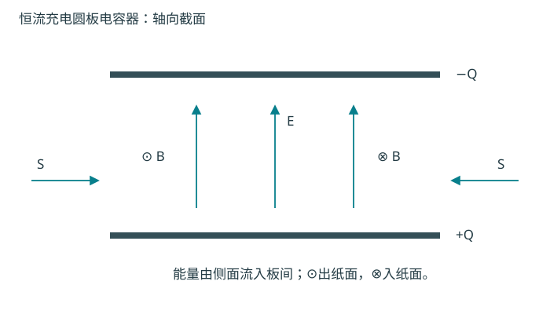
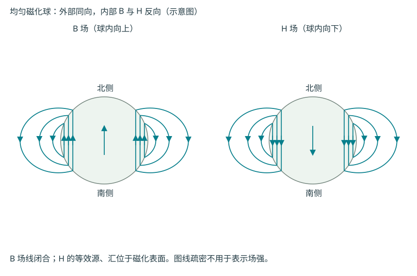

# 电磁学官方题库逐题解答

按官方图片文件名排列，保留原题号与原题链接。采用 SI 制，$K=1/(4\pi\varepsilon_0)$；时谐复振幅采用 $e^{-i\omega t}$，除非题目另有约定。电荷、电流、场与势的边界条件要同时满足。

## 1-2T191：旋转的带电圆柱壳

[原题图](官方题库/1-2T191.png)。半径 $a$、无限长薄圆柱，实验室面电荷密度 $\sigma$，角速度 $\boldsymbol\omega=\omega\hat z$。

**(a)** 同轴高斯柱给 $E_r2\pi r\ell=Q_{\rm enc}/\varepsilon_0$；旋转产生面电流 $K_\varphi=\sigma\omega a$，等效无限长螺线管。因此
$$
\mathbf E=\begin{cases}0,&r<a,\\
\dfrac{\sigma a}{\varepsilon_0r}\hat r,&r>a,\end{cases}
\qquad
\mathbf B=\begin{cases}\mu_0\sigma a\boldsymbol\omega,&r<a,\\0,&r>a.\end{cases}
$$
正电荷的磁场沿角速度，负电荷则反向。

**(b)** 若只有一个离散电荷高速绕行，电荷分布和电流随时间改变，应使用迟滞场。除随电荷运动的速度场外还存在加速度辐射场；接近光速时辐射集中在瞬时速度方向附近的窄锥，成为同步辐射，并须有外力维持轨道与补充能量。

**(c)** 对理想连续、均匀旋转的圆柱壳，实验室 $\rho,\mathbf J$ 仍然不随时间变，(a)的麦克斯韦静态解仍适用，不能把单电荷辐射强度直接相加。这里 $\sigma$ 必须是实验室测量值；若固定材料固有电荷密度，则要处理相对论密度关系。真实物体不能把有限质量电荷加速至恰好 $c$，但这不改变给定稳恒源的场方程。

## 1-2T192：微波保护罩的最小透射厚度

[原题图](官方题库/1-2T192.png)。频率 $f=10\,\mathrm{GHz}$、塑料相对介电常数 $2.5$，两侧均为空气。

按平行平板、正入射、非磁且无吸收模型，折射率 $n=\sqrt{2.5}$。前后表面反射的两束光中，一次低折射率到高折射率反射有 $\pi$ 相变，另一次没有；要使总反射消失，板内往返相位须 $2nk_0d=2m\pi$。因此最小非零厚度
$$
d=\frac{\lambda_0}{2n}=\frac{c}{2f\sqrt{2.5}}\simeq9.49\,\mathrm{mm}.
$$
这是半波板厚度的透射共振；四分之一波长层用于不同两侧介质的匹配问题，不能直接套在此处。

## 1-2T193：随时间变化的矢势与静止点电荷

[原题图](官方题库/1-2T193.png)。$V=0$，$\mathbf A=-qt\,\hat r/(4\pi\varepsilon_0r^2)$。

用势的定义而不是仅由 $V=0$ 判断电场：
$$
\mathbf E=-\nabla V-\partial_t\mathbf A
=\frac{q}{4\pi\varepsilon_0r^2}\hat r,\qquad
\mathbf B=\nabla\times\mathbf A=0.
$$
利用分布恒等式 $\nabla\cdot(\hat r/r^2)=4\pi\delta^3(\mathbf r)$，高斯定律给
$$
\rho=q\delta^3(\mathbf r),\qquad
\mathbf J=\frac1{\mu_0}\nabla\times\mathbf B-\varepsilon_0\partial_t\mathbf E=0.
$$
原点以外 $\rho=0$，但不能因此漏掉原点点电荷。该势只是库仑场的一种规范：从 $V_{\rm old}=q/(4\pi\varepsilon_0r)$、$\mathbf A_{\rm old}=0$ 取规范函数 $\chi=qt/(4\pi\varepsilon_0r)$ 即得题设。

## 1-2T194：半无限接地矩形管的静电场

[原题图](官方题库/1-2T194.png)。$0<x<a,0<y<b,z>0$，四壁接地，端面 $z=0$ 为 $V_0$，内部均匀介电常数 $\varepsilon$。

**(a)** 无体自由电荷，$\nabla^2\phi=0$。分离变量，四壁为零选择正弦，无穷远有界选择衰减指数：
$$
\phi=\sum_{m,n\geq1}A_{mn}\sin\frac{m\pi x}{a}\sin\frac{n\pi y}{b}e^{-\kappa_{mn}z},
\quad \kappa_{mn}=\pi\sqrt{\frac{m^2}{a^2}+\frac{n^2}{b^2}}.
$$
端面常数作双重正弦展开，正交性给
$$
A_{mn}=\frac4{ab}\int_0^a\!\int_0^b V_0\sin\frac{m\pi x}{a}\sin\frac{n\pi y}{b}\,dy\,dx
=\begin{cases}16V_0/(\pi^2mn),&m,n\text{均奇},\\0,&\text{其余}.\end{cases}
$$
**(b)** 记 $u_m=m\pi/a,v_n=n\pi/b$，以下求和只取正奇数：
$$
E_x=-\sum A_{mn}u_m\cos(u_mx)\sin(v_ny)e^{-\kappa z},\quad
E_y=-\sum A_{mn}v_n\sin(u_mx)\cos(v_ny)e^{-\kappa z},
$$
$$
E_z=\sum A_{mn}\kappa_{mn}\sin(u_mx)\sin(v_ny)e^{-\kappa z}.
$$
端面朝向介质的法向为 $+\hat z$，导体上的自由面电荷密度
$$
\sigma_f(x,y)=\varepsilon E_z(x,y,0^+)
=\varepsilon\sum A_{mn}\kappa_{mn}\sin(u_mx)\sin(v_ny).
$$
边缘处不同电势边界相接，理想模型有场奇性，端面级数按从 $z>0$ 取极限理解；内部势不含 $\varepsilon$，但维持同样电势所需电荷正比于 $\varepsilon$。

## 1-2T195：电子振荡与等离子体色散

[原题图](官方题库/1-2T195.png)。沿 $z$ 的线偏振波，电场沿 $x$，非相对论电子初始静止。

**(a)** 取电子处 $E_x=E_0\cos\omega t$、$v_x(0)=0$。忽略高阶磁力 $vB$，积分 $m\dot v_x=-eE_x$：
$$
v_x(t)=-\frac{eE_0}{m\omega}\sin\omega t,\qquad
v_{\max}=\frac{eE_0}{m\omega}.
$$
光强 $\bar S=\varepsilon_0cE_0^2/2$，要求 $eE_0/(m\omega c)\ll1$，等价于
$$
\bar S\ll S_{\rm rel}=\frac{\varepsilon_0m^2c^3\omega^2}{2e^2}.
$$
以题给常数计算：$\lambda=10\,\mathrm{cm}$ 时 $S_{\rm rel}\simeq1.37\times10^{12}\,\mathrm{W\,m^{-2}}$；$\lambda=1\,\mu\mathrm m$ 时约 $1.37\times10^{22}\,\mathrm{W\,m^{-2}}$。这些是“远小于”的比较尺度，不是已满足非相对论条件的最大允许强度。

**(b)** 复振幅方程 $-i\omega m\widetilde{\mathbf v}=-e\widetilde{\mathbf E}$，故 $\widetilde{\mathbf v}=-ie\widetilde{\mathbf E}/(m\omega)$。离子不动，电子产生
$$
\widetilde{\mathbf J}=-n_0e\widetilde{\mathbf v}
=\frac{in_0e^2}{m\omega}\widetilde{\mathbf E},\qquad
\sigma(\omega)=\frac{in_0e^2}{m\omega}.
$$
电导率纯虚意味着无碰撞模型不耗散平均能量。

**(c)** 对法拉第定律取旋度并用 $\nabla\cdot\mathbf E=0$：
$$
\nabla^2\mathbf E=\mu_0\partial_t\mathbf J+c^{-2}\partial_t^2\mathbf E.
$$
由 $m\partial_t\mathbf v=-e\mathbf E$ 有 $\partial_t\mathbf J=n_0e^2\mathbf E/m$，故
$$
\left(\partial_t^2-c^2\nabla^2+\omega_{pe}^2\right)\mathbf E=0,\quad
\omega_{pe}^2=\frac{n_0e^2}{\varepsilon_0m},\qquad
\boxed{\omega^2=c^2k^2+\omega_{pe}^2}.
$$
低于等离子体频率时 $k$ 虚，波不能在无限均匀介质中传播。

## 1-2T196：均匀介质球中的电场

[原题图](官方题库/1-2T196.png)。介电常数 $\varepsilon$、半径 $a$ 的球放在真空均匀外场 $E_0\hat z$。

球内原点有限，球外远处为 $-E_0r\cos\theta$。由于边界只含 $P_1(\cos\theta)=\cos\theta$，勒让德正交性使其他 $l$ 系数为零。写
$$
\phi_{\rm in}=-Ar\cos\theta,\qquad
\phi_{\rm out}=-E_0r\cos\theta+\frac{B}{r^2}\cos\theta.
$$
在 $r=a$ 势连续给 $A=E_0-B/a^3$；无自由面电荷，法向 $D$ 连续给 $\varepsilon A=\varepsilon_0(E_0+2B/a^3)$。解得
$$
\boxed{\mathbf E_{\rm in}=\frac{3\varepsilon_0}{\varepsilon+2\varepsilon_0}\mathbf E_0},\qquad
B=a^3E_0\frac{\varepsilon-\varepsilon_0}{\varepsilon+2\varepsilon_0}.
$$
真空球 $\varepsilon=\varepsilon_0$ 不扰动场；$\varepsilon\to\infty$ 时内部场趋零，恢复导体极限。

## 1-2T197：朗之万取向极化

[原题图](官方题库/1-2T197.png)。永久偶极矩大小 $p_0$、数密度 $N$，在温度 $T$ 下受局域电场 $E$。

**(a)** 与场夹角 $\theta$ 的能量 $U=-p_0E\cos\theta$。各方向的态数须带球面测度 $\sin\theta\,d\theta\,d\varphi$。令 $x=p_0E/(k_BT)$，取向配分因子与平均沿场偶极为
$$
Z_\Omega=2\pi\int_{-1}^1e^{xu}\,du=4\pi\frac{\sinh x}{x},\quad
\langle p_\parallel\rangle=p_0\partial_x\ln Z_\Omega
=p_0\left(\coth x-\frac1x\right).
$$
故 $\boxed{P=Np_0[\coth x-1/x]}$。垂直场的平均分量由旋转对称性消失。

**(b)** 弱场或高温 $x\ll1$ 时 $\coth x=1/x+x/3+\cdots$，所以
$$
P=\frac{Np_0^2}{3k_BT}E=\varepsilon_0\chi_eE,\qquad
\chi_e=\frac{Np_0^2}{3\varepsilon_0k_BT}.
$$
这给线性介质及 $1/T$ 取向极化规律。强场 $x\gg1$ 时 $P\to Np_0$ 饱和，线性关系失效。推导忽略偶极间关联及局域场与宏观场差别。

## 1-2T198：两相邻面加电势的立方盒

[原题图](官方题库/1-2T198.png)。设边长 $L$，盒内 $0<x,y,z<L$，$y=0$ 面电势 $\phi_1$，$z=0$ 面电势 $\phi_2$，其余四面接地。

利用拉普拉斯方程线性，把答案拆成只有 $y=0$ 非零和只有 $z=0$ 非零两个解。对于第一个，沿 $x,z$ 用正弦，沿 $y$ 用在 $L$ 为零的双曲正弦。由常数面的双重正弦展开系数 $16/(\pi^2mn)$，得到
$$
\boxed{\begin{aligned}
\phi(x,y,z)={}&\frac{16\phi_1}{\pi^2}\sum_{\substack{m,n\geq1\\m,n\ {\rm odd}}}
\frac{\sin(m\pi x/L)\sin(n\pi z/L)}{mn}
\frac{\sinh[\kappa_{mn}(L-y)]}{\sinh(\kappa_{mn}L)}\\
&+\frac{16\phi_2}{\pi^2}\sum_{\substack{m,n\geq1\\m,n\ {\rm odd}}}
\frac{\sin(m\pi x/L)\sin(n\pi y/L)}{mn}
\frac{\sinh[\kappa_{mn}(L-z)]}{\sinh(\kappa_{mn}L)},
\end{aligned}}
$$
其中 $\kappa_{mn}=\pi\sqrt{m^2+n^2}/L$。逐面代入可检查边界；两面接边的理想电势跳跃需要绝缘缝，边线值不决定内部唯一解。

## 1-2T199：分层介质同轴电缆电容

[原题图](官方题库/1-2T199.png)。内导体半径 $a$，外管内半径 $c$；$a<r<b$ 真空，$b<r<c$ 相对介电常数 $\kappa$。

内导体单位长带电 $\lambda$，高斯定律给 $D_r=\lambda/(2\pi r)$。电势差为各层电场积分之和：
$$
V=\int_a^b\frac{\lambda\,dr}{2\pi\varepsilon_0r}
+\int_b^c\frac{\lambda\,dr}{2\pi\kappa\varepsilon_0r}
=\frac{\lambda}{2\pi\varepsilon_0}
\left[\ln\frac ba+\frac1\kappa\ln\frac cb\right].
$$
单位长度电容
$$
\boxed{C'=\frac{\lambda}{V}
=\frac{2\pi\varepsilon_0}{\ln(b/a)+\kappa^{-1}\ln(c/b)}.}
$$
这是径向串联层，不应把介电常数按体积简单平均。$\kappa=1$ 恢复真空同轴电容。

## 1-2T200：导体电荷弛豫

[原题图](官方题库/1-2T200.png)。电导率 $\sigma$、介电常数 $\varepsilon$，问体自由电荷达到表面平衡的时间及磁场。

**(a)** 连续方程、欧姆定律、高斯定律依次给
$$
\partial_t\rho_f=-\nabla\cdot\mathbf J
=-\sigma\nabla\cdot\mathbf E=-\frac{\sigma}{\varepsilon}\rho_f,
\qquad \rho_f(t)=\rho_f(0)e^{-t/\tau},\quad \tau=\varepsilon/\sigma.
$$
所以特征时间是 $\tau$；达到余量比例 $\eta$ 所需时间 $\tau\ln(1/\eta)$。精确平衡为渐近极限。

**(b)** 题目提示场与电荷具有相同衰减时间依赖，故 $\mathbf J+\partial_t\mathbf D=\sigma\mathbf E-\varepsilon\mathbf E/\tau=0$。在初始无磁场、无外加磁场的纯弛豫模型中不产生磁场。不能只保留传导电流而漏掉位移电流；任意含辐射的瞬态需另解麦克斯韦方程。

## 1-2T201：接地平面上的感应电荷和能量

[原题图](官方题库/1-2T201.png)。点电荷 $q$ 位于 $(0,0,d)$。

**(a)** 在 $(0,0,-d)$ 放镜像 $-q$，物理上半空间电势为
$$
\phi=\frac{q}{4\pi\varepsilon_0}
\left[\frac1{\sqrt{x^2+y^2+(z-d)^2}}
-\frac1{\sqrt{x^2+y^2+(z+d)^2}}\right].
$$
平面零势成立；法向边界条件给
$$
\boxed{\sigma(x,y)=-\varepsilon_0\partial_z\phi|_{0^+}
=-\frac{qd}{2\pi(x^2+y^2+d^2)^{3/2}}.}
$$
对平面积分为 $-q$。

**(b)** 去掉点电荷自能，以 $d=\infty$ 为零点，建立感应电荷的能量为 $U=q\phi_{\rm image}/2$，所以
$$
\boxed{U=-\frac{q^2}{16\pi\varepsilon_0d}.}
$$
由 $-dU/dd$ 得镜像吸力 $-q^2/(16\pi\varepsilon_0d^2)$。理想点电荷若连自能一起计入，总场能发散；上式为有限的相互作用部分。

## 1-2T202：介质界面的正入射波

[原题图](官方题库/1-2T202.png)。两非磁无损介质介电常数 $\varepsilon_1,\varepsilon_2$，入射幅度 $E_0$。

**(a)** 令 $k_j=\omega\sqrt{\mu_0\varepsilon_j}$、$Z_j=\sqrt{\mu_0/\varepsilon_j}$，取实部得到物理场：
$$
\mathbf E_i=\hat xE_0e^{i(k_1z-\omega t)},\quad
\mathbf B_i=\hat y\frac{k_1}{\omega}E_0e^{i(k_1z-\omega t)},
$$
$$
\mathbf E_r=\hat x rE_0e^{i(-k_1z-\omega t)},\quad
\mathbf B_r=-\hat y\frac{k_1}{\omega}rE_0e^{i(-k_1z-\omega t)},
$$
$$
\mathbf E_t=\hat x tE_0e^{i(k_2z-\omega t)},\quad
\mathbf B_t=\hat y\frac{k_2}{\omega}tE_0e^{i(k_2z-\omega t)}.
$$
**(b)** 切向 $E,H$ 连续：$1+r=t$、$(1-r)/Z_1=t/Z_2$，因此
$$
r=\frac{Z_2-Z_1}{Z_2+Z_1},\quad
t=\frac{2Z_2}{Z_1+Z_2}
=\frac{2\sqrt{\varepsilon_1}}{\sqrt{\varepsilon_1}+\sqrt{\varepsilon_2}}.
$$
透射电、磁场幅度分别 $tE_0$、$\sqrt{\mu_0\varepsilon_2}tE_0$。

**(c)** 平均能流为 $|E|^2/(2Z)$，故
$$
R=|r|^2,\qquad T=\frac{Z_1}{Z_2}|t|^2
=\frac{4Z_1Z_2}{(Z_1+Z_2)^2},\qquad R+T=1.
$$
透射能量系数不能只写 $t^2$。

## 1-2T203：吸收介质中的电磁场相位差

[原题图](官方题库/1-2T203.png)。给定 $E_x=E_0e^{-\beta z/2}e^{i\omega(t-n_rz/c)}$，$\beta=2n_i\omega/c$。

本题使用 $e^{+i\omega t}$。由 $\partial_zE_x=-i\omega B_y$：
$$
\boxed{B_y=\left(\frac{n_r}{c}-i\frac{\beta}{2\omega}\right)E_x
=\frac{n_r-in_i}{c}E_x.}
$$
其余磁场分量为零（不加静态背景场），所以空间方向上 $\mathbf B\perp\mathbf E$。振幅比为 $\sqrt{n_r^2+n_i^2}/c$，磁场相对电场的复相位为 $-\arctan(n_i/n_r)$，即按此时间约定滞后该相位。

题面同时写 $n=n_r+in_i$ 与 $e^{+i\omega(t-n_rz/c)}e^{-n_i\omega z/c}$；若把 $n$ 直接代入 $e^{i\omega(t-nz/c)}$ 会得到增长。因而计算必须以明确给定的衰减场为准，或在该时间约定下用有效复折射率 $n_r-in_i$。无吸收时相位差为零。

## 1-2T204：空气到水的反射与频率响应

[原题图](官方题库/1-2T204.png)。给出空气 $\varepsilon_r-1=567\times10^{-6}$，水在 $10^6\,\mathrm{Hz}$ 为80，在 $5\times10^{14}\,\mathrm{Hz}$ 为1.77。

**(a)** 正入射的边界方程 $E_i+E_r=E_t$、$(E_i-E_r)/Z_1=E_t/Z_2$，所以振幅反射系数 $r=(Z_2-Z_1)/(Z_2+Z_1)$。非磁无损介质 $Z=Z_0/n$，得
$$
r=\frac{n_1-n_2}{n_1+n_2},\quad
R=r^2,\quad T=\frac{4n_1n_2}{(n_1+n_2)^2}=1-R.
$$
**(b)** 取空气 $n_1\simeq1$：

| 频率范围 | 水的折射率 | 反射能量比 $R$ | 入水透射比 $T$ |
|---|---:|---:|---:|
| 可见光 | $\sqrt{1.77}\simeq1.33$ | $0.020$ | $0.980$ |
| 题给无线电频率 | $\sqrt{80}\simeq8.94$ | $0.638$ | $0.362$ |

低频时水分子永久偶极可转动跟随场，产生很大的取向极化；光频率太高，分子转动来不及响应，主要剩较快的电子极化，所以介电常数较小。以上按表中实介电常数忽略损耗，“透射”指进入水面的能量，未计在水中继续传播的吸收。

## 1-2T206：径向渐变介质的圆柱电容器

[原题图](官方题库/1-2T206.png)。$a<r<b$ 中 $\varepsilon(r)=\varepsilon_0b/r$，内外导体电势差 $V>0$。

**电位移和电场。** 取内导体单位长自由电荷 $\lambda$，则 $D_r=\lambda/(2\pi r)$。故 $E_r=D_r/\varepsilon(r)=\lambda/(2\pi\varepsilon_0b)$ 是常数。由 $V=E_r(b-a)$ 解得
$$
\boxed{\mathbf E=\frac{V}{b-a}\hat r,\qquad
\mathbf D=\frac{\varepsilon_0bV}{r(b-a)}\hat r.}
$$
**极化。** 定义 $\mathbf P=\mathbf D-\varepsilon_0\mathbf E$：
$$
\boxed{\mathbf P=\frac{\varepsilon_0V}{b-a}\left(\frac br-1\right)\hat r.}
$$
**束缚电荷。** 在介质体内 $\rho_b=-\nabla\cdot\mathbf P=-r^{-1}d(rP_r)/dr$，所以
$$
\boxed{\rho_b=\frac{\varepsilon_0V}{(b-a)r}.}
$$
若“电荷分布”包含界面，还应给 $\sigma_b=\mathbf P\cdot\hat n_{\rm dielectric}$：内面法向为 $-\hat r$，故 $\sigma_b(a)=-\varepsilon_0V/a$；外面 $\sigma_b(b)=0$。单位长体束缚电荷为 $+2\pi\varepsilon_0V$，内面为 $-2\pi\varepsilon_0V$，总束缚电荷为零。

## 1-2T207：远隔小线圈的互感与魔角

[原题图](官方题库/1-2T207.png)。面积矢量 $\mathbf a_1,\mathbf a_2$，间隔 $\mathbf r$ 远大于线圈尺寸。

第一环磁矩 $\mathbf M_1=i_1\mathbf a_1$，在第二环范围内场近似均匀，磁通 $\Phi_{21}=\mathbf B_1(\mathbf r)\cdot\mathbf a_2$。定义 $\Phi_{21}=m_{12}i_1$，得
$$
\boxed{m_{12}=\frac{\mu_0}{4\pi r^3}
[3(\mathbf a_1\cdot\hat r)(\mathbf a_2\cdot\hat r)-\mathbf a_1\cdot\mathbf a_2].}
$$
该式交换1、2不变，符合互感互易性。若两面积矢量平行、与 $\mathbf r$ 夹角为 $\theta$，则 $m_{12}=\mu_0a_1a_2(3\cos^2\theta-1)/(4\pi r^3)$。零互感要求
$$
\cos^2\theta=\frac13,\qquad \theta=54.7356^\circ\ \text{或}\ 125.2644^\circ.
$$
图示锐角取前者。互感为负只表示所选线圈正向下磁通反向。

## 1-2T208：传导电流和位移电流

[原题图](官方题库/1-2T208.png)。$E_x=E_0e^{i\omega t-(\alpha+i\beta)z}$，均匀实电导率 $\sigma$、介电常数 $\varepsilon$。

**第一问。** 实际电场为 $E_0e^{-\alpha z}\cos(\omega t-\beta z)\hat x$。欧姆定律直接给
$$
\boxed{\mathbf J_{\rm cond}
=\hat x\,\sigma E_0e^{-\alpha z}\cos(\omega t-\beta z).}
$$
**第二问。** 位移电流密度为
$$
\mathbf J_d=\partial_t\mathbf D
=-\hat x\,\omega\varepsilon E_0e^{-\alpha z}\sin(\omega t-\beta z).
$$
因为 $-\sin u=\cos(u+\pi/2)$，位移电流相位超前传导电流 $90^\circ$。振幅比为
$$
\frac{J_{d,0}}{J_{{\rm cond},0}}=\frac{\omega\varepsilon}{\sigma}
=\omega\tau=\frac{2\pi\tau}{T},\quad \tau=\varepsilon/\sigma,\ T=2\pi/\omega.
$$
低频良导体中传导电流占优；高频或低电导率时不可忽略位移电流。

## 1-2T209：时变磁偶极的近场与辐射场

[原题图](官方题库/1-2T209.png)。给定 $V=0$，$A_\varphi=\mu_0\sin\theta[M/r^2+\dot M/(cr)]/(4\pi)$，所有 $M$ 及其导数在 $t_r=t-r/c$ 处取值。

**近区势。** 当环尺寸远小于 $r$ 且 $r\ll c/\omega$（对典型变化频率 $\omega$），$A_\varphi\simeq\mu_0M(t)\sin\theta/(4\pi r^2)$，是瞬时磁偶极的准静态势。这里“小 $r$”不能小到进入实际线圈。

**电场。** $-\partial_t\mathbf A$ 给
$$
E_\varphi=-\frac{\mu_0\sin\theta}{4\pi}
\left(\frac{\dot M}{r^2}+\frac{\ddot M}{cr}\right),\qquad E_r=E_\theta=0.
$$
**磁场。** 球坐标旋度为 $B_r=(r\sin\theta)^{-1}\partial_\theta(\sin\theta A_\varphi)$、$B_\theta=-r^{-1}\partial_r(rA_\varphi)$。对迟滞量微分时用 $\partial_rM=-\dot M/c$，得
$$
B_r=\frac{\mu_0\cos\theta}{2\pi}
\left(\frac M{r^3}+\frac{\dot M}{cr^2}\right),\quad
B_\theta=\frac{\mu_0\sin\theta}{4\pi}
\left(\frac M{r^3}+\frac{\dot M}{cr^2}+\frac{\ddot M}{c^2r}\right),\quad B_\varphi=0.
$$
**远区能流。** 保留 $1/r$ 场，$E_\varphi=-cB_\theta$；由于 $\hat\varphi\times\hat\theta=-\hat r$，能流向外：
$$
\mathbf S_{\rm rad}=\hat r\frac{\mu_0\ddot M(t_r)^2\sin^2\theta}{16\pi^2c^3r^2}.
$$
**瞬时辐射功率。** 在半径 $r$ 的球面上积分，$\int\sin^2\theta\,d\Omega=8\pi/3$，所以源时刻 $t_r$ 的辐射率为
$$
\boxed{P(t_r)=\frac{\mu_0\ddot M(t_r)^2}{6\pi c^3}.}
$$
不作时间平均；若 $M=M_0\cos\omega t$，平均结果再乘振荡平方的平均 $1/2$。

## 1-2T210：角向分区介质的球电容器

[原题图](官方题库/1-2T210.png)。内外同心球半径 $a,b$，介电常数随角度分区或连续变化。

设球间电势差 $V$。候选场 $\mathbf E=A\hat r/r^2$ 的切向连续性和各球等势均满足；且若 $\varepsilon$ 仅依赖角度，$\nabla\cdot(\varepsilon\mathbf E)=0$。因此由唯一性，这就是解。$V=A(1/a-1/b)$，自由电荷
$$
Q=\int\mathbf D\cdot d\mathbf S=A\int\varepsilon(\theta,\varphi)\,d\Omega.
$$
**(a)** 两半球各占 $2\pi$ 立体角，所以
$$
\boxed{C=\frac{2\pi(\varepsilon_1+\varepsilon_2)ab}{b-a}.}
$$
电场沿介质分界面切向，两半相当于并联。

**(b)** $\varepsilon=\varepsilon_0+d\cos^2\theta$，$\int\cos^2\theta\,d\Omega=4\pi/3$，故
$$
\boxed{C=\frac{4\pi ab}{b-a}\left(\varepsilon_0+\frac d3\right).}
$$
$d$ 的量纲是介电常数，且需 $\varepsilon(\theta)>0$ 才是普通静态线性介质。

## 1-2T211：矩形波导截止频率

[原题图](官方题库/1-2T211.png)。理想导体矩形空波导，截面边长 $a>b$。

设沿轴波数 $k_z$。对纵向场分离变量，横向本征值 $k_\perp^2=(m\pi/a)^2+(n\pi/b)^2$，而真空波动方程给
$$
k_z^2=\frac{\omega^2}{c^2}-k_\perp^2,\qquad
\omega_{c,mn}=c\pi\sqrt{\frac{m^2}{a^2}+\frac{n^2}{b^2}}.
$$
TE模式可有一个指标为零，但不能两者均零；TM模式两指标均为正。最低为TE$_{10}$：
$$
\boxed{\omega_c=\frac{\pi c}{a},\quad f_c=\frac c{2a},\quad\lambda_c=2a.}
$$
低于截止频率 $k_z$ 为虚，场沿轴衰减；空心单导体波导不存在零截止频率的TEM模。

## 1-2T212：指向接地球的电偶极

[原题图](官方题库/1-2T212.png)。球心设为原点，偶极位置 $\mathbf r_0=d\hat n$，偶极矩 $\mathbf p=-p\hat n$，$d>a$。

从一个电荷的球镜像解出发，对源位置做方向导数可生成偶极。单位实电荷的镜像为 $-a/d$，位于 $\mathbf b=(a^2/d)\hat n$。径向偶极相当于 $(-p)\partial_d$，微分镜像电量和位置分别产生一个镜像电荷和镜像偶极：
$$
q'=-\frac{ap}{d^2},\qquad
\mathbf p'=\left(\frac ad\right)^3\mathbf p,\qquad
\mathbf b=\frac{a^2}{d}\hat n.
$$
所以球外电势为
$$
\boxed{\phi(\mathbf r)=\frac1{4\pi\varepsilon_0}\left[
\frac{\mathbf p\cdot(\mathbf r-\mathbf r_0)}{|\mathbf r-\mathbf r_0|^3}
+\frac{q'}{|\mathbf r-\mathbf b|}
+\frac{\mathbf p'\cdot(\mathbf r-\mathbf b)}{|\mathbf r-\mathbf b|^3}
\right],\quad r>a.}
$$
球内导体电势为零。不能只放一个镜像偶极：镜像电量本身随源距离变化，额外的 $q'$ 对球面零势不可缺少。

## 1-2T213：霍尔电压与运动导体的面电荷

[原题图](官方题库/1-2T213.png)。板厚 $t$，右方为 $+\hat x$、上方为 $+\hat y$、前表面朝 $+\hat z$；图中 $\mathbf B=-B\hat y$。

**(a)** 记载流子的有符号体电荷密度为 $\rho_c$，漂移速度 $\mathbf v_d=\mathbf J/\rho_c$。横向稳态不继续偏移，故洛伦兹力平衡：
$$
\mathbf E_H=-\mathbf v_d\times\mathbf B
=\frac{JB}{\rho_c}\hat z,\qquad
\boxed{V_{\rm front}-V_{\rm back}=-\frac{JBt}{\rho_c}.}
$$
若题中“carrier density $\rho$”指粒子数密度，应代入 $\rho_c=q\rho$；电子载流子 $q=-e$，电压符号相反。磁场在题干和图中已作为给定外场，不能单凭载流子密度算出它；题干重复出现“calculate magnetic field”不提供额外外场数据。若还计均匀电流的自场，取厚度坐标 $z\in[-t/2,t/2]$，有 $B_{y,\rm self}=-\mu_0Jz$，其厚度积分为零，不改变上述跨板霍尔电压。

**(b)** 整块板以 $\mathbf v=v\hat x$ 移动，内部平衡要求 $\mathbf E=-\mathbf v\times\mathbf B=vB\hat z$。无限大板的两层面电荷在外部电场抵消、内部形成该场，所以
$$
\boxed{\sigma_{\rm front}=-\varepsilon_0vB,\qquad
\sigma_{\rm back}=+\varepsilon_0vB.}
$$
这是 $v\ll c$ 的结果；运动面电荷对给定磁场的相对修正为 $v^2/c^2$ 阶。

## 1-2T214：电势和磁势的意义

[原题图](官方题库/1-2T214.png)。

**(a)** 一般时变电磁场满足
$$
\mathbf E=-\nabla\phi-\partial_t\mathbf A.
$$
只有静电场或适当无感应情形才能简化为 $\mathbf E=-\nabla\phi$，此时两点电势差 $\phi(B)-\phi(A)=-\int_A^B\mathbf E\cdot d\boldsymbol\ell$ 与路径无关。等势面与电场正交，沿电场方向电势下降；$q\phi$ 给静电势能。电势只确定到加常数，适合用泊松方程 $\nabla^2\phi=-\rho/\varepsilon_0$、无源区拉普拉斯方程以及边界条件求场。

**(b)** 因 $\nabla\cdot\mathbf B=0$，可用矢势 $\mathbf B=\nabla\times\mathbf A$ 表示磁场；它通常是矢量而非标量。$\mathbf A\to\mathbf A+\nabla\chi$、$\phi\to\phi-\partial_t\chi$ 不改变物理场，称规范自由度。在静态库仑规范可解 $\nabla^2\mathbf A=-\mu_0\mathbf J$；矢势便于计算磁通、感应及量子相位。在无自由电流且单连通区域还可设磁标势 $\mathbf H=-\nabla\psi_m$，但含环绕电流的区域一般不能使用单值全局磁标势。

## 1-2T215：载流导线旁电子的参考系变换

[原题图](官方题库/1-2T215.png)。电子速度为 $+v_0\hat z$，导线电流为 $-I\hat z$，线在实验室中电中性。

**磁场与实验室受力。** 在导线外，安培环路给 $B_\varphi=-\mu_0I/(2\pi r)$，从而
$$
\mathbf F=-e\mathbf v_0\times\mathbf B
=-\hat r\,\frac{\mu_0eIv_0}{2\pi r},
$$
是吸向导线的力。若问导线内部且均匀载流、半径 $a$，则 $B_\varphi=-\mu_0Ir/(2\pi a^2)$；原题运动电子在外部使用前式。

**电子瞬时静止系。** 电子速度为零，因此磁力为零，但电力不为零。按题设导线电子漂移速度也为 $v_0$，实验室两种线电荷密度为 $+\lambda,-\lambda$，$\lambda=I/v_0$。记 $\gamma=(1-v_0^2/c^2)^{-1/2}$。在电子系，晶格运动使正密度增为 $\gamma\lambda$；电子流静止，负密度是其固有密度 $-\lambda/\gamma$。净密度
$$
\lambda'=\lambda(\gamma-\gamma^{-1})=\gamma\lambda v_0^2/c^2.
$$
所以
$$
\mathbf E'=\frac{\lambda'}{2\pi\varepsilon_0r}\hat r,\qquad
\mathbf F'=-e\mathbf E'=\gamma\mathbf F.
$$
当 $v_0^2/c^2\ll1$，两系三维力相同到最低非零阶。

**动量变化。** 相对论下一般不能说两系“力完全相同”。垂直于 boost 的动量分量满足 $p_r'=p_r$，故同一运动过程的横向冲量 $\Delta p_r'=\Delta p_r$。在电子瞬时静止的比较中 $dt'=dt/\gamma$，恰有 $F'_r\,dt'=F_r\,dt$。这说明较大的静止系力与较短的坐标时间相互补偿。

## 1-2T216：盐溶液中的德拜屏蔽

[原题图](官方题库/1-2T216.png)。平面表面带电，水中有单价正、负离子，各自远处数密度 $n_0$，介电常数 $\varepsilon$。

离子在势 $\phi$ 中按玻尔兹曼分布：
$$
n_\pm=n_0e^{\mp e\phi/(k_BT)},\quad
\rho=e(n_+-n_-)=-2en_0\sinh\frac{e\phi}{k_BT}.
$$
小势能条件 $|e\phi|\ll k_BT$ 使 $\rho\simeq-2n_0e^2\phi/(k_BT)$，泊松方程变为
$$
\phi''=\kappa_D^2\phi,\qquad
\kappa_D^2=\frac{2n_0e^2}{\varepsilon k_BT},\qquad
\lambda_D=\kappa_D^{-1}.
$$
在溶液半空间 $x>0$、远处势为零时 $\boxed{\phi(x)=\phi_s e^{-x/\lambda_D}}$。若表面自由电荷密度为 $\sigma$，另一侧无场，则 $-\varepsilon\phi'(0)=\sigma$，所以 $\phi_s=\sigma\lambda_D/\varepsilon$。若一张带电薄片两侧都是相同盐水，电场分到两侧，改为 $\phi(x)=\sigma\lambda_De^{-|x|/\lambda_D}/(2\varepsilon)$。

浓度越高，$\lambda_D\propto n_0^{-1/2}$ 越短；在固定面电荷条件下表面势也越小。室温 $k_BT/e\simeq25.9\,\mathrm{mV}$，线性化要求电势绝对值远小于这一尺度。金属中的电子通常是简并费米气体，不能沿用经典玻尔兹曼分布，应使用电子可压缩率得到托马斯–费米屏蔽，长度通常在原子尺度；宏观静电导体内部近似等势、无场。

## 1-2T217：接地狭槽中的电势

[原题图](官方题库/1-2T217.png)。$x>0,0<y<d$，$y=0,d$ 接地，$x=0$ 端面为 $V_0$，沿第三方向平移不变。

**(a)** 解 $\partial_x^2V+\partial_y^2V=0$，横向正弦满足接地条件，沿 $x$ 取衰减解：
$$
V(x,y)=\sum_{n=1}^\infty A_ne^{-n\pi x/d}\sin(n\pi y/d).
$$
正交积分 $A_n=(2/d)\int_0^dV_0\sin(n\pi y/d)\,dy$ 给奇数项 $4V_0/(n\pi)$、偶数项零。因此
$$
\boxed{V(x,y)=\frac{4V_0}{\pi}\sum_{j=0}^\infty
\frac{e^{-(2j+1)\pi x/d}}{2j+1}
\sin\frac{(2j+1)\pi y}{d}.}
$$
远处首项占优，端面扰动穿入长度约 $d/\pi$。

**(b)** 不推解析解时可用有限差分：截断到足够大的 $x=X$ 并设 $V(X,y)=0$，内部等距格点满足
$$
V_{i,j}=\frac14(V_{i+1,j}+V_{i-1,j}+V_{i,j+1}+V_{i,j-1}).
$$
固定三个导体边界，迭代松弛或解稀疏线性方程。检查离散拉普拉斯残差，逐步减半网格并增大 $X$，确认内部结果收敛；端角电势不连续处不以单点值判断收敛。

## 1-2T218：另一题号下的点电荷势

[原题图](官方题库/1-2T218.png)。$V=0$，$\mathbf A=-qt\hat r/(4\pi\varepsilon_0r^2)$。

电势为零并不等于电场为零，因为矢势随时间变化：
$$
\mathbf E=-\partial_t\mathbf A=\frac{q\hat r}{4\pi\varepsilon_0r^2},\qquad
\mathbf B=\nabla\times\mathbf A=0.
$$
由 $\nabla\cdot(\hat r/r^2)=4\pi\delta^3(\mathbf r)$，
$$
\rho=q\delta^3(\mathbf r),\qquad
\mathbf J=\mu_0^{-1}\nabla\times\mathbf B-\varepsilon_0\partial_t\mathbf E=0.
$$
这描述静止点电荷，仅规范与通常库仑标势不同；原点的分布源不能漏掉。

## 1-2T219：均匀带电球中的偏心球腔

[原题图](官方题库/1-2T219.png)。绝缘球体电荷密度 $\rho$，腔心相对球心位移 $\mathbf a=a\hat x$。

**(a)** 球内高斯面包围电荷 $4\pi r^3\rho/3$，所以
$$
\mathbf E_{\rm full}(\mathbf r)=\frac{\rho}{3\varepsilon_0}\mathbf r,\qquad r<R.
$$
**(b)** 挖腔等价于在完整球上叠加一个密度 $-\rho$、中心在 $\mathbf a$ 的球。腔内场点同时位于两个球的内部，因此
$$
\mathbf E_{\rm cavity}=\frac{\rho}{3\varepsilon_0}\mathbf r
-\frac{\rho}{3\varepsilon_0}(\mathbf r-\mathbf a)
=\boxed{\frac{\rho a}{3\varepsilon_0}\hat x}.
$$
腔内是匀强场，与腔半径无关；正电荷时沿球心到腔心方向。这依靠球内场与位移成线性，不能把导体空腔的零场结论套给绝缘体。

## 1-2T220：电荷落向接地平面的辐射

[原题图](官方题库/1-2T220.png)。电荷 $q$、质量 $m$，高度 $z>0$，题设忽略源之间的迟滞，以非相对论偶极近似求辐射。

**(a)** 上半空间用镜像 $-q$ 位于 $(x,y,-z)$ 表示导体，等效源的偶极矩
$$
\mathbf p_{\rm image}=q(x,y,z)-q(x,y,-z)=2qz\hat z.
$$
这是用于求上半空间场的等效镜像偶极，不是把镜像当成真实下半空间电荷。

**(b)** 吸力 $m\ddot z=-q^2/[4\pi\varepsilon_0(2z)^2]$，所以
$$
\ddot{\mathbf p}_{\rm image}=2q\ddot z\,\hat z
=-\frac{q^3}{8\pi\varepsilon_0mz^2}\hat z.
$$
**(c)** 完整偶极在全空间的辐射率为 $|\ddot p|^2/(6\pi\varepsilon_0c^3)$。实际能量只从上半空间逸出，取一半：
$$
\boxed{P_{\rm physical}=\frac{|\ddot p_{\rm image}|^2}{12\pi\varepsilon_0c^3}
=\frac{q^6}{768\pi^3\varepsilon_0^3m^2c^3z^4}\propto z^{-4}.}
$$
若只问镜像全空间数学模型，功率为上述两倍。靠近表面的无限发散提示理想点粒子、非相对论和连续平面模型最终需要修正。

## 1-2T221：充电电容器中的能量流

[原题图](官方题库/1-2T221.png)。圆板半径 $a$、间距 $w\ll a$，恒流 $I$，从零电荷开始。图中下板积正电、上板积负电。

**(a,b)** $Q=It$，忽略边缘场，板间
$$
\mathbf E=\frac{It}{\varepsilon_0\pi a^2}\hat z.
$$
半径 $s<a$ 的安培环只包围比例 $s^2/a^2$ 的位移电流，所以
$$
\mathbf B=\frac{\mu_0Is}{2\pi a^2}\hat\varphi.
$$
画图时电场为下板指向上板的平行箭头，磁场为绕轴按向上电流右手方向的同心圆：在右侧截面点指向纸内、左侧指向纸外。

**(c)** 电磁能量密度两项都应保留：
$$
u=\frac{\varepsilon_0E^2}{2}+\frac{B^2}{2\mu_0}
=\frac{I^2t^2}{2\varepsilon_0\pi^2a^4}
+\frac{\mu_0I^2s^2}{8\pi^2a^4}.
$$
**(d)** $\hat z\times\hat\varphi=-\hat s$，所以
$$
\mathbf S=\frac{\mathbf E\times\mathbf B}{\mu_0}
=-\hat s\frac{I^2ts}{2\varepsilon_0\pi^2a^4}.
$$
能量从圆柱侧面流入板间区域。

**(e)** 无传导电流穿过真空间隙，坡印廷定理为 $\partial_tu+\nabla\cdot\mathbf S=0$。直接计算
$$
\partial_tu=\frac{I^2t}{\varepsilon_0\pi^2a^4},\qquad
\nabla\cdot\mathbf S=\frac1s\partial_s(sS_s)
=-\frac{I^2t}{\varepsilon_0\pi^2a^4}.
$$
整体检验：侧面流入功率 $-S_s(a)2\pi aw=I^2tw/(\varepsilon_0\pi a^2)=IV$。恒流建立后的磁能不随时间变化；理想开关瞬间的磁场建立过程不包含在此简化模型中。

## 1-2T222：两条异号无限线电荷的等势面

[原题图](官方题库/1-2T222.png)。沿 $x$ 的两线位于 $(y,z)=(a,0),(-a,0)$，分别带 $+\lambda,-\lambda$。

**(a)** 记到两线的距离 $r_+=\sqrt{(y-a)^2+z^2}$、$r_-=\sqrt{(y+a)^2+z^2}$。单线势为 $-\lambda\ln r/(2\pi\varepsilon_0)$ 加常数；异号叠加后可取中平面为零：
$$
\boxed{\phi(x,y,z)=\frac{\lambda}{2\pi\varepsilon_0}\ln\frac{r_-}{r_+}.}
$$
**(b)** 设等势值 $V$，令 $K_V=e^{4\pi\varepsilon_0V/\lambda}$，则
$$
(y+a)^2+z^2=K_V[(y-a)^2+z^2].
$$
若 $K_V\ne1$，配方得
$$
\left[y-a\frac{K_V+1}{K_V-1}\right]^2+z^2
=\frac{4a^2K_V}{(K_V-1)^2}.
$$
**(c)** 横截面为阿波罗尼斯圆，沿 $x$ 延伸成圆柱面；圆心通常不在线电荷上，不同等势柱不共轴。$V=0$、$K_V=1$ 时退化为中平面 $y=0$。

## 1-2T223：两层漏电介质的稳恒场与界面电荷

[原题图](官方题库/1-2T223.png)。两层串联，厚度 $d_1,d_2$，介电常数 $\varepsilon_1,\varepsilon_2$，电导率 $\sigma_1,\sigma_2$。取从高电势板经1层到2层的法向为正，忽略接通后的暂态。

**(a)** 稳恒时电流不能在界面继续积累，故 $\sigma_1E_1=\sigma_2E_2=J$；同时 $E_1d_1+E_2d_2=V$。解得
$$
E_1=\frac{\sigma_2V}{\sigma_2d_1+\sigma_1d_2},\qquad
E_2=\frac{\sigma_1V}{\sigma_2d_1+\sigma_1d_2}.
$$
**(b)** 板面积若为 $A$，电流
$$
I=AJ=\frac{AV}{d_1/\sigma_1+d_2/\sigma_2}.
$$
题中未给面积，能唯一写出的局域量是此式除以 $A$ 的电流密度。

**(c)** 电场跳跃反映全部电荷，界面总面电荷为
$$
\sigma_{\rm total}=\varepsilon_0(E_2-E_1)
=\frac{\varepsilon_0V(\sigma_1-\sigma_2)}{\sigma_2d_1+\sigma_1d_2}.
$$
**(d)** 电位移跳跃只计自由面电荷：
$$
\sigma_f=D_2-D_1
=\frac{V(\varepsilon_2\sigma_1-\varepsilon_1\sigma_2)}
{\sigma_2d_1+\sigma_1d_2}.
$$
束缚面电荷是 $\sigma_b=P_1-P_2$，所以 $\sigma_f+\sigma_b=\sigma_{\rm total}$。“自由”指未计入介质极化 $\mathbf P$ 的传导/外加电荷，并非“其他电荷不真实”。若两层是理想绝缘体 $\sigma_i=0$，应另用无初始界面自由电荷条件 $D_1=D_2$ 求静电场，不能把稳恒漏电公式作 $0/0$ 使用。

## 1-2T224：带自感线圈的旋转发电与外力矩

[原题图](官方题库/1-2T224.png)。$n$ 匝、半径 $a$、电阻 $R$、自感 $L$，匀强真空磁场 $B=\mu_0H$，线圈平面与场夹角 $\theta=\omega t$。

选绕线正向使外磁链 $\Phi_{\rm ext}=\Phi_0\sin\theta$，$\Phi_0=n\pi a^2B$。注意题给角度是**平面**与场的夹角。

**(a)** 电路方程为 $L\dot I+RI=-\dot\Phi_{\rm ext}=-\Phi_0\omega\cos\theta$。设 $I=A\cos\theta+B_1\sin\theta$ 并比较两谐波系数：
$$
\boxed{I(\theta)=-\frac{\Phi_0\omega}{R^2+\omega^2L^2}
(R\cos\theta+\omega L\sin\theta).}
$$
暂态 $Ce^{-Rt/L}$ 按题设已经消失。

**(b)** 电磁广义力矩 $\tau_{\rm em}=I\,\partial_\theta\Phi_{\rm ext}=I\Phi_0\cos\theta$，保持匀速需
$$
\boxed{\tau_{\rm ext}=-I\Phi_0\cos\theta
=\frac{\Phi_0^2\omega}{R^2+\omega^2L^2}
(R\cos^2\theta+\omega L\sin\theta\cos\theta).}
$$
瞬时外力矩可有负值，表示电感回送能量；平均 $\overline{\tau_{\rm ext}}\omega=\Phi_0^2\omega^2R/[2(R^2+\omega^2L^2)]=R\overline{I^2}$，检验了能量守恒。

## 1-2T225：同轴电容器中的介质拉力

[原题图](官方题库/1-2T225.png)。内外半径 $a,b$，长 $L$，充满介电常数 $\varepsilon$ 的绝缘体。

**(a)** 圆柱高斯面给
$$
\mathbf E(r)=\begin{cases}
\dfrac{Q}{2\pi\varepsilon Lr}\hat r,&a<r<b,\\0,&\text{理想导体内部及总电荷为零的外部}.
\end{cases}
$$
**(b)** $V=\int_a^bE_rdr=Q\ln(b/a)/(2\pi\varepsilon L)$，故 $C=2\pi\varepsilon L/\ln(b/a)$。

**(c)** 保持电池电压 $V$，介质沿轴部分抽出。设留在电容器中的长度为 $\ell$，忽略端部场，则真空段与介质段并联：
$$
C(\ell)=\frac{2\pi}{\ln(b/a)}[\varepsilon\ell+\varepsilon_0(L-\ell)].
$$
固定电压的机械有效势为 $-CV^2/2$（电源功已计入），所以介质受向内吸力
$$
F_{\rm in}=\frac{V^2}{2}\frac{dC}{d\ell}
=\frac{\pi(\varepsilon-\varepsilon_0)V^2}{\ln(b/a)}.
$$
维持原位的外力等大、沿抽出方向。若只对正的场能 $CV^2/2$ 求负梯度，会因漏算电池而把方向弄反。

## 1-2T226：由色散扫频测星际电子密度

[原题图](官方题库/1-2T226.png)。宽频噪声脉冲经完全电离介质传播距离 $D$，测得频率随到达时间变化。

自由电子响应 $m\ddot x=-eE$ 导出冷等离子体色散
$$
\omega^2=c^2k^2+\omega_p^2,\qquad
\omega_p^2=\frac{ne^2}{\varepsilon_0m}.
$$
脉冲包络以群速度传播：
$$
v_g=\frac{d\omega}{dk}=c\sqrt{1-\frac{\omega_p^2}{\omega^2}},\qquad
t(\omega)=t_{\rm emit}+\frac{D}{c}\left(1-\frac{\omega_p^2}{\omega^2}\right)^{-1/2}.
$$
较低频率更晚到达，所以扫频向下。精确导数为
$$
\frac{dt}{d\omega}
=-\frac{D\omega_p^2}{c\omega^3}
\left(1-\frac{\omega_p^2}{\omega^2}\right)^{-3/2}.
$$
已知 $D,\omega$ 与测得斜率可数值反解 $\omega_p^2$。在无线电频率远高于星际等离子体频率的常用极限，
$$
\boxed{n\simeq-\frac{\varepsilon_0mc\,\omega^3}{e^2D}
\frac{dt}{d\omega}
=-\frac{4\pi^2\varepsilon_0mc\,f^3}{e^2D}\frac{dt}{df}.}
$$
若直接测的是 $df/dt$，右侧用其倒数。空间不均匀时测出的是 $\int n\,ds$，除以路径长 $D$ 才是题目要求的平均密度；必须假设各频率原始发射时间相同或已扣除源本身的扫频。

## 1-2T227：电离介质传播——原图截断说明与可解部分

[原题图](官方题库/1-2T227.png)。图片保留了忽略磁力、离子运动和碰撞的模型假设，但底部从(a)起被截断，后续具体小问不可读。旧汇编的对应页也未保留完整问句。因此本项标为**原题不完整**，以下给出由可读模型确定的传播结论，不把它们冒充缺失小问的完整答案。

取电子电荷 $-e$，谐波 $e^{-i\omega t}$ 下 $m\ddot{\mathbf x}=-e\mathbf E$，有 $\mathbf x=e\mathbf E/(m\omega^2)$，极化 $\mathbf P=-ne\mathbf x$，因此
$$
\varepsilon(\omega)=\varepsilon_0\left(1-\frac{\omega_p^2}{\omega^2}\right),
\qquad \omega_p^2=\frac{ne^2}{\varepsilon_0m}.
$$
由横波方程得
$$
k^2=\frac{\omega^2-\omega_p^2}{c^2}.
$$
故 $\omega>\omega_p$ 时传播，折射率 $N=\sqrt{1-\omega_p^2/\omega^2}$；$\omega<\omega_p$ 时 $k=i\sqrt{\omega_p^2-\omega^2}/c$，振幅衰减长度为 $c/\sqrt{\omega_p^2-\omega^2}$。传播区
$$
v_{\rm phase}=\frac c{\sqrt{1-\omega_p^2/\omega^2}},\qquad
v_g=c\sqrt{1-\omega_p^2/\omega^2},\qquad v_{\rm phase}v_g=c^2.
$$
原图使用含 $1/c$ 的高斯制洛伦兹力，若沿用其单位制，等离子体频率写为 $\omega_p^2=4\pi ne^2/m$；以上其余无量纲关系相同。

## 1-2T228：接地球外的点电荷与均匀介质

[原题图](官方题库/1-2T228.png)。接地球半径 $a$，实电荷 $q$ 位于 $\mathbf s$，$s>a$。

**(a)** 放置镜像 $q'=-aq/s$ 于 $\mathbf s'=a^2\mathbf s/s^2$。对 $|\mathbf r|=a$，两距离之比为 $a/s$，使球面电势为零；由唯一性
$$
\boxed{\phi(\mathbf r)=\frac1{4\pi\varepsilon_0}
\left[\frac q{|\mathbf r-\mathbf s|}
-\frac{aq/s}{|\mathbf r-a^2\mathbf s/s^2|}\right],\quad r>a.}
$$
**(b)** 球外全部填充均匀线性介质时，泊松核由 $\varepsilon_0$ 变为 $\varepsilon$，边界几何不变。因此上式只需将系数中的 $\varepsilon_0$ 替换为 $\varepsilon$，镜像位置和电荷比例不变。球内 $\phi=0$；点电荷本身的位置仍有库仑奇性。

## 1-2T229：半厚度介质插入恒压电容器

[原题图](官方题库/1-2T229.png)。板面积 $A$、间距 $d$、恒压 $V$，取上板相对下板为正。图中介质覆盖整个面积、厚度为 $d/2$，不是只覆盖半个面积。

**(a)** 忽略边缘场且无外加共模净电荷，上板外侧面1的密度为零，内侧面2为 $\sigma_2=\varepsilon_0V/d$。仅给电势差而容许任意额外净电荷时，外表面电荷还需外场条件；这里使用标准电容器模型。

**(b)** 串联两层中 $D$ 连续，$\kappa\varepsilon_0E_{\rm dielectric}=\varepsilon_0E_{\rm air}$，且两段电势降和为 $V$，所以
$$
E_{\rm dielectric}=\frac{2V}{(\kappa+1)d},\quad
E_{\rm air}=\frac{2\kappa V}{(\kappa+1)d},\qquad
\sigma_1'=0,\quad
\boxed{\sigma_2'=\frac{2\kappa\varepsilon_0V}{(\kappa+1)d}.}
$$
**(c)** $C_i=\varepsilon_0A/d$，$C_f=2\kappa\varepsilon_0A/[(\kappa+1)d]$。恒压准静态插入的外力功
$$
\boxed{W_{\rm external}=-\frac12(C_f-C_i)V^2
=-\frac{\varepsilon_0AV^2}{2d}\frac{\kappa-1}{\kappa+1}.}
$$
介质被吸入，外力应制动，故对 $\kappa>1$ 外力功为负。场能增加 $+\Delta CV^2/2$，电源输出 $+\Delta CV^2$，二者之差成为机械输出；只用场能差会得出错误正号。

## 1-2T230：三个同心导体的场、势与电荷

[原题图](官方题库/1-2T230.png)。实心内球 $r<R_1$ 带 $2Q$；中壳 $R_2<r<R_3$ 总电荷0；外壳 $R_4<r<R_5$ 总电荷 $-Q$。

**(b)，先确定电荷。** 导体内部场为零，所以内球表面电荷 $2Q$；中壳内外面分别 $-2Q,+2Q$；外壳内外面分别 $-2Q,+Q$。每一面因球对称均匀分布，面密度为该面电荷除以 $4\pi R_i^2$。

**(a)** 高斯定律给径向场，导体内为零：
$$
E_r=\begin{cases}
0,&r<R_1,\\
2KQ/r^2,&R_1<r<R_2,\\
0,&R_2<r<R_3,\\
2KQ/r^2,&R_3<r<R_4,\\
0,&R_4<r<R_5,\\
KQ/r^2,&r>R_5.
\end{cases}
$$
从无穷远积分、保持各界面电势连续。定义 $V_3=KQ/R_5+2KQ(1/R_3-1/R_4)$，得到
$$
V(r)=\begin{cases}
V_3+2KQ(1/R_1-1/R_2),&r<R_1,\\
V_3+2KQ(1/r-1/R_2),&R_1<r<R_2,\\
V_3,&R_2<r<R_3,\\
KQ/R_5+2KQ(1/r-1/R_4),&R_3<r<R_4,\\
KQ/R_5,&R_4<r<R_5,\\
KQ/r,&r>R_5.
\end{cases}
$$
核查每区 $E_r=-dV/dr$，总外部电荷为 $Q$；场可以在带电面跳跃，势不能跳跃。

## 1-2T231：圆形磁场区域的感生电场

[原题图](官方题库/1-2T231.png)。半径记为 $R$ 的圆形区域内 $\mathbf B=B(t)\hat z$ 均匀，外面无磁场。

轴对称下电场沿环向；法拉第定律 $2\pi rE_\varphi=-d\Phi_B/dt$ 给
$$
\boxed{\mathbf E=
\begin{cases}
-\dfrac r2\dot B\,\hat\varphi,&r<R,\\
-\dfrac{R^2}{2r}\dot B\,\hat\varphi,&r>R.
\end{cases}}
$$
边界 $r=R$ 两式连续，中心为零。若沿 $+z$ 的磁场增加，从上方看感生场顺时针；若减小则逆时针。原图附解只写内部，本解补齐外部，因为外部闭合回路仍包围变化磁通。

## 1-2T232：均匀磁化球与偶极接触项

[原题图](官方题库/1-2T232.png)。半径 $R$、总磁矩 $m\hat z$ 的均匀磁化球。

**(a)** 磁化定义为单位体积磁矩，故 $\mathbf M=3m\hat z/(4\pi R^3)$。

**(b,c)** 无自由电流，用磁标势或对表面磁极密度 $M\cos\theta$ 求解，得到
$$
\mathbf H_{\rm in}=-\frac{\mathbf M}{3},\qquad
\mathbf B_{\rm in}=\mu_0(\mathbf H+\mathbf M)=\frac{2\mu_0\mathbf M}{3};
$$
$$
\mathbf B_{\rm out}=\frac{\mu_0m}{4\pi r^3}
(2\cos\theta\,\hat r+\sin\theta\,\hat\theta),\qquad
\mathbf H_{\rm out}=\mathbf B_{\rm out}/\mu_0.
$$
画 $\mathbf B$ 时球内为竖直向上的均匀场线，球外从北侧绕回南侧并闭合；画 $\mathbf H$ 时球外方向相同、球内却竖直向下，对应退磁场，场线可起止于等效磁极面。不能把 $\mathbf H$ 的球内箭头照抄 $\mathbf B$。

**(d)** 均匀磁化无体束缚电流，表面电流为
$$
\boxed{\mathbf K_b=\mathbf M\times\hat r
=\frac{3m}{4\pi R^3}\sin\theta\,\hat\varphi.}
$$
赤道最大、两极为零。

**(e)** 原题给的点偶极场含接触项 $2\mu_0\,d\mathbf m\,\delta^3/3$。将其改写成便于积分的分布形式：
$$
d\mathbf B=\frac{\mu_0}{4\pi}
[(d\mathbf m\cdot\nabla)\nabla(1/s)+4\pi\,d\mathbf m\,\delta^3(\mathbf s)],
\quad \mathbf s=\mathbf r-\mathbf r'.
$$
令 $F(\mathbf r)=\int_{r'<R}d^3r'/|\mathbf r-\mathbf r'|$，则
$$
F=\begin{cases}2\pi(R^2-r^2/3),&r<R,\\4\pi R^3/(3r),&r>R.\end{cases}
$$
积分后 $\mathbf B=\mu_0[(\mathbf M\cdot\nabla)\nabla F+4\pi\mathbf M\,1_{r<R}]/(4\pi)$。内区 Hessian 为 $-4\pi\mathbf 1/3$，与接触项合成 $2\mu_0\mathbf M/3$；外区给上述偶极场。更一般地 $\nabla^2F=-4\pi1_{r<R}$，所以其散度两项严格抵消，$\nabla\cdot\mathbf B=0$。在球面还满足内外法向 $B_r=2\mu_0M\cos\theta/3$ 连续，任何闭合面净磁通都为零。

## 1-2T233：旋转带电圆盘的轴向磁场

[原题图](官方题库/1-2T233.png)。圆盘半径 $R$、面电荷密度 $\tau$、角速度 $\omega\hat z$，求轴上 $z>R$ 的场。

把圆盘分成半径 $s$、宽 $ds$ 的细环，环电荷 $dq=2\pi s\tau ds$，每周期 $2\pi/\omega$ 转一圈，故电流 $dI=\tau\omega s\,ds$。轴向场叠加：
$$
B_z=\frac{\mu_0\tau\omega}{2}\int_0^R
\frac{s^3ds}{(s^2+z^2)^{3/2}}.
$$
令 $u=\sqrt{s^2+z^2}$，积分为 $u+z^2/u$。因此
$$
\boxed{\mathbf B(z)=\hat z\frac{\mu_0\tau\omega}{2}
\left[\frac{R^2+2z^2}{\sqrt{R^2+z^2}}-2z\right]\quad(z>0).}
$$
题设 $z>R$ 可直接用精确式。只有更强条件 $z\gg R$ 才可化为 $\mu_0\tau\omega R^4\hat z/(8z^3)$，与圆盘磁矩 $m=\pi\tau\omega R^4/4$ 的轴向偶极场一致。

## 1-2T234：均匀磁场中的带电谐振子

[原题图](官方题库/1-2T234.png)。质量 $m$、电荷 $q$、各向同性固有频率 $\omega_0$，外场沿 $z$。真空 SI 制下 $B=\mu_0H$。

**(a)** 定义带符号的 $\omega_c=qB/m$，运动方程
$$
\ddot x+\omega_0^2x=\omega_c\dot y,\quad
\ddot y+\omega_0^2y=-\omega_c\dot x,\quad
\ddot z+\omega_0^2z=0.
$$
**(b)** 取 $u=x+iy$，合并为 $\ddot u+i\omega_c\dot u+\omega_0^2u=0$。代入 $u\propto e^{-i\Omega t}$ 得 $\Omega^2-\omega_c\Omega-\omega_0^2=0$。两相反旋向圆振动的正频率为
$$
\boxed{\omega_\pm=\sqrt{\omega_0^2+\frac{\omega_c^2}{4}}
\pm\frac{|\omega_c|}{2}.}
$$
沿场方向频率不变为 $\omega_0$。零磁场时两横向频率简并；弱磁场时分裂约 $|\omega_c|$。一般横向运动是两圆模叠加，不能只给一个新频率。

## 1-2T236：重叠异号带电圆柱

[原题图](官方题库/1-2T236.png)。两个无限长圆柱半径相同，体密度 $+\rho,-\rho$，轴间位移 $\mathbf d$ 从正柱指向负柱。

单柱内部高斯定律 $E_r2\pi r\ell=\rho\pi r^2\ell/\varepsilon_0$，所以 $\mathbf E_+=\rho\mathbf r_+/(2\varepsilon_0)$。重叠区域也位于负柱内，$\mathbf r_-=\mathbf r_+-\mathbf d$，故
$$
\boxed{\mathbf E=\frac{\rho}{2\varepsilon_0}
(\mathbf r_+-\mathbf r_-)=\frac{\rho\mathbf d}{2\varepsilon_0}.}
$$
这是从正柱轴指向负柱轴的均匀场，大小 $\rho d/(2\varepsilon_0)$。局部总电荷密度为零只要求 $\nabla\cdot\mathbf E=0$，并不要求场本身为零。

## 1-2T237：交流电场中电子的辐射图样

[原题图](官方题库/1-2T237.png)。自由电子在平行板中受 $V_0\cos\omega t$ 驱动，板法向记为 $\hat z$，间距为 $d$。

电场幅度 $E_0=V_0/d$，非相对论加速度 $a_z=-eE_0\cos\omega t/m$，辐射远场正比于加速度在观察方向横平面的投影。其平均强度
$$
\bar S(r,\theta)=\frac{e^4E_0^2}{32\pi^2\varepsilon_0m^2c^3r^2}\sin^2\theta,
$$
其中 $\theta$ 相对板法向。

**(a)** 辐射电磁场角频率为 $\omega$；瞬时强度含 $2\omega$ 项，但这不把光的频率变成 $2\omega$。**(b)** 沿板法向 $\theta=0,\pi$ 强度最小为零。**(c)** 平行板面方向 $\theta=\pi/2$ 最大，该方向的辐射电场沿板法向，是线偏振。**(d)** 远区强度按 $r^{-2}$ 衰减。

这是把电子作为自由空间偶极辐射源的题设近似；理想无限金属板若作为实际电磁边界，还会改变可传播模式，不能把此图样理解为穿过无限金属板的实际透射。

## 1-2T238：垂直电偶极与导体平面的吸力

[原题图](官方题库/1-2T238.png)。偶极距平面 $d$、大小 $p$、方向垂直并指向平面。

镜像偶极位于另一侧相同距离，垂直分量的镜像与原偶极同向。二者轴向间距 $s=2d$，镜像场在实偶极处为轴向偶极场 $2Kp/s^3$。固定镜像源位置，对实偶极位置微分得吸力大小
$$
F=p\left|\frac{d}{ds}\frac{2Kp}{s^3}\right|_{s=2d}
=\frac{6Kp^2}{(2d)^4}
=\boxed{\frac{3p^2}{32\pi\varepsilon_0d^4}},
$$
方向朝平面。能量检验：物理相互作用能是镜像对能的一半，$U=-p^2/(32\pi\varepsilon_0d^3)$，故 $F_d=-dU/dd=-3p^2/(32\pi\varepsilon_0d^4)$。

## 1-2T239：板间距缓慢振动产生的磁场

[原题图](官方题库/1-2T239.png)。恒压 $V_0$，平均间距 $d$，间距变化幅度按题面字面为 $a(t)=a_0\sin\omega t$、$a_0\ll d$。

令实际间距 $h(t)=d+a(t)$，选择电场为 $E_z=V_0/h(t)$。板间圆形安培回路给
$$
2\pi rB_\varphi=\mu_0\varepsilon_0\pi r^2\dot E_z,\qquad
B_\varphi=-\frac{rV_0\dot h}{2c^2h^2}.
$$
一阶小振幅近似
$$
\boxed{\mathbf B\simeq-\hat\varphi
\frac{\omega a_0V_0r}{2c^2d^2}\cos\omega t,\qquad r<R.}
$$
方向随间距变化符号反转。原图印刷答案没有 $1/2$：若其 $a_0$ 实际指**每块板**反向运动的幅度，使 $h=d+2a_0\sin\omega t$，则幅度恰为印刷值；若如题面所言是板间距本身的振幅，则必须有 $1/2$。以上通过明确 $h(t)$ 消除了歧义。忽略边缘场及相对论迟滞，适用慢变化条件。

## 1-2T240：有内阻电源驱动并联LC

[原题图](官方题库/1-2T240.png)。电感 $L$ 与电容 $C$ 并联，电源峰值 $V_0$、角频率 $\omega$，串联内阻 $R$。

沿 $e^{i\omega t}$ 约定，并联支路导纳 $Y=i(\omega C-1/\omega L)$，所以
$$
Z_{LC}=\frac{i\omega L}{1-\omega^2LC},\qquad
|I_0|^2=\frac{V_0^2}{R^2+[\omega L/(1-\omega^2LC)]^2}.
$$
只有电源内阻消耗平均功率：
$$
\boxed{\bar W=\frac{V_0^2R(1-\omega^2LC)^2}
{2[R^2(1-\omega^2LC)^2+\omega^2L^2]}.}
$$
因 $V_0$ 是峰值而非有效值，分母有2。$\omega=1/\sqrt{LC}$ 时并联LC导纳为零，源电流与内阻耗散均为零，尽管LC内部可以有相反方向的循环电流。

## 1-2T460：同轴电池的内阻与电容

[原题图](官方题库/1-2T460.png)。长 $\ell$ 的同轴电极半径 $a,b$，电解质电阻率 $\rho$、介电常数 $\varepsilon$。

**(1)** 电流径向通过圆柱薄层，电流截面积为 $2\pi r\ell$，串联微电阻 $dR=\rho\,dr/(2\pi r\ell)$，所以
$$
R=\frac{\rho}{2\pi\ell}\ln\frac ba.
$$
**(2)** 高斯面给 $E_r=Q/(2\pi\varepsilon\ell r)$，电势差 $U=Q\ln(b/a)/(2\pi\varepsilon\ell)$，故
$$
C=\frac{2\pi\varepsilon\ell}{\ln(b/a)}.
$$
**(3)** 两式相乘得 $\boxed{RC=\rho\varepsilon=\varepsilon/\sigma}$，正是该均匀介质的电荷弛豫时间，与电极几何无关。这里忽略电极化学界面的额外阻抗与端部效应。

## 1-2T462：铝导线中电子的漂移和热运动

[原题图](官方题库/1-2T462.png)。截面积 $S=0.10\,\mathrm{mm^2}=10^{-7}\,\mathrm{m^2}$，电流 $I=5\times10^{-4}\,\mathrm A$。每个铝原子贡献3个传导电子。

**(1) 漂移速率。** 先把质量密度换成原子数密度，再乘3：
$$
n=3\frac{2.7\times10^3}{0.027}(6\times10^{23})=1.8\times10^{29}\,\mathrm{m^{-3}},\qquad
v_d=\frac{I}{neS}=1.74\times10^{-7}\,\mathrm{m/s}.
$$
电子漂移方向与约定电流相反。

**(2) 题设经典模型的方均根热速率。**
$$
v_{\rm rms}=\sqrt{\frac{3k_BT}{m_e}}=1.17\times10^5\,\mathrm{m/s}.
$$
热运动随机，其平均速度为零；小漂移叠加在随机运动上才产生电流。实际金属电子服从费米统计，此数是按题目要求使用经典公式所得。

**(3) 现有电场。** $j=I/S=5\times10^3\,\mathrm{A/m^2}$，所以 $E=\rho j=1.4\times10^{-4}\,\mathrm{V/m}$。

**(4) 若线性欧姆定律外推到 $v_d=v_{\rm rms}$，**
$$
E_*=\rho ne v_{\rm rms}\simeq9.4\times10^7\,\mathrm{V/m}.
$$
这只是该模型的外推结果；如此大的场不能维持题设的常温、固定电阻率导线状态。采用 $v_{\rm rms}=1.2\times10^5$ 的舍入值会得到约 $9.7\times10^7\,\mathrm{V/m}$。

## 1-2T470：有限长螺线管轴线上的磁场

[原题图](官方题库/1-2T470.png)。半径 $R$、长度 $\ell$、单位长度匝数 $n$、每匝电流 $I$。取管中心为 $z=0$，正向由右手定则确定。

位于 $z'$ 的一小段有 $n\,dz'$ 匝，每匝的轴线磁场相加：
$$
B_z(z)=\frac{\mu_0nI}{2}\int_{-\ell/2}^{\ell/2}
\frac{R^2\,dz'}{[R^2+(z-z')^2]^{3/2}}
=\frac{\mu_0nI}{2}\left[
\frac{z+\ell/2}{\sqrt{R^2+(z+\ell/2)^2}}
-\frac{z-\ell/2}{\sqrt{R^2+(z-\ell/2)^2}}\right].
$$
中心场为 $B_z(0)=\mu_0nI\ell/[2\sqrt{R^2+\ell^2/4}]$。令 $\ell\to\infty$ 而观测点固定，括号趋向2，得到长螺线管内部 $B=\mu_0nI$。在端面且 $\ell\gg R$ 时则约为内部值的一半。

## 1-2T478：偏心圆柱空腔内的均匀磁场

[原题图](官方题库/1-2T478.png)。无限长导体的电流密度为轴向常矢量 $\mathbf j$，空腔轴相对大圆柱轴的位移为 $\mathbf a$。

把挖洞等效成完整的 $\mathbf j$ 圆柱，加上空腔位置的 $-\mathbf j$ 小圆柱。均匀载流圆柱内部由安培定律得
$$
\mathbf B_{\rm cyl}(\mathbf r)=\frac{\mu_0}{2}\mathbf j\times\mathbf r.
$$
空腔点相对小圆柱轴的位置是 $\mathbf r-\mathbf a$，故
$$
\boxed{\mathbf B_{\rm cavity}=\frac{\mu_0}{2}\mathbf j\times\mathbf r
-\frac{\mu_0}{2}\mathbf j\times(\mathbf r-\mathbf a)
=\frac{\mu_0}{2}\mathbf j\times\mathbf a.}
$$
结果不随观测点变化，证明场均匀；同心空腔 $\mathbf a=0$ 时为零。

## 1-2T480：旋转带电球壳内部的磁场

[原题图](官方题库/1-2T480.png)。半径 $R$、均匀总电荷 $Q$ 的球壳绕直径以 $\boldsymbol\omega$ 旋转。

面电荷密度 $\sigma=Q/(4\pi R^2)$，电流面密度 $\mathbf K=\sigma\boldsymbol\omega\times\mathbf r$。它与均匀磁化球表面的束缚电流 $\mathbf M\times\hat r$ 相同，只需取 $\mathbf M=\sigma R\boldsymbol\omega$。球内矢势和磁场为
$$
\mathbf A_{\rm in}=\frac{\mu_0}{3}\mathbf M\times\mathbf r,
\qquad
\boxed{\mathbf B_{\rm in}=\nabla\times\mathbf A_{\rm in}
=\frac{2\mu_0}{3}\mathbf M
=\frac{\mu_0Q}{6\pi R}\boldsymbol\omega.}
$$
这里使用 $\nabla\times(\mathbf M\times\mathbf r)=2\mathbf M$。也可由轴对称的 $l=1$ 内外磁势，匹配 $B_r$ 连续和切向磁场跳跃 $\mathbf K$ 得到同一结果。场与位置无关，方向由电荷符号及旋转方向决定。

## 1-2T481：螺旋面电流的磁场

[原题图](官方题库/1-2T481.png)。无限圆柱面半径 $R$，面电流大小 $k$，与轴夹角 $\theta$。约定分量为 $\mathbf K=k\cos\theta\,\hat z+k\sin\theta\,\hat\varphi$。

轴向分量是总电流 $I_z=2\pi Rk\cos\theta$ 的圆柱壳；周向分量是无限长螺线管。各自应用安培定律再叠加：
$$
\boxed{\mathbf B(r<R)=\mu_0k\sin\theta\,\hat z,\qquad
\mathbf B(r>R)=\frac{\mu_0Rk\cos\theta}{r}\,\hat\varphi.}
$$
若螺旋的周向或轴向流向反转，对应分量符号随之改变。$\theta=0$ 和 $\pi/2$ 分别还原直线载流壳与螺线管，检验了分解。

## 1-2T482：轴向载流圆柱壳

[原题图](官方题库/1-2T482.png)。无限长薄圆柱壳半径 $R$，总轴向电流 $I$ 均匀分布。

柱对称保证场只有周向分量。在半径 $r$ 的同轴圆周上，$2\pi rB_\varphi=\mu_0I_{\rm enclosed}$，故
$$
\boxed{B_\varphi=0\quad(r<R),\qquad
B_\varphi=\frac{\mu_0I}{2\pi r}\quad(r>R).}
$$
表面处的跳跃为 $\mu_0I/(2\pi R)=\mu_0K_z$，正是面电流边界条件；理想零厚度表面应区分内外极限。

## 1-2T483：两张任意夹角电流片的叠加

[原题图](官方题库/1-2T483.png)。两平行无限电流片分别有面电流 $\mathbf K_1,\mathbf K_2$，夹角 $\theta$。取法向 $\hat n$ 从片1指向片2。

单片在法向正侧的场为 $\mu_0\mathbf K\times\hat n/2$，负侧相反。叠加得
$$
\mathbf B_{\rm between}=\frac{\mu_0}{2}(\mathbf K_1-\mathbf K_2)\times\hat n,
\quad
\mathbf B_{\rm above}=\frac{\mu_0}{2}(\mathbf K_1+\mathbf K_2)\times\hat n,
\quad \mathbf B_{\rm below}=-\mathbf B_{\rm above}.
$$
场强分别为
$$
B_{\rm between}=\frac{\mu_0}{2}\sqrt{k_1^2+k_2^2-2k_1k_2\cos\theta},
\quad B_{\rm outside}=\frac{\mu_0}{2}\sqrt{k_1^2+k_2^2+2k_1k_2\cos\theta}.
$$
特别地，等大反向时外部相消，片间 $\mathbf B=\mu_0\mathbf K_1\times\hat n$。

## 1-2T484：无限均匀电流片

[原题图](官方题库/1-2T484.png)。无限平面的均匀面电流为 $\mathbf K$，法向为 $\hat n$。

平移对称性使场与面内坐标无关；关于片面的对称性使两侧切向场等大反向。用跨过电流片、两长边长 $\ell$ 且平行磁场的矩形安培回路，得 $2B\ell=\mu_0K\ell$，所以
$$
\boxed{\mathbf B_+=\frac{\mu_0}{2}\mathbf K\times\hat n,\qquad
\mathbf B_-=-\frac{\mu_0}{2}\mathbf K\times\hat n.}
$$
磁场与距片面的距离无关。这里的常场来自无限尺寸理想化；有限电流片的远场会衰减。

## 1-2T485：由霍尔场求迁移率

[原题图](官方题库/1-2T485.png)。磁场 $B=0.100\,\mathrm T$，纵向电场是横向霍尔场的 $\eta=3.1\times10^3$ 倍。

稳定横向平衡时电场力抵消洛伦兹力，故场强大小 $E_H=v_dB$。迁移率定义为 $\mu=v_d/E_\parallel$，所以
$$
\boxed{\mu=\frac{E_H}{BE_\parallel}=\frac1{\eta B}
=3.23\times10^{-3}\,\mathrm{m^2/(V\,s)}.}
$$
这里迁移率取正值；载流子的正负由霍尔电压的方向判断，不能仅由两个场强之比判断。

## 1-2T486：载流圆导线的径向电势差

[原题图](官方题库/1-2T486.png)。均匀电流 $I$ 沿 $+z$，半径 $R$，电子数密度 $n$；以下 $q=-e_0$ 是带符号电子电荷。

导线内 $B_\varphi=\mu_0Ir/(2\pi R^2)$，电子漂移速度 $v_z=I/(nq\pi R^2)$。忽略由该极小径向电场引起的密度修正，径向平衡给
$$
\mathbf E=-\mathbf v\times\mathbf B,
\qquad E_r=v_zB_\varphi=\frac{\mu_0I^2r}{2\pi^2R^4nq}.
$$
因 $q<0$，电场指向轴线，表面电势高于轴线。明确取 $U=V(0)-V(R)$，则
$$
\boxed{U=\int_0^R E_r\,dr=\frac{\mu_0I^2}{4\pi^2R^2nq}.}
$$
代入 $R=5.0\,\mathrm{mm}$、$I=50\,\mathrm A$、$n=8.4\times10^{28}\,\mathrm{m^{-3}}$ 得 $U=-2.37\times10^{-10}\,\mathrm V$。若仅问电势差大小，答案为 $2.37\times10^{-10}\,\mathrm V$。

## 1-2T487：铜片的霍尔电压

[原题图](官方题库/1-2T487.png)。厚度 $d=1.0\,\mathrm{mm}$，磁场 $B=1.5\,\mathrm T$ 垂直片面，电流 $I=200\,\mathrm A$。

令 $x$ 沿电流，$y$ 从边 $b$ 指向边 $a$，右手系的 $+z$ 指向铜片可见正面外侧。按原图厚度与磁力线的遮挡关系，磁场穿入片面，即 $\mathbf B=-B\hat z$。片宽为 $w$，则 $\mathbf v_d=-I\hat x/(ne_0wd)$。横向无电流要求
$$
\mathbf E_H=-\mathbf v_d\times\mathbf B
=\frac{IB}{ne_0wd}\hat y.
$$
电子的磁力指向 $a$，使 $a$ 边积累负电荷、电势较低：
$$
\boxed{U_{ab}=-\int_b^a\mathbf E_H\cdot d\mathbf l
=-\frac{IB}{ne_0d}=-2.23\times10^{-5}\,\mathrm V.}
$$
这里 $n=8.4\times10^{28}\,\mathrm{m^{-3}}$。若翻转磁场或电流，电压反号；宽度消去而厚度保留。

## 1-2T488：外磁场引起轨道频率的拉莫尔修正

[原题图](官方题库/1-2T488.png)。轨道半径按题设保持 $r$ 不变。令未加场时吸引力大小 $F_0=mr\omega^2$，电子电荷大小为 $e_0$。

磁场垂直轨道，其力或增加、或减小向心力。以 $s=\pm1$ 表示磁力向内或向外，径向方程为
$$
mr\omega'^2=mr\omega^2+s e_0r\omega' B.
$$
弱场 $e_0B/m\ll\omega$ 下令 $\omega'=\omega+\Delta\omega$，保留 $B$ 的一阶项：
$$
2m\omega\Delta\omega=s e_0\omega B,
\qquad \boxed{\Delta\omega=s\frac{e_0B}{2m}.}
$$
正负对应场相对轨道方向的两种取向。若沿用原题带符号电荷 $e<0$，同样可写为 $\pm eB/(2m)$，但必须同时说明方向约定。

## 1-2T489：正交电磁场中的摆线运动

[原题图](官方题库/1-2T489.png)。$\mathbf B=B\hat x$，$\mathbf E=E\hat z$，初始位置原点、速度 $v_0\hat y$。令电子带符号电荷 $q<0$、$\Omega=qB/m$。

洛伦兹方程为
$$
\dot v_x=0,\qquad \dot v_y=\Omega v_z,\qquad
\dot v_z=qE/m-\Omega v_y.
$$
平移速度 $u=E/B$ 后，$v_y-u$ 与 $v_z$ 做圆周转动。满足初始条件的解是
$$
\boxed{x=0,\quad y=ut+\frac{v_0-u}{\Omega}\sin\Omega t,
\quad z=\frac{v_0-u}{\Omega}(\cos\Omega t-1).}
$$
这是绕以 $\mathbf E\times\mathbf B/B^2=u\hat y$ 匀速移动的中心做圆周运动，通常称为旋轮线；$v_0=0$ 是普通摆线，$v_0=u$ 时退化为不偏转直线。初始 $\ddot z=q(E-v_0B)/m$ 可检验符号。

## 1-2T490：平行电磁场中的电子轨迹

[原题图](官方题库/1-2T490.png)。取 $\mathbf E=E\hat z$、$\mathbf B=B\hat z$，原点为初始位置，$q<0$，$\Omega=qB/m$。

通式为 $\mathbf a=q(\mathbf E+\mathbf v\times\mathbf B)/m$。磁场只改变横向速度方向，电场只改变纵向速度。

**(1) 初速同向。** $x=y=0$，$z=v_0t+qEt^2/(2m)$，加速度恒为 $qE\hat z/m$。电子先减速、停下，再反向加速。

**(2) 初速反向。** $x=y=0$，$z=-v_0t+qEt^2/(2m)$；加速度仍为 $qE\hat z/m$，沿初速方向加速。

**(3) 初速垂直场，令其沿 $+x$。**
$$
\boxed{x=\frac{v_0}{\Omega}\sin\Omega t,\quad
 y=\frac{v_0}{\Omega}(\cos\Omega t-1),\quad
 z=\frac{qE}{2m}t^2.}
$$
对应 $\mathbf a=(-\Omega v_0\sin\Omega t,-\Omega v_0\cos\Omega t,qE/m)$。横向投影为半径 $mv_0/(|q|B)$ 的圆，纵向位移随 $t^2$ 增长，因而是螺距不断改变的螺旋线，不是等螺距螺旋线。

## 1-2T491：磁场轴取在横向时的螺旋线

[原题图](官方题库/1-2T491.png)。$\mathbf B=B\hat x$，$\mathbf v_0$ 垂直 $z$ 轴、与磁场夹角 $\alpha$。取其 $y$ 分量为正，令 $v_\parallel=v_0\cos\alpha$、$v_\perp=v_0\sin\alpha$，$\Omega=qB/m$。

初始条件为 $x_0=y_0=0$、$z_0=v_\perp/\Omega$。由 $\dot v_y=\Omega v_z$、$\dot v_z=-\Omega v_y$ 积分得
$$
\boxed{x=v_\parallel t,\qquad y=\frac{v_\perp}{\Omega}\sin\Omega t,
\qquad z=\frac{v_\perp}{\Omega}\cos\Omega t.}
$$
因此 $y^2+z^2=(mv_\perp/qB)^2$，轨迹绕 $x$ 轴作螺旋，周期 $2\pi m/(|q|B)$，每周轴向位移 $2\pi mv_\parallel/(|q|B)$。若初始横向速度取负，必须连同相位和旋转中心重新代入初始条件。

## 1-2T492：速度选择器

[原题图](官方题库/1-2T492.png)。粒子从左向右，磁场入纸面，上极板正、下极板负。

**(1)** 要沿两小孔的连线作直线运动，必须有 $q(\mathbf E+\mathbf v\times\mathbf B)=0$。对带电粒子 $q\ne0$，场彼此垂直，故选出速度
$$
\boxed{v_c=E/B.}
$$
**(2)** $10\,\mathrm{Gs}=10^{-3}\,\mathrm T$，所以 $v_c=3.0\times10^3\,\mathrm{m/s}$。

**(3)** 电荷大小约去，选定速度与 $|q|$ 无关。**(4)** 电荷变号时电场力、磁场力同时反向，相互抵消条件不变，所以与正负无关。

此结论指理想选择器中沿轴线不偏转的透射束。若只有两个孔而没有吸收侧壁或几何限制，不能对任意长度和强偏转轨道断言“只有这一速度能碰巧再次到达出口”；题目的通常模型排除了这种绕行轨道。

## 1-2T493：正电子的螺旋轨道数值

[原题图](官方题库/1-2T493.png)。动能 $K=2000\,\mathrm{eV}$，$B=1000\,\mathrm{Gs}=0.100\,\mathrm T$，速度与场夹角 $89^\circ$。

磁场不做功，速率不变。此时 $K/(mc^2)\simeq0.0039$，先按题目的非相对论精度计算：
$$
v=\sqrt{2K/m}=2.65\times10^7\,\mathrm{m/s},\quad
T=\frac{2\pi m}{eB}=3.58\times10^{-10}\,\mathrm s,
$$
$$
\boxed{r=\frac{mv\sin89^\circ}{eB}=1.51\times10^{-3}\,\mathrm m,\qquad
p=v\cos89^\circ T=1.65\times10^{-4}\,\mathrm m.}
$$
螺距是每转一周的轴向位移，不是半径。若要求相对论精度，应取 $\gamma=1+K/(mc^2)$、$T=2\pi\gamma m/(eB)$、$r=p_\perp/(eB)$。

## 1-2T494：回旋加速器的磁场与加速时间

[原题图](官方题库/1-2T494.png)。最大半径 $R=0.60\,\mathrm m$，质子质量 $m=1.67\times10^{-27}\,\mathrm{kg}$、电荷 $e=1.6\times10^{-19}\,\mathrm C$，目标动能 $K=4.0\,\mathrm{MeV}$；缝隙 $d=0.010\,\mathrm m$，每次加速电压 $U=2.0\times10^4\,\mathrm V$。

**(1)** 非相对论回旋轨道 $p=eBR$，故
$$
\boxed{B=\frac{\sqrt{2mK}}{eR}=0.482\,\mathrm T.}
$$
目标能量远小于质子静能，非相对论近似误差约千分之几。

**(2)** 每过缝隙一次增加 $eU$，需 $N=K/(eU)=200$ 次。每段半圆耗时 $t_{1/2}=\pi m/(eB)=6.81\times10^{-8}\,\mathrm s$，忽略缝宽的通常答案为
$$
\boxed{t\simeq Nt_{1/2}=1.36\times10^{-5}\,\mathrm s.}
$$
题目另给缝宽，可在“第一次从缝隙入口静止开始、到第200次出缝隙停止计时”的约定下计入缝隙时间。缝隙内匀加速度 $a=eU/(md)$，第 $k$ 次过缝速度从 $v_{k-1}$ 增到 $v_k=\sqrt{2keU/m}$，所以
$$
\sum_{k=1}^{N}\Delta t_k=\sum_{k=1}^{N}\frac{v_k-v_{k-1}}a
=\frac{md}{eU}\sqrt{\frac{2K}{m}}=1.44\times10^{-7}\,\mathrm s.
$$
200次过缝之间有199段半圆，故该计时约定给 $t=199t_{1/2}+\sum\Delta t_k=1.37\times10^{-5}\,\mathrm s$。实际交流电场在缝内随时间变化；此修正沿用题设“过缝时恒定均匀场”的理想化。

## 1-2T495：任意初始条件的磁场运动通解

[原题图](官方题库/1-2T495.png)。令 $\hat b=\mathbf B/B$、$\omega=qB/m$，把初速分解为 $\mathbf v_\parallel=(\mathbf v_0\cdot\hat b)\hat b$、$\mathbf v_\perp=\mathbf v_0-\mathbf v_\parallel$。

由 $\dot{\mathbf v}=\omega\mathbf v\times\hat b$，平行分量不变，垂直分量以带符号角频率旋转：
$$
\mathbf v(t)=\mathbf v_\parallel+\mathbf v_\perp\cos\omega t
+(\mathbf v_0\times\hat b)\sin\omega t.
$$
积分并利用 $\hat b\times(\mathbf v_0\times\hat b)=\mathbf v_\perp$ 得
$$
\boxed{\mathbf r(t)=\mathbf r_0+(\mathbf v_0\cdot\hat b)\hat b\,t
+\frac{\sin\omega t}{\omega}[\hat b\times(\mathbf v_0\times\hat b)]
+\frac{1-\cos\omega t}{\omega}(\mathbf v_0\times\hat b).}
$$
这就是要求证明的式子；微分两次即可直接验证运动方程及初值。一般轨迹为半径 $v_\perp/|\omega|$、轴向速度 $v_\parallel$ 的圆螺旋线；平行初速给直线，垂直初速给圆。

## 1-2T496：螺旋粒子在屏上的落点

[原题图](官方题库/1-2T496.png)。$\mathbf B=B\hat z$，$\mathbf v_0=v_x\hat x+v_z\hat z$，初始位置原点，屏位于 $z=a$。令 $\omega=qB/m$。

**(1)** 洛伦兹方程的解为
$$
x(t)=\frac{v_x}{\omega}\sin\omega t,\qquad
y(t)=\frac{v_x}{\omega}(\cos\omega t-1),\qquad z(t)=v_zt.
$$
横向轨迹满足 $x^2+(y+v_x/\omega)^2=(v_x/\omega)^2$，故为圆螺旋线。

**(2)** 若 $a/v_z>0$，飞行时间 $t_*=a/v_z$，落点为
$$
\boxed{\left(\frac{v_x}{\omega}\sin\frac{\omega a}{v_z},
\frac{v_x}{\omega}\left[\cos\frac{\omega a}{v_z}-1\right],a\right).}
$$
若 $a/v_z<0$，粒子沿相反方向飞离该屏；$v_z=0,a\ne0$ 时不能到屏。这里忽略屏附近边缘电磁场。

## 1-2T497：沿地球赤道运动的相对论质子

[原题图](官方题库/1-2T497.png)。$R=6.370\times10^6\,\mathrm m$，赤道场 $B=0.32\,\mathrm{Gs}=3.2\times10^{-5}\,\mathrm T$。

**(1)** 圆运动的磁力关系应写成 $p=eBR$，其中 $p=\gamma m_0v$。令 $u=eBR/(m_0c)=65.10$，解得
$$
\boxed{v=c\frac{u}{\sqrt{1+u^2}}=0.999882\,c.}
$$
直接套 $m_0v=eBR$ 会得到超光速，显示必须使用相对论动量。

**(2)** 给定 $v=1.0\times10^7\,\mathrm{m/s}$，所需磁场
$$
\boxed{B=\frac{\gamma m_0v}{eR}=1.64\times10^{-8}\,\mathrm T
=1.64\times10^{-4}\,\mathrm{Gs}.}
$$
模型把赤道上的场理想化为处处垂直轨道且等大；还需选择合适运动方向使洛伦兹力指向地心。忽略重力及粒子与大气的相互作用。

## 1-2T498：直导线对长方形回路的合力

[原题图](官方题库/1-2T498.png)。长直线电流 $I_1$ 向上，矩形近边 $DA$ 电流也向上，近边距 $c$、远边距 $c+b$，竖边长 $a$。

取 $x$ 向右、$y$ 向上、$z$ 出纸面。回路所在处 $\mathbf B=-\mu_0I_1\hat z/(2\pi x)$。由 $d\mathbf F=I_2d\boldsymbol\ell\times\mathbf B$：
$$
\mathbf F_{DA}=-\frac{\mu_0I_1I_2a}{2\pi c}\hat x,
\quad \mathbf F_{BC}=+\frac{\mu_0I_1I_2a}{2\pi(c+b)}\hat x,
$$
$$
\mathbf F_{AB}=+\frac{\mu_0I_1I_2}{2\pi}\ln\frac{c+b}{c}\hat y,
\quad \mathbf F_{CD}=-\mathbf F_{AB}.
$$
上下边抵消，近侧吸引强于远侧排斥：
$$
\boxed{\mathbf F=-\frac{\mu_0I_1I_2a}{2\pi}
\left(\frac1c-\frac1{c+b}\right)\hat x.}
$$
代入 $I_1=30\,\mathrm A,I_2=20\,\mathrm A,a=0.30\,\mathrm m,b=0.080\,\mathrm m,c=0.010\,\mathrm m$，得合力大小 $3.20\times10^{-3}\,\mathrm N$，朝长直导线。

## 1-2T499：相互垂直的小线圈间力矩

[原题图](官方题库/1-2T499.png)。两线圈半径 $R_1,R_2$，中心相距 $l\gg R_1,R_2$；线圈2的一条直径在线圈1的轴线上。

用磁偶极近似，$\mathbf m_i=I_i\pi R_i^2\hat n_i$。线圈1在自身轴上、线圈2中心处产生
$$
\mathbf B_1\simeq\frac{\mu_0}{4\pi}\frac{2\mathbf m_1}{l^3}.
$$
线圈2的磁矩与该场垂直，所以
$$
\boxed{\boldsymbol\tau_2=\mathbf m_2\times\mathbf B_1
=\frac{\mu_0}{2\pi l^3}\mathbf m_2\times\mathbf m_1,
\quad |\tau_2|=\frac{\mu_0\pi I_1I_2R_1^2R_2^2}{2l^3}.}
$$
方向由图中两电流的右手定则确定，力矩使 $\mathbf m_2$ 转向 $\mathbf B_1$。近似误差相对量级为 $R_1^2/l^2,R_2^2/l^2$；不能在距离与半径相当时继续使用此式。

## 1-2T500：直导线与正方形回路

[原题图](官方题库/1-2T500.png)。正方形边长 $a$，中心距直线 $d>a/2$，电流方向如图。取 $x$ 向右、$y$ 向上。

**(1)** 近、远两竖边距离分别 $r_-=d-a/2$、$r_+=d+a/2$。逐边积分得
$$
\mathbf F_{DA}=-\frac{\mu_0I_1I_2a}{2\pi r_-}\hat x,
\quad \mathbf F_{BC}=+\frac{\mu_0I_1I_2a}{2\pi r_+}\hat x,
$$
$$
\mathbf F_{AB}=+\frac{\mu_0I_1I_2}{2\pi}\ln\frac{r_+}{r_-}\hat y,
\quad \mathbf F_{CD}=-\frac{\mu_0I_1I_2}{2\pi}\ln\frac{r_+}{r_-}\hat y.
$$
题目所称“主矢”就是各力的矢量和：
$$
\boxed{\mathbf F_{\rm total}=-\frac{\mu_0I_1I_2a^2}{2\pi(d^2-a^2/4)}\hat x.}
$$
**(2)** $I_1=3.0\,\mathrm A,I_2=2.0\,\mathrm A,a=d=0.040\,\mathrm m$ 时，合力为 $1.60\times10^{-6}\,\mathrm N$，指向长直线。各竖边力为 $2.40\times10^{-6}\,\mathrm N$ 向左、$0.80\times10^{-6}\,\mathrm N$ 向右；上下边各 $1.32\times10^{-6}\,\mathrm N$ 且方向相反。
