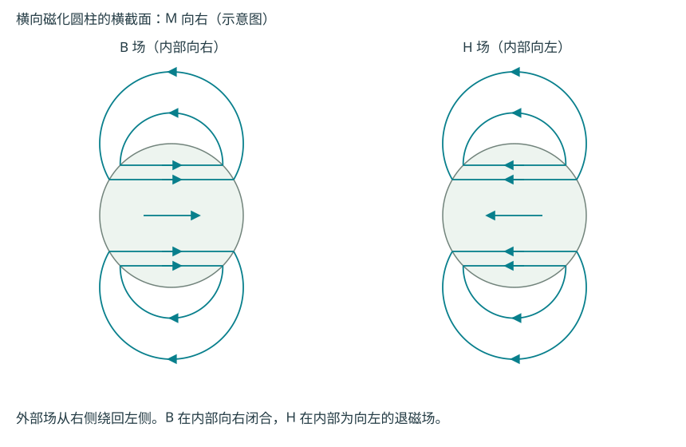
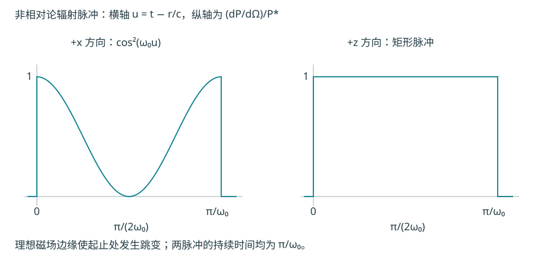

# 电动力学官方题库逐题解答

原题以各节链接的图片为准。本文采用 SI 制；复振幅默认时间因子 $e^{-i\omega t}$。解题顺序是先确定源、边界与近似，再求场和可观测量。磁单极的单位约定为 $\nabla\cdot\mathbf B=\mu_0\rho_m$。

## 1-6T1033：导体内自由电荷弛豫

[原题图](官方题库/1-6T1033.png)。导电率 $\sigma$、介电常数 $\varepsilon$ 均匀，求电荷移到表面的时间及过程是否产生磁场。

**(a)** 电荷守恒为 $\partial_t\rho_f+\nabla\cdot\mathbf J=0$，欧姆定律为 $\mathbf J=\sigma\mathbf E$，高斯定律为 $\nabla\cdot\mathbf E=\rho_f/\varepsilon$。合并得
$$
\partial_t\rho_f=-\frac{\sigma}{\varepsilon}\rho_f,
\qquad \rho_f(\mathbf r,t)=\rho_f(\mathbf r,0)e^{-t/\tau},\qquad \tau=\frac{\varepsilon}{\sigma}.
$$
$\tau$ 是衰减到原来 $1/e$ 的时间。达到严格平衡需渐近无限长；若容许体电荷余量为初值的 $\eta$，则 $t=\tau\ln(1/\eta)$。体电荷的减少对应表面电荷的积累，总电荷并未消失。

**(b)** 按题目提示，导体内弛豫电场也按 $e^{-t/\tau}$ 衰减，因此
$$
\mathbf J+\partial_t\mathbf D=\sigma\mathbf E+\varepsilon\partial_t\mathbf E=0.
$$
安培–麦克斯韦方程给出 $\nabla\times\mathbf B=0$。在初始无磁场、无外加磁场的这一纯电荷弛豫模型中不产生磁场：传导电流和位移电流恰好抵消。这一结论使用了题设给定的场时间依赖，不能从电荷连续方程单独推广到任意含辐射的开关瞬态。

## 1-6T1034：点电荷与接地平面

[原题图](官方题库/1-6T1034.png)。电荷 $q$ 在 $(0,0,d)$，接地导体占据 $z\leq0$。

**(a)** 用 $(0,0,-d)$ 的镜像电荷 $-q$ 在上半空间构造电势，满足平面电势为零：
$$
\phi=\frac{q}{4\pi\varepsilon_0}\left[\frac1{\sqrt{x^2+y^2+(z-d)^2}}-\frac1{\sqrt{x^2+y^2+(z+d)^2}}\right].
$$
导体内电场为零，外法向为 $+\hat z$，边界条件 $\sigma_s=\varepsilon_0E_z(0^+)$ 给出
$$
\boxed{\sigma_s(x,y)=-\frac{qd}{2\pi(x^2+y^2+d^2)^{3/2}}.}
$$
用极坐标积分得到 $\int\sigma_s\,dA=-q$，符合无限接地平面的总感应电荷。

**(b)** 把点电荷自能排除，以点电荷在无穷远处为相互作用能零点。感应电荷是随 $q$ 建立的，能量含 $1/2$：
$$
U=\frac12q\phi_{\rm image}(0,0,d)=-\frac{q^2}{16\pi\varepsilon_0d}.
$$
检查 $F_z=-dU/dd=-q^2/(16\pi\varepsilon_0d^2)$，恰为镜像吸力。若把“总场能”包含理想点电荷自身的场能，则该量发散；题目通常所求是这里有限的、依赖 $d$ 的相互作用能。

## 1-6T1036：磁单极经过探测线圈

[原题图](官方题库/1-6T1036.png)。线圈 $n$ 匝，磁荷 $q_m$ 沿穿链路径绕行 $N$ 次。

**(a)** 与电磁对偶相容的真空方程为
$$
\nabla\cdot\mathbf E=\rho_e/\varepsilon_0,\quad
\nabla\cdot\mathbf B=\mu_0\rho_m,\quad
\nabla\times\mathbf E=-\partial_t\mathbf B-\mu_0\mathbf j_m,\quad
\nabla\times\mathbf B=\mu_0\mathbf j_e+\mu_0\varepsilon_0\partial_t\mathbf E.
$$
对第三式取散度可检验磁荷也满足连续方程。

**(b)** 指定线圈正向后，把法拉第定律对时间积分。一轮后普通外磁通回到初值，但穿过每匝的累计磁荷为 $q_m$，故 $\int\mathcal E\,dt=-\mu_0nNq_m$。忽略电感、用 $RI=\mathcal E$ 得
$$
Q=\int I\,dt=-\frac{\mu_0nNq_m}{R},\qquad |Q|=\frac{\mu_0nN|q_m|}{R}.
$$
负号表示反抗磁荷穿越所定义的正向。

**(c)** 超导线圈用自感 $L$ 限制电流，$L\Delta I=\int\mathcal E_{\rm external}\,dt$。初始电流为零，故
$$
I_f=-\frac{\mu_0nNq_m}{L},\qquad |I_f|=\frac{\mu_0nN|q_m|}{L}.
$$
此电流在磁荷离开后仍保留，正是超导探测器可记录磁单极通过的原因。

## 1-6T1038：霍尔型电导中的圆偏振本征波

[原题图](官方题库/1-6T1038.png)。$\mathbf J=g\hat z\times\mathbf E$，$g>0$，$\mathbf P=\mathbf M=0$，波沿 $+z$。

**(a)** 安培方程的 $z$ 分量给出 $E_z=0$。法拉第定律给 $\mathbf B_0=(k/\omega)\hat z\times\mathbf E_0$，代入安培方程：
$$
(N^2-1)\mathbf E_0=\frac{ig}{\varepsilon_0\omega}\hat z\times\mathbf E_0,\qquad N=kc/\omega.
$$
旋转算符 $\hat z\times$ 的两个本征矢为 $\hat x+i\hat y$ 和 $\hat x-i\hat y$，本征值分别 $-i,+i$。因此
$$
\boxed{N_+^2=1+\frac{g}{\varepsilon_0\omega},\qquad N_-^2=1-\frac{g}{\varepsilon_0\omega}.}
$$
向前传播取正实平方根；倏逝支取 $\operatorname{Im}N>0$，使振幅在 $+z$ 衰减。

**(b)** 临界角频率为 $\omega_c=g/\varepsilon_0$。$\omega>\omega_c$ 时两支 $N$ 均为实数；$0<\omega<\omega_c$ 时 $N_+$ 为实数，$N_-=i\sqrt{\omega_c/\omega-1}$ 是倏逝波。临界点 $N_-=0$，不是具有非零传播波数的普通平面波。

**(c)** $N_+$ 对应 $\mathbf E_0=A(\hat x+i\hat y)$；$N_-$ 对应 $\mathbf E_0=B(\hat x-i\hat y)$。用显式复矢量指定旋向，可避免观察方向不同导致“左旋/右旋”名称歧义。两者是相反旋向的圆偏振。这里 $\mathbf J\cdot\mathbf E=0$，无焦耳耗散；倏逝来自频带截止，不是欧姆吸收。

## 1-6T1040：电荷–磁单极的场角动量

[原题图](官方题库/1-6T1040.png)。磁荷 $g$ 在原点，电荷 $q$ 在 $a\hat z$，取 $a>0$。

**(a)** 记 $\mathbf R=\mathbf r-a\hat z$，则
$$
\mathbf B=\frac{\mu_0g}{4\pi}\frac{\mathbf r}{r^3},\qquad
\mathbf E=\frac{q}{4\pi\varepsilon_0}\frac{\mathbf R}{R^3}.
$$
**(b)** 场动量密度为 $\varepsilon_0\mathbf E\times\mathbf B$，场角动量为 $\int\mathbf r\times(\varepsilon_0\mathbf E\times\mathbf B)d^3r$。令 $\mathbf r=a\mathbf u$：两个场共带 $a^{-4}$，力臂带 $a$，体积元带 $a^3$，故积分不依赖 $a$。轴对称保证只剩 $z$ 分量。在柱坐标中
$$
(\mathbf E\times\mathbf B)_\varphi=-\frac{\mu_0qg}{16\pi^2\varepsilon_0}\frac{as}{r^3R^3}.
$$
因而当 $qg>0$ 时角动量沿 $-\hat z$，即从电荷指向磁荷。积分的完整结果为 $\mathbf L_{\rm field}=-\mu_0qg\hat z/(4\pi)$，本题只要求尺度不变性与方向。注意交叉积顺序为 $\mathbf E\times\mathbf B$。

**(c)** 移动电荷受力 $m\dot{\mathbf v}=q\mathbf v\times\mathbf B$，所以
$$
\frac{d\mathbf L_{\rm mech}}{dt}=\mathbf r\times(q\mathbf v\times\mathbf B)
=\frac{\mu_0qg}{4\pi}\left(\frac{\mathbf v}{r}-\frac{\mathbf r(\mathbf r\cdot\mathbf v)}{r^3}\right)
=\frac{\mu_0qg}{4\pi}\frac{d\hat{\mathbf r}}{dt}.
$$
机械角动量一般不守恒；所求补偿量为 $\boxed{\mathbf G=-\mu_0qg\hat{\mathbf r}/(4\pi)}$。总角动量 $\mathbf L_{\rm mech}+\mathbf G$ 守恒，与(b)的方向一致。

## 1-6T1043：无限长直导线突然通电

[原题图](官方题库/1-6T1043.png)。中性导线沿 $z$ 轴，电流 $I_0\Theta(t)$，场点距轴 $s$。

**(a)** 最近的源点距场点 $s$，信号传播速度为 $c$，所以 $t_s=s/c$，此前电、磁场均为零。

**(b,c)** 题设 $\rho=0$，迟滞标势 $V=0$。所有电流元都沿 $+\hat z$，故矢势沿 $+\hat z$。

**(f)，同时求(d,e)。** 只有满足 $\sqrt{s^2+z'^2}\leq ct$ 的源点已对场点产生影响。令 $b=\sqrt{c^2t^2-s^2}$，则
$$
\mathbf A(s,t)=\hat z\frac{\mu_0I_0}{4\pi}\int_{-b}^{b}\frac{dz'}{\sqrt{s^2+z'^2}}
=\hat z\frac{\mu_0I_0}{2\pi}\operatorname{arcosh}\frac{ct}{s},\quad t>s/c.
$$
由此直接微分，避免仅凭电流方向猜电场：
$$
\mathbf E=-\hat z\frac{\mu_0I_0c}{2\pi\sqrt{c^2t^2-s^2}},\qquad
\mathbf B=\hat\varphi\frac{\mu_0I_0ct}{2\pi s\sqrt{c^2t^2-s^2}}.
$$
所以(d)电场沿 $-z$；(e)磁场按正向电流右手定则沿 $+\hat\varphi$。图中左侧点磁场指向纸外。$t\to\infty$ 时电场趋零，磁场趋 $\mu_0I_0/(2\pi s)$。波前处的发散来自电流理想瞬时跳变，有限上升时间会使之平滑。

## 1-6T1044：旋转电流环的辐射减速

[原题图](官方题库/1-6T1044.png)。质量 $M$、半径 $R$ 的细环载恒定电流 $I$，绕直径转动，初角速度 $\Omega_0$。

采用长波、非相对论和慢辐射衰减近似 $\Omega R\ll c$、$|\dot\Omega|\ll\Omega^2$。电流保持环的磁矩大小 $m=I\pi R^2$；磁矩方向随环转动，与转轴垂直。磁偶极辐射公式是
$$
P=\frac{\mu_0|\ddot{\mathbf m}|^2}{6\pi c^3}\simeq C\Omega^4,
\qquad C=\frac{\mu_0I^2\pi R^4}{6c^3}.
$$
绕直径的机械转动惯量 $\mathcal I=MR^2/2$。以辐射带走机械转动能，$d(\mathcal I\Omega^2/2)/dt=-C\Omega^4$，即 $\dot\Omega=-(C/\mathcal I)\Omega^3$。分离变量并代入初值：
$$
\boxed{\Omega(t)=\frac{\Omega_0}{\sqrt{1+t/\tau}},\qquad
\tau=\frac{\mathcal I}{2C\Omega_0^2}=\frac{3Mc^3}{2\mu_0\pi I^2R^2\Omega_0^2}.}
$$
转轴方向不变。幂律是 $t^{-1/2}$，不能在积分时误写成 $t^{-1}$。此处忽略电磁场对转动惯量的微小修正；如果不作慢变化近似，$\ddot{\mathbf m}$ 还含 $\dot\Omega$ 项，不能把这个初等结果当作任意转速下的精确动力学。

## 1-6T1051：束缚电荷的光散射

[原题图](官方题库/1-6T1051.png)。三维各向同性谐振子，质量 $m$、电荷 $q$、弹性系数 $k$，受振幅 $E_0$ 的线偏振光驱动。

**(a)** 令 $\omega_0^2=k/m$，忽略阻尼且离开共振，稳态位移振幅为 $x_0=qE_0/[m(\omega_0^2-\omega^2)]$，偶极矩振幅 $p_0=qx_0$。远区平均辐射功率角分布为
$$
\frac{d\bar P}{d\Omega}=\frac{p_0^2\omega^4}{32\pi^2\varepsilon_0c^3}\sin^2\theta.
$$
除以入射光强 $\bar S=\varepsilon_0cE_0^2/2$，得到
$$
\boxed{\frac{d\sigma}{d\Omega}=\left(\frac{q^2}{4\pi\varepsilon_0mc^2}\right)^2
\frac{\omega^4}{(\omega_0^2-\omega^2)^2}\sin^2\theta.}
$$
$\theta$ 相对电场偏振方向，并非相对传播方向。

**(b)** $\int\sin^2\theta\,d\Omega=2\pi\int_0^\pi\sin^3\theta\,d\theta=8\pi/3$，所以
$$
\sigma=\frac{8\pi}{3}\left(\frac{q^2}{4\pi\varepsilon_0mc^2}\right)^2
\frac{\omega^4}{(\omega_0^2-\omega^2)^2}.
$$
无束缚极限 $\omega_0=0$ 恢复汤姆孙截面。共振附近需保留阻尼，不能使用发散的无阻尼稳态结果。

**(c)** 可见光频率低于氮分子主要电子共振频率，取 $\omega\ll\omega_0$，则 $\sigma\propto\omega^4\propto\lambda^{-4}$。日落光程长，蓝光更易散射出直达视线，剩下直达太阳光偏红。分子尺度远小于可见波长也是采用偶极近似的条件。

## 1-6T1052：磁偶极场的洛伦兹变换

[原题图](官方题库/1-6T1052.png)。边长 $d$ 的中性方形线圈在 $xy$ 平面，取从 $+z$ 看电流逆时针，$\mathbf m=Id^2\hat z$；观测点为 $x_0\hat x$、$x_0\gg d$。

**(a)** 将 $1/|\mathbf r-\mathbf r'|=1/r+(\mathbf r\cdot\mathbf r')/r^3+\cdots$ 代入 $\mathbf A=\mu_0I\oint d\boldsymbol\ell'/[4\pi|\mathbf r-\mathbf r'|]$。首项因闭路 $\oint d\boldsymbol\ell'=0$ 消失，次项化为偶极矢势：
$$
\mathbf A=\frac{\mu_0}{4\pi}\frac{\mathbf m\times\mathbf r}{r^3},\qquad
\mathbf A(x_0)=\frac{\mu_0Id^2}{4\pi x_0^2}\hat y.
$$
**(b)** 应先对完整空间表达式取旋度，不能只对轴上数值微分：
$$
\mathbf B=\frac{\mu_0}{4\pi r^3}[3(\mathbf m\cdot\hat r)\hat r-\mathbf m],\qquad
\mathbf B(x_0)=-B\hat z,\quad B=\frac{\mu_0Id^2}{4\pi x_0^3}.
$$
**(c)** 静止电荷不受磁力；中性理想线圈在静电荷场中总电力为零，电荷无磁场，所以两者净力均为零。

**(d)** 新系中两物体以 $\mathbf v=+v_0\hat x$ 运动，即新坐标系相对旧系速度为 $-\mathbf v$。$\mathbf E'= -\gamma\mathbf v\times\mathbf B=-\gamma v_0B\hat y$，$\mathbf B'=-\gamma B\hat z$，其中 $\gamma=(1-v_0^2/c^2)^{-1/2}$。

**(e)** $q_0\mathbf v\times\mathbf B'=+q_0\gamma v_0B\hat y$，恰抵消电力，故 $\mathbf F'_{\rm tot}=0$。这也由静止系四力为零直接得到。若线圈电流反向，各场方向同时反向，净力仍为零。

## 1-6T1053：经典氢原子的辐射寿命估计

[原题图](官方题库/1-6T1053.png)。给定直径 $D=10^{-8}\,\mathrm{cm}=10^{-10}\,\mathrm m$，令轨道半径 $a=D/2$。

**(a)** 库仑力提供向心力：$m_e\omega_0^2a=e^2/(4\pi\varepsilon_0a^2)$，所以
$$
\omega_0=\sqrt{\frac{e^2}{4\pi\varepsilon_0m_ea^3}}\simeq4.50\times10^{16}\ \mathrm{s^{-1}}.
$$
这是角频率；通常频率为 $\omega_0/(2\pi)\simeq7.16\times10^{15}\,\mathrm{Hz}$。

**(b)** 用振幅 $a$、频率 $\omega_0$ 的直线振荡代替圆周运动，$p(t)=ea\cos\omega_0t$。远区电场大小为 $E_\theta=\ddot p(t-r/c)\sin\theta/(4\pi\varepsilon_0c^2r)$，$B_\varphi=E_\theta/c$。积分平均坡印廷通量：
$$
\bar P=\frac{e^2a^2\omega_0^4}{32\pi^2\varepsilon_0c^3}
\int_0^{2\pi}d\varphi\int_0^\pi\sin^3\theta\,d\theta
=\frac{e^2a^2\omega_0^4}{12\pi\varepsilon_0c^3}\simeq2.88\times10^{-8}\ \mathrm W.
$$
若使用圆轨道，两个正交振荡分量使功率为上述两倍；此小问明确要求用直线振荡替代。

**(c)** 按题设指定的“功率恒定”粗估，用初始束缚能大小 $|E|=e^2/(8\pi\varepsilon_0a)\simeq2.31\times10^{-18}\,\mathrm J$：
$$
\tau\sim\frac{|E|}{\bar P}\simeq8.0\times10^{-11}\ \mathrm s.
$$
这是能量损失时间尺度，不是真实原子寿命，也不是经典螺旋坍缩的精确积分。结果暴露经典原子模型不能解释原子稳定性。

## 1-6T1054：带转换开关的交流电路

[原题图](官方题库/1-6T1054.png)。先辨认连接：A位使两只电容并联；B位短接电阻；开路位只保留右侧电容。本题沿原题用 $e^{i\omega t}$，因此 $Z_L=i\omega L$、$Z_C=1/(i\omega C)$。

**(a)** A位总电容为 $2C$，总阻抗 $Z_A=R+i[\omega L-1/(2\omega C)]$。电阻电流即串联总电流，最大振幅发生在虚部为零：
$$
\omega_A=\frac1{\sqrt{2LC}},\qquad I_{A,\max}=\frac{\varepsilon_0}{R}.
$$
**(b)** B位电阻两端被导线短接，无焦耳热；剩下理想LC支路只交换储能，平均耗散功率 $\bar P=0$。在上问频率它也不处于剩余单电容LC的共振。

**(c)** 开路时 $Z=R+i[\omega_A L-1/(\omega_A C)]=R-i\omega_A L$。要求 $\varepsilon_0/\sqrt{R^2+(\omega_A L)^2}=\varepsilon_0/(2R)$，故
$$
R=\frac{\omega_A L}{\sqrt3}=\sqrt{\frac{L}{6C}}.
$$
此比较使用同一电阻在A位的共振振幅。

**(d)** 长空气芯螺线管内 $B=\mu_0NI/\ell$，磁链 $NBS=LI$，所以截面积 $S=L\ell/(\mu_0N^2)$。边缘场忽略，轴沿哪个方向不影响电感。

## 1-6T1055：横向均匀磁化的无限圆柱

[原题图](官方题库/1-6T1055.png)。半径 $R$、轴沿 $z$，内部 $\mathbf M=m_0\hat x$，外部零。

无自由电流时 $\nabla\times\mathbf H=0$，可设 $\mathbf H=-\nabla\psi$。等效磁极面密度为 $\sigma_m=\mathbf M\cdot\hat s=m_0\cos\varphi$，所以只需一阶角谐波：
$$
\psi_{\rm in}=A s\cos\varphi,\qquad \psi_{\rm out}=\frac{B}{s}\cos\varphi.
$$
切向 $H$ 连续给 $B=AR^2$；法向 $B$ 连续等价于 $H_{s,\rm out}-H_{s,\rm in}=m_0\cos\varphi$，给 $2A=m_0$。从而
$$
\boxed{\mathbf H_{\rm in}=-\frac{m_0}{2}\hat x,\qquad
\mathbf B_{\rm in}=\frac{\mu_0m_0}{2}\hat x,}
$$
$$
\boxed{\mathbf H_{\rm out}=\frac{m_0R^2}{2s^2}
(\cos\varphi\,\hat s+\sin\varphi\,\hat\varphi),\qquad
\mathbf B_{\rm out}=\mu_0\mathbf H_{\rm out}.}
$$
**场线画法：** 在横截面圆内画 $\mathbf M$ 向右、$\mathbf H$ 向左、$\mathbf B$ 向右的均匀平行箭头。圆外两种场同向，从右侧绕过上下方进入左侧，按上式衰减；$\mathbf B$ 场线经圆内向右闭合。$\mathbf H$ 等效从右侧正磁极面指向左侧负磁极面，内部向左。法向 $B$ 连续、切向 $H$ 连续是画图时的检查。

## 1-6T1056：磁偶极翻转、磁通与电源功

[原题图](官方题库/1-6T1056.png)。磁矩 $m\hat z$ 在半径 $R$ 的圆环中心，正面元向上；随后圆环由恒流源维持逆时针电流 $I$。

**(a)** 原点处点偶极场有奇性，不可把不含接触项的 $1/r^3$ 场直接从平面圆心积分。用沿圆周正则的矢势和斯托克斯定理：
$$
A_\varphi(R)=\frac{\mu_0m}{4\pi R^2},\qquad
\Phi=\oint\mathbf A\cdot d\boldsymbol\ell=\frac{\mu_0m}{2R}>0.
$$
也可改用不穿过偶极的曲面计算磁通。

**(b)** 环在中心产生 $B_I=\mu_0I/(2R)$，磁矩的机械势能为 $U_{\rm mech}=-mB_I\cos\theta$。准静态从 $0$ 转到 $\pi$ 所需外力功：
$$
W_{\rm mech}=2mB_I=\frac{\mu_0mI}{R}.
$$
**(c)** 偶极穿环磁通由 $+\Phi$ 变成 $-\Phi$；感生电动势为 $-\dot\Phi$，为维持恒流，电源额外电压为 $+\dot\Phi$。因此
$$
W_{\rm source}=\int I\dot\Phi\,dt=I\Delta\Phi
=-\frac{\mu_0mI}{R}=-W_{\rm mech}.
$$
负号表示电源吸收能量，而非额外输出正能量。机械输入可回馈恒流源。讨论能量时须一致选择系统：固定磁矩的机械势能 $-mB$ 已含维持源的效应，不能再把它同相互作用场能 $+mB$ 当作两个独立势能相加。若把磁矩本身也模型化为由第二恒流源维持的小线圈，两个电源各做 $-2mB_I$，外力做 $+2mB_I$，场的互感能变化为 $-2mB_I$，总账相等。

## 1-6T1057：弱导体中的透射波

[原题图](官方题库/1-6T1057.png)。真空平面波正入射 $z>0$ 的 $(\varepsilon,\mu,\sigma)$ 介质，求波数及深度 $d$ 的复电场振幅。

**(a)** 由 $\mathbf J=\sigma\mathbf E$ 与麦克斯韦方程，$k^2=\mu\varepsilon\omega^2+i\mu\sigma\omega$。选择正向衰减支：
$$
k=\omega\sqrt{\mu\varepsilon}\sqrt{1+i\eta}
=k_m+i\alpha+O(\eta^2),\quad
\eta=\frac{\sigma}{\varepsilon\omega}\ll1,\quad
k_m=\omega\sqrt{\mu\varepsilon},\quad
\alpha=\frac{\sigma}{2}\sqrt{\frac{\mu}{\varepsilon}}.
$$
**(b)** 还需解界面边界条件，不能把入射振幅直接当作介质表面振幅。记 $Z_0=\sqrt{\mu_0/\varepsilon_0}$、$Z_m=\sqrt{\mu/\varepsilon}$，复波阻抗
$$
Z=\frac{\mu\omega}{k}=Z_m(1-i\eta/2)+O(\eta^2).
$$
切向 $E,H$ 连续给 $E_t(0)/E_i=2Z/(Z+Z_0)$。因此一阶结果是
$$
\boxed{\frac{E_t(d)}{E_i}=
\frac{2Z_m}{Z_m+Z_0}
\left[1-\frac{i\eta Z_0}{2(Z_m+Z_0)}\right]
e^{ik_md}e^{-\alpha d}+O(\eta^2).}
$$
上式保留传播衰减指数便于使用；在固定 $d$ 的严格一阶泰勒展开中把 $e^{-\alpha d}$ 换为 $1-\alpha d$。若只要振幅模，
$$
|E_t(d)|=\frac{2Z_m}{Z_m+Z_0}|E_i|e^{-\alpha d}+O(\eta^2).
$$
界面的一阶修正是相位项。$\sigma\to0$ 恢复无损介质正入射菲涅耳透射系数。

## 1-6T1058：磁偶极穿过导线环与带电环

[原题图](官方题库/1-6T1058.png)。磁矩 $m\hat z$ 沿轴以速度 $v$ 穿过半径 $a$ 的环，位置 $z=vt$。采用准静态偶极场、忽略自感。

**(a)** 环上矢势 $A_\varphi=\mu_0ma/[4\pi(a^2+z^2)^{3/2}]$，因而
$$
\Phi(z)=2\pi aA_\varphi=\frac{\mu_0ma^2}{2(a^2+z^2)^{3/2}},\qquad
\boxed{\mathcal E(t)=\frac{3\mu_0ma^2v^2t}{2(a^2+v^2t^2)^{5/2}}.}
$$
正向从上方看为逆时针；靠近时负、离开时正，符合楞次定律。

**(b)** 电流 $\mathcal E/R$，焦耳热功率为
$$
P(t)=\frac{\mathcal E^2}{R}
=\frac{9\mu_0^2m^2a^4v^4t^2}{4R(a^2+v^2t^2)^5}.
$$
**(c)** 不导电环带固定线电荷 $\lambda$，总电荷 $Q=2\pi a\lambda$。电场的环向分量 $E_\varphi=\mathcal E/(2\pi a)$，转矩 $\tau_z=QaE_\varphi=\lambda a\mathcal E$。由初始静止积分：
$$
L_z(t)=-\lambda a\Phi(vt)
=-\frac{\mu_0\lambda ma^3}{2(a^2+v^2t^2)^{3/2}}.
$$
角动量**大小**在磁矩位于环心 $z=0$ 时最大，为 $|L|_{\max}=\mu_0|\lambda m|/2$。若 $\lambda m>0$，方向为 $-\hat z$。磁矩远离后角动量又回到零；因此这里“最大”应按大小理解。

## 1-6T1059：菲涅耳菱体的全反射相移

[原题图](官方题库/1-6T1059.png)。从折射率相对外界为 $n>1$ 的介质内部全反射，入射角 $\theta$；两次反射各产生 $45^\circ$ 的 $p,s$ 相位差。

令 $c_\theta=\cos\theta$、$b=\sqrt{\sin^2\theta-n^{-2}}$，全反射条件为 $\sin\theta>1/n$。由切向场连续的菲涅耳系数，采用每一光线局部 $p,s$ 基底：
$$
r_p=\frac{c_\theta-in^2b}{c_\theta+in^2b},\qquad
r_s=\frac{c_\theta-ib}{c_\theta+ib}.
$$
**(a,b)** 两者模均为1，相位分别
$$
\phi_p=-2\arctan\frac{n^2b}{c_\theta},\qquad
\phi_s=-2\arctan\frac{b}{c_\theta}.
$$
若改变反射光的 $p$ 基矢正向，单个 $p$ 反射系数会多出 $\pi$；计算装置输出时要始终保持同一基矢约定。

**(c)** 用正切差角公式可化简为
$$
\tan\frac{|\phi_p-\phi_s|}{2}
=\frac{b\cos\theta}{\sin^2\theta}.
$$
设 $t=\tan22.5^\circ=\sqrt2-1$，则
$$
\boxed{n=\left[\sin^2\theta-
t^2\frac{\sin^4\theta}{\cos^2\theta}\right]^{-1/2}\simeq1.50
\quad(\theta=53.3^\circ).}
$$
入射偏振与入射面成 $45^\circ$，两个分量等幅；两次全反射累计相差 $90^\circ$，所以出射为圆偏振。正入射的入口、出口对两偏振作用相同，不改变这一相对相位。

## 1-6T1060：静电能量筛选器与潘宁阱

[原题图](官方题库/1-6T1060.png)。正离子 $q,m$ 经电势差 $V_0$ 加速；另一装置由两个轴上正电荷、负电荷环和轴向匀强磁场组成。

**(a)** 忽略入口边缘场，轨道处电势取入口的零值，入射动能 $mv^2/2=qV_0$。同轴圆柱间电势为 $A\ln r+B$，径向场 $E_r=-A/r$。圆周运动要求 $qA/r_0=mv^2/r_0$，故 $A=2V_0$。以 $V(r_0)=0$ 定标：
$$
V(r)=2V_0\ln\frac r{r_0},\qquad
\boxed{V(a)=2V_0\ln\frac a{r_0},\quad V(b)=2V_0\ln\frac b{r_0}.}
$$
内电极为负、外电极为正，电场指向圆心。电极电势差 $2V_0\ln(b/a)$ 与离子质量无关，表明此段筛选能量/电荷而非直接区分同能量的质量。

**(b-i)** 记 $K=1/(4\pi\varepsilon_0)$。轴上电势为
$$
V(0,z)=KQ\left[\frac1{a-z}+\frac1{a+z}
-\frac2{\sqrt{a^2+z^2}}\right]
=\frac{3KQ}{a^3}z^2+O(z^4).
$$
所以 $k_z=-6KQ/a^3$。无源区 $\nabla\cdot\mathbf E=2k_r+k_z=0$，给 $k_r=3KQ/a^3>0$；径向电场是排斥性的。

**(b-ii)** 轴向不受磁力，$m\ddot z=qk_zz$，故
$$
\omega_z=\sqrt{\frac{6KqQ}{ma^3}}.
$$
**(b-iii)** 定义 $\omega_c=qB_0/m>0$，从 $+z$ 看离子顺时针转动，角速率为正数 $\Omega$。向内的磁力与向外电力相减提供向心力：
$$
m\Omega^2R=qB_0\Omega R-qk_rR,
\qquad
\boxed{\Omega_\pm=\frac{\omega_c\pm\sqrt{\omega_c^2-2\omega_z^2}}2.}
$$
须 $\omega_c^2\geq2\omega_z^2$ 才有这些圆周轨道。大磁场下 $\Omega_+\simeq\omega_c-\omega_z^2/(2\omega_c)$ 是修正回旋运动；$\Omega_-\simeq\omega_z^2/(2\omega_c)=k_r/B_0$ 是慢磁控漂移。两者均顺时针，后者与 $\mathbf E\times\mathbf B$ 漂移方向相同。

## 1-6T1061：半圆轨道的辐射脉冲

[原题图](官方题库/1-6T1061.png)。电子以速率 $v_0$ 在磁场中走半径 $a=v_0/\omega_0$ 的半圆，$\omega_0=eB_0/m_e$，持续时间 $T=\pi/\omega_0$。

按题设非相对论且辐射损失可忽略于轨道的精度，源时间 $u$ 下的位置为 $(a\sin\omega_0u,-a\cos\omega_0u,0)$，加速度为 $a\omega_0^2(-\sin\omega_0u,\cos\omega_0u,0)$。非相对论辐射公式
$$
\frac{dP}{d\Omega}=\frac{e^2}{16\pi^2\varepsilon_0c^3}
|\hat n\times\dot{\mathbf v}(u)|^2.
$$
令 $P_*={e^2a^2\omega_0^4}/({16\pi^2\varepsilon_0c^3})$。

**(a)** 对 $+\hat x$ 方向，只有加速度的 $y$ 分量产生辐射。远场观测时间 $u\simeq t-r/c$，故
$$
\frac{dP_x(t)}{d\Omega}=
\begin{cases}P_*\cos^2[\omega_0(t-r/c)],&r/c<t<r/c+T,\\0,&\text{其他时间}.\end{cases}
$$
图线在起点由零跳至 $P_*$，在脉冲中央降至零，再升至 $P_*$，终点降为零。持续 $\pi/\omega_0$；理想磁场边界导致跳变。若保留次一级的传播时间修正，应使用 $t=r/c+u-a\sin(\omega_0u)/c$，其相对修正为 $v_0/c$。

**(b)** 对 $+\hat z$ 方向，加速度总与视线垂直，脉冲是同样起止时间、恒高 $P_*$ 的矩形。

**(c)** 对全部角度积分，$\int\sin^2\theta\,d\Omega=8\pi/3$，所以拉莫尔总功率 $P=e^2a^2\omega_0^4/(6\pi\varepsilon_0c^3)$。总辐射能
$$
W_{\rm rad}=PT=\frac{e^2a^2\omega_0^3}{6\varepsilon_0c^3}
=\frac{e^2v_0^2\omega_0}{6\varepsilon_0c^3}.
$$
使用题设恒速半圆近似需 $W_{\rm rad}\ll m_ev_0^2/2$；辐射的能量最终来自电子动能，磁场本身不做功。

## 1-6T1062：周期带电面与诱导偶极受力

[原题图](官方题库/1-6T1062.png)。平面 $z=0$ 的面电荷 $\sigma_0\cos kx$，介质为真空，取 $k>0$。

**(a)** 分离变量解拉普拉斯方程、要求远离平面衰减，得 $\phi=Ae^{-k|z|}\cos kx$。法向电场跳跃为 $\sigma/\varepsilon_0$，所以 $2kA=\sigma_0/\varepsilon_0$。上半空间
$$
\phi=\frac{\sigma_0}{2\varepsilon_0k}e^{-kz}\cos kx,\qquad
\boxed{\mathbf E=\frac{\sigma_0}{2\varepsilon_0}e^{-kz}
(\sin kx\,\hat x+\cos kx\,\hat z).}
$$
**(b)** 按 SI 极化率定义 $\mathbf p=\alpha\mathbf E$，诱导偶极能为 $U=-\alpha E^2/2$，其中 $1/2$ 来自从零建立偶极所需的极化功。$E^2=\sigma_0^2e^{-2kz}/(4\varepsilon_0^2)$，所以
$$
\boxed{\mathbf F(0,0,z_0)=\frac{\alpha}{2}\nabla E^2
=-\hat z\frac{\alpha k\sigma_0^2}{4\varepsilon_0^2}e^{-2kz_0}.}
$$
对于通常 $\alpha>0$ 的物体，力朝向场较强的平面。这个一阶小粒子近似忽略物体对给定源分布的反作用。

## 1-6T1063：薄金属筒屏蔽交变轴向磁场

[原题图](官方题库/1-6T1063.png)。长筒半径 $a$、壁厚 $t_w\ll a$、电导率 $\sigma$，外场 $B_0\cos\omega t$。原图把厚度记为 $t$，这里改为 $t_w$ 以免与时间混淆。原图的 $\omega\ll h/c$ 量纲不一致；准静态条件应理解为 $\omega h/c\ll1$。

先在薄壁电流近似下求解，即电流在厚度方向近似均匀（还需 $t_w\ll\delta=\sqrt{2/(\mu_0\sigma\omega)}$）。法拉第定律给环向场 $2\pi aE_\varphi=-\pi a^2\dot B_{\rm in}$，面电流 $K_\varphi=\sigma t_wE_\varphi$。长圆筒电流的附加内场为 $\mu_0K_\varphi$，外场为零，因此
$$
B_{\rm in}=B_{\rm ext}-\frac{\mu_0\sigma at_w}{2}\dot B_{\rm in},
\qquad \tau=\frac{\mu_0\sigma at_w}{2}.
$$
稳态解为
$$
\boxed{B_{\rm in}(t)=\frac{B_0}{\sqrt{1+\omega^2\tau^2}}
\cos[\omega t-\arctan(\omega\tau)]},\qquad
\boxed{B_{\rm amplitude}=\frac{B_0}{\sqrt{1+(\mu_0\sigma at_w\omega/2)^2}}.}
$$
静态极限无涡流屏蔽；频率增加时幅度减小、相位落后。高度消失是忽略端部的结果。

**厚壁趋肤修正。** 单凭 $t_w\ll a$ 不保证 $t_w\ll\delta$。若需要保留任意趋肤深度，在准静态近似中令 $\kappa^2=i\mu_0\sigma\omega$，解
$$
f''+\frac1r f'+\kappa^2f=0,\qquad
f(a)=1,\quad f'(a)=-\frac{\kappa^2a}{2}.
$$
该解为 $f(r)=A J_0(\kappa r)+D Y_0(\kappa r)$，系数由
$$
\begin{pmatrix}J_0(\kappa a)&Y_0(\kappa a)\\J_1(\kappa a)&Y_1(\kappa a)\end{pmatrix}
\binom A D=\binom1{\kappa a/2}
$$
唯一确定。外壁条件给精确柱壳扩散模型幅度 $B_0/|f(a+t_w)|$，展开至薄壁均匀电流极限即上框结果。这说明题目的常用答案还含一个可检查的趋肤近似。

## 1-6T1064：接地球与带半球凸起的接地平面

[原题图](官方题库/1-6T1064.png)。球半径 $a$，实电荷 $q$ 距球心 $p>a$。

**(a)** 取球心为原点、电荷在 $p\hat z$，候选镜像为 $q'=-aq/p$、位置 $b\hat z$，$b=a^2/p$。对球面点 $\mathbf r$，几何恒等式 $|\mathbf r-b\hat z|=(a/p)|\mathbf r-p\hat z|$ 使两电荷电势恰好抵消。候选势满足边界、远处为零，唯一性定理保证正确。故
$$
\mathbf F=-\hat z\frac{q^2}{4\pi\varepsilon_0}\frac{ap}{(p^2-a^2)^2}.
$$
**(b)** 凸起球心在接地平面原点，实电荷仍在 $p\hat z$。先用平面镜像 $-q$ 放在 $-p\hat z$，再给这两个外电荷各配球镜像：

| 镜像位置 | 镜像电量 |
|---|---|
| $-p\hat z$ | $-q$ |
| $+(a^2/p)\hat z$ | $-aq/p$ |
| $-(a^2/p)\hat z$ | $+aq/p$ |

关于平面反对称保证平面零势；两组球镜像保证球面零势，且所有镜像位于物理求解域以外。实电荷所受力为三项库仑力之和：
$$
\boxed{\mathbf F=\hat z\frac{q^2}{4\pi\varepsilon_0}
\left[-\frac1{4p^2}-\frac{ap}{(p^2-a^2)^2}
+\frac{ap}{(p^2+a^2)^2}\right].}
$$
$a\to0$ 恢复平面镜像力；$p-a\ll a$ 时最近球镜像产生局部平面吸力。

## 1-6T1065：任意电长度的均匀电流直天线

[原题图](官方题库/1-6T1065.png)。长度 $\ell$ 的细直导线沿 $z$，处处电流 $I_0\cos\omega t$；不假设 $\ell\ll\lambda$。

**(a)** 电荷连续方程要求上端积累 $q_+(t)=I_0\sin\omega t/\omega$、下端为 $-q_+$。取无静态背景电荷：
$$
\rho=\frac{I_0}{\omega}\sin\omega t\,\delta(x)\delta(y)
[\delta(z-\ell/2)-\delta(z+\ell/2)],
$$
$$
\mathbf J=\hat zI_0\cos\omega t\,\delta(x)\delta(y)
[\Theta(z+\ell/2)-\Theta(z-\ell/2)].
$$
直接微分可验证 $\partial_t\rho+\nabla\cdot\mathbf J=0$；偶极矩 $p_z=q_+\ell=p_0\sin\omega t$，$p_0=I_0\ell/\omega$。

**(b)** 采用洛伦兹规范 $\nabla\cdot\mathbf A+c^{-2}\partial_tV=0$，其迟滞解在任意源外点都是
$$
V=\frac{I_0}{4\pi\varepsilon_0\omega}
\left[\frac{\sin\omega(t-R_+/c)}{R_+}
-\frac{\sin\omega(t-R_-/c)}{R_-}\right],\quad
R_\pm=|\mathbf r\mp(\ell/2)\hat z|,
$$
$$
\mathbf A=\hat z\frac{\mu_0I_0}{4\pi}
\int_{-\ell/2}^{\ell/2}
\frac{\cos\{\omega[t-|\mathbf r-z'\hat z|/c]\}}{|\mathbf r-z'\hat z|}\,dz'.
$$
这些表达式不展开 $k\ell$。在辐射远区，令 $k=\omega/c$、$u=k\ell\cos\theta/2$、$\operatorname{sinc}u=\sin u/u$，复振幅为
$$
\widetilde{\mathbf A}=\hat z\frac{\mu_0I_0\ell}{4\pi r}e^{ikr}\operatorname{sinc}u,\qquad
\widetilde V=\frac{I_0}{2\pi\varepsilon_0\omega r}e^{ikr}\sin u.
$$
这里因子 $e^{-i\omega t}$ 被省略；有 $\widetilde V=c\cos\theta\,\widetilde A_z$，可用于检查规范关系。

**(c)** 远场只保留 $1/r$ 的横场，$\widetilde E_\theta=-i\omega\widetilde A_z\sin\theta$（整体相位不影响强度）。于是
$$
\boxed{\frac{d\bar P}{d\Omega}
=\frac{\mu_0I_0^2\omega^2\ell^2}{32\pi^2c}
\sin^2\theta\,\operatorname{sinc}^2u
=\frac{p_0^2\omega^4}{32\pi^2\varepsilon_0c^3}
\sin^2\theta\,\operatorname{sinc}^2u.}
$$
距离 $r$ 的平均能流密度为该式除以 $r^2$。$k\ell\ll1$ 时 $\operatorname{sinc}u\to1$，恢复电偶极图样；任意 $k\ell$、$\theta=\pi/2$ 时 $u=0$，也恰好与同一 $p_0$ 的偶极结果一致。将精确迟滞积分进一步化为上述远场形式需夫琅禾费条件 $r\gg\ell$ 且 $r\gg k\ell^2$，后者对很长天线不可省略。

## 1-6T1066：方形波导的模式与切缝

[原题图](官方题库/1-6T1066.png)。$0<x,y<L$，$\mathbf E=E_0\sin(qy)\sin\psi\,\hat x$，$q=m\pi/L$、$\psi=kz-\omega t$。

**(a)** $\nabla\cdot\mathbf E=\partial_xE_x=0$。在 $y=0,L$，电场虽平行壁面但 $\sin qy=0$；在 $x=0,L$，电场完全垂直壁面。所以所有壁面切向电场为零，符合理想导体条件。

**(b)** 对旋度分量积分 $-\partial_t\mathbf B=\nabla\times\mathbf E$，取无外加静磁场：
$$
B_y=\frac{kE_0}{\omega}\sin(qy)\sin\psi,\qquad
B_z=\frac{qE_0}{\omega}\cos(qy)\cos\psi.
$$
在 $y$ 壁法向分量 $B_y=0$，在 $x$ 壁法向分量 $B_x=0$，磁场边界条件亦满足。还可直接验证 $\partial_yB_y+\partial_zB_z=0$。

**(c)** 安培方程的 $x$ 分量为
$$
(\nabla\times\mathbf B)_x
=-\frac{(q^2+k^2)E_0}{\omega}\sin(qy)\cos\psi
=-\frac{\omega E_0}{c^2}\sin(qy)\cos\psi.
$$
所以 $\boxed{\omega_m(k)=c\sqrt{k^2+(m\pi/L)^2}}$，传播须 $\omega>cm\pi/L$。

**(d)** 切开却不分离意味着几何空腔未增添中间金属板，而是原壁面不能有电流跨越切缝。壁面电流 $\mathbf K=\hat n\times\mathbf H$。在 $y=L/2$ 切开时，切缝位于两个 $x$ 壁，跨缝电流 $K_y\propto B_z$，须 $\cos(m\pi/2)=0$。因此只保留奇数 $m=1,3,5,\ldots$，频率仍由上式给出。

在 $x=L/2$ 切开时，缝位于两个 $y$ 壁，跨缝电流 $K_x\propto B_z$。由于 $B_z$ 与 $x$ 无关且在 $y=0,L$ 的 $\cos(qy)=\pm1$，任一 $m\geq1$ 的非零模式都需要跨缝电流。因此题目限定的这组 $E_x$ 模式全部被排除；这不等于所有其他偏振的波导模式都消失。
