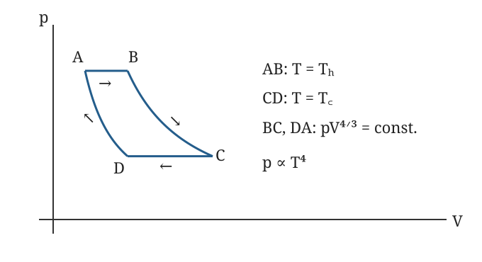
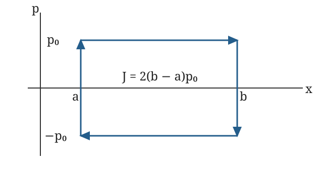

# 热学官方题库逐题解答

本文件按官方图片文件名组织。每题已查看原图；题意摘要保留模型、参数与全部小问。以下为依据题面独立推导的教学解答。统一令系统吸热为 $Q>0$、对外做功为 $W>0$，故 $\Delta U=Q-W$；原题若用“热量损失”则另记 $q=-Q$。同一套原图中包含统计物理题，仍按官方文件名保留在本目录。

## 1-4T904：三种理想气体膨胀

[官方原图](官方题库/1-4T904.png)

**题意。** $N$ 个粒子的理想气体从 $V_1$ 膨胀到 $2V_1$，比较可逆等温、可逆绝热和绝热自由膨胀。(a) 用能量均分求单原子和线性三原子气体的能量、热容；(b) 填写热损失、外功、内能变化及熵变。

**(a) 自由度与热容。** 单原子只有三个平动二次项，每项平均能量 $k_BT/2$，因此
$$
U=\frac32Nk_BT,\qquad C_V=\frac32Nk_B,\qquad C_p=C_V+Nk_B=\frac52Nk_B.
$$
线性三原子分子有 3 个平动自由度、2 个转动自由度和 $3\times3-5=4$ 个振动正则模式。每个振动模式含一个动能和一个势能二次项，完整经典均分给
$$
U=\frac{13}{2}Nk_BT,\quad C_V=\frac{13}{2}Nk_B,\quad C_p=\frac{15}{2}Nk_B.
$$
若讨论的是振动尚冻结、转动已激发的温区，则应使用 $U=5Nk_BT/2$、$C_V=5Nk_B/2$、$C_p=7Nk_B/2$。原题没有指定内部激发温区，完整均分与冻结近似必须区分。

**(b) 按题目给出的单原子熵公式计算。** 由 $\Delta S=Nk_B\ln(V_2/V_1)+(3/2)Nk_B\ln(T_2/T_1)$。原图常数项的印刷不影响熵差。定义
$$
A=Nk_BT_1\ln2,\qquad B=\frac32Nk_BT_1(1-2^{-2/3}).
$$

| 路径 | 热损失 $q=-Q$ | 气体外功 $W$ | $\Delta U$ | $\Delta S$ |
|---|---:|---:|---:|---:|
| 可逆等温 | $-A$ | $A$ | $0$ | $Nk_B\ln2$ |
| 可逆绝热 | $0$ | $B$ | $-B$ | $0$ |
| 绝热自由膨胀 | $0$ | $0$ | $0$ | $Nk_B\ln2$ |

第一行用 $W=\int Nk_BT_1\,dV/V$。第二行用 $TV^{2/3}=\mathrm{const}$，所以 $T_2=T_1 2^{-2/3}$，再由 $W=-\Delta U$。第三行实际外压为零，故 $W=0$；隔热给 $Q=0$，从而理想气体温度不变。三条路径共享末体积，但可逆绝热的末温与另外两条不同，不能强行把它们视为同一末态。检查：各行均满足 $\Delta U=-q-W$。

## 1-4T905：三维自由费米气体

[官方原图](官方题库/1-4T905.png)

**题意。** 边长 $L$ 的立方体中有 $N$ 个无相互作用、自旋 $1/2$ 的电子，温度为 $T$。求 (a) 费米能，(b) 总能量，(c) 基态压强，(d) 态密度。以下取大盒连续态近似，$V=L^3$。

**(a)** 每个波矢态有两个自旋，零温填满波矢球：
$$
N=2\frac V{(2\pi)^3}\frac{4\pi k_F^3}{3},
\quad k_F=(3\pi^2N/V)^{1/3},
\quad E_F=\frac{\hbar^2}{2m_e}(3\pi^2N/V)^{2/3}.
$$
费米能通常指由粒子密度定义的零温能量尺度；有限温度的化学势一般不严格等于它。

**(d) 先求态密度，便于做 (b)。** $D(E)dE=2V(2\pi)^{-3}4\pi k^2dk$，代入 $E=\hbar^2k^2/(2m_e)$ 得
$$
D(E)=\frac V{2\pi^2}\left(\frac{2m_e}{\hbar^2}\right)^{3/2}\sqrt E.
$$
这是整个盒子的态密度，单位为能量的倒数；若问每体积态密度，再除以 $V$。

**(b)** 题干允许一般 $T$，严格表达式是
$$
N=\int_0^\infty\frac{D(E)\,dE}{e^{(E-\mu)/(k_BT)}+1},
\qquad
U=\int_0^\infty\frac{E D(E)\,dE}{e^{(E-\mu)/(k_BT)}+1},
$$
第一式确定 $\mu(T,N,V)$。基态时积分上限截为 $E_F$，所以
$$
U_0=\frac{\int_0^{E_F}E^{3/2}dE}{\int_0^{E_F}E^{1/2}dE}N
=\frac35NE_F.
$$

**(c)** 固定 $N$ 时 $U_0\propto V^{-2/3}$，故
$$
p_0=-\left(\frac{\partial U_0}{\partial V}\right)_N
=\frac{2U_0}{3V}=\frac25\frac NV E_F.
$$
零温仍有压强，来自泡利约束导致的动能。检查 $D(E)$ 积分给 $N$，且压强具有能量每体积的单位。

## 1-4T906：表面吸附 HD 的平动、转动与残余熵

[官方原图](官方题库/1-4T906.png)

**题意。** $N$ 个不相互作用、服从 Maxwell–Boltzmann 统计的 HD 分子吸附在面积 $L^2$ 的表面，可在面内自由平动和自由转动，法向受到谐振子束缚。原图给转动常数 $B_e=46\ \mathrm{cm^{-1}}$、振动波数 $3817\ \mathrm{cm^{-1}}$ 等资料。小问为 (a) 冻结方向无序的残余熵及 H$_2$ 对照，(b) 单分子平动配分函数，(c) 转动配分函数并以积分求和，(d) 平动能量，(e) 转动热容，(f) 平动热容的高低温极限与示意形状。

**(a)** 图示每个固定位置的 HD 有 H–D、D–H 两种独立可区分取向。取向冻结且各状态等权时 $\Omega=2^N$，故 $S_{\mathrm{res}}=Nk_B\ln2$。换成 H$_2$ 后交换两个端点不形成新的取向态，所以这部分残余熵为零。这里只统计图示取向，不另添加题目没有给出的核自旋无序。

**(b)** 令分子质量 $m=m_H+m_D$、热波长 $\lambda_T=h/\sqrt{2\pi mk_BT}$。面内二维平动给 $L^2/\lambda_T^2$。法向谐振子用其实际曲率定义频率 $\Omega=\sqrt{V''(z_0)/m}$，则
$$
q_z=\sum_{n=0}^\infty e^{-\beta\hbar\Omega(n+1/2)}
=\frac{e^{-\beta\hbar\Omega/2}}{1-e^{-\beta\hbar\Omega}},
\quad
q_{\mathrm{tr}}=\frac{L^2}{\lambda_T^2}q_z.
$$
原图势能前因子处有手写痕迹：若按标准 $V=m\omega_a^2(z-z_0)^2/2$，则 $\Omega=\omega_a$；若系数实际为 $m\omega_a^2$，则 $\Omega=\sqrt2\omega_a$。以上曲率形式同时给出两种读法的正确结果，不用模糊系数猜频率。

**(c)** HD 是异核刚性转子，无需 H$_2$ 式的同核对称数。精确转动和为
$$
q_{\mathrm{rot}}=\sum_{J=0}^\infty(2J+1)e^{-aJ(J+1)},
\qquad a=\frac{hcB_e}{k_BT}.
$$
当 $T\gg\theta_r=hcB_e/k_B\simeq66.2\ \mathrm K$，用积分并令 $y=J(J+1)$：
$$
q_{\mathrm{rot}}\simeq\int_0^\infty(2J+1)e^{-aJ(J+1)}dJ
=\int_0^\infty e^{-ay}dy=\frac1a.
$$
分子内振动温度约 $5490\ \mathrm K$，常见中温下可冻结；高电子激发也可忽略。它们不属于本问要求的转动积分。

**(d)** 对平动对数求导：
$$
U_{\mathrm{tr}}=N\left[k_BT+\frac{\hbar\Omega}{2}
+\frac{\hbar\Omega}{e^{\beta\hbar\Omega}-1}\right].
$$
第一项来自两个面内动量自由度，后两项为法向振子的零点能和热激发能。

**(e)** 在 (c) 的高转动温度近似下 $U_{\mathrm{rot}}=Nk_BT$，故 $C_{V,\mathrm{rot}}=Nk_B$。任意温度可用 $C_{V,\mathrm{rot}}=N\operatorname{Var}(E_J)/(k_BT^2)$ 配合精确和计算，低温因转动能隙而趋零。

**(f)** 令 $x=\hbar\Omega/(k_BT)$，平动热容为
$$
C_{V,\mathrm{tr}}=Nk_B\left[1+\frac{x^2e^x}{(e^x-1)^2}\right].
$$
在面内平动仍可视为连续经典的温区，它随温度由 $Nk_B$ 平滑升向 $2Nk_B$，没有发散：低温法向振动冻结，高温法向动能、势能各贡献 $k_B/2$。严格有限盒的 $T\to0$ 还会冻结面内离散平动，此时经典 MB 连续近似不再适用，真实热容趋零。原题给定统计模型的“低温平台”应理解为两种能级间隔之间的温区。

## 1-4T907：从 Gibbs 自由能求物性

[官方原图](官方题库/1-4T907.png)

**题意。** 已知 $G=-Nk_BT\ln(aT^{5/2}/P)$，$a$ 的单位使对数无量纲。求 (a) 熵，(b) 定压热容，(c) 状态方程，(d) 内能。

令 $L_0=\ln(aT^{5/2}/P)$。由 $dG=-S\,dT+V\,dP+\mu\,dN$，
$$
S=-G_T=Nk_B(L_0+5/2),\qquad
V=G_P=\frac{Nk_BT}{P}.
$$
因此 **(a)** 熵如上，**(c)** $PV=Nk_BT$。由 $H=G+TS$，
$$
H=\frac52Nk_BT,\qquad
C_P=\left(\frac{\partial H}{\partial T}\right)_P=\frac52Nk_B,
$$
得到 **(b)**。最后 **(d)** $U=H-PV=3Nk_BT/2$。检查：$C_P-C_V=Nk_B$，与状态方程对应的单原子理想气体一致；熵导数中的 $5/2$ 来自对 $T^{5/2}$ 求导，不能漏掉。

## 1-4T908：弱四次非谐势的热能

[官方原图](官方题库/1-4T908.png)

**题意。** $N$ 个一维经典振子势能为 $V(x)=k_0x^2/2+ax^4$，满足 $a\langle x^4\rangle\ll k_BT$，求平均总热能至 $a$ 一阶。

以谐振子分布为参考，$\langle x^2\rangle_0=k_BT/k_0$、$\langle x^4\rangle_0=3(k_BT/k_0)^2$。展开 Boltzmann 因子：
$$
z=z_0\langle e^{-\beta ax^4}\rangle_0
=z_0\left[1-\frac{3a}{\beta k_0^2}+O(a^2)\right],
\quad
\ln z=\ln z_0-\frac{3a}{\beta k_0^2}+O(a^2).
$$
谐振子 $z_0\propto\beta^{-1}$，故
$$
U=-N\partial_\beta\ln z
=Nk_BT-\frac{3Na(k_BT)^2}{k_0^2}+O(a^2).
$$
正四次势使分布收窄，因此总能量修正可以为负；只把 $a\langle x^4\rangle_0$ 加到未改变的谐振子能量上会漏掉分布变化。交叉检查：广义均分给 $k_0\langle x^2\rangle+4a\langle x^4\rangle=k_BT$，故势能平均值为 $k_BT/2-a\langle x^4\rangle$，加动能即复得上式。控制参数是 $a k_BT/k_0^2\ll1$；若 $a<0$，全空间纯四次截断势不稳定，须有高阶稳定项或仅作局域扰动。

## 1-4T909：二维吸附气体与三维蒸气平衡

[官方原图](官方题库/1-4T909.png)

**题意。** 质量 $m$ 的吸附粒子在表面作二维理想气体运动，每粒子有结合能 $-\epsilon_0$。与温度 $T$、压强 $p$ 的同种三维理想气体平衡，求面密度 $n_s$。

经典二维气体的单粒子配分函数为 $q_s=Ae^{\beta\epsilon_0}/\lambda_T^2$。利用 $Z_{N_s}=q_s^{N_s}/N_s!$ 得
$$
\mu_s=-\epsilon_0+k_BT\ln(n_s\lambda_T^2).
$$
三维气体化学势为 $\mu_g=k_BT\ln(n_g\lambda_T^3)$，且 $n_g=p/(k_BT)$。粒子可在两相间交换，平衡要求 $\mu_s=\mu_g$，所以
$$
\boxed{n_s=n_g\lambda_T e^{\epsilon_0/(k_BT)}
=\frac{p\lambda_T}{k_BT}e^{\epsilon_0/(k_BT)}}.
$$
单位是每面积，结合能越大吸附越强。模型没有位点饱和约束，适用稀薄、可移动的表面气体；高密度时不能据此预言无限吸附。

## 1-4T910：二能级系统的负温度

[官方原图](官方题库/1-4T910.png)

**题意。** 孤立系统有 $N$ 个可区分二能级粒子，能量 $\epsilon_1<\epsilon_2$，总能量 $U$；求 (a) 熵，(b) 温度，(c) 负温与布居反转，(d) 与正温系统接触的热流方向，(e) 可实现模型及制备方式。

**(a)** 记 $\Delta=\epsilon_2-\epsilon_1$，
$$
N_2=\frac{U-N\epsilon_1}{\Delta},\quad
N_1=\frac{N\epsilon_2-U}{\Delta},\quad
\Omega=\frac{N!}{N_1!N_2!}.
$$
精确熵为 $S=k_B\ln\Omega$，大数近似为 $k_B[N\ln N-N_1\ln N_1-N_2\ln N_2]$。

**(b)** 在该平滑大数近似下，固定 $N$ 求导：
$$
\frac1T=\left(\frac{\partial S}{\partial U}\right)_N
=\frac{k_B}{\Delta}\ln\frac{N_1}{N_2},
\quad
T=\frac{\Delta}{k_B\ln[(N\epsilon_2-U)/(U-N\epsilon_1)]}.
$$
总能量必须在 $N\epsilon_1$ 与 $N\epsilon_2$ 之间。

**(c)** $\Delta>0$，所以 $T<0$ 当且仅当 $N_2>N_1$，即高能级布居反转。两布居相等时 $1/T=0$，熵最大。

**(d)** 设有正能量 $\delta Q$ 从负温系统流向正温系统，则总熵变化为 $\delta S=\delta Q(1/T_+-1/T_-)>0$。因此自发能量流由负温流向正温。负温系统在热接触意义上比所有正温系统更“热”，不能按数轴温度值判断流向。

**(e)** 隔离于晶格而内部可快速弛豫的核自旋或有效自旋系统具有有界能谱，可用射频脉冲反转布居，或在合适时间尺度上反转外磁场。须让自旋内部达到统计平衡，同时与具有无上界平动谱的环境交换能量足够慢。单纯激光布居反转不自动意味着整个系统具有热力学负温度。

## 1-4T911：本征半导体的载流子与化学势

[官方原图](官方题库/1-4T911.png)

**题意。** 本征半导体以价带顶为能量零点，导带底为 $E_G$；电子、空穴有效质量分别为 $m_e,m_h$，$E_G\gg k_BT$。求 (a) $n=p$ 及载流子浓度，(b) $\mu=E_G/2+(3/4)k_BT\ln(m_h/m_e)$。

**(a)** 每从价带激发一个电子到导带，同时留下一个空穴。无掺杂、整体电中性给 $n=p$。在非简并近似中，计入自旋二重简并，
$$
N_c=2\left(\frac{m_ek_BT}{2\pi\hbar^2}\right)^{3/2},
\quad
N_v=2\left(\frac{m_hk_BT}{2\pi\hbar^2}\right)^{3/2}.
$$
导带电子的 Boltzmann 积分给 $n=N_ce^{-(E_G-\mu)/(k_BT)}$；价带空穴由 $1-f(E)$ 得 $p=N_ve^{-\mu/(k_BT)}$。两式相乘消去 $\mu$：
$$
np=N_cN_ve^{-E_G/(k_BT)},\qquad
n=p=\sqrt{N_cN_v}\,e^{-E_G/(2k_BT)}.
$$
即 $n=2(m_em_h)^{3/4}[k_BT/(2\pi\hbar^2)]^{3/2}e^{-E_G/(2k_BT)}$。

**(b)** 令 $n=p$ 并取对数，得到 $2\mu-E_G=k_BT\ln(N_v/N_c)$。由 $N_v/N_c=(m_h/m_e)^{3/2}$ 即得题目结果。检查：两有效质量相等时化学势位于带隙中点；浓度随低温呈激活抑制，其指数为带隙的一半而不是整个带隙。

## 1-4T912：两个有限热源驱动卡诺机

[官方原图](官方题库/1-4T912.png)

**题意。** 两个相同物体各有内能 $U=NCT$，$N,C$ 相同且 $C$ 为常数；初温 $T_1,T_2$，通过卡诺机达到共同末温。求 (a) 末温，(b) 输出功。

**(a)** 每个物体热容是 $NC$。卡诺机可逆，整体绝热，故总熵不变：
$$
NC\ln\frac{T_f}{T_1}+NC\ln\frac{T_f}{T_2}=0,
\qquad T_f=\sqrt{T_1T_2}.
$$
**(b)** 热机完成循环后内能无净变化，因此输出功来自两个物体的内能减少：
$$
W=NC(T_1+T_2-2T_f)
=NC(\sqrt{T_1}-\sqrt{T_2})^2.
$$
两初温相等时没有可提取功；末温是几何平均，不能使用直接接触传热的算术平均。

## 1-4T913：等温与干绝热大气

[官方原图](官方题库/1-4T913.png)

**题意。** 简化地球大气模型忽略风、对流影响及重力随高度变化。(a) 等温 $0^\circ\mathrm C$ 时求分子高度分布，估算包含一半分子的高度；(b) 求绝热温度递减率并估计数值。

**(a)** 静力平衡 $dp/dz=-\rho g$，理想气体给 $p=nk_BT$、$\rho=mn$。定温积分得到
$$
n(z)=n(0)e^{-z/H},\quad p(z)=p(0)e^{-z/H},
\quad H=\frac{k_BT}{mg}.
$$
高度低于 $z$ 的柱总分子数比例为 $1-e^{-z/H}$，所以 $z_{1/2}=H\ln2$。空气摩尔质量取 $M=0.029\ \mathrm{kg\,mol^{-1}}$，$T=273\ \mathrm K$，得 $H=RT/(Mg)\simeq8.0\ \mathrm{km}$，$z_{1/2}\simeq5.5\ \mathrm{km}$。

**(b)** “绝热温度递减”采用干理想气体等熵层结，或比较作可逆绝热位移且与环境压强平衡的小气团。摩尔熵微分为 $ds=c_p\,dT/T-R\,dp/p=0$，再代入静力平衡 $dp/p=-Mg\,dz/(RT)$：
$$
\frac{dT}{dz}=-\frac{Mg}{c_p}.
$$
对室温双原子空气 $c_p\simeq7R/2$，得到 $dT/dz\simeq-9.8\ \mathrm{K\,km^{-1}}$。这是干绝热标准递减率；仅有“无热交换”而不给等熵层结或气团位移条件，静态大气的温度剖面本身并不唯一。

## 1-4T914：有限高度重力气体的热容

[官方原图](官方题库/1-4T914.png)

**题意。** 高 $L$、截面 $A$ 的圆筒中有质量 $m$ 的经典不相互作用粒子，重力加速度为 $g$，温度为 $T$。求每粒子定容热容以及 $T\to0,\infty$ 的模型极限。原图末端另露出下一题开头，本题完整题意为 A6。

单粒子配分函数把动量和平面位置积分分开：
$$
z_1=\frac A{\lambda_T^3}\frac{1-e^{-\beta mgL}}{\beta mg}.
$$
设 $E_L=mgL$、$x=E_L/(k_BT)$，对 $\ln z_1$ 求 $\beta$ 导数：
$$
u=\frac52k_BT-\frac{E_L}{e^x-1}.
$$
固定容器参数求温度导数，得到
$$
\boxed{c_V=k_B\left[\frac52-\frac{x^2e^x}{(e^x-1)^2}\right]}.
$$
高温 $x\ll1$ 时括号中的比值趋一，故 $c_V\to3k_B/2$；粒子几乎均匀分布，平均重力势能趋 $mgL/2$，不再随温度显著变化。低温 $x\gg1$ 时气体集中于底部，平均势能趋 $k_BT$，故模型内 $c_V\to5k_B/2$。此低温结果是题设经典连续近似的形式极限；真实有限容器足够低温需处理量子简并和离散能级。

## 1-4T915：无质量活塞驱动的声学响应

[官方原图](官方题库/1-4T915.png)

**题意。** 长 $L$、截面 $A$ 的气柱平衡压强 $p_0$、质量密度 $\rho_0$，右端固定，左端无质量无摩擦活塞。外力在平衡力 $p_0A$ 上叠加 $f_0\cos\omega t$，声速为 $c$、忽略黏性，求活塞速度。

取 $x=0$ 为左活塞平衡位置，$x=L$ 为右端，向右为正。线性声学方程是
$$
\rho_0\partial_t v=-\partial_x\delta p,\qquad
\partial_t\delta p=-\rho_0c^2\partial_xv.
$$
消元得波动方程。无质量活塞要求瞬时力平衡，故 $\delta p(0,t)=f_0\cos\omega t/A$；右端刚性给 $v(L,t)=0$，等价于 $\partial_x\delta p(L,t)=0$。令 $k=\omega/c$，受迫谐波解为
$$
\delta p(x,t)=\frac{f_0}{A}\frac{\cos[k(L-x)]}{\cos(kL)}\cos\omega t.
$$
代回动量方程并取无额外自由振动的周期响应，
$$
v(x,t)=-\frac{f_0}{A\rho_0c}\frac{\sin[k(L-x)]}{\cos(kL)}\sin\omega t,
\quad
\boxed{V(t)=-\frac{f_0}{A\rho_0c}\tan\frac{\omega L}{c}\sin\omega t}.
$$
低频下 $V\simeq-f_0\omega L/(A\rho_0c^2)\sin\omega t$，对应气柱压缩弹簧的位移 $f(t)L/(A\rho_0c^2)$。$\cos(\omega L/c)=0$ 时出现理想无耗散共振，不能使用有限幅稳态式；完整初值问题还允许叠加自由声学振动，题面未给初值。

## 1-4T916：卡诺空调的制冷与制热极限

[官方原图](官方题库/1-4T916.png)

**题意。** 室外温度 $T_1>T_2$，室内温度 $T_2$；空调运行时耗电功率 $P$，服从可逆卡诺循环，室外漏热率为 $A(T_1-T_2)$。(a) 求制冷性能系数；(b) 连续运行稳态室温；(c) 室内 $20^\circ\mathrm C$、室外 $30^\circ\mathrm C$ 时工作占比 30%，求维持室内 $20^\circ\mathrm C$ 的最高室外温度；(d) 改作热泵时求可维持相同室温的最低室外温度。依题取零摄氏度为 273 K。

**(a)** 可逆熵平衡给 $\dot Q_1/T_1=\dot Q_2/T_2$，能量守恒给 $\dot Q_1-\dot Q_2=P$，所以 $\dot Q_2/P=T_2/(T_1-T_2)$。

**(b)** 稳态制冷量等于漏热：$PT_2/(T_1-T_2)=A(T_1-T_2)$。令 $r=P/A$，解二次方程并选 $T_2<T_1$ 的根：
$$
T_2=T_1+\frac r2-\sqrt{rT_1+\frac{r^2}{4}}.
$$

**(c)** 观测工况下温差为 10 K，运行时制冷功率为 $P\times293/10$，时间平均值乘 $0.30$。因此 $10A=0.30P(293/10)$，即 $P/A=100/(0.30\times293)$ K。连续工作是极限，固定室内 293 K 时
$$
(T_{\mathrm{out,max}}-293)^2=\frac PA\,293=\frac{100}{0.30}\ \mathrm{K^2}.
$$
故最高室外摄氏温度为 $20+\sqrt{100/0.30}\simeq38.26^\circ\mathrm C$。

**(d)** 供热性能系数为 $293/(293-T_{\mathrm{out}})$，热损失仍为 $A(293-T_{\mathrm{out}})$。平衡给同一个温差平方，因此最低室外温度为 $20-\sqrt{100/0.30}\simeq1.74^\circ\mathrm C$。温差扩大时热负荷增大且性能系数降低，必须同时计入二者。

## 1-4T917：绝热容器内移除气体隔板

[官方原图](官方题库/1-4T917.png)

**题意。** 同种理想气体在绝热刚性容器两侧分别为 $(P_1,V_1,T_1)$、$(P_2,V_2,T_2)$，摩尔定容热容为同一常数。去掉隔板后求 (a) 末压，(b) 末温。

先由状态方程得 $n_i=P_iV_i/(RT_i)$。整个容器没有外功与热交换，故 $(n_1+n_2)c_VT_f=n_1c_VT_1+n_2c_VT_2$，于是
$$
\boxed{T_f=\frac{P_1V_1+P_2V_2}{P_1V_1/T_1+P_2V_2/T_2}}.
$$
再把 $T_f$ 代入整个容器的状态方程：
$$
\boxed{P_f=\frac{(n_1+n_2)RT_f}{V_1+V_2}
=\frac{P_1V_1+P_2V_2}{V_1+V_2}}.
$$
末温是按物质的量加权的初温平均，必位于两初温之间；初压相同时末压仍等于该压强。移除隔板过程不必可逆，能量守恒不受影响。

## 1-4T918：推导理想气体可逆绝热关系

[官方原图](官方题库/1-4T918.png)

**题意。** 理想气体具有常量摩尔热容 $C_V,C_P$，从 $(P_i,V_i)$ 可逆绝热变化到 $(P_f,V_f)$，证明 $V_f/V_i=(P_i/P_f)^{C_V/C_P}$。

对固定物质量 $n$，绝热可逆给 $nC_VdT=-P\,dV$。用 $P=nRT/V$ 除以温度：
$$
C_V\frac{dT}{T}+R\frac{dV}{V}=0.
$$
状态方程给 $dT/T=dP/P+dV/V$，因此 $C_VdP/P+(C_V+R)dV/V=0$。再用 $C_P=C_V+R$ 并积分，
$$
C_V\ln\frac{P_f}{P_i}+C_P\ln\frac{V_f}{V_i}=0,
\qquad
\frac{V_f}{V_i}=\left(\frac{P_i}{P_f}\right)^{C_V/C_P}.
$$
可逆条件使气体压强可用于边界功，单有“绝热”不足以推出该式；膨胀时末压下降，方向符合公式。

## 1-4T919：恒压绝热混合两份水的熵增

[官方原图](官方题库/1-4T919.png)

**题意。** 质量 $m_1,m_2$、初温 $T_1,T_2$ 的液态水在恒压下绝热混合，定压质量比热 $\widetilde C_P$ 为常数，求总熵变。

恒压且只有体积功时，整体绝热使总焓守恒：$m_1\widetilde C_P(T_f-T_1)+m_2\widetilde C_P(T_f-T_2)=0$，故
$$
T_f=\frac{m_1T_1+m_2T_2}{m_1+m_2}.
$$
熵为状态函数，分别沿恒压可逆温变路径积分，得到
$$
\boxed{\Delta S=\widetilde C_P\left[m_1\ln\frac{T_f}{T_1}+m_2\ln\frac{T_f}{T_2}\right]}.
$$
利用对数凹性或加权算术—几何平均不等式可证 $\Delta S\ge0$，相同初温时等于零。图中手写开头用 $\Delta U=0$，对一般恒压过程更准确的守恒量是焓；其后使用定压热容得到的末温和熵差在本题条件下正确。所有对数使用绝对温度。

## 1-4T920：能量均分与两种热容之差

[官方原图](官方题库/1-4T920.png)

**题意。** $N$ 个粒子组成的气体具有 $\nu$ 个内部自由度，用均分定理求 (a) 内能，(b) 定容热容，(c) 理想气体的 $C_P-C_V$。

每个已激发且以独立二次项进入 Hamiltonian 的自由度贡献 $k_BT/2$。若题目所说的 $\nu$ 严格指平动以外的内部二次项数，则加上三个平动项后
$$
U=\frac{3+\nu}{2}Nk_BT,\qquad C_V=\frac{3+\nu}{2}Nk_B.
$$
若采用某些教材把 $\nu$ 直接记为包括平动在内的总二次项数的约定，则对应写成 $U=\nu Nk_BT/2$、$C_V=\nu Nk_B/2$。振动的一个正则模式包含动能和势能两个二次项，计数时要区分模式数与二次项数。

理想气体 $PV=Nk_BT$，故 $H=U+Nk_BT$。温区内自由度数不变时，
$$
C_P=\left(\frac{\partial H}{\partial T}\right)_P=C_V+Nk_B,
\qquad \boxed{C_P-C_V=Nk_B}.
$$
若使用摩尔热容，差值相应为 $R$。低温量子冻结时不能把所有机械自由度无条件列入经典均分。

## 1-4T921：吸热而降温时做多少功

[官方原图](官方题库/1-4T921.png)

**题意。** 活塞下有 4.8 mol 单原子理想气体，吸热 2300 J，同时温度下降 45 K，求气体对外做功。原图下方重复题干并附解，不是另一道题。

单原子气体内能差为
$$
\Delta U=\frac32nR\Delta T
=\frac32(4.8)(8.314)(-45)\ \mathrm J\simeq-2694\ \mathrm J.
$$
由第一定律 $W=Q-\Delta U$，得到
$$
W\simeq2300+2694=4994\ \mathrm J\simeq5.0\times10^3\ \mathrm J.
$$
原图用 $R=8.3$ 得 4989.2 J，与上述舍入相容。吸入的热量不足以补偿更大的外功，差额来自内能下降，因此吸热与降温可以同时发生。

## 1-4T922：两个水箱的可逆取功

[官方原图](官方题库/1-4T922.png)

**题意。** 两个水箱各有恒热容 $C$，初温 $T_h>T_c$，可逆热机运行到共同温度 $T_f$。求 (a) 两箱熵变，(b) $T_h=100^\circ\mathrm C,T_c=10^\circ\mathrm C$ 的末温，(c) $C=10^4\ \mathrm{J\,K^{-1}}$ 时总功。

**(a)** 热箱的带符号熵变为 $\Delta S_h=C\ln(T_f/T_h)<0$，其“熵减少量”大小为 $C\ln(T_h/T_f)$。冷箱熵增加为 $\Delta S_c=C\ln(T_f/T_c)>0$。可逆要求两者之和为零，因此 $T_f^2=T_hT_c$。

**(b)** 必须先转绝对温度：
$$
T_f=\sqrt{373.15\times283.15}\ \mathrm K\simeq325.05\ \mathrm K
\simeq51.90^\circ\mathrm C.
$$
**(c)** 水箱释放的总净能量转为机械功：
$$
W=C(T_h+T_c-2T_f)\simeq6.20\times10^4\ \mathrm J.
$$
用图中 273.2 K 的摄氏换算约定会产生轻微舍入差别。末温低于算术平均 $55^\circ\mathrm C$，体现了一部分能量作为功被取走。

## 1-4T923：Maxwell 关系与等温压缩排热

[官方原图](官方题库/1-4T923.png)

**题意。** (a) 写出自由能微分并导出 $(\partial S/\partial V)_T$ 的 Maxwell 关系；(b) 一摩尔理想气体在 300 K 可逆等温压缩到一半体积，求流出的热量。

**(a)** $F=U-TS$、$dU=T\,dS-p\,dV$，故
$$
dF=-S\,dT-p\,dV.
$$
对光滑 $F(T,V)$ 交换混合二阶导数，得
$$
\left(\frac{\partial S}{\partial V}\right)_T
=\left(\frac{\partial p}{\partial T}\right)_V.
$$
一般气体右端由其状态方程确定；没有状态方程时不能直接代成 $p/T$。

**(b)** 对一摩尔理想气体，右端为 $R/V$。可逆等温过程吸热 $Q=T\Delta S=RT\ln(V_2/V_1)=-RT\ln2$，所以排热大小
$$
Q_{\mathrm{out}}=RT\ln2\simeq1.729\times10^3\ \mathrm J.
$$
内能不变，外界输入的压缩功全部作为热量流出，能量收支一致。

## 1-4T924：等温与等熵压缩率

[官方原图](官方题库/1-4T924.png)

**题意。** 定义 $\kappa_T=-V^{-1}(\partial V/\partial p)_T$，$\kappa_S$ 同理在固定熵下定义。(a) 求理想气体 $\kappa_T$；(b) 证明一般简单流体 $\kappa_T/\kappa_S=C_P/C_V$；(c) 在常热容比下推出理想气体 $pV^\gamma=\mathrm{const}$。本原图并非凝固点题。

**(a)** 固定温度时 $V=nRT/p$，所以 $\kappa_T=1/p$。

**(b)** 定义 $\alpha=V^{-1}(\partial V/\partial T)_p$。由 $G$ 的 Maxwell 关系 $(\partial S/\partial p)_T=-(\partial V/\partial T)_p=-V\alpha$，得
$$
dS=\frac{C_P}{T}dT-V\alpha\,dp,\qquad
dV=V\alpha\,dT-V\kappa_T\,dp.
$$
在等熵路径上 $dT/dp=TV\alpha/C_P$，因此
$$
\kappa_S=\kappa_T-\frac{TV\alpha^2}{C_P}.
$$
另一方面，在固定体积路径上 $dp/dT=\alpha/\kappa_T$，将其代入熵微分得 $C_V=C_P-TV\alpha^2/\kappa_T$。两式合并：
$$
\boxed{\kappa_S=\kappa_T\frac{C_V}{C_P}}.
$$

**(c)** 理想气体有 $\kappa_S=1/(\gamma p)$，所以等熵路径上 $dV/V=-dp/(\gamma p)$。常量 $\gamma$ 下积分即得 $pV^\gamma=\mathrm{const}$。这种“绝热压缩”需要可逆或等熵条件；压缩率定义本身已明确取固定熵。

## 1-4T926：可逆绝热压缩的温度变化

[官方原图](官方题库/1-4T926.png)

**题意。** (a) 证明 $(\partial T/\partial V)_S=-(T/C_V)(\partial p/\partial T)_V$；(b) 对 $p(V-b)=RT$、常量 $C_V$ 的样品，求由 $T_1,V_1$ 压缩至 $V_2$ 的末温。

**(a)** 用 $F$ 的 Maxwell 关系写
$$
dS=\frac{C_V}{T}dT+\left(\frac{\partial p}{\partial T}\right)_VdV.
$$
令 $dS=0$ 并移项，立刻得到所需偏导。$C_V$ 是题目整个样品的热容，与状态方程中的常数 $R$ 使用一致的物质量约定。

**(b)** 给定状态方程有 $p_T=R/(V-b)$，故
$$
\frac{dT}{T}=-\frac R{C_V}\frac{dV}{V-b},
\quad
\boxed{T_2=T_1\left(\frac{V_1-b}{V_2-b}\right)^{R/C_V}}.
$$
要求全过程 $V>b$。压缩使分母减小、末温升高；$b\to0$ 时还原理想气体的常热容绝热线。

## 1-4T927：温度依赖弹簧的热量

[官方原图](官方题库/1-4T927.png)

**题意。** 拉伸弹簧时外界做功 $\delta W_{\mathrm{on}}=f\,dL$。(a) 写自由能微分并导出相应 Maxwell 关系；(b) 状态方程为 $f=aL/T-b$，等温由 $L_1$ 拉伸到 $L_2$，求吸热。

**(a)** 第一律采用输入功，$dU=T\,dS+f\,dL$，所以
$$
dF=-S\,dT+f\,dL,\qquad
\left(\frac{\partial S}{\partial L}\right)_T
=-\left(\frac{\partial f}{\partial T}\right)_L.
$$
**(b)** $f_T=-aL/T^2$，因此在可逆或准静态无耗散的等温拉伸中
$$
Q=T\Delta S=T\int_{L_1}^{L_2}\frac{aL}{T^2}dL
=\boxed{\frac a{2T}(L_2^2-L_1^2)}.
$$
$b$ 与温度无关，不贡献这个熵导数。对 $a>0,L_2>L_1$，拉伸时吸热；这与橡皮筋常见模型的符号未必相同，应由本题给定状态方程决定。

## 1-4T928：热机驱动制冷机的联合性能

[官方原图](官方题库/1-4T928.png)

**题意。** 热机在热库 $T_H$ 与排热库 $T_E$ 间运行，产生的全部功驱动一台制冷机；制冷机由 $T_C$ 冷端取热、向同一 $T_H$ 热库排热。定义 $\epsilon=Q_C/Q_1$，其中 $Q_1$ 是热机吸热，求最大值。

先分清两个循环：热机输出功满足 $W/Q_1\le1-T_E/T_H$；制冷机性能系数满足 $Q_C/W\le T_C/(T_H-T_C)$。两者各自可逆时同时达到上界，因此
$$
\boxed{\epsilon_{\max}=
\left(1-\frac{T_E}{T_H}\right)\frac{T_C}{T_H-T_C}
=\frac{T_C(T_H-T_E)}{T_H(T_H-T_C)}}.
$$
条件是 $T_H>T_E$ 且 $T_H>T_C$，温度均为绝对温度。该定义分母是热机吸入的热量，不是高温热库在两个装置共同作用下的净失热，不能混淆。$T_E\to T_H$ 时热机无可用功，联合制冷量相应趋零。

## 1-4T929：制冷机的最大性能系数

[官方原图](官方题库/1-4T929.png)

**题意。** 制冷机每循环从 $T_L$ 冷库取热 $Q_L$，向 $T_H$ 热库排热 $Q_H$，耗功 $W$，定义 $\omega=Q_L/W$，求最大值。

循环能量守恒给 $Q_H=Q_L+W$。两热库总熵变化为 $Q_H/T_H-Q_L/T_L\ge0$，所以 $Q_H/Q_L\ge T_H/T_L$。因此
$$
\omega=\frac{1}{Q_H/Q_L-1}\le
\boxed{\frac{T_L}{T_H-T_L}}.
$$
可逆卡诺制冷循环取等号。性能系数可以大于一，因为外功用于搬运已有热量；它不是热机将热量转成功的比例。

## 1-4T930：有吸引相互作用的等温大气

[官方原图](官方题库/1-4T930.png)

**题意。** 状态方程 $(p+A/V^2)(V-B)=Nk_BT$；取等温、$B\to0$，质量密度 $\rho=\mu N/V$，$\mu$ 是单粒子质量。求高度分布微分方程、隐式解及高空极限。

局域状态方程的材料吸引参数必须独立于所选小体积。定义 $a=A/N^2$，即通常 van der Waals 记号中的材料常数；写 $c_T^2=k_BT/\mu$、$K=a/\mu^2$，则
$$
p=c_T^2\rho-K\rho^2.
$$
静力平衡 $dp/dz=-\rho g$ 给所求方程
$$
(c_T^2-2K\rho)\frac{d\rho}{dz}=-g\rho.
$$
指定地面密度 $\rho_0=\rho(0)$，分离变量积分：
$$
\boxed{c_T^2\ln\frac{\rho(z)}{\rho_0}-2K[\rho(z)-\rho_0]=-gz}.
$$
取机械稳定的稀薄分支 $c_T^2-2K\rho>0$。当 $z\to\infty$，$\rho\to0$，二次修正相比对数项可忽略，因此
$$
\rho(z)\sim\rho_0e^{-2K\rho_0/c_T^2}e^{-gz/c_T^2}.
$$
高空指数衰减尺度仍为 $k_BT/(\mu g)$，吸引相互作用改变由地面边界决定的前因子。不能把整团气体的广延 $A$ 直接当作每一任意微元都相同的常数；应保持 $A/N^2$ 相同。$K\to0$ 时恢复标准气压公式。

## 1-4T931：另一份制冷机性能题

[官方原图](官方题库/1-4T931.png)

**题意。** 当前原图与 1-4T929 同样给定循环制冷机 $Q_L,Q_H,W,T_L,T_H$，求 $\omega=Q_L/W$ 的最大值。按独立文件名保留完整答案。

循环第一律给 $W=Q_H-Q_L$。第二律给 $-Q_L/T_L+Q_H/T_H\ge0$，故
$$
W\ge Q_L\left(\frac{T_H}{T_L}-1\right),
\qquad
\boxed{\omega_{\max}=\frac{T_L}{T_H-T_L}}.
$$
等号是全部过程可逆的极限。$T_H-T_L$ 越大，需要把每单位热量提升的温差越大，性能系数越低；所有温度必须使用开尔文。

## 1-4T932：同种等压但不同温气体的熵变

[官方原图](官方题库/1-4T932.png)

**题意。** 两份相同的单原子理想气体各有 $N$ 个粒子，初压均为 $P$、初温 $T_1,T_2$、初体积 $V_1,V_2$，两容器连通后求平衡熵变。

按两刚性容器与外界无净热和功交换的连通模型，能量守恒给 $T_f=(T_1+T_2)/2$，总体积为 $V_1+V_2$，总粒子数为 $2N$。初态等压还给 $V_1/V_2=T_1/T_2$。使用同种单原子气体熵 $S=Nk_B[\ln(V/N)+(3/2)\ln T+\mathrm{const}]$，分别计算初态与最终整体：
$$
\Delta S=Nk_B\ln\frac{(V_1+V_2)^2}{4V_1V_2}
+\frac32Nk_B\ln\frac{T_f^2}{T_1T_2}.
$$
代入体积比与末温，
$$
\boxed{\Delta S=\frac52Nk_B\ln\frac{(T_1+T_2)^2}{4T_1T_2}
=5Nk_B\ln\frac{T_1+T_2}{2\sqrt{T_1T_2}}}.
$$
同种气体没有额外的组分混合熵。相同初温时熵变为零；不同初温时由算术—几何平均不等式知熵增为正。若允许未知外界热交换，末温还需要额外边界信息。

## 1-4T933：van der Waals 气体的熵差

[官方原图](官方题库/1-4T933.png)

**题意。** 状态方程 $(P+A/V^2)(V-B)=Nk_BT$，定容热容 $C_V=3Nk_B/2$ 为常数，证明从 $(T_i,V_i)$ 到 $(T_f,V_f)$ 的熵差公式。

选 $T,V$ 为独立变量，熵微分为
$$
dS=\frac{C_V}{T}dT+\left(\frac{\partial S}{\partial V}\right)_T dV.
$$
由 $dF=-S\,dT-P\,dV$ 得 Maxwell 关系 $S_V=P_T$。给定状态方程有 $P_T=Nk_B/(V-B)$，于是
$$
dS=\frac{3Nk_B}{2T}dT+\frac{Nk_B}{V-B}dV.
$$
分别积分：
$$
\boxed{\Delta S=Nk_B\left[\frac32\ln\frac{T_f}{T_i}
+\ln\frac{V_f-B}{V_i-B}\right]}.
$$
吸引常数 $A$ 在固定温度的压强导数中消失，所以不显式出现在此熵差；它仍会影响实际路径的温度变化。要求两态在模型的同一稳定相且 $V_i,V_f>B$。

## 1-4T934：两容器通过细管扩散

[官方原图](官方题库/1-4T934.png)

**题意。** 两容器体积均为 $V$，细管长 $L$、截面 $A$ 且 $AL\ll V$。初始第一容器 CO 分压为 $P_0$，其余为 N$_2$；第二容器为同总压 $P$ 的 N$_2$。两气体互扩散系数为 $D$，求第一容器的 CO 分压随时间变化。

取温度均匀固定、容器内充分混匀且管内准稳态的扩散模型。设 CO 两侧分压为 $p_1,p_2$，其数密度为 $p_i/(k_BT)$。Fick 定律给穿管粒子流率
$$
J_N=\frac{DA}{Lk_BT}(p_1-p_2).
$$
第一容器粒子守恒给 $V\dot p_1=-DA(p_1-p_2)/L$；总 CO 守恒给 $p_1+p_2=P_0$。因此
$$
\dot p_1=-\frac{DA}{VL}(2p_1-P_0),
\quad
\boxed{p_1(t)=\frac{P_0}{2}\left[1+e^{-2DAt/(VL)}\right]}.
$$
初值为 $P_0$，终值为 $P_0/2$，时间常数 $\tau=VL/(2DA)$ 的单位是秒。$AL\ll V$ 使管内扩散时间 $L^2/D$ 远小于容器交换时间，支持准稳态近似；极短的管内初始瞬态不在此简化式中。

## 1-4T935：理想气体推动弹簧的功

[官方原图](官方题库/1-4T935.png)

**题意。** 右室为真空且弹簧初始无伸缩，左室理想气体被挡块固定在 $(P_i,V_i,T)$。移除挡块后气体等温膨胀，弹簧压缩 $x_0$，末态 $(P_f,V_f,T)$。分别以气体、弹簧为系统求功，并求气体 $\Delta U,\Delta H$。

设活塞面积为 $A_p$、弹簧劲度为 $K_s$。末态力平衡 $K_sx_0=P_fA_p$，体积变化 $V_f-V_i=A_px_0$。弹簧获得的机械能为
$$
W_{\mathrm{on,spring}}=\int_0^{x_0}K_sx\,dx
=\frac12K_sx_0^2=\frac12P_f(V_f-V_i).
$$
初末活塞均静止、无其他外部耗散功时，这就是气体对外做功：
$$
W_{\mathrm{by,gas}}=+\frac12P_f(V_f-V_i),\qquad
W_{\mathrm{by,spring}}=-\frac12K_sx_0^2.
$$
若统一记“对系统做功”，气体的值需取负号。理想气体等温时 $U,H$ 都只依赖温度，所以 $\Delta U=\Delta H=0$，气体从热库吸热 $Q=W_{\mathrm{by,gas}}$。

移除挡块后初始气压与零弹簧力不平衡，过程不是可逆等温膨胀，不能直接把气体功写成 $Nk_BT\ln(V_f/V_i)$。若严格理想装置没有任何内部弛豫，活塞会持续振荡；题面给定平衡末态，相应计算采用最终已经静止的状态。

## 1-4T936：用膨胀系数与压缩率求等温热量

[官方原图](官方题库/1-4T936.png)

**题意。** (a) 写压缩时熵对体积的 Maxwell 关系；(b) 证明小幅等温可逆变化吸热 $\Delta Q=T\beta_p\Delta V/\kappa_T$，其中 $\beta_p=V^{-1}V_T|_p$、$\kappa_T=-V^{-1}V_p|_T$；(c) 判断压缩热流方向；(d) 与等量绝热压缩比较。

**(a)** 由 $dF=-S\,dT-p\,dV$ 得 $S_V|_T=p_T|_V$。

**(b)** 体积微分为 $dV=V\beta_p\,dT-V\kappa_T\,dp$。令 $dV=0$，得到 $p_T|_V=\beta_p/\kappa_T$。可逆等温时 $\delta Q=T\,dS=T S_V|_T dV$，所以
$$
\Delta Q=T\frac{\beta_p}{\kappa_T}\Delta V+O(\Delta V^2).
$$
这里 $\Delta V$ 是带符号的体积变化，压缩时为负；若把“压缩量”定义为正值，公式前应加负号。

**(c)** 对通常具有正热膨胀系数的稳定气体，$\beta_p,\kappa_T>0$，压缩时 $\Delta Q<0$，即热量流出。若某物质具有负膨胀系数，应按实际系数重新判断，稳定性只要求压缩率为正。

**(d)** 绝热过程按定义没有热交换，$Q=0$，所以热流的大小比通常等温压缩更小；压缩输入的能量会改变内能和温度。

## 1-4T937：湖面冰层增长的幂律

[官方原图](官方题库/1-4T937.png)

**题意。** 冬季空气温度恒定且低于冰点，求湖面冰层厚度 $L\propto t^\alpha$ 中的指数。

用冰层导热控制的准稳态模型：冰水界面保持熔点 $T_m$，上表面近似为恒定空气温度 $T_a<T_m$。冰的热导率 $K$、密度 $\rho_i$、单位质量凝固潜热 $\ell$ 取常数。单位面积导热功率为 $K(T_m-T_a)/L$；冰层增长释放潜热的速率为 $\rho_i\ell\,dL/dt$。能量平衡给
$$
L\frac{dL}{dt}=\frac{K(T_m-T_a)}{\rho_i\ell},
\quad
L^2-L_0^2=\frac{2K(T_m-T_a)}{\rho_i\ell}\,t.
$$
若初始冰层可忽略，$\boxed{\alpha=1/2}$。冰越厚导热越慢，增长率随 $1/L$ 下降。该标度采用冰层传热为主要热阻，若空气侧传热或雪层控制，早期规律可不同。

## 1-4T938：氦气绝热膨胀

[官方原图](官方题库/1-4T938.png)

**题意。** 2.0 mol He 初体积 60 L、温度 500 K，绝热膨胀至两倍体积，求末温、末压及气体外功。

原题只明确“绝热”，没有显式写可逆性；以下先给通常教材意图中的准静态可逆绝热答案，再说明题面条件的边界。氦视为单原子理想气体，$\gamma=5/3$，故
$$
T_f=T_i(V_i/V_f)^{2/3}=500\,2^{-2/3}\simeq315.0\ \mathrm K.
$$
$V_f=0.120\ \mathrm{m^3}$，所以 $p_f=nRT_f/V_f\simeq4.365\times10^4\ \mathrm{Pa}$。由 $Q=0$，
$$
W=-\Delta U=\frac32nR(T_i-T_f)\simeq4.615\times10^3\ \mathrm J.
$$
若实际是对真空自由膨胀，同样符合“绝热、体积加倍”，却有 $W=0,T_f=500\ \mathrm K,p_f\simeq6.93\times10^4\ \mathrm{Pa}$。因此唯一数值答案需要补充可逆或外压路径条件；不能单凭提示“没有热交换”推出绝热线。

## 1-4T939：冷铁块在温水池中升温的熵与可用功

[官方原图](官方题库/1-4T939.png)

**题意。** 2 kg 铁块初温 $10^\circ\mathrm C$，置入温度恒为 $20^\circ\mathrm C$ 的大水池，铁比热为 $450\ \mathrm{J\,kg^{-1}K^{-1}}$。(a) 求铁与水池整体熵增；(b) 若用可逆热机在二者之间取功，证明最大功约 157 J。

铁块总热容 $C=900\ \mathrm{J\,K^{-1}}$，记 $T_i=283.15\ \mathrm K,T_0=293.15\ \mathrm K$。

**(a)** 铁吸热 $C(T_0-T_i)=9000$ J，熵增 $C\ln(T_0/T_i)$；恒温水池熵变为 $-9000/T_0$。因此
$$
\Delta S_{\mathrm{tot}}=C\left[\ln\frac{T_0}{T_i}-\frac{T_0-T_i}{T_0}\right]
\simeq0.5359\ \mathrm{J\,K^{-1}}.
$$

**(b)** 铁作不断升温的冷端，可逆热机向铁排入微小热量 $dQ_c=C\,dT$，从恒温池吸热 $dQ_h=(T_0/T)C\,dT$。微小功是二者之差，积分得
$$
W_{\max}=C\int_{T_i}^{T_0}\left(\frac{T_0}{T}-1\right)dT
=C\left[T_0\ln\frac{T_0}{T_i}-(T_0-T_i)\right]
\simeq157.1\ \mathrm J.
$$
它等于 $T_0\Delta S_{\mathrm{tot}}$，说明直接接触造成的熵产生对应损失的可用功。

## 1-4T940：高空氮氧比例与煮土豆

[官方原图](官方题库/1-4T940.png)

**题意。** 海平面 N$_2$/O$_2$ 分子数密度比为 3，假设大气恒为 300 K。分子质量分别为 $4.69\times10^{-26}$、$5.36\times10^{-26}$ kg。(a) 求 5000 m 高度的比例；(b) 讨论该高度在沸水中煮土豆所需时间。

**(a)** 在题目采用的重力扩散平衡模型中，各组分 $n_i(z)=n_i(0)e^{-m_igz/(k_BT)}$。因此
$$
\frac{n_{\mathrm{N_2}}(z)}{n_{\mathrm{O_2}}(z)}
=3\exp\left[\frac{(m_{\mathrm{O_2}}-m_{\mathrm{N_2}})gz}{k_BT}\right]
\simeq3e^{0.07935}\simeq3.248.
$$
较轻的氮分子相对比例随高度增加。实际低层大气强烈混合会削弱这种按质量分离，计算针对题设平衡模型。

**(b)** 高空大气压较低，水的饱和蒸气压在更低温度就等于外压，因此沸点降低。土豆接触的沸水温度更低，达到同等软化程度所需时间通常显著增加。继续加大火力主要增加汽化速率，不能在敞口锅内把沸水温度升回海平面的沸点；提高锅内压强才可提高沸点。题目未给反应与传热参数，不能据此算唯一时间比。

## 1-4T941：Otto 循环效率

[官方原图](官方题库/1-4T941.png)

**题意。** 理想气体经历体积 $V_1$ 下定容加热、绝热膨胀至 $V_2$、定容冷却以及绝热压缩，求效率关于压缩比 $r=V_2/V_1$ 的表达式。图上四个温度依次为 $T_1',T_1,T_2,T_2'$。

取热容比 $\gamma=C_P/C_V$ 在温区内不变。两条等熵线给
$$
T_1V_1^{\gamma-1}=T_2V_2^{\gamma-1},\qquad
T_1'V_1^{\gamma-1}=T_2'V_2^{\gamma-1}.
$$
因此 $T_2-T_2'=(T_1-T_1')r^{1-\gamma}$。吸热量是 $Q_h=C_V(T_1-T_1')$，排热大小是 $Q_c=C_V(T_2-T_2')$，所以
$$
\boxed{\eta=1-\frac{Q_c}{Q_h}=1-r^{1-\gamma}
=1-\left(\frac{V_1}{V_2}\right)^{\gamma-1}}.
$$
$r\to1$ 时循环面积与效率趋零。理想模型中增加压缩比提高效率；常量热容比是该简单幂律所需的物性近似。

## 1-4T942：氦气平均自由程与散射时间

[官方原图](官方题库/1-4T942.png)

**题意。** He 原子视为直径 $d=0.22$ nm 的硬球，$T=300$ K、$p=1.013\times10^5$ Pa，单原子质量 $m=6.7\times10^{-27}$ kg。求平均自由程与散射时间。

理想气体数密度为 $n=p/(k_BT)\simeq2.45\times10^{25}\ \mathrm{m^{-3}}$。两个硬球碰撞的几何截面是 $\sigma=\pi d^2$，相对热运动引入 $\sqrt2$，所以
$$
\lambda=\frac1{\sqrt2\,n\pi d^2}\simeq1.90\times10^{-7}\ \mathrm m.
$$
Maxwell 平均速率是 $\bar v=\sqrt{8k_BT/(\pi m)}\simeq1.25\times10^3\ \mathrm{m\,s^{-1}}$，因此平均碰撞频率的倒数
$$
\tau=\frac{\lambda}{\bar v}\simeq1.51\times10^{-10}\ \mathrm s.
$$
注意题目给的是直径，不能再将其加倍后代入 $\pi d^2$；自由程远大于原子直径，符合稀薄硬球模型。

## 1-4T943：火鸡烘烤时间的尺寸标度

[官方原图](官方题库/1-4T943.png)

**题意。** 将火鸡视为半径 $r_t$ 的均匀球，材料参数与温度无关。(a) 写球内温度方程并求烘烤时间随半径的标度；(b) 求随重量的标度，比较每磅固定时间的经验规则。

**(a)** 设热导率 $K$、质量密度 $\rho$、质量比热 $c_p$，热扩散率 $D_T=K/(\rho c_p)$。球对称热方程为
$$
\partial_tT=D_T\frac1{r^2}\partial_r(r^2\partial_rT).
$$
取无量纲变量 $\xi=r/r_t,\tau=D_Tt/r_t^2$，方程不再显式含半径。在相同初温、固定表面温度或相同无量纲边界条件下，中心达到同一温度标准对应相同 $\tau$，所以 $t_{\mathrm{cook}}\propto r_t^2/D_T$。

**(b)** 相同密度的重量 $W_{\mathrm{weight}}\propto r_t^3$，因而
$$
\boxed{t_{\mathrm{cook}}\propto W_{\mathrm{weight}}^{2/3}}.
$$
重量加倍时该模型给时间乘 $2^{2/3}\simeq1.59$，而非两倍。该结果针对内部扩散控制；表面换热系数、几何、含水相变或目标熟化标准改变时，比例常数乃至简单标度都需重新判断。

## 1-4T944：光子气体的绝热线与卡诺循环

[官方原图](官方题库/1-4T944.png)

**题意。** 给定基本关系 $U=S^{4/3}/V^{1/3}$，求 (a) 绝热压强体积关系，(b) 状态方程，(c) 在 $pV$ 图上画卡诺循环，(d) 用功 $W$ 在 $T_h,T_c$ 间制冷时可从冷库最多取多少热量。题面把带单位的常系数取为一。

**(a)** 从 $dU=T\,dS-p\,dV$，
$$
p=-U_V|_S=\frac13S^{4/3}V^{-4/3}.
$$
可逆绝热使 $S$ 固定，故 $\boxed{pV^{4/3}=\mathrm{const}}$。

**(b)** $T=U_S|_V=(4/3)(S/V)^{1/3}$，所以 $S/V=(3T/4)^3$，代回上式：
$$
\boxed{p=\frac{27}{256}T^4},\qquad U=3pV.
$$
若恢复基本关系中的常系数 $A_0$，$U=A_0S^{4/3}V^{-1/3}$，则 $p=27T^4/(256A_0^3)$；温度四次方规律不变。

**(c)** 光子等温线同时是等压水平线。高温水平线从 A 向右至 B，沿绝热线向右下至 C，低温水平线从 C 向左至 D，再沿绝热线向左上回 A。两条弯曲边分别满足 $pV^{4/3}$ 为不同常数；循环顺时针输出功。四点可参数化为
$$
A=(V_A,p_h),\ B=(V_B,p_h),\
C=(rV_B,p_c),\ D=(rV_A,p_c),\quad
r=(T_h/T_c)^3,\quad V_B>V_A.
$$
这些坐标和上述连线给出可直接按比例绘制的 $pV$ 图；不要把光子等温线画成普通气体的双曲线。

**(d)** 可逆循环的冷、热端熵交换满足 $Q_c/T_c=Q_h/T_h$，且 $W=Q_h-Q_c$。因此
$$
\boxed{Q_{c,\max}=W\frac{T_c}{T_h-T_c}}.
$$
结果与工作物质无关，是卡诺限制的体现。

## 1-4T945：热弹簧的自由松弛

[查看原题](官方题库/1-4T945.png)

**题意。** 弹簧满足$dU=T\,dS+f\,dL$、$f=(a+bT)(L-L_0)$，且$(\partial U/\partial L)_T=a(L-L_0)$。初态$(L_1,T_1)$，绝热自由松弛到$L_0$，不向外做功；定长热容量$C_L$恒定。求熵变方向与温升。

**(a) 熵增加。** 自由松弛有不可逆的内部能量转化，绝热不等于等熵。先写出状态微分
$$
dU=C_L\,dT+a(L-L_0)dL,\qquad
dS=\frac{C_L}{T}dT-b(L-L_0)dL.
$$
因实际过程$Q=W_{\rm out}=0$，总内能不变。待求出的$T_f>T_1$代入可得
$$
\Delta S=C_L\ln\frac{T_f}{T_1}+\frac b2(L_1-L_0)^2>0.
$$
两个正项分别来自升温和弹簧恢复自然长度。

**(b) 温升。** 积分内能微分，令$\Delta U=0$：
$$
0=C_L(T_f-T_1)-\frac a2(L_1-L_0)^2,\qquad
\boxed{\Delta T=\frac{a(L_1-L_0)^2}{2C_L}}.
$$
$a(L_1-L_0)^2/2$是减少的弹性内能。$b$控制温度对力及熵的影响，但在已给定的内能关系下不进入温升。初始伸长趋零时，两种变化都趋零。

## 1-4T946：逐渐卸载与突然卸载的绝热活塞

[查看原题](官方题库/1-4T946.png)

**题意。** 一摩尔单原子理想气体在绝热筒内，活塞面积$A$，初始高度$h$，承载两个质量均为$M$的砝码。分别缓慢、突然移去一个，求平衡高度。图中未给大气压及活塞自重，按二者忽略计算；$C=C_V=3R/2$。

初态$P_i=2Mg/A$、$V_i=Ah$、$RT_i=2Mgh$，终态机械平衡$P_f=Mg/A$。

**(a) 无穷小卸载。** 过程可逆绝热，$PV^\gamma$恒定，$\gamma=5/3$，故
$$
\boxed{h_f=2^{1/\gamma}h=2^{3/5}h}.
$$
若以一般定容热容量$C$表示，$\gamma=1+R/C$。

**(b) 突然卸载。** 剩余砝码接受的功为$Mg(h_f-h)$，不能把内部气体压强当作准静态积分路径。末态静止后
$$
C(T_f-T_i)=-Mg(h_f-h),\qquad RT_f=Mgh_f.
$$
消去温度得到
$$
\boxed{\frac{h_f}{h}=\frac{2C+R}{C+R}=\frac85}.
$$
突然卸载的$1.6h$大于可逆情形的约$1.516h$，对应熵增加；可逆过程在逐渐下降的负载下输出更多功。题设“新平衡”隐含气体内部耗散使宏观振荡最终衰减；纯无耗散理想运动则不会自行静止。

## 1-4T947：三热库吸热制冷机的最大效能

[查看原题](官方题库/1-4T947.png)

**题意。** 热机从$T_h$取热$Q_h$，向室温$T_r$和冷库$T_c$分别放热$Q_r'$、$Q_c'$；输出功驱动冰箱从冷库吸热$Q_c$并向室内排热。求净制冷量$L=Q_c-Q_c'$与$Q_h$之比的上限，其中$T_h>T_r>T_c$。

**(a) $Q_c'=0$。** 可逆热机效率$1-T_r/T_h$，可逆冰箱制冷系数$T_c/(T_r-T_c)$，两者相乘：
$$
\boxed{\eta_{\max}=\frac{T_c(T_h-T_r)}{T_h(T_r-T_c)}}.
$$

**(b) $Q_r'=0$。** 此时热机在$T_h,T_c$之间工作，$W/Q_h=1-T_c/T_h$，且$Q_c'/Q_h=T_c/T_h$。因此
$$
\eta_{\max}=\left(1-\frac{T_c}{T_h}\right)
\frac{T_c}{T_r-T_c}-\frac{T_c}{T_h}
=\boxed{\frac{T_c(T_h-T_r)}{T_h(T_r-T_c)}}.
$$
虽然热机效率提高，它直接排入冷库的热也必须重新搬走。

**(c) 任意排热比例。** 令$x=Q_r'/Q_c'$。可逆热机的熵平衡给出
$$
\frac{Q_h}{T_h}=\frac{xQ_c'}{T_r}+\frac{Q_c'}{T_c},
\qquad
\frac{Q_c'}{Q_h}=\frac{T_rT_c}{T_h(T_r+xT_c)}.
$$
再将$W=Q_h-(1+x)Q_c'$和$Q_c=W T_c/(T_r-T_c)$代入，仍得到同一上限，与$x$无关。更直接地，把两机器合为整体：向室内总排热$Q_h+L$，第二定律要求
$$
-\frac{Q_h}{T_h}-\frac L{T_c}+\frac{Q_h+L}{T_r}\ge0.
$$
解此不等式即得上述界；整体可逆时取等号。$T_h\to T_r$时净制冷能力趋零，符合热源不能提供可用功的极限。

## 1-4T948：恒压金属盘的热接触

[查看原题](官方题库/1-4T948.png)

**题意。** 两块金属薄盘初温$T_2>T_1$，各盘温度均匀，热容不同但不随温度变化。两盘在大气压下绝热接触，求相关热容、末温和宇宙熵增。

**(a)** 使用各盘的定压总热容量$C_1=C_{P,1}$、$C_2=C_{P,2}$。金属热膨胀虽小，恒压条件下严格守恒的是总焓，不应因“绝热”就把$C_P$改为$C_V$。

**(b)** 环境只施加恒定压强，无外界热交换：
$$
\Delta(H_1+H_2)=C_1(T_f-T_1)+C_2(T_f-T_2)=0,
\quad
\boxed{T_f=\frac{C_1T_1+C_2T_2}{C_1+C_2}}.
$$
末温在两个初温之间，热容较大者权重较大。

**(c)** 熵是状态函数，可为每一盘设计恒压可逆升降温路径：
$$
\boxed{\Delta S_{\rm universe}
=C_1\ln\frac{T_f}{T_1}+C_2\ln\frac{T_f}{T_2}>0}.
$$
热绝缘使环境无热熵交换，机械功本身不携带熵。正性由对数的凹性推出；只有$T_1=T_2$时等号成立。

## 1-4T949：太阳照射下的黑体地球

[查看原题](官方题库/1-4T949.png)

**题意。** 太阳黑体温度$T_s=5800\ {\rm K}$，地球看到的太阳角直径$0.53^\circ$。忽略大气和反照率，求均匀地表平衡温度及太阳入射功率密度。

令角半径$\alpha=0.265^\circ$，则$R_s/d=\sin\alpha$。太阳光在垂直光线平面的辐照度为
$$
F_\odot=\sigma T_s^4\left(\frac{R_s}{d}\right)^2
=\sigma T_s^4\sin^2\alpha.
$$

**(a)** 地球以投影面积$\pi R_E^2$吸收、以球面积$4\pi R_E^2$辐射；稳态能量平衡给出
$$
\pi R_E^2F_\odot=4\pi R_E^2\sigma T_E^4,\qquad
\boxed{T_E=T_s\sqrt{\frac{\sin\alpha}{2}}\simeq278.9\ {\rm K}}.
$$
这里“地表温度”是热量充分再分布后的均匀有效温度；仅有局地辐射平衡会有昼夜和纬度差异。

**(b)**
$$
\boxed{F_\odot=4\sigma T_E^4\simeq1.373\times10^3\ {\rm W\,m^{-2}}}.
$$
若“单位面积”指全地表平均，则应再除以4，约$343.2\ {\rm W\,m^{-2}}$。分清截面通量和球面平均，是本题关键。

## 1-4T950：零温热容趋零是否足够

[查看原题](官方题库/1-4T950.png)

**题意。** 取$S(0)=0$且$S(T)=\int_0^T C(T')\,dT'/T'$，讨论低温热容的必要条件与充分条件。

**(a)** 若低温极限存在且$\lim_{T\to0^+}C(T)=c\ne0$，在足够小温区$C(T)$同号且$|C(T)|>|c|/2$，于是
$$
\left|\int_\epsilon^{T_0}\frac{C(T)}T\,dT\right|
\ge\frac{|c|}{2}\ln\frac{T_0}{\epsilon}\longrightarrow\infty.
$$
因此有限零温熵要求该极限（若存在）只能为零。常见稳定系统$C\ge0$，发散方向是正无穷。单靠积分收敛不能排除人为构造的窄尖峰函数没有极限；题目讨论的是具有正常低温极限的热容。

**(b)** 趋零不是充分条件。对题给形式作量纲明确的写法$C(T)=C_0/\ln(T/T_*)$，在$0<T<T_*$：
$$
\int_\epsilon^T\frac{C(T')}{T'}dT'
=C_0\left[\ln|\ln(T'/T_*)|\right]_\epsilon^T,
$$
下限项发散，积分不收敛。题给函数在此温区为负，仅是数学反例；取正热容$C_0/\ln(T_*/T)$，仍趋零而熵积分正向发散。相反，$C\sim T^\nu$且$\nu>0$时$S\sim T^\nu/\nu$收敛。

## 1-4T951：热泵做饭

[查看原题](官方题库/1-4T951.png)

**题意。** 热泵从$27^\circ{\rm C}$室内吸热，向$127^\circ{\rm C}$菜肴供热，问理想情况下每消耗$1\ {\rm J}$功可供多少热。

设热端得到$Q_h$、冷端失去$Q_c$，可逆性给出$Q_h/T_h=Q_c/T_c$；能量守恒$W=Q_h-Q_c$。所以制热系数为
$$
\frac{Q_h}{W}=\frac{T_h}{T_h-T_c}
=\frac{400.15}{400.15-300.15}=4.0015.
$$
因此$\boxed{Q_h\simeq4.00\ {\rm J}}$。其中约$3.00\ {\rm J}$来自室内空气，另$1\ {\rm J}$来自输入功，没有违反能量守恒。温度须用开尔文；这是在给定两个温度之间工作的瞬时理想系数。

## 1-4T952：有限热源最大功及提高卡诺效率

[查看原题](官方题库/1-4T952.png)

**题意。** (a) 两个相同物体各有恒定定压热容量$C_P$，初温$T_1>T_2$，在恒压下驱动热机直至同温，求熵给出的末温界和最大功。(b) 两恒温热库，升高热端或同量降低冷端，哪种提高效率更多？

**(a)** 机器循环后无熵变，两个物体总熵不可减少：
$$
C_P\ln\frac{T_f}{T_1}+C_P\ln\frac{T_f}{T_2}\ge0
\quad\Longrightarrow\quad T_f\ge\sqrt{T_1T_2}.
$$
恒压物体供应的净热等于焓减少，故
$$
W=C_P(T_1+T_2-2T_f)
\le\boxed{C_P(\sqrt{T_1}-\sqrt{T_2})^2}.
$$
可逆热机在不断变化的两温度间工作时等号成立，$T_f=\sqrt{T_1T_2}$。不可逆熵产抬高末温，降低可取出的功。

**(b)** 初始效率$\eta_0=1-T_c/T_h$。取$0<\Delta T<T_c$，两种效率增量分别为
$$
\Delta\eta_{\rm 升热端}=\frac{T_c\Delta T}{T_h(T_h+\Delta T)},\qquad
\Delta\eta_{\rm 降冷端}=\frac{\Delta T}{T_h}.
$$
后者与前者之比$(T_h+\Delta T)/T_c>1$，所以同样温差改变量，降低冷端更有效。这里只比较工作温度改变后的循环效率；改变热库温度本身的资源代价并未计入题设。

## 1-4T953：自由膨胀的温度变化

[查看原题](官方题库/1-4T953.png)

**题意。** 自由膨胀保持总内能$E$不变。证明焦耳系数公式，并讨论定容热容恒定的范德瓦耳斯气体。

**(a)** 从$dE=T\,dS-p\,dV$出发，把熵写成$S(T,V)$。亥姆霍兹自由能的麦克斯韦关系是$(\partial S/\partial V)_T=(\partial p/\partial T)_V$，且$T(\partial S/\partial T)_V=C_V$，故
$$
dE=C_VdT+\left[T\left(\frac{\partial p}{\partial T}\right)_V-p\right]dV.
$$
令$dE=0$即得
$$
\boxed{\left(\frac{\partial T}{\partial V}\right)_E
=-\frac{T(\partial p/\partial T)_V-p}{C_V}}.
$$
这里$V$若用总体积，$C_V$必须用总热容量；若用摩尔体积，则须同时用摩尔热容。

**(b)** 以$n$摩尔气体$p=nRT/(V-nb)-an^2/V^2$为例，
$$
T\left(\frac{\partial p}{\partial T}\right)_V-p=\frac{an^2}{V^2}>0,
\qquad
\boxed{T_f-T_i=\frac{an^2}{C_V}\left(\frac1{V_f}-\frac1{V_i}\right)<0}.
$$
分子拉开时吸引势能增加，动能减少，故降温。排斥参数$b$不出现在内能的体积导数中。结论限于保持同一气相、模型热容为正的区间；$a=0$恢复理想气体自由膨胀不变温。

## 1-4T954：橡皮筋的热弹性

[查看原题](官方题库/1-4T954.png)

**题意。** 橡皮筋张力$F$按向外拉伸为正定义，求热力学基本式，并由拉伸升温推断定长加热时张力如何变。

**(a)** 外力在伸长$dL>0$时对橡皮筋做正功，故
$$
\boxed{dE=T\,dS+F\,dL}.
$$
这与气体的$-p\,dV$符号不同，原因是广义力及功的方向定义不同。

**(b)** 令$\mathcal F=E-TS$，则$d\mathcal F=-S\,dT+F\,dL$，由混合偏导对称性
$$
\left(\frac{\partial S}{\partial L}\right)_T
=-\left(\frac{\partial F}{\partial T}\right)_L.
$$
因此
$$
dS=\frac{C_L}{T}dT-
\left(\frac{\partial F}{\partial T}\right)_LdL,\qquad
\left(\frac{\partial T}{\partial L}\right)_S
=\frac{T}{C_L}\left(\frac{\partial F}{\partial T}\right)_L.
$$
把题述“拉伸升温”理解为通常的近似绝热、可逆的热弹性测量，左侧为正，稳定橡胶$C_L>0$，故$\boxed{(\partial F/\partial T)_L>0}$：定长加热使张力增加。若升温完全来自快速拉伸的摩擦耗散，仅凭这一现象不能推断平衡张力导数；上述热弹性条件是推导所需条件。

## 1-4T956：慢压缩与快压缩的末温

[查看原题](官方题库/1-4T956.png)

**题意。** 绝热活塞内的同一流体由相同初态压缩至相同$V_f$，慢过程输入功$W_A$、末温$T_A$；快过程输入功$W_B$、末温$T_B$。比较末温并求温差。

**(a)** 慢过程按无摩擦可逆压缩理解，$S_A=S_i$；快压缩后非平衡流动耗散，$S_B>S_i$。在相同末体积上
$$
S_B-S_A=\int_{T_A}^{T_B}\frac{C_V(T,V_f)}T\,dT.
$$
正常稳定流体的$C_V>0$，故$\boxed{T_B>T_A}$，等号仅在快过程也没有熵产生的理想极限。论证不要求流体是理想气体。

**(b)** 两过程均绝热，输入功等于内能增加：
$$
U(T_A,V_f)-U_i=W_A,\qquad U(T_B,V_f)-U_i=W_B.
$$
在共同$V_f$上相减，并用常数$C_V$，
$$
\boxed{T_A-T_B=\frac{W_A-W_B}{C_V}}.
$$
故快压缩需要更多输入功；其额外功最终变为内部热运动。若慢过程也含摩擦，单凭速度不能保证(a)的排序，题目的标准比较采用可逆慢过程。

## 1-4T957：压强正比温度时的内能

[查看原题](官方题库/1-4T957.png)

**题意。** 已知状态方程$P=T f(V)$，证明固定温度时内能不依赖体积。

由$dU=T\,dS-P\,dV$和自由能麦克斯韦关系，
$$
\left(\frac{\partial U}{\partial V}\right)_T
=T\left(\frac{\partial S}{\partial V}\right)_T-P
=T\left(\frac{\partial P}{\partial T}\right)_V-P.
$$
本题$f$仅是$V$的函数，所以$(\partial P/\partial T)_V=f(V)$，得到
$$
\boxed{\left(\frac{\partial U}{\partial V}\right)_T=Tf(V)-Tf(V)=0}.
$$
因此在固定粒子数、单一光滑相区内$U=U(T)$。这并不要求$f(V)=Nk_B/V$，有纯排除体积的气体也有这个性质；但状态方程本身不能进一步确定$U(T)$的具体形式。

## 1-4T958：太阳光球的数量级估计

[查看原题](官方题库/1-4T958.png)

**题意。** 太阳$M=2\times10^{33}\ {\rm g}$、$R=7\times10^{10}\ {\rm cm}$、光度$L=4\times10^{33}\ {\rm erg\,s^{-1}}$，光球为氢且近似黑体，不透明度$\kappa=0.5\ {\rm cm^2\,g^{-1}}$。求温度、厚度、密度及辐射压与气压之比。以下统一用题给cgs常数。

**(a)** $L=4\pi R^2\sigma T^4$，所以
$$
\boxed{T\simeq5.81\times10^3\ {\rm K}}.
$$

**(b)** 光球厚度用压强标高估计。表面重力$g=GM/R^2\simeq2.73\times10^4\ {\rm cm\,s^{-2}}$，静力平衡$dP/dz=-\rho g$，中性氢$P=\rho kT/m_p$，给出
$$
\boxed{H\sim\frac{kT}{m_pg}\simeq1.75\times10^7\ {\rm cm}\simeq175\ {\rm km}}.
$$
$H/R\sim2.5\times10^{-4}$，可把局部重力视为常数。电离会改变平均粒子质量；此处是题目所需的一阶估计。

**(c)** 辐射逃逸处光学厚度$\tau\sim\kappa\rho H\sim1$：
$$
\boxed{\rho\sim\frac1{\kappa H}\simeq1.14\times10^{-7}\ {\rm g\,cm^{-3}}}.
$$

**(d)** 光子压强$P_{\rm rad}=aT^4/3$，气压$P_{\rm gas}=\rho kT/m_p\simeq5.47\times10^4\ {\rm dyn\,cm^{-2}}$，所以
$$
\boxed{\frac{P_{\rm rad}}{P_{\rm gas}}
=\frac{a m_pT^3}{3\rho k}\simeq5.3\times10^{-5}}.
$$
光球力学支撑由气体压强主导，尽管它通过辐射向外输送大量能量。

## 1-4T959：文丘里流量计与缺失的测压液密度

[查看原题](官方题库/1-4T959.png)

**题意。** 水的密度$\rho=10^3\ {\rm kg\,m^{-3}}$，水平管截面$A=20\ {\rm cm^2}$、喉部$a=8\ {\rm cm^2}$，U形测压计液面差$h=1\ {\rm cm}$，求主管速度。

连续性给出$AV=av$，所以$v=(A/a)V$。忽略黏性损失，伯努利方程给出
$$
p_1-p_2=\frac{\rho}{2}(v^2-V^2)
=\frac{\rho V^2}{2}\left[\left(\frac Aa\right)^2-1\right].
$$
图中U管含与水分界的另一种测压液，若其密度为$\rho_m$，静力关系为$p_1-p_2=(\rho_m-\rho)gh$，因此
$$
\boxed{V=\sqrt{\frac{2gh(\rho_m/\rho-1)}{(A/a)^2-1}}
=\sqrt{\frac{0.1962(\rho_m/\rho-1)}{5.25}}\ {\rm m\,s^{-1}}}.
$$
原图未标注$\rho_m$，所以不能由已给数字唯一求出速度。若测压液是水银$\rho_m=13.6\times10^3\ {\rm kg\,m^{-3}}$，则$V\simeq0.686\ {\rm m\,s^{-1}}$。若另把$h$定义成两根开口水柱的压强水头差（这不是图中的双液U管），则$p_1-p_2=\rho gh$，得$V\simeq0.193\ {\rm m\,s^{-1}}$。两种结果对应不同仪器条件，不能混用。

## 1-4T960：暗星云的碰撞与压强支撑

[查看原题](官方题库/1-4T960.png)

**题意。** 球形暗星云直径20光年，单原子氢数密度$50\ {\rm cm^{-3}}$，温度20 K，原子半径$5.0\times10^{-11}$ m。估计碰撞参数、气压、引力束缚及周围星际介质条件。

**(a)** 换算$n=5.0\times10^7\ {\rm m^{-3}}$，碰撞直径$d=10^{-10}$ m。硬球平均自由程
$$
\boxed{\lambda=\frac1{\sqrt2n\pi d^2}\simeq4.5\times10^{11}\ {\rm m}}.
$$
它远小于星云直径$1.892\times10^{17}$ m，但在人类尺度上很长。

**(b)** 氢质量$m=M/N_A\simeq1.67\times10^{-27}$ kg，
$$
v_{\rm rms}=\sqrt{\frac{3k_BT}m}\simeq7.0\times10^2\ {\rm m\,s^{-1}},
\qquad \tau\sim\frac{\lambda}{v_{\rm rms}}\simeq6.4\times10^8\ {\rm s}\simeq20\ {\rm 年}.
$$
精确平均碰撞时间用平均速率而非均方根速率只改变约8%。星云演化达百万年以上，原子可碰撞许多次，碰撞过程能影响成分；但两孤立氢原子不能仅靠弹性碰撞稳定成分子，成键还需辐射、第三体或尘埃表面带走能量。碰撞频率不等于成键频率。

**(c)** 理想气体压强
$$
\boxed{p=nk_BT\simeq1.38\times10^{-14}\ {\rm Pa}}.
$$

**(d)** 半径$R=9.46\times10^{16}$ m，总质量$M_{\rm cl}=(4\pi/3)R^3nm\simeq2.97\times10^{32}$ kg，逃逸速率
$$
\boxed{v_e=\sqrt{2GM_{\rm cl}/R}\simeq6.47\times10^2\ {\rm m\,s^{-1}}}.
$$
$v_{\rm rms}$略高于$v_e$，相当多原子能逃逸；若外界真空，该简化均匀云有显著膨胀、蒸发倾向，不能仅凭此自引力获得长期静态束缚。

**(e)** 忽略磁场、湍流等压强，边界机械平衡要求$n_{\rm neb}k_BT_{\rm neb}=n_{\rm ISM}k_BT_{\rm ISM}$，即
$$
\boxed{\frac{n_{\rm neb}}{n_{\rm ISM}}=\frac{T_{\rm ISM}}{T_{\rm neb}}}.
$$
这是机械压强平衡，不是两相已经达到相同温度的完全热平衡。

**(f)** $n_{\rm ISM}=1/200\ {\rm cm^{-3}}$，所以$T_{\rm ISM}=20\times10^4=\boxed{2.0\times10^5\ {\rm K}}$，约为太阳表面温度的34倍。飞船不会仅因这个粒子温度就像浸入高密度热炉一样烧毁：介质极稀薄，单位面积粒子和能量通量很小，也不是该温度的黑体辐射场；飞船仍可向空间辐射散热。

## 1-4T961：一维盒中粒子的绝热不变量

[查看原题](官方题库/1-4T961.png)

**题意。** 质量$m$的粒子在$a\le x\le b$间自由运动并在硬壁弹性反射。求相轨迹、缓慢移动盒壁时的绝热不变量、能量变化及理想气体解释。记$L=b-a$、$p_0=\sqrt{2mE}$。

**(a)** 固定壁时，相轨迹由$p=+p_0$上从$a$到$b$的水平段、$b$处动量翻转、$p=-p_0$上从$b$到$a$的水平段及$a$处翻转构成：
$$
(a,p_0)\ \longrightarrow\ (b,p_0)
\ \downarrow\ (b,-p_0)
\ \longrightarrow_{\ x\ {\rm 减小}}\ (a,-p_0)
\ \uparrow\ (a,p_0).
$$

**(b)** 盒壁移动时间尺度远大于往返时间$2L/|v|$时，
$$
\boxed{J=\oint p\,dx=2Lp_0=2L\sqrt{2mE}\approx{\rm 常数}},
\qquad \boxed{EL^2\approx{\rm 常数}}.
$$
若采用作用量$I=J/(2\pi)$，只差约定常数。

**(c)** 在绝热近似下$\dot E/E=-2\dot L/L$。因此盒宽近似不变（两壁近似同速平移）时能量近似不变；盒宽有累计显著变化时，墙再慢也不能使总能量保持不变。

**(d)** 一次撞上速度为$u$的无限重壁，实验室速度变为$v'=2u-v$，故
$$
\Delta E=\frac m2[(2u-v)^2-v^2]=-2muv+2mu^2.
$$
单次实验室系能量一般不守恒，只有墙的瞬时静止参考系保持动能。向内移动的墙加速粒子、向外移动的墙减速粒子；固定宽度缓慢平移时两端的主要效应在一往返内抵消。

**(e)** 单壁每次得到动量$2p_0$，同壁碰撞周期$2L/|v|$，时间平均力$P=p_0^2/(mL)=2E/L$。在一维以长度作“体积”$V=L$、力作“压强”，并由$E=k_BT/2$定义温度，就有$PV=k_BT$。对$n$个粒子相加得到$\boxed{PV=nk_BT}$。绝热不变量意味着$TV^2$恒定、$PV^3$恒定，对应一维理想气体$\gamma=3$；微正则熵$S=k_B\ln(J/h_0)+{\rm 常数}$也保持不变，$h_0$是使对数无量纲的相空间单位。

## 1-4T962：两个黑体空腔与可移动顶盖

[查看原题](官方题库/1-4T962.png)

**题意。** 两黑体辐射空腔体积$V_A=L_A^2h_A$、$V_B=L_B^2h_B$，初温$T_A>T_B$，壁热容忽略。讨论固定体积热机、恒载顶盖、绝热扩张及$n$维推广。记辐射常数$a_r$，$U=a_rVT^4$、$P=a_rT^4/3$、$S=4a_rVT^3/3$。

**(a)** 顶盖固定，可逆循环热机持续取功直至两侧同温，再无温差可用。整体熵守恒：
$$
V_AT_A^3+V_BT_B^3=(V_A+V_B)T_f^3.
$$
故热机运行阶段A的最低温和B的最高温相同，
$$
\boxed{T_A'=T_B'=T_f=
\left(\frac{V_AT_A^3+V_BT_B^3}{V_A+V_B}\right)^{1/3}}.
$$
这指理想可逆热机沿该取功过程的终点；若允许任意不可逆传热，末温与可取功均会改变。

**(b)** 固定砝码使两边各自压强恒定：$P_i=m_i g/L_i^2$。光子压强仅取决于温度，因此体积变化时$T_A,T_B$各自恒定。热端放热时顶盖下降，冷端受热时上升；直到$h_A'\to0$，热端的可供热量才耗尽。可逆总熵守恒给出
$$
V_AT_A^3+V_BT_B^3=V_B'T_B^3,\qquad
\boxed{h_B'=h_B+\frac{L_A^2h_A}{L_B^2}\left(\frac{T_A}{T_B}\right)^3}.
$$
也可用恒压辐射焓$H=4a_rVT^4/3$验证：$Q_A=4a_rV_AT_A^4/3$，$Q_B=Q_AT_B/T_A$。顶盖重力势能已经通过恒压功计入焓平衡。

**(c)** 隔热、缓慢膨胀按可逆绝热处理，$S\propto VT^3$恒定，且底面积固定：
$$
\boxed{T'=T(h/h')^{1/3}}.
$$

**(d)** $n$维无质量粒子的$u\propto T^{n+1}$、$P=u/n$，所以$S\propto VT^n$。仅改变高度时
$$
\boxed{T'=T(h/h')^{1/n}}.
$$
该结果采用膨胀中辐射维持各向同性热平衡的热力学极限；若完全反射空腔使各方向模式互不热化，仅改变一个方向会产生非热分布，不能用一个温度描述。

## 1-4T963：冷热水驱动高速射流

[查看原题](官方题库/1-4T963.png)

**题意。** 两路等质量流量的水，初温$T_1,T_2$，进入稳态绝热机器，只有一股温度$T$的高速水流输出。入口动能忽略，水比热$C$恒定。求流速及最大流速。

**(a)** 设每路质量流率为$\dot m$。取入口出口同压、同高度，或忽略其比焓中的压强与重力差，稳流能量守恒为
$$
\dot m C(T_1+T_2)=2\dot m\left(CT+\frac{v^2}{2}\right).
$$
故
$$
\boxed{v=\sqrt{C(T_1+T_2-2T)}}.
$$
若进出口压强不同，需另加流动功对应的比焓差，单凭温度不能确定速度。

**(b)** 第二定律要求输出熵流不少于输入熵流：
$$
2\dot m C\ln T-\dot m C\ln T_1-\dot m C\ln T_2\ge0,
\qquad T\ge\sqrt{T_1T_2}.
$$
温度最低时动能最大，因此
$$
\boxed{v_{\max}=\sqrt C\,|\sqrt{T_1}-\sqrt{T_2}|}.
$$
可逆地利用温差做功再转为射流动能可达此上限；直接混合的末温为算术平均，对应上述理想无压差模型中没有可供射流的动能。$T_1=T_2$时最大速度为零。

## 1-4T964：一滴眼泪落入冷饮的熵增

[查看原题](官方题库/1-4T964.png)

**题意。** 估计温热眼泪与冷饮传热造成的总熵增，以及微观态简并度增加倍数；水的摩尔热容为$75\ {\rm J\,mol^{-1}K^{-1}}$，其余数值自行合理估计。

先保留符号。令泪滴、冷饮热容量分别$C_t,C_d$，初温$T_t>T_d$。忽略外界传热及蒸发，恒压焓守恒给出
$$
T_f=\frac{C_tT_t+C_dT_d}{C_t+C_d},\qquad
\boxed{\Delta S=C_t\ln\frac{T_f}{T_t}+C_d\ln\frac{T_f}{T_d}}.
$$
若$C_t\ll C_d$，可把饮料视作热库，得到
$$
\Delta S\simeq C_t\left[\frac{T_t-T_d}{T_d}-\ln\frac{T_t}{T_d}\right].
$$
设泪滴$0.05$ g、饮料$200$ g，$T_t=310$ K、$T_d=280$ K。用水摩尔质量18 g/mol，$C_t=0.2083$ J/K、$C_d=833.3$ J/K，计算
$$
\boxed{T_f\simeq280.0075\ {\rm K},\qquad \Delta S\simeq1.12\times10^{-3}\ {\rm J\,K^{-1}}}.
$$
由玻尔兹曼公式$S=k_B\ln\Omega$，
$$
\boxed{\frac{\Omega_f}{\Omega_i}
=e^{\Delta S/k_B}\simeq\exp(8.1\times10^{19})}.
$$
熵增在人类尺度很小，却相当于极大的微观态数倍增；不能把$\Delta S$本身当作倍数。这里只估传热熵，不计眼泪盐分混合的额外熵。温差较小时，上式以$C_t(T_t-T_d)^2/(2T_d^2)$起始，确保正性。

## 1-4T965：等温大气与绝热递减率的区别

[查看原题](官方题库/1-4T965.png)

**题意。** 双原子分子由两个质量$M$的质点与刚杆组成。先求等温大气$P(h)$和摩尔热容，再求绝热气团$T(P)$，最后要求用(a)的压强关系求$T(h)$。

**(a)** 分子总质量是$2M$。静力平衡和理想气体方程分别为$dP/dh=-2Mgn$、$P=nk_BT_0$，所以
$$
\boxed{P(h)=P_0\exp\left(-\frac{2Mgh}{k_BT_0}\right)}.
$$

**(b)** 刚性线性分子有3个平动、2个转动二次型自由度，没有振动：
$$
\boxed{C_{V,m}=\frac52R,\qquad C_{P,m}=\frac72R,\qquad\gamma=\frac75}.
$$
题中未指定“比热”的过程，故把两种都列出。

**(c)** 准静态绝热气团满足$TV^{\gamma-1}$恒定，联立$PV=Nk_BT$：
$$
\boxed{T(P)=T_0(P/P_0)^{(\gamma-1)/\gamma}
=T_0(P/P_0)^{2/7}}.
$$

**(d)** 按原题字面将(a)的等温压强轮廓代入(c)，得到
$$
\boxed{T_{\rm 代入}(h)=T_0\exp\left(-\frac{4Mgh}{7k_BT_0}\right)}.
$$
但(a)以全大气恒温为前提，不能同时作为大幅变温的自洽大气解。若要求静力平衡与(c)同时成立，应重新积分$dP/dh=-2MgP/(k_BT)$，得
$$
\boxed{T(h)=T_0-\frac{4Mg}{7k_B}h,\qquad
P(h)=P_0\left(1-\frac{4Mgh}{7k_BT_0}\right)^{7/2}}.
$$
这才是干绝热模型，适用于括号为正的高度区间。两种$T(h)$在低高度展开到一阶相同。解答分别保留题面要求的代入结果与物理自洽结果，避免把等温和绝热假设混为一谈。

## 1-4T966：保持电极表面清洁的真空度

[查看原题](官方题库/1-4T966.png)

**题意。** 每个撞击电极的分子都粘住，持续$\tau$内覆盖率不超过$f<10\%$；分子质量$M$、直径$d$、温度$T$。估计背景气压上限及室温一小时的数量级。

**(a)** Maxwell气体撞击单位平面面积的通量不是$n\bar v$，而是
$$
J=n\int_0^\infty v_z f(v_z)dv_z
=n\sqrt{\frac{k_BT}{2\pi M}}
=\frac{P}{\sqrt{2\pi Mk_BT}}.
$$
一个吸附分子占据面积$s\sim d^2$；低覆盖率下$f\simeq J\tau s$，故
$$
\boxed{P_{\max}\sim\frac{f\sqrt{2\pi Mk_BT}}{\tau d^2}}.
$$
若选圆形投影面积$s=\pi d^2/4$，结果多$4/\pi$，不改变数量级。忽略脱附并取粘附概率1，符合题设。

**(b)** 取$f=0.1$、$T=300$ K、$\tau=3600$ s、空气分子$M\simeq4.8\times10^{-26}$ kg、$d\simeq3\times10^{-10}$ m：
$$
\boxed{P_{\max}\sim1.1\times10^{-8}\ {\rm Pa}
\sim8\times10^{-11}\ {\rm Torr}}.
$$
若实际允许覆盖率更低，气压上限按$f$线性降低。单位检查：$\sqrt{Mk_BT}/(\tau d^2)$为$\mathrm{kg\,m^{-1}s^{-2}}$，即压强。

## 1-4T967：双原子气体的三段循环

[查看原题](官方题库/1-4T967.png)

**题意。** 一摩尔刚性双原子理想气体，AB等温$T_A=T_B=500$ K，BC等压，CA等容；$V_A=1.00$ L、$V_B=4.00$ L，$R=8.31$ J/(mol K)。求B点压强、循环功和$S_C-S_B$。

**(a)**
$$
\boxed{p_B=\frac{RT_B}{V_B}
=\frac{8.31\times500}{4.00\times10^{-3}}
=1.039\times10^6\ {\rm Pa}}.
$$
$V_C=V_A$且$p_C=p_B$，故$T_C=T_BV_A/V_B=125$ K。

**(b)** 取气体对外做功为正，
$$
W_{AB}=RT_A\ln4,\quad
W_{BC}=p_B(V_A-V_B)=-\frac34RT_A,\quad W_{CA}=0.
$$
因此
$$
\boxed{W_{\rm cycle}=RT_A(\ln4-3/4)\simeq2.644\times10^3\ {\rm J}}.
$$
顺时针循环围成正面积，结果符号一致。

**(c)** 刚性双原子$C_{P,m}=7R/2$，沿BC恒压计算状态熵差：
$$
\boxed{S_C-S_B=\frac72R\ln\frac{125}{500}
=-\frac72R\ln4\simeq-40.32\ {\rm J\,K^{-1}}}.
$$
气体在BC放热，自身熵减少；不代表总宇宙熵减少。

## 1-4T968：液态大气深度与最高山

[查看原题](官方题库/1-4T968.png)

**题意。** (a) 若地球大气全部液化，估计全球平均液层深度，并与5 km海洋比较。(b) 用岩石熔点1000 K、平均质量数30及每原子熔化潜热约$k_BT_m$估计最高山，并比较月球。

**(a)** 大气单位面积质量由地面压强直接给出$\Sigma=p_0/g$。液态空气密度取$\rho_\ell\sim10^3\ {\rm kg\,m^{-3}}$，则
$$
\boxed{h=\frac{p_0}{\rho_\ell g}\sim
\frac{10^5}{10^3\times10}\sim10\ {\rm m}}.
$$
用液氮典型密度$800\ {\rm kg\,m^{-3}}$则约13 m；仅是实际海洋平均深度的约$1/500$。这里是把液体铺满全地表的等效深度。

**(b)** 按题目提示，把每原子重力能$mgh$与破坏固体的能量尺度$k_BT_m$比较，$m\simeq30m_p$：
$$
\boxed{h_{\max}\sim\frac{k_BT_m}{30m_pg}
\simeq2.8\times10^4\ {\rm m}},
$$
即几十公里。也可用$k_BT_m\sim0.1$ eV和$mc^2\sim30$ GeV求得同量级。真实山高还由屈服强度、板块、侵蚀和均衡补偿决定，故该估计不是精确极限。材料相同时$h_{\max}\propto1/g$，月球重力约地球的$1/6$，可支撑的地形高度尺度更大；不能由此断言每一座月球山都比地球山高。

## 1-4T969：等离子体中的光子与电子散射

[查看原题](官方题库/1-4T969.png)

**题意。** 电子数密度$n$的均匀等离子体与温度$T$的黑体辐射平衡，辐射能量密度$aT^4$，汤姆孙截面$\sigma_T=(8\pi/3)r_e^2$。求光子自由程、电子两次光子散射间路程和光子扩散距离$L$的碰撞数。

**(a)** 光子每走$dx$的散射概率为$n\sigma_Tdx$，所以
$$
\boxed{\lambda=\frac1{n\sigma_T}}.
$$
电子较光子慢，不能照搬同种硬球气体的$\sqrt2$因子。

**(b)** 黑体光子的平均能量$\langle\epsilon\rangle=2.701\,k_BT$，因此
$$
n_\gamma=\frac{aT^4}{2.701k_BT},\qquad
\tau_e\simeq\frac1{n_\gamma\sigma_Tc}.
$$
非相对论电子热速$v_e\sim\sqrt{k_BT/m_e}$，每两次散射之间自身走过
$$
\boxed{l\sim v_e\tau_e
=\frac{2.701k_B}{a\sigma_Tc\,T^3}
\sqrt{\frac{k_BT}{m_e}}}.
$$
可采用$v_{\rm rms}=\sqrt{3k_BT/m_e}$，只改变数量级系数。$1/(n_\gamma\sigma_T)$是光的相对行程尺度，电子路程还要乘$v_e/c$；本题提示正是为区分二者。汤姆孙及非相对论近似要求典型光子、电子热能远小于$m_ec^2$。

**(c)** 独立随机方向的步长为$\lambda$，均方位移随步数而非总路程增长：$L^2\sim N_{\rm sc}\lambda^2$，故
$$
\boxed{N_{\rm sc}\sim(L/\lambda)^2=(n\sigma_TL)^2}.
$$
相应扩散时间约$L^2/(c\lambda)$，远大于直线穿越时间$L/c$。具体边界与步长分布会给数量级为1的系数。

## 1-4T970：从人体冷却估计每日能量摄入

[查看原题](官方题库/1-4T970.png)

**题意。** 人体死亡后约10–12小时冷却到室温，估计维持生命所需每日热量。

取人体质量$m\sim70$ kg，比热接近水$c\sim4\times10^3$ J/(kg K)，体温37℃、室温20℃，储存的高于环境的热能约
$$
Q\sim mc\Delta T\sim70\times4000\times17
\simeq4.8\times10^6\ {\rm J}.
$$
以冷却时间$t\sim11$小时为热损失时间尺度，维持体温所需代谢功率估为
$$
P\sim\frac Qt\sim120\ {\rm W}.
$$
因此每日能量
$$
\boxed{E_{\rm day}\sim P(24\,{\rm h})
\sim1.0\times10^7\ {\rm J}\sim2.5\times10^3\ {\rm kcal}}.
$$
食品“卡路里”通常指千卡，$1\ {\rm kcal}=4184$ J。本题是数量级估计：指数冷却严格到室温需无限时间，10–12小时“达到”取决于容许温差，且代谢、衣物、活动会改变散热；所以不能由这一条信息精确反演每日摄入量。

## 1-4T971：先加牛奶还是后加牛奶

[查看原题](官方题库/1-4T971.png)

**题意。** 失重环境中，200 ml的97℃咖啡与200 ml的7℃牛奶均为均匀温度液球，环境300 K；只考虑黑体辐射，密度比热按水。15分钟后希望饮料尽可能热，比较立即混合和到时混合并估计最终温度。

**(a)** 单个体积$V$液球的面积$A=4\pi(3V/4\pi)^{2/3}$，辐射能量平衡为
$$
mc\frac{dT}{dt}=-\sigma A(T^4-T_0^4).
$$
初始立即混合温度$T_m=(370.15+280.15)/2=325.15$ K。混合球质量$2m$，面积$A_m=2^{2/3}A$；其面积/质量比降为单球的$2^{-1/3}$。用题给短时间近似，两策略的最终温度为
$$
T_{\rm 先}\simeq T_m-\frac{\sigma At}{mc}2^{-1/3}(T_m^4-T_0^4),
$$
$$
T_{\rm 后}\simeq T_m-\frac{\sigma At}{2mc}
(T_h^4+T_c^4-2T_0^4).
$$
因$T^4$凸，冷热两球的平均辐射项大于平均温度球的辐射项；混合后面积还更小。因此$\boxed{\text{应立即混合}}$。牛奶升温所吸的环境热不足以抵消热咖啡因高温多损失的辐射能。

**(b)** 取$\rho=1000$ kg/m³、$c=4180$ J/(kg K)，单球$m=0.2$ kg、$A\simeq0.01654$ m²、$t=900$ s，得到
$$
\boxed{T_{\max}\simeq322.68\ {\rm K}\simeq49.5^\circ{\rm C}}
$$
（题给一阶时间近似）。相同近似下后混合约$320.74$ K。直接积分上述温度方程，先混合为$322.81$ K（$49.7^\circ$C），后混合为$321.20$ K；结论相同，近似误差小于1 K。

## 1-4T972：恒星收缩、升温与电子简并

[查看原题](官方题库/1-4T972.png)

**题意。** 均匀密度、质量$M$、半径$R$的完全电离氢球，经典阶段满足理想气体和维里平衡，辐射而收缩。估计温度、电子波长、简并密度及质量决定的最高升温尺度。

**(a)** 均匀球引力势能$\Omega=-3GM^2/(5R)$。每质子对应一个电子，粒子总数$N_{\rm tot}\simeq2M/m_p$，热动能$K=(3/2)N_{\rm tot}k_BT=3Mk_BT/m_p$。维里定理$2K+\Omega=0$给出质量平均温度
$$
\boxed{k_BT=\frac{GMm_p}{10R}}.
$$
收缩使温度增加。总能量$E=K+\Omega=-K$，辐射失能使$E$更负而$K$增大；释放的引力能一部分辐射、一部分加热。这是自引力体系的负热容量。

**(b)** 采用热德布罗意波长的标准约定
$$
\boxed{\lambda_e=\frac{h}{\sqrt{2\pi m_ek_BT}}
=\sqrt{\frac{2\pi\hbar^2}{m_ek_BT}}}.
$$
若只需数量级，可写$\lambda_e\sim\hbar/\sqrt{m_ek_BT}$；最终数值前因子会随简并阈值约定而变。

**(c)** 电子数密度$n_e=\rho/m_p$，自旋简并度2，经典条件$n_e\lambda_e^3/2\ll1$。取转折为等号：
$$
\boxed{\rho_0\simeq\frac{2m_p}{\lambda_e^3}}.
$$
到达此密度并非不可跨越的硬边界。电子简并压开始重要，物体可继续收缩和冷却，最终由简并压支撑；经典关系$T\propto1/R$不能延伸到任意高密度。对于过大质量，相对论简并及引力不稳定还会改变结局。

**(d)** 令$\rho=3M/(4\pi R^3)$与(c)匹配，则
$$
k_BT=\frac{2\pi\hbar^2}{m_e}
\left(\frac{3M}{8\pi m_pR^3}\right)^{2/3}.
$$
与(a)消去$R$，得到经典收缩升温转向简并的重要温度尺度
$$
\boxed{T_{\max}\sim
\frac1{100(2\pi)}
\left(\frac{8\pi}{3}\right)^{2/3}
\frac{G^2m_em_p^{8/3}M^{4/3}}{k_B\hbar^2}}.
$$
用题给$M=2\times10^{33}$ g及常数，按这一均匀球和$n_e\lambda_e^3/2=1$的具体约定，约$\boxed{1.7\times10^7\ {\rm K}}$。主要可检验结论是$T_{\max}\propto M^{4/3}$及约$10^7$–$10^8$ K的转折尺度；精确峰值需含部分简并的完整状态方程与恒星结构，不能由“量子效应开始”这个阈值精确确定。该模型也未包含核聚变热源。

## 1-4T973：氪原子谱线、降温与碰撞淬灭

[查看原题](官方题库/1-4T973.png)

**题意。** $^{84}$Kr的811.51 nm跃迁，室温均方根速率300 m/s，干涉仪分辨本领$10^7$，碰撞截面$\sigma\sim10^{-15}$ cm²。求室温及1 K的相对线宽；估计原子飞行50 cm和探测0.5 s时容许气压。

**(a)** 一维多普勒均方根相对宽度为
$$
\frac{\sigma_\nu}{\nu_0}=\frac{\sqrt{k_BT/m}}c
=\frac{v_{\rm rms}}{\sqrt3c}\simeq5.8\times10^{-7}.
$$
数量级是$10^{-6}$，大于仪器的$10^{-7}$，室温以多普勒展宽为主。降到1 K后速度缩小$\sqrt{300}$倍，宽度约$3.3\times10^{-8}$，仪器成为限制，实际分辨改善约一个数量级（采用rms宽度约6倍；采用FWHM约14倍）。这里讨论线宽/分辨尺度，谱线中心的统计拟合误差还取决于信噪比和采样，不能仅由分辨本领推出。

**(b)** 转换$\sigma=10^{-19}$ m²。为少发生碰撞，应有$\lambda=(\sqrt2n\sigma)^{-1}\gg L=0.5$ m。以$\lambda=L$定义“碰撞开始显著”的压强尺度：
$$
P_*=\frac{k_BT}{\sqrt2\sigma L}.
$$
于是
$$
\boxed{P_*(300\,{\rm K})\simeq5.9\times10^{-2}\ {\rm Pa},\quad
P_*(1\,{\rm K})\simeq2.0\times10^{-4}\ {\rm Pa}}.
$$
安全气压应显著低于此值；例如要求存活率至少90%，由$e^{-L/\lambda}\ge0.9$取$P\le0.105P_*$。题目未给损失容忍度，所以以上尺度比“严格安全最大值”更准确。

**(c)** 要求平均碰撞时间远大于探测时间$t=0.5$ s。用$\tau\sim1/(\sqrt2n\sigma v_{\rm rms})$估计：
$$
P_*=\frac{k_BT}{\sqrt2\sigma v_{\rm rms}t},
\qquad v_{\rm rms}(1{\rm K})=300/\sqrt{300}\simeq17.3\ {\rm m\,s^{-1}}.
$$
得到
$$
\boxed{P_*(300{\rm K})\simeq2.0\times10^{-4}\ {\rm Pa},\quad
P_*(1{\rm K})\simeq1.1\times10^{-5}\ {\rm Pa}}.
$$
同样，若要求90%无碰撞存活，乘0.105。固定探测时间时阈值随$\sqrt T$变，固定飞行长度时随$T$变；二者不可混用。

## 1-4T974：山顶比山脚冷多少

[查看原题](官方题库/1-4T974.png)

**题意。** 低层大气由下方加热并近似绝热对流，空气为刚性双原子理想气体，平均分子质量$\bar m$。求温度或压强随高度的变化。

3个平动加2个转动自由度给出每摩尔$c_V=5R/2$、$c_P=7R/2$，$\gamma=7/5$。等熵关系$T P^{-2/7}$恒定，即
$$
\frac{dT}{T}=\frac27\frac{dP}{P}.
$$
静力平衡$dP/dh=-\rho g$，而$\rho=\bar m P/(k_BT)$，联立得
$$
\frac{dT}{dh}=-\frac{2\bar m g}{7k_B}.
$$
所以
$$
\boxed{T(h)=T(0)-\frac{2\bar m g}{7k_B}h},
\qquad
\boxed{P(h)=P(0)\left[1-\frac{2\bar m gh}{7k_BT(0)}\right]^{7/2}}.
$$
对空气摩尔质量约0.029 kg/mol，温降约$9.8\ {\rm K/km}$。这是忽略凝结潜热的干绝热递减率，不应当作所有天气下的实测固定递减率；公式仅用到温度仍为正且该气体模型适用的范围。

## 1-4T975：空气中水分子的比例

[查看原题](官方题库/1-4T975.png)

**题意。** 温度293 K、相对湿度50%，水在373 K于环境压强$p$沸腾；按“饱和蒸气压每升10 K翻倍”估计水分子占气体总粒子数的比例。

在373 K饱和蒸气压等于总环境压强。降至293 K共下降8个10 K，按题设近似
$$
p_{\rm sat}(293)=p\,2^{-8}.
$$
相对湿度$\phi=p_w/p_{\rm sat}=0.5$，而理想混合气体同温下数目比等于分压比，故
$$
\boxed{\frac{N_w}{N_{\rm tot}}=\frac{p_w}{p}
=0.5\,2^{-8}=\frac1{512}\simeq1.95\times10^{-3}\simeq0.20\%}.
$$
体积1 m³在比值中消去。此数值是题给“每10 K翻倍”跨80 K外推的结果；真实饱和蒸气压不遵从全温区固定翻倍率，所以不应用这一估计替代实际湿度表。

## 1-4T976：不用温度计测卡诺热库温度

[查看原题](官方题库/1-4T976.png)

**题意。** $n$摩尔理想气体作卡诺循环，已测净功$W$、热等温段首尾体积$V_{H1},V_{H2}$与冷等温段首尾体积$V_{C1},V_{C2}$，已知$\gamma$。求$T_H,T_C$。

两个可逆绝热段满足
$$
T_HV_{H2}^{\gamma-1}=T_CV_{C1}^{\gamma-1},\qquad
T_HV_{H1}^{\gamma-1}=T_CV_{C2}^{\gamma-1}.
$$
定义可测比值
$$
r=\frac{V_{H2}}{V_{H1}}=\frac{V_{C1}}{V_{C2}}>1,\qquad
q=\left(\frac{V_{C1}}{V_{H2}}\right)^{\gamma-1}
=\frac{T_H}{T_C}>1.
$$
等温吸放热分别$nRT_H\ln r$和$nRT_C\ln r$，故$W=nR(T_H-T_C)\ln r$。联立比值即可解得
$$
\boxed{T_C=\frac{W}{nR(q-1)\ln r},\qquad
T_H=\frac{qW}{nR(q-1)\ln r}}.
$$
四个体积还提供一致性校验：两种测得的温比应相同、两种等温体积比应相同。$r=1$或$q=1$意味着循环退化、$W=0$，此时不能靠这一方法确定绝对温度。

## 1-4T977：地下的日温与年温波

[查看原题](官方题库/1-4T977.png)

**题意。** 地表$z=0$的温度为$T_0+T_a\cos\omega_at+T_d\cos\omega_dt$，地下$z<0$的热扩散率$D$恒定，深处趋$T_0$。求周期稳态温度、最近的年周期反相位置及衰减。

**(a)** 热方程$\partial_tT=D\partial_z^2T$是线性的，可逐频率求解。设一项为$\operatorname{Re}[A e^{i\omega t+kz}]$，有$Dk^2=i\omega$。为使$z\to-\infty$衰减，取
$$
k=(1+i)\sqrt{\omega/(2D)},\qquad
\delta_\omega=\sqrt{2D/\omega}.
$$
于是
$$
\boxed{T(t,z)=T_0+
T_a e^{z/\delta_a}\cos(\omega_at+z/\delta_a)
+T_d e^{z/\delta_d}\cos(\omega_dt+z/\delta_d)}.
$$
这是初始瞬态衰减后的周期解；若要从任意初始时刻求全解，还需要初始温度分布。深度越大，振幅越小且相位滞后。

**(b)** 年周期相位差首次达到$-\pi$时，
$$
\boxed{z_*=-\pi\delta_a=-\pi\sqrt{2D/\omega_a}}.
$$

**(c)** 年温振幅在此处为地表的
$$
\boxed{e^{z_*/\delta_a}=e^{-\pi}\simeq0.0432},
$$
即剩4.32%，或称被压低约23.1倍。日波穿透尺度比年波小约$\sqrt{365}$倍，在这种深度已极弱。

## 1-4T978：节流过程与范德瓦耳斯冷却条件

[查看原题](官方题库/1-4T978.png)

**题意。** 绝热气体由左侧恒压$P_L$经多孔塞到右侧恒压$P_R<P_L$。求不变势、理想气体内能变、给定范德瓦耳斯自由能对应的内能及稀薄极限冷却条件。

**(a)** 左活塞输入功$P_LV_L$，右活塞接受功$P_RV_R$，无热交换且首末无宏观动能：
$$
U_R-U_L=P_LV_L-P_RV_R.
$$
所以
$$
\boxed{H_R=U_R+P_RV_R=U_L+P_LV_L=H_L}.
$$
节流等焓，不是等内能或等熵。

**(b)** 理想气体$H=H(T)$且$C_P>0$，等焓推出$T_R=T_L$，故$\boxed{\Delta U=0}$。

**(c)** 原题
$$
F=-Nk_BT\{\ln[n_Q(V-Nb)/N]+1\}-N^2a/V,\qquad n_Q\propto T^{3/2}.
$$
由$U=F-T(\partial F/\partial T)_V$，对数的温度导数为$3/(2T)$，得到
$$
\boxed{U=\frac32Nk_BT-\frac{N^2a}{V}}.
$$
排斥体积$b$改变熵及可用空间，吸引项$a$改变内能。

**(d)** 用状态方程$P=Nk_BT/(V-Nb)-N^2a/V^2$，当$Nb/V\ll1$，
$$
H=U+PV\simeq\frac52Nk_BT+\frac{N^2}{V}(k_BTb-2a).
$$
若末体积非常大，末态修正趋零。等焓给出
$$
T_f-T_i\simeq\frac{2N}{5k_BV_i}(k_BT_ib-2a).
$$
因此冷却条件为
$$
\boxed{2a>k_BT_i b\quad\text{或}\quad T_i<\frac{2a}{k_Bb}}.
$$
吸引作用强使稀释时势能增加，促使降温；排斥体积贡献倾向升温。注意自由膨胀固定$U$时只有吸引项控制冷却，节流固定$H$时还要计入流动功，出现了$b$和系数2。

## 1-4T979：弹性弦的熵与零张力热容

[查看原题](官方题库/1-4T979.png)

**题意。** 弹性弦的力$f=\mu x-\alpha T+\beta Tx$，定长热容$C_x=A(x)T$。求熵导数，证明$A$为常数，积分熵，并求零张力热容。给定$S(0,0)=B$。

**(a)** 以外力伸长做功为正，$dU=T\,dS+f\,dx$，所以自由能$dF=-S\,dT+f\,dx$。麦克斯韦关系给出
$$
\boxed{\left(\frac{\partial S}{\partial x}\right)_T
=-\left(\frac{\partial f}{\partial T}\right)_x
=\alpha-\beta x}.
$$

**(b)** 由$C_x=T(\partial S/\partial T)_x$得$(\partial S/\partial T)_x=A(x)$。对(a)再求温度导数为零，混合偏导对称性遂要求$\boxed{A'(x)=0}$。

**(c)** 现$A$为常数，积分两个偏导并用参考值：
$$
\boxed{\left(\frac{\partial S}{\partial T}\right)_x=A,\qquad
S(x,T)=AT+\alpha x-\frac{\beta}{2}x^2+B}.
$$

**(d)** 零张力曲线满足$x_0(T)=\alpha T/(\mu+\beta T)$，其斜率$x_0'=\alpha\mu/(\mu+\beta T)^2$。沿此曲线用全导数，
$$
C_{f=0}=T\left[A+(\alpha-\beta x_0)x_0'\right],
$$
而$\alpha-\beta x_0=\alpha\mu/(\mu+\beta T)$，故
$$
\boxed{C_{f=0}=AT+\frac{\alpha^2\mu^2T}{(\mu+\beta T)^3}}.
$$
在力学稳定支$(\partial f/\partial x)_T=\mu+\beta T>0$上，恒力热容不小于定长热容，多出的部分来自升温时弦长的自由调整。
