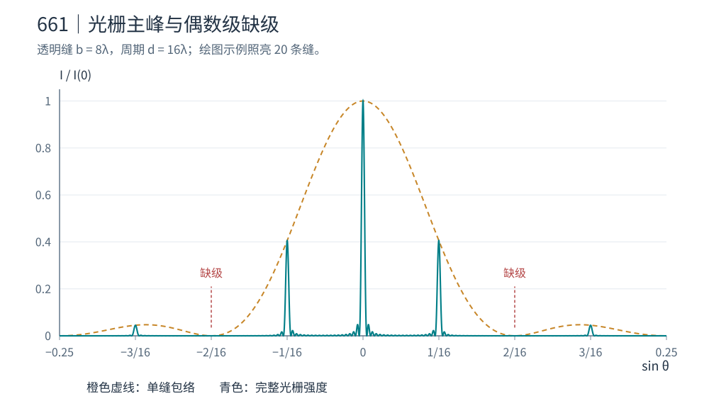
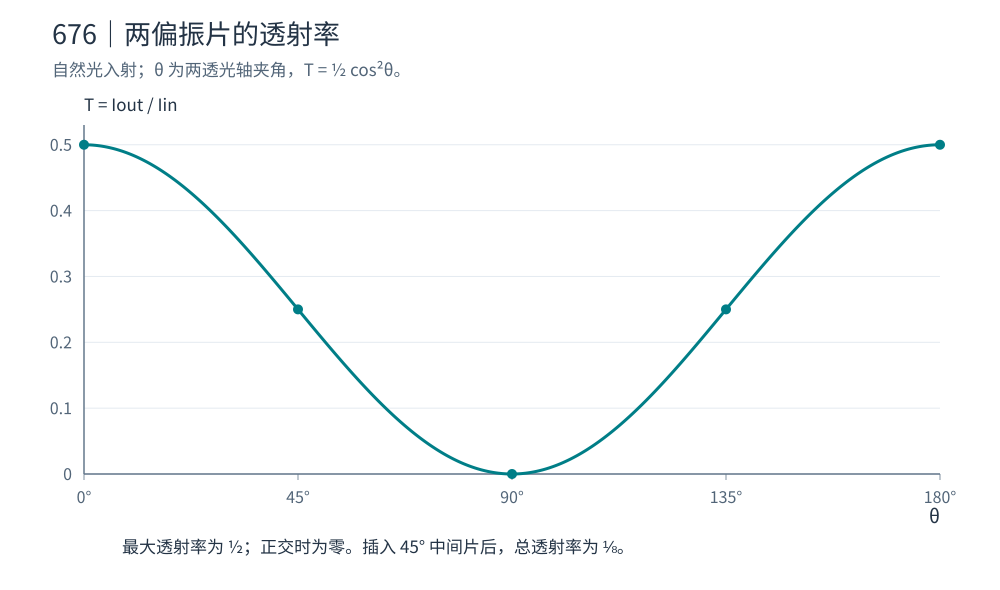
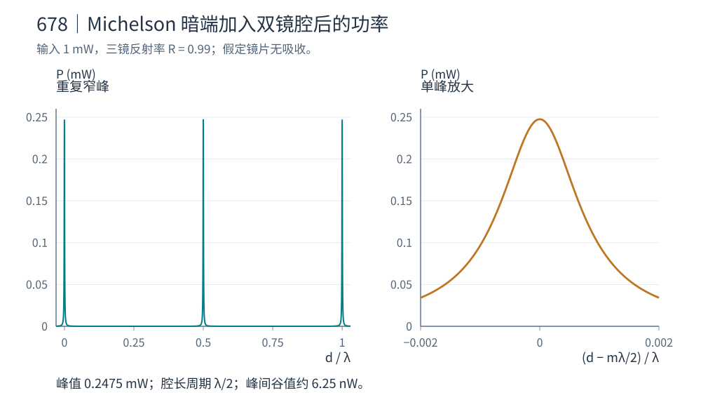
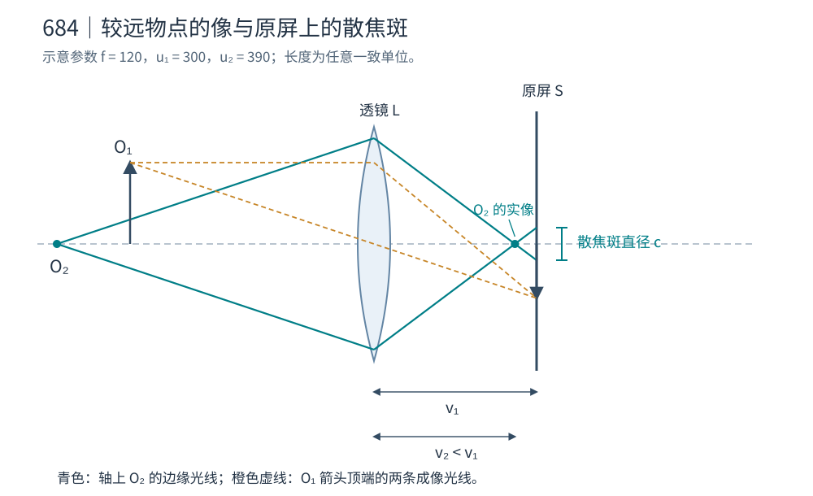

# 光学官方题库逐题解答

本文件逐张对应官方图片。每题先给题意，再说明物理模型、计算步骤与结果；原题缺少问项时明确标注，不根据常见版本补造。统一使用真空波长 $\lambda$（另有说明除外），强度为光学周期平均强度，$\operatorname{sinc}u=\sin u/u$。

## 1-3T660

[原题图片](官方题库/1-3T660.png)

**题意。** 两点相距 $2f$，在中点安放折射率 $n$、口径 $2R$ 的对称折射透镜，使单色点源无几何像差地成像，求两个非球面。

取物点 $(0,0,-f)$、像点 $(0,0,f)$，径向坐标 $r=\sqrt{x^2+y^2}$，两面写成 $z=\mp s(r)$。利用反演对称，选择透镜内每条光线沿 $z$ 轴传播，则两个折射点具有同一 $r$。费马原理要求所有物像光程相等：

$$
2\sqrt{r^2+[f-s(r)]^2}+2ns(r)=2L.
$$

故满足要求的两面为

$$
z=\pm s(r),\qquad
\sqrt{r^2+[f-s(r)]^2}+ns(r)=L,\quad 0\le r\le R.
$$

这一等光程条件求导后正是入口、出口的 Snell 定律，所以并非只保证相位、却不保证光路。把根式平方可见母线是二次曲线：

$$
r^2=(n^2-1)s^2+2(f-nL)s+L^2-f^2.
$$

取与轴上解 $s(0)=(L-f)/(n-1)$ 连续的分支：

$$
s(r)=\frac{nL-f-\sqrt{(nL-f)^2-(n^2-1)(L^2-f^2-r^2)}}{n^2-1}.
$$

透镜厚度未给定，所以有一个由 $L$ 参数化的族。若采用边缘厚度为零的常用选择，$s(R)=0$，则 $L=\sqrt{f^2+R^2}$；若保留边缘厚度，则选择相应更大的 $L$。必须保留原根式条件 $L-ns\ge0$、$0\le s<f$ 以及足够的折射几何范围；不能把平方后的另一支也当作透镜。上述零边厚、内部平行光方案要求 $R<f\sqrt{n^2-1}$，否则需改变设计几何。得到的是旋转非球面，有限口径焦斑仍受衍射限制。

## 1-3T661

[原题图片](官方题库/1-3T661.png)

**题意。** 不透明条和透明间隔各宽 $8\lambda$，平行光垂直入射，描述衍射图并求中央峰正侧前两个显著主峰的角度。

透明缝宽 $b=8\lambda$，周期是 $d=16\lambda$。若有 $N$ 条被照亮的缝，将每条缝内的复振幅积分，再把各缝等比相位相加：

$$
\frac{I(\theta)}{I(0)}
=\left(\frac{\sin\beta}{\beta}\right)^2
\left(\frac{\sin N\alpha}{N\sin\alpha}\right)^2,\quad
\beta=\frac{\pi b\sin\theta}{\lambda},\quad
\alpha=\frac{\pi d\sin\theta}{\lambda}.
$$

主峰级次满足 $\sin\theta_m=m/16$，包络零点满足 $\sin\theta=q/8$。因此所有非零偶数级缺级，前两个显著正侧主峰为 $m=1,3$：

$$
\theta_1=\arcsin(1/16)\simeq3.583^\circ,\qquad
\theta_3=\arcsin(3/16)\simeq10.807^\circ.
$$

主峰高度比为 $I_m/I(0)=[\sin(m\pi/2)/(m\pi/2)]^2$：一级约 $0.4053$，三级约 $0.0450$。图形关于零角对称，中央峰最高，奇数级窄峰落在单缝包络内，偶数级处为零；有限 $N$ 时各主峰间还有较弱旁瓣，精确峰位可有有限宽度带来的微小偏移。

## 1-3T662

[原题图片](官方题库/1-3T662.png)

**题意。** 高斯光束 $I=I_0e^{-2r^2/w^2}$，$I_0=10\,{\rm GW/cm^2}$、$w=8$ mm，经焦距 20 mm、直径 10 cm 的理想透镜聚焦；求焦斑、峰值强度及与氢原子电场的比较。

**(a)** 高斯场振幅是 $e^{-r^2/w^2}$，透镜焦面是其 Fourier 变换，仍为高斯。按题中 $1/e^2$ 强度半径定义，

$$
w_0=\frac{\lambda f}{\pi w}
=\frac{1.064\times10^{-6}\times0.020}{\pi(0.008)}
\simeq0.847\ \mu{\rm m}.
$$

焦斑直径为 $2w_0\simeq1.69\ \mu$m。入射束远小于口径，截断损失 $e^{-2(50/8)^2}$ 可忽略。

**(b)** 功率 $P=\int I\,d^2r=\pi I_0w^2/2$ 守恒，故

$$
I_{\rm peak}=I_0(w/w_0)^2
\simeq8.93\times10^{17}\ {\rm W/cm^2}.
$$

**(c)** 真空中 $I=\tfrac12c\epsilon_0E_{\rm peak}^2$，所以 $E_{\rm peak}\simeq2.59\times10^{12}$ V/m。氢原子玻尔半径处库仑场

$$
E_{\rm at}=\frac{e}{4\pi\epsilon_0a_0^2}\simeq5.14\times10^{11}\ {\rm V/m},
$$

焦场约为其 $5.0$ 倍，已是强场电离与非线性相互作用尺度。数值采用标量近轴高斯聚焦模型；本题 $w/f=0.4$，定量精密设计需矢量高数值孔径聚焦，不能把 $0.847\ \mu$m 当作不依赖模型的精确答案。

## 1-3T663

[原题图片](官方题库/1-3T663.png)

**原图完整性。** 图中只给出了单色仪装置描述：1200 线/mm 光栅、250 mm 焦距透镜、固定入射与衍射束夹角 $\Delta=\theta_d-\theta_i$，通过转动光栅调波长。图片到示意图为止，没有具体要求计算的问项，也没有 $\Delta$、狭缝宽度或工作波长数值。此项标记为 **source_incomplete**，不能给出一个虚构的唯一数值答案。

可确定的通用关系如下，供读图复习。光栅常数 $d=1/1200$ mm $=833.33$ nm。在反射光栅常用角度约定下，

$$
m\lambda=d(\sin\theta_i+\sin\theta_d)
=2d\sin\bar\theta\cos(\Delta/2),\quad
\bar\theta=\frac{\theta_i+\theta_d}{2}.
$$

转动光栅改变 $\bar\theta$，从而改变通过固定出射狭缝的 $\lambda$。固定入射角时角分散为 $d\theta_d/d\lambda=m/(d\cos\theta_d)$，焦面线分散为 $dx/d\lambda\simeq fm/(d\cos\theta_d)$。狭缝宽度和照亮刻线数分别限制实际带宽与光栅本征分辨本领 $mN$。

## 1-3T664

[原题图片](官方题库/1-3T664.png)

**题意。** 两正交线偏振片间插入半波片，快轴与第二偏振片透光轴夹角 $\theta$，求波片后偏振态及透射率。

取第二片透光轴为 $x$，第一片为 $y$，入射半波片的线偏振方位角为 $\pi/2$。半波片使沿快慢轴分量相差 $\pi$，等价于把线偏振方向关于快轴反射。因此出射仍为线偏振，方位角为 $2\theta-\pi/2$（模 $\pi$）。

由 Malus 定律，若 $I_1$ 是第一片后的强度，

$$
I_{\rm out}=I_1\cos^2(2\theta-\pi/2)
=I_1\sin^2(2\theta).
$$

所以相对于入射波片的透射率是 $\sin^2(2\theta)$。$\theta=0,\pi/2$ 时消光；$\theta=\pi/4$ 时全透。若最初为强度 $I_{\rm in}$ 的自然光，理想第一片先损失一半，故 $I_{\rm out}/I_{\rm in}=\tfrac12\sin^2(2\theta)$。

## 1-3T665

[原题图片](官方题库/1-3T665.png)

**题意。** 折射率 $n_0$ 的环境与玻璃 $n_2$ 之间镀光学厚度 $\lambda/4$ 的薄膜，求正入射无反射的膜折射率。

设 $r_{ij}=(n_i-n_j)/(n_i+n_j)$，膜厚 $t$，单程相位 $\delta=2\pi n_1t/\lambda$。把所有膜内往返反射振幅作几何级数相加，得到

$$
r=\frac{r_{01}+r_{12}e^{2i\delta}}
{1+r_{01}r_{12}e^{2i\delta}}.
$$

四分之一波光学厚度 $n_1t=\lambda/4$ 给 $e^{2i\delta}=-1$。因此无反射要求 $r_{01}=r_{12}$，交叉相乘得

$$
n_1^2=n_0n_2,\qquad n_1=\sqrt{n_0n_2},
\qquad t=\frac{\lambda}{4\sqrt{n_0n_2}}.
$$

相位反向与两反射振幅等大共同保证相消。假定材料无吸收、非磁性；只满足膜厚条件而不满足折射率匹配时仍有剩余反射。

## 1-3T666

[原题图片](官方题库/1-3T666.png)

**题意。** 两条宽 $b$ 的竖直缝，中心距 $h=3b$，求 Fraunhofer 明暗条纹。

令 $\beta=\pi b\sin\theta/\lambda$，每条缝的积分产生 $\sin\beta/\beta$，两缝中心相位差为 $2\pi h\sin\theta/\lambda=6\beta$。因此

$$
I(\theta)=I(0)\left(\frac{\sin\beta}{\beta}\right)^2\cos^2(3\beta).
$$

暗纹精确由两类零点组成：单缝衍射零点 $b\sin\theta=q\lambda$（$q\ne0$）；双缝相消零点 $h\sin\theta=(m+\tfrac12)\lambda$。

干涉因子的名义明纹在 $h\sin\theta=m\lambda$，其中 $m=3q\ne0$ 与单缝零点重合而缺级。中央包络内有 $m=0,\pm1,\pm2$ 五个未缺失的名义干涉级次。完整强度的局部最大值会因包络变化偏移；除中央峰外应求

$$
\cot\beta-\frac1\beta-3\tan(3\beta)=0
$$

并排除零点。中央包络边缘与最近干涉暗纹之间还各有一个很弱局部峰，因而严格数“所有局部强度峰”时是七个，不能与五个名义级次混用。若题目所谓缝距指两缝边缘净间隙，则中心距应改为 $4b$；本解采用通常的中心距定义。

## 1-3T667

[原题图片](官方题库/1-3T667.png)

**题意。** 波长 $1\ \mu$m、$1/e^2$ 半径 1 cm、峰值强度 $10\,{\rm GW/cm^2}$ 的高斯束，经焦距 30 cm 的足够大透镜聚焦，求焦斑及场强。

焦面 Fourier 变换与功率守恒分别给

$$
w_0=\frac{\lambda f}{\pi w}=\frac{10^{-6}\times0.30}{\pi(0.01)}
=9.55\ \mu{\rm m},
$$

$$
I_{\rm peak}=I_0\left(\frac{w}{w_0}\right)^2
=1.097\times10^{16}\ {\rm W/cm^2}.
$$

题中宽度符号采用 $\omega=2\sigma$，即本解的 $w$；焦后相应 $\sigma_0=4.77\ \mu$m，不能把直径 $2w_0$ 当成题目宽度。峰值电场为

$$
E_{\rm peak}=\sqrt{\frac{2I_{\rm peak}}{c\epsilon_0}}
\simeq2.88\times10^{11}\ {\rm V/m}
\simeq0.56\,E_{\rm at}.
$$

其中 $E_{\rm at}=e/(4\pi\epsilon_0a_0^2)=5.14\times10^{11}$ V/m。光场已经接近原子内部场尺度，普通弱场线性响应不足以描述全部相互作用；本题近轴比例 $w/f\simeq0.033$，高斯聚焦近似良好。

## 1-3T668

[原题图片](官方题库/1-3T668.png)

**题意。** 潜水员在离船水平距离 50 m 处下潜，水折射率 1.3，问船上朋友何时首次看到水下的潜水员。

先辨认题目的隐含几何。水向空气出射的临界角满足 $\sin\theta_c=1/n$。如果题目预设只接受“从潜水员到船旁某指定水面小区域”的光线，则该水下光线的入射角满足 $\tan i=50/h$。临界条件给

$$
h_{\rm crit}=\frac{50}{\tan\theta_c}
=50\sqrt{n^2-1}\simeq41.5\ {\rm m}.
$$

这就是常见的临界角作答，但必须附带上述出射位置限制。

按原文实际只说“朋友在船上”，没有限制水面出射点，这个非零阈值不能成立。若眼睛距水面高度为 $H>0$，水面出射点距潜水员正上方水平距离为 $x$，光路应满足

$$
n\frac{x}{\sqrt{x^2+h^2}}
=\frac{50-x}{\sqrt{(50-x)^2+H^2}},\quad 0<x<50.
$$

左减右在 $x=0$ 为负、在 $x=50$ 为正，故任意 $h>0$ 都有折射光路，且其水下角小于临界角。透明无障碍的理想模型中，潜水员下水后即可有光到达朋友，不存在 41.5 m 才突然可见的普遍结论。题目若要唯一非零数值，需要补充观察口、遮挡或指定出射位置。

## 1-3T669

[原题图片](官方题库/1-3T669.png)

**题意。** Fabry–Perot 腔往返相位为 $\delta=4\pi nd\cos\theta/\lambda$，求相邻频率透射峰间隔，以及正入射时扫描一个峰所需镜间距变化。

**(a)** 明纹条件 $\delta=2\pi m$，代入 $\lambda=c/\nu$：

$$
\nu_m=\frac{mc}{2nd\cos\theta},\qquad
\Delta\nu=\nu_{m+1}-\nu_m=\frac{c}{2nd\cos\theta}.
$$

这里 $\theta$ 是腔内传播角，且计算默认 $n,\theta$ 在小频段内不变；存在色散时应对整个往返相位求频率导数。

**(b)** 正入射固定 $\lambda,n$ 时，$2nd_m=m\lambda$，故相邻共振镜间距相差

$$
|\Delta d|=\frac{\lambda}{2n}.
$$

题中 $\Delta d=d_1-d_2$ 的正负取决于扫描方向；“一个条纹”的位移量是上述绝对值。

## 1-3T670

[原题图片](官方题库/1-3T670.png)

**题意。** 周期 $h$ 的光栅，推导主极大条件及同级不同波长的角间隔。

**(a)** 正入射时相邻刻线到远方观察方向的光程差为 $h\sin\theta$。所有缝同相相加要求它为整数倍波长，故

$$
h\sin\theta_m=m\lambda,\qquad m\in\mathbb Z,\quad |m\lambda|\le h.
$$

斜入射必须另加带符号的入射光程差，原题未给入射角，采用正入射。

**(b)** 同级 $m$ 的精确角间隔为

$$
\Delta\theta=\arcsin\frac{m\lambda_2}{h}
-\arcsin\frac{m\lambda_1}{h}.
$$

若波长差很小，对光栅方程微分得到 $h\cos\theta\,d\theta=m\,d\lambda$，于是 $\Delta\theta\simeq m(\lambda_2-\lambda_1)/(h\cos\bar\theta)$。物理分离角取绝对值；增大级次增加角分散，但也受可传播级次及缺级限制。

## 1-3T671

[原题图片](官方题库/1-3T671.png)

**题意。** 锥顶角 $120^\circ$ 的玻璃轴锥镜，大小端直径 $b=6$ cm、$a=2$ cm，小端遮黑，$n=1.5$，求出射角和轴上线焦段长度。

**(a)** 母线与轴夹角 $\alpha/2=60^\circ$，因此玻璃内轴向光线对锥面法线的入射角为 $i=30^\circ$。Snell 定律给 $\sin t=1.5\sin30^\circ=0.75$，$t=48.590^\circ$。出射光向轴弯折的角度为

$$
\beta=t-i=18.590^\circ.
$$

图中 $\beta$ 为单条出射线与轴的夹角；两侧光线之间夹角为 $2\beta$。

**(b)** 以大端面为 $z=0$，径向位置 $r$ 的锥面坐标 $z_s=(b/2-r)\cot60^\circ$。该出射线到轴的距离为 $r\cot\beta$，故 $z_{\rm cross}=z_s+r\cot\beta$。由 $r=a/2$ 到 $b/2$ 的交轴点差为

$$
f=\frac{b-a}{2}\cot\beta-h,\qquad
h=\frac{b-a}{2}\cot60^\circ=\frac2{\sqrt3}\ {\rm cm}.
$$

因此 $f\simeq4.79$ cm。原图把 $2/\sqrt3$ 印成十进制 $1.555$，正确值为 $1.1547$；本解使用与锥角和直径一致的精确尺寸。若机械厚度实际为 1.555 cm，则它与题给锥角不相容，不能同时使用。

## 1-3T672

[原题图片](官方题库/1-3T672.png)

**题意。** 强度 $I$ 的光从真空正入射无导电、非磁介质，折射率 $n$，求介质表面辐射力。

设介质位于 $z>0$，入射方向为 $+\hat z$，假定无吸收、稳态，且讨论入口界面的电磁面力（不把内部吸收、后表面或电致伸缩压力并入）。由 Fresnel 系数，

$$
R=\left(\frac{n-1}{n+1}\right)^2,\quad
T=\frac{4n}{(n+1)^2},\quad
E_t=\frac2{n+1}E_i.
$$

在此界面模型中，介電常数梯度的平均面力为 $-\epsilon_0(n^2-1)|E_t|^2/4$，故

$$
\frac{\mathbf F_{\rm surface}}A
=-\frac{2I}{c}\frac{n-1}{n+1}\,\hat z.
$$

即大小 $2I(n-1)/[c(n+1)]$、方向从高折射率介质指向空气。也可用稳态介质应力的动量通量差写成 $[1+R-nT]I/c$，得到同样结果。$n=1$ 时力为零。

这里必须说明“表面”与“整个物体”的区别。若只计真空侧反射光的动量变化会误写 $2RI/c$；若用介质内 Abraham 场动量 $p=\hbar\omega/(nc)$ 而不计同时随脉冲建立的物质动量，则会得到 $[1+R-T/n]I/c$，它不是上述稳态入口面力。整块介质受力需要给出后表面、吸收及入射脉冲等条件；透明介质不能直接套用不透明吸收面的 $(1+R)I/c$。

## 1-3T673

[原题图片](官方题库/1-3T673.png)

**题意。** 用 589 nm 线偏振光产生圆偏振光，求方解石真正零级四分之一波片厚度，并比较石英。

入射线偏振与快、慢轴各成 $45^\circ$，保证两分量等幅；相位延迟需为 $\pi/2$：

$$
\frac{2\pi}{\lambda}|n_o-n_e|t=\frac\pi2,\qquad
t=\frac{\lambda}{4|n_o-n_e|}.
$$

**(a)** 方解石 $\Delta n=1.659-1.487=0.172$，所以 $t=589/(4\times0.172)$ nm $=0.856\ \mu$m。

**(b)** 用题给石英折射率，$\Delta n=1.55336-1.54424=0.00912$，得到 $t=16.15\ \mu$m，约为方解石的 18.9 倍。石英需要的厚度较大，更易制备和维持机械强度；同样绝对厚度误差导致的延迟误差也更小，因此制作真正零级波片通常更合适。仅有四分之一波延迟但入射方位不为 $45^\circ$ 时得到椭圆偏振，而非圆偏振。

## 1-3T674

[原题图片](官方题库/1-3T674.png)

**题意。** 推导空气到 BK7 的 Brewster 角，计算 800 nm 的最小 $p$ 反射入射角及误用 $s$ 偏振时四次界面的反射损失。

$R_p=0$ 要求 $n_2\cos\theta_1=n_1\cos\theta_2$，结合 $n_1\sin\theta_1=n_2\sin\theta_2$。对 $n_1\ne n_2$ 可得 $\theta_1+\theta_2=\pi/2$，从而

$$
\tan\theta_B=\frac{n_2}{n_1},\qquad
\theta_B=\arctan\frac{1.51078}{1.00027}\simeq56.49^\circ.
$$

代回 $s$ 反射率，

$$
R_s(\theta_B)=
\left(\frac{n_2^2-n_1^2}{n_2^2+n_1^2}\right)^2\simeq0.152.
$$

四次相同界面透射后保留强度 $(1-R_s)^4\simeq0.516$，总反射损失约 $48.4\%$。这里“四次反射损失”指棱镜光路通过四个界面各有一部分被反射走，不能用 $4R_s$ 代替连乘；如果实际收集的是连续四次被反射的分支，其强度才是 $R_s^4I$。

## 1-3T675

[原题图片](官方题库/1-3T675.png)

**题意。** 峰值功率 $10^{10}$ W、束径 2 mm 的近准直飞秒光束，要把镜面强度降到 $5\times10^{10}$ W/cm$^2$ 以下；用给定焦距的 25 mm 口径透镜设计准直扩束器。

若按均匀圆斑，所需直径 $D_{\min}=\sqrt{4P/(\pi I_{\rm th})}=5.05$ mm，即扩束倍数至少 2.53。若 2 mm 是高斯束的 $1/e^2$ 直径，中心强度为 $8P/(\pi D^2)$，需要 $D_{\min}=7.14$ mm，即倍数至少 3.57。

采用可兼容两种常用定义的四倍 Galilean 扩束器：先放 $f_1=-50$ mm 凹透镜，再放 $f_2=+200$ mm 凸透镜，间距

$$
L=f_1+f_2=150\ {\rm mm},\qquad
M=-f_2/f_1=4.
$$

其无焦矩阵满足平行入射仍平行出射，输出束径 8 mm，远小于 25 mm 口径。输出均匀模型强度为 $1.99\times10^{10}$ W/cm$^2$，高斯峰值为 $3.98\times10^{10}$ W/cm$^2$，均低于阈值。负透镜在前还避免了两镜之间的实焦点；实际超短脉冲设计另外需要已知镜片损伤阈值和色散，但题给数据足以完成上述几何扩束方案。

## 1-3T676

[原题图片](官方题库/1-3T676.png)

**题意。** 自然光经过可调两偏振片、正交片间加 $45^\circ$ 片、以及分步旋转的多片系统，分别求透射率。

**(a)** 第一片把自然光变成强度 $I_{\rm in}/2$ 的线偏振，第二片按 Malus 定律给

$$
T(\theta)=\frac12\cos^2\theta.
$$

作图是周期 $\pi$ 的余弦平方：$0^\circ,180^\circ$ 为 $1/2$，$45^\circ,135^\circ$ 为 $1/4$，$90^\circ$ 为零。

**(b)** 插入 $45^\circ$ 片后，$T=\tfrac12\cos^245^\circ\cos^245^\circ=1/8$。中间片改变了到达末片的偏振方向，因此可以使原来不透的装置透光。

**(c)** 若总转角 $\pi/2$ 分为 $N$ 个角度增量，则需 $N+1$ 片，透射率

$$
T_N=\frac12\left[\cos^2\frac{\pi}{2N}\right]^N
\simeq\frac12e^{-\pi^2/(4N)}\longrightarrow\frac12.
$$

若题目的 $N$ 指偏振片总数，则把指数和分母中的 $N$ 同时换为 $N-1$。极限中第一片后的偏振方向逐步转过 $90^\circ$，后续附加损失趋零；自然光在第一片损失的一半不恢复。

## 1-3T677

[原题图片](官方题库/1-3T677.png)

**题意。** 四条很窄的缝相邻间距依次 $h,2h,3h$，等强正入射，求远场强度及绝对最大、最小的位置。

**(a)** 缝坐标是 $0,h,3h,6h$，不是 $0,h,2h,3h$。设 $\phi=2\pi h\sin\theta/\lambda$，$I_s$ 为单缝在忽略包络时的强度，则

$$
\frac I{I_s}=|1+e^{i\phi}+e^{3i\phi}+e^{6i\phi}|^2
=4+2(\cos\phi+\cos2\phi+2\cos3\phi+\cos5\phi+\cos6\phi).
$$

**(b)** 四个单位振幅同相时达到三角不等式上限，故 $I_{\max}=16I_s$，要求 $\phi=2\pi m$，即 $h\sin\theta=m\lambda$。

**(c)** 令 $z=e^{i\phi}$，振幅因式分解为

$$
1+z+z^3+z^6=(1+z)(1+z^2)(1-z^2+z^3).
$$

单位圆上的零点是 $z=-1,i,-i$，所以 $I_{\min}=0$，满足

$$
\frac{h\sin\theta}{\lambda}
=m+\frac14,\quad m+\frac12,\quad m+\frac34,\qquad m\in\mathbb Z.
$$

可用 $e^{i\phi}\cos3\phi=-\cos\phi$ 的虚部证明没有遗漏其他单位圆零点。所有角都还需满足 $|\sin\theta|\le1$；有限缝宽时整体乘单缝衍射包络。

## 1-3T678

[原题图片](官方题库/1-3T678.png)

**题意。** 50/50 Michelson 干涉仪两臂镜反射率 $R=0.99$、输入 1 mW；求暗端条件和能量去向。保持暗端调整后，在一臂镜后加入第三面同反射率镜，扫描镜间距，求输出功率。

**(a)** 完全相消要求到 $P$ 的两振幅等大，且包括分束器反射相位在内的总相位差为 $(2m+1)\pi$。若把固定反射相位并入零点，写作往返光程差为整数波长即可。两臂等损耗保证振幅匹配，暗端为零时约 $0.99$ mW 从另一端口离开，剩余 $0.01$ mW 经端镜透射或被吸收，能量未消失。

**(b)** 为定量计算，采用各镜无吸收、剩余 $1\%$ 为透射的理想模型；若 $1\%$ 全为吸收，第三镜的作用会不同。令 $r=\sqrt R$，新增腔长 $d$、往返相位 $\delta=4\pi d/\lambda$（镜相位可并入其原点）。两相同镜组成腔的复反射系数为

$$
r_{\rm FP}=\frac{r(1-e^{i\delta})}{1-Re^{i\delta}}.
$$

原暗端相当于两臂反射振幅作差，故

$$
P_P(d)=\frac{P_{\rm in}}4|r_{\rm FP}-r|^2
=\frac{P_{\rm in}}4
\frac{R(1-R)^2}{(1-R)^2+4R\sin^2(2\pi d/\lambda)}.
$$

它是周期 $\lambda/2$ 的窄 Airy 峰。在 $d=m\lambda/2$ 时腔反射为零，单臂留在 $P$ 的功率为 $RP_{\rm in}/4=0.2475$ mW；半周期处最小值为 $P_{\rm in}R(1-R)^2/[4(1+R)^2]\simeq6.25$ nW。用这些峰值、谷值和周期即可画出曲线。He–Ne 常见波长为 632.8 nm，此时腔长周期约 316.4 nm，但原题未明确激光谱线，公式保留 $\lambda$。

## 1-3T679

[原题图片](官方题库/1-3T679.png)

**题意。** 从边界条件推导两个非磁介质界面 $p$ 偏振振幅反射系数，并证明 Brewster 条件。

设入射角 $\theta$、折射角 $\phi$，$n_1\sin\theta=n_2\sin\phi$。取每束光的 $p$ 单位矢量使 $\mathbf e_p,\mathbf e_s,\hat{\mathbf k}$ 形成统一定向，则切向电场、磁场连续可写

$$
(E_i-E_r)\cos\theta=E_t\cos\phi,\qquad
n_1(E_i+E_r)=n_2E_t.
$$

消去 $E_t$ 得

$$
r_p=\frac{E_r}{E_i}
=\frac{n_2\cos\theta-n_1\cos\phi}
{n_2\cos\theta+n_1\cos\phi},\qquad R_p=|r_p|^2.
$$

若给反射波电矢量选相反的正方向，$r_p$ 整体变号，$R_p$ 不变。令分子为零，与 Snell 定律联立，得到 $\theta+\phi=\pi/2$ 和 $\tan\theta_B=n_2/n_1$。此时反射光与折射光垂直，$p$ 分量完全不反射。

## 1-3T680

[原题图片](官方题库/1-3T680.png)

**题意。** 六个基本概念问答。

**(a)** 普通折射透镜有而理想反射镜没有的像差是色差：材料 $n(\lambda)$ 改变透镜焦距；几何反射定律本身无此色散。反射镜仍可能有球差、彗差等几何像差。

**(b)** 反射产生最大线偏振时为 Brewster 入射，反射线与折射线夹角 $90^\circ$。

**(c)** 偏振现象直接表明光的横波性质，例如两正交偏振片的消光、Malus 定律以及双折射分解成正交横向偏振。干涉、衍射本身不能区分横波与纵波。

**(d)** 取可见波长约 380–780 nm，频率约 $3.84\times10^{14}$ 至 $7.89\times10^{14}$ Hz；使用 400–700 nm 约定时范围为 $4.3$–$7.5\times10^{14}$ Hz。视网膜敏感度边缘没有锋利的统一截止。

**(e)** 对厚透镜，指向第一节点的近轴光线，从第二节点出射时保持相同方向。两侧介质相同时节点与主点重合；通常会有横向位移，不能笼统说“穿过薄透镜光心的一条直线”。若要求在两曲面处都完全不折转，射线还必须分别沿两面的法线，普通厚透镜中这通常只剩轴向特殊线。

**(f)** 红光条纹更宽，因为相邻双缝干涉条纹间距 $\Delta y=\lambda L/d$，红光波长大于紫光。

## 1-3T681

[原题图片](官方题库/1-3T681.png)

**题意。** 双折射光纤 $n_x=1.4475,n_y=1.4476$，$\lambda=852$ nm，把线偏振变为圆偏振，求全部入射方位与长度，并选最短左圆偏振方案。

**(a)** 采用复场 $\mathbf E e^{i(kz-\omega t)}$，传播后 Jones 向量除整体相位为

$$
\begin{pmatrix}\cos\alpha\\ e^{i\delta}\sin\alpha\end{pmatrix},
\qquad \delta=\frac{2\pi(n_y-n_x)L}{\lambda}.
$$

圆偏振要求等幅与相差奇数个 $\pi/2$，故 $0\le\alpha<\pi$ 内 $\alpha=\pi/4,3\pi/4$，并且

$$
L=(2m+1)\frac{\lambda}{4(n_y-n_x)}
=(2m+1)(2.13\ {\rm mm}),\qquad m=0,1,\ldots.
$$

**(b)** 最短 $L=2.13$ mm。$\alpha=\pi/4$ 时输出 $(1,i)/\sqrt2$，固定位置的实电场随时间从 $+x$ 转向 $+y$；$\alpha=3\pi/4$ 时输出等效于 $(1,-i)/\sqrt2$，方向相反。本解沿用本题库 700 的明确约定：“面向光源观察时逆时针”为右旋，因此最短左旋方案是 $\alpha=135^\circ$。若课程采用相反的左右旋命名，答案方位换成 $45^\circ$；上述 Jones 向量和真实旋转方向不受命名差异影响。

## 1-3T682

[原题图片](官方题库/1-3T682.png)

**题意。** 双缝一臂放厚度 $\delta$、折射率 $n$ 的薄玻璃，原中央强度 $I_0$；求随厚度变化的强度与极小，再把一缝宽增倍。

采用玻璃只引入相位、忽略表面反射的题意模型（无吸收本身并不严格等于无反射）。额外光程 $(n-1)\delta$，相位 $\varphi=2\pi(n-1)\delta/\lambda$。原来单缝振幅 $A$，$I_0\propto4|A|^2$。

**(a)** 两束相加后

$$
I_C(\delta)=I_0\cos^2\frac{\varphi}{2}
=I_0\cos^2\frac{\pi(n-1)\delta}{\lambda}.
$$

**(b)** 极小为零，$\delta=(m+\tfrac12)\lambda/(n-1)$，取非负厚度。

**(c)** 很窄且均匀照明的缝在中央的振幅与宽度成正比，因此加宽到 $2w$ 使该振幅加倍。于是

$$
I_C=\frac{I_0}{4}|2+e^{i\varphi}|^2
=\frac{I_0}{4}(5+4\cos\varphi).
$$

哪一条缝加宽不影响此强度表达式。最大值 $9I_0/4$、最小值 $I_0/4$，等幅条件失去后不再完全消光。

## 1-3T683

[原题图片](官方题库/1-3T683.png)

**题意。** 地球同步卫星以 15 GHz 向地面约半径 300 km 区域发送信号，估计抛物面天线直径。

同步周期 $T\simeq86164$ s，由 $GM/r^2=4\pi^2r/T^2$，

$$
r=\left(\frac{GMT^2}{4\pi^2}\right)^{1/3}\simeq4.22\times10^7\ {\rm m}.
$$

减去地球半径后轨道高度约 $H=3.58\times10^7$ m。波长 $\lambda=c/\nu\simeq0.020$ m。用圆孔第一暗环半角 $\theta=1.22\lambda/D$，以近似天底距离估计覆盖半径 $\rho\simeq H\theta$：

$$
D\simeq\frac{1.22\lambda H}{\rho}
\simeq2.9\ {\rm m}.
$$

所以尺度约 3 m。Ann Arbor 不在赤道，真实同步卫星的斜距略大，地面投影也呈椭圆；若采用该纬度上方最佳经度的几何，仍是几米量级。若用半功率轮廓定义“覆盖区域”而非第一暗环，系数相应改变，题目要求的是估算而非唯一精确口径。

## 1-3T684

[原题图片](官方题库/1-3T684.png)

**题意。** 透镜把距镜 $\ell$ 的 $O_1$ 成像在屏上；轴上更远物点 $O_2$ 的像在哪里、屏上散焦斑多大，以及 CCD 允许的物距差。

设两物点轴向间距 $\Delta>0$，故 $O_2$ 物距为 $\ell+\Delta$。原题 (b) 列出的 $\ell,f,D$ 不足以独立确定散焦量，还需要 $\Delta$；这里把它显式保留。

**(a)** 透镜公式给

$$
v_1=\frac{f\ell}{\ell-f},\qquad
v_2=\frac{f(\ell+\Delta)}{\ell+\Delta-f}.
$$

因 $dv/du=-f^2/(u-f)^2<0$，$O_2$ 的实像位于透镜与原屏之间。作图时，轴上点的一条斜射光经透镜后通过此像点，另一条沿轴光不偏折。

**(b)** 透镜口径为 $D$，汇聚锥在 $v_2$ 处交轴后发散。由相似三角形，屏上光斑直径

$$
c=D\frac{v_1-v_2}{v_2}
=\frac{Df\Delta}{(\ell-f)(\ell+\Delta)}.
$$

小间隔时 $c\simeq Df\Delta/[\ell(\ell-f)]$。$\Delta\to0$ 时几何散焦为零，但实际衍射斑仍存在。

**(c)** 设 CCD 可接受弥散圆直径为 $c_{\rm acc}$（常取一个至数个像素，需说明选择），要求 $c\le c_{\rm acc}$。若 $Df>c_{\rm acc}(\ell-f)$，

$$
\Delta_{\max}=
\frac{c_{\rm acc}\ell(\ell-f)}
{Df-c_{\rm acc}(\ell-f)}
\simeq\frac{c_{\rm acc}\ell(\ell-f)}{Df}.
$$

若分母非正，远侧到无穷远都满足此几何容差。题目未给像素尺寸或容许模糊标准，因此不存在唯一数值；光阑缩小会减小几何散焦，却增大衍射，实际清晰范围需同时考虑。

## 1-3T686

[原题图片](官方题库/1-3T686.png)

**题意。** 用最短传播时间推导折射定律；再由塑料劈尖条纹间距求波长。

**(a)** 两点距界面垂直距离为 $a,b$，水平投影相距 $L$，折射点距第一点投影为 $x$。传播时间

$$
t(x)=\frac1c[n_A\sqrt{a^2+x^2}+n_B\sqrt{b^2+(L-x)^2}].
$$

令一阶导数为零，得到 $n_Ax/\sqrt{a^2+x^2}=n_B(L-x)/\sqrt{b^2+(L-x)^2}$，即 $n_A\sin i=n_B\sin r$。二阶导数

$$
t''=\frac1c\left[
\frac{n_Aa^2}{(a^2+x^2)^{3/2}}+
\frac{n_Bb^2}{(b^2+(L-x)^2)^{3/2}}
\right]>0,
$$

所以本平面界面问题确为最小时间。一般 Fermat 原理是光程驻值，不能在所有成像问题中都替换为最小值。原题英文将 Snell 定律称为 reflection，实际是 refraction。

**(b)** 相邻同类条纹的往返光程差增量为 $\lambda$。薄劈尖厚度 $t\simeq\alpha x$，所以 $2n\alpha\Delta x=\lambda$。代入 $\alpha=20\pi/(180\times3600)=9.6963\times10^{-5}$ rad、$\Delta x=0.0025$ m、$n=1.4$，

$$
\lambda=6.79\times10^{-7}\ {\rm m}=679\ {\rm nm}.
$$

反射相位影响明暗级次原点，但不影响相邻条纹间距。

## 1-3T687

[原题图片](官方题库/1-3T687.png)

**题意。** 标量 Helmholtz 方程 $(\nabla^2+k_0^2)U=-4\pi S$，证明远场由源 Fourier 变换给出，并证明某类源不辐射。

**(a)** 出射 Green 函数 $G(\mathbf r)=e^{ik_0r}/r$ 满足 $(\nabla^2+k_0^2)G=-4\pi\delta^3(\mathbf r)$，所以

$$
U(\mathbf r)=\int d^3r'\,
\frac{e^{ik_0|\mathbf r-\mathbf r'|}}{|\mathbf r-\mathbf r'|}S(\mathbf r').
$$

对有限尺度 $a$ 的源，远区振幅分母取 $r$，相位保留一次项 $|\mathbf r-\mathbf r'|\simeq r-\hat{\mathbf r}\cdot\mathbf r'$。在 $r\gg a$ 且 $k_0a^2/r\ll1$ 下，

$$
U(\mathbf r)\sim\frac{e^{ik_0r}}r
\int e^{-ik_0\hat{\mathbf r}\cdot\mathbf r'}S(\mathbf r')d^3r'
=\frac{e^{ik_0r}}r\,\widehat S(k_0\hat{\mathbf r}).
$$

**(b)** 对 $S_{\rm NR}=(\nabla^2+k_0^2)F$，若 $F$ 足够光滑且局域化、边界项消失，分部积分给

$$
\widehat S_{\rm NR}(\mathbf k)=(k_0^2-|\mathbf k|^2)\widehat F(\mathbf k).
$$

传播光的远场只采样球面 $|\mathbf k|=k_0$，所以所有方向的 $1/r$ 辐射项均为零。更强地，出射解可取 $U=-4\pi F$，若 $F$ 紧支撑，则源区外场严格为零。原题所谓“任意函数”须满足上述局域与边界条件；无穷延伸、增长或带边界项的任意 $F$ 不能直接套这个结论。

## 1-3T688

[原题图片](官方题库/1-3T688.png)

**题意。** 空气中的肥皂膜折射率 1.33，对 600 nm 反射相长，求最小膜厚。

正入射时，两束反射光的几何光程差为 $2nt$。空气到膜反射有 $\pi$ 相变，膜到空气反射无此相变，所以反射相长要求 $2nt=(m+\tfrac12)\lambda$。最小正厚度为

$$
t_{\min}=\frac{\lambda}{4n}
=\frac{600}{4(1.33)}\ {\rm nm}\simeq112.8\ {\rm nm}.
$$

题中未指定角度，采用通常的正入射模型；斜入射时改为 $t_{\min}=\lambda/(4n\cos r)$，不可能仅由 $n,\lambda$ 给任意角下唯一厚度。

## 1-3T689

[原题图片](官方题库/1-3T689.png)

**题意。** 远点无穷、近点 83 cm 的人，要戴隐形眼镜看清眼前 25 cm 的手机，求屈光度。

镜片应把 25 cm 的实物变为原近点 83 cm 的正立虚像。用实物距 $u=0.25$ m、虚像距 $v=-0.83$ m，

$$
P=\frac1f=\frac1u+\frac1v
=4-\frac1{0.83}=+2.795\ {\rm m^{-1}}.
$$

所以需要约 $+2.80$ D 的会聚镜片；正号对应增加会聚能力。此为近用所需最小附加屈光度；题给远点无穷表明原来远视力无需这种正透镜矫正。

## 1-3T690

[原题图片](官方题库/1-3T690.png)

**题意。** 光沿 $z$ 正入射方解石棱镜 AB 面，光轴沿 $x$，$n_o=1.6584,n_e=1.4864$，BC 面与底边夹角 $51^\circ$；入射电场与入射面夹角 $\theta$，描述晶体内和 BC 出射光。

入射面为 $xz$ 面。将电场分成 $E_x=E_0\cos\theta$ 与 $E_y=E_0\sin\theta$。沿 $z$ 的波矢垂直光轴，因此 $x$ 分量为非寻常光，折射率 $n_e$；$y$ 分量为寻常光，折射率 $n_o$。正入射 AB 后两者均沿 $z$ 前进，此特殊方向没有初始空间走离，但相速度不同。若传播长度为 $l$，相对相位累积为 $2\pi(n_o-n_e)l/\lambda$，一般形成椭圆偏振叠加。

在 BC 面，波矢对法线入射角为 $i=90^\circ-51^\circ=39^\circ$。分别检查出射切向波矢：

$$
n_o\sin39^\circ\simeq1.044>1,\qquad
n_e\sin39^\circ\simeq0.935<1.
$$

因此寻常光全反射，BC 外无传播的 $o$ 光；非寻常光可以出射，空气中出射角

$$
r_e=\arcsin(n_e\sin39^\circ)\simeq69.3^\circ
$$

（相对 BC 法线），偏转角约 $30.3^\circ$。出射束是入射面内的纯线偏振。忽略 Fresnel 损耗时其功率占比为 $\cos^2\theta$，精确功率还乘两个界面的对应透射系数；$\theta=90^\circ$ 时只有寻常入射分量，BC 不出射传播光。

## 1-3T691

[原题图片](官方题库/1-3T691.png)

**题意。** 空气中折射率 1.85 的透镜镀透明薄膜，两界面反射率相同，对 $\lambda=0.4\ \mu$m 使反射相消，求膜折射率和厚度。

在 $1<n_1<n_2$ 的无吸收减反模型，两界面反射振幅均有相同符号。等反射率要求

$$
\frac{n_1-1}{n_1+1}=\frac{n_2-n_1}{n_2+n_1},
\qquad n_1=\sqrt{n_2}=\sqrt{1.85}\simeq1.3601.
$$

反射相消再要求往返相位为奇数 $\pi$，即

$$
t=(2m+1)\frac{\lambda}{4n_1}
=(2m+1)(73.52\ {\rm nm}),\quad m=0,1,\ldots.
$$

“很薄”通常取最小厚度 73.52 nm。若把膜内全部多次反射相加，同一折射率和厚度条件仍使总反射严格为零。

## 1-3T692

[原题图片](官方题库/1-3T692.png)

**题意。** 强度 $I$ 的平面光垂直照射半径 $R$ 的不透明圆盘，求盘后轴线上远于 $R$ 的点 $P$ 的强度。

这是 Poisson–Arago 亮斑。令圆盘到 $P$ 距离为 $z$，未遮挡场为 $U_{\rm free}=U_0e^{ikz}$。先计算互补圆孔的轴上 Fresnel 场：

$$
U_{\rm hole}=\frac{U_0e^{ikz}}{i\lambda z}
\int_0^R e^{i\pi r^2/(\lambda z)}2\pi r\,dr
=U_0e^{ikz}[1-e^{i\pi R^2/(\lambda z)}].
$$

Babinet 原理对复场给 $U_{\rm disk}+U_{\rm hole}=U_{\rm free}$，从而

$$
U_{\rm disk}=U_0e^{ikz+i\pi R^2/(\lambda z)},\qquad I(P)=I.
$$

轴心虽然处在几何阴影中，边缘衍射仍在轴上相干叠加为亮点。结论在平面相干照明、理想圆盘及标量近轴模型下成立；不能把互补屏的强度直接相加。

## 1-3T693

[原题图片](官方题库/1-3T693.png)

**题意。** 折射率 1.5 的玻璃立方体，光从顶面斜入射后射向侧面，是否有光从侧面出射？

设顶面内折射角为 $r$。空气入射给 $\sin r=\sin i/1.5\le2/3$，故 $r\le41.81^\circ$。若光线在垂直侧面的截面中，侧面入射角为 $j=90^\circ-r\ge48.19^\circ$。玻璃到空气临界角仅 $\theta_c=\arcsin(2/3)=41.81^\circ$，所以必发生全反射，没有传播光从侧面出射。

三维斜射也一样：侧面法向方向余弦不超过横向分量 $\sin r\le2/3$，因而侧面入射角至少 $48.19^\circ$。界面外可有倏逝场，但不是远离界面传播的透射光。

## 1-3T694

[原题图片](官方题库/1-3T694.png)

**题意。** 单缝右半部分加吸收片，使那里电场振幅减半；原中央强度为 $I_0$，第一暗纹坐标为 $x_0$，求新图样在 $0,x_0,2x_0$ 的强度。

设全缝宽 $a$，$\beta=\pi ax/(\lambda L)=\pi x/x_0$。把两半缝视为宽 $a/2$、中心相隔 $a/2$ 的两个相干孔径，则相对于原中央振幅 $A_0$，

$$
\frac{A'}{A_0}
=\frac12\operatorname{sinc}(\beta/2)
\left(e^{i\beta/2}+\frac12e^{-i\beta/2}\right).
$$

因此

$$
\frac{I'}{I_0}
=\frac14\operatorname{sinc}^2(\beta/2)
\left(\frac54+\cos\beta\right).
$$

代入三点：

$$
I'(0)=\frac9{16}I_0,\qquad
I'(x_0)=\frac{I_0}{4\pi^2},\qquad
I'(2x_0)=0.
$$

第一原暗纹处，两半缝原来的等大反相振幅现在不等大，故被填亮；第二原暗纹处，每个半缝自身振幅已为零，仍暗。原题明确是电场减半，不能把透过场错误取为 $1/\sqrt2$。

## 1-3T695

[原题图片](官方题库/1-3T695.png)

**题意。** 提出天空呈蓝色的物理模型并用简单计算说明；空气并非自由电子气。

把空气分子的束缚电子近似为受迫谐振子：$m(\ddot x+\gamma\dot x+\omega_0^2x)=-eE_0e^{-i\omega t}$。稳态诱导偶极矩为 $p=\alpha(\omega)E$，其中

$$
\alpha(\omega)=\frac{e^2/m}{\omega_0^2-\omega^2-i\gamma\omega}.
$$

可见光频率低于主要电子共振频率时，$\alpha\simeq e^2/(m\omega_0^2)$ 近似与频率无关。振荡偶极的平均总辐射功率为 $P=\omega^4|p|^2/(12\pi\epsilon_0c^3)$，入射强度 $I=\epsilon_0c|E|^2/2$，故 Rayleigh 总截面

$$
\sigma=\frac{\omega^4|\alpha|^2}{6\pi\epsilon_0^2c^4}
\propto\lambda^{-4}.
$$

例如 450 nm 与 650 nm 的散射强度比约 $(650/450)^4=4.35$，蓝光更容易偏离太阳直射方向进入视线，所以天空偏蓝。紫光虽有更大的散射因子，但太阳光谱、眼睛光谱响应和大气透射共同决定视觉颜色，不能只凭 $\lambda^{-4}$ 断言天空应为紫色。落日光程较长，短波被沿途散走，剩余直射光偏红。自由电子模型给 Thomson 截面近乎与频率无关，无法解释本题。

## 1-3T696

[原题图片](官方题库/1-3T696.png)

**题意。** Kepler 望远镜物镜焦距 $F$、目镜焦距 $f$、物镜口径 $D$、出射束径 $d$，求放大率、分辨率及双材料镜片作用。

**(a)** 远处物体张角 $\alpha$ 在物镜焦面形成高度 $y\simeq F\alpha$ 的倒像，目镜把它以角 $\alpha'\simeq-y/f$ 送出，故角放大率

$$
M=\frac{\alpha'}{\alpha}=-\frac Ff,\qquad
|M|=\frac Dd.
$$

后式来自共焦锥的相似三角形 $D/F=d/f$。负号表示倒像。

**(b)** 圆形物镜受衍射限制，Rayleigh 角分辨率约 $\delta\alpha=1.22\lambda/D$；对应物镜焦面间距 $1.22\lambda F/D$。目镜把视角放大却不恢复物镜未分开的细节，眼瞳和像差也可进一步限制实用分辨率。

**(c)** 两种材料的色散不同，常用正的冕牌玻璃与负的火石玻璃组合成消色差双胶合镜。薄镜近似中 $\Phi=\Phi_1+\Phi_2$，令 $\Phi_1/V_1+\Phi_2/V_2=0$ 可消掉选定两波长间的一阶色差，同时保留总会聚光焦度；这并非让所有波长的全部像差完全消失。

## 1-3T697

[原题图片](官方题库/1-3T697.png)

**题意。** 汇聚光路中插入折射率 1.60 的平行玻璃板，使焦点向后移动 0.3 cm，求厚度。

设板前入射角 $\theta$ 很小，板内角 $\theta'\simeq\theta/n$。原本在厚度 $t$ 内下降的横向高度为 $t\theta$，插板后只有 $t\theta/n$；出板后角度恢复 $\theta$，因此还需多传播

$$
\Delta=t\left(1-\frac1n\right).
$$

代入得 $t=0.3/(1-1/1.60)=0.80$ cm，即 8.0 mm。图中 14.4 cm 的初始焦距位置不影响近轴焦点位移公式；非近轴光线移动量略有差异，会产生球差。

## 1-3T698

[原题图片](官方题库/1-3T698.png)

**题意。** 532 nm、总功率 1 W、入射高斯半径 5 mm，要聚焦到峰值强度 $10^7$ W/cm$^2$，求入射峰值、焦腰及所需焦距。

功率积分为 $P=2\pi I_0\int_0^\infty r e^{-2r^2/w^2}dr=\pi I_0w^2/2$。

**(a)** 入射峰值 $I_{\rm in}=2P/(\pi w^2)=2.546\times10^4$ W/m$^2=2.546$ W/cm$^2$。

**(b)** 目标强度是 $10^{11}$ W/m$^2$，所以

$$
w_0=\sqrt{\frac{2P}{\pi I_{\rm peak}}}
=2.523\times10^{-6}\ {\rm m}=2.52\ \mu{\rm m}.
$$

**(c)** 对理想准直高斯束 $w_0=\lambda f/(\pi w)$，因此

$$
f=\frac{\pi ww_0}{\lambda}\simeq0.0745\ {\rm m}=74.5\ {\rm mm}.
$$

选择约 75 mm 的焦距。原图最后一问重复编号为 (b)，这里按第三问处理。检查焦后 Rayleigh 长度 $z_R=\pi w_0^2/\lambda\simeq37.6\ \mu$m，说明高强度区沿轴也很短。

## 1-3T699

[原题图片](官方题库/1-3T699.png)

**题意。** 第一镜在 $x=0$、焦距 $f>0$；第二镜在 $x=d$、焦距 $-f'<0$；物点在 $x=-s$。求总像位置及三个特例。

**(a)** 第一镜像距 $v_1=fs/(s-f)$。第二镜的有符号物距为 $u_2=d-v_1$，可为负（虚物）。第二镜像距

$$
v_2=\frac{(-f')u_2}{u_2+f'}
=-\frac{f'[d(s-f)-fs]}{(d+f')(s-f)-fs},
\qquad x_{\rm image}=d+v_2.
$$

第二镜右侧实像对应 $v_2>0$，左侧虚像对应 $v_2<0$。分母为零表示出射平行、像在无穷远。

**(b)** $s\to\infty,f=d$ 时第一焦点恰在第二镜面，理想薄镜处汇聚高度为零，故 $v_2=0$，像在 $x=d$，也可从上式连续取极限。

**(c)** $s=f=f'=d$ 时第一镜出射平行，第二发散镜形成位于其左侧 $d$ 的虚像，所以 $v_2=-d$、$x_{\rm image}=0$。

**(d)** $s=4d,f=d,f'=2d$ 时 $v_1=4d/3$、$u_2=-d/3$、$v_2=2d/5$，故实像在 $x=7d/5$。

## 1-3T700

[原题图片](官方题库/1-3T700.png)

**题意。** 拉伸透明胶带成为 532 nm 的零级四分之一波片，厚度 0.25 mm，求双折射、讨论拉伸方向对应快慢轴，并判定指定输入的旋向。

**(a)** 四分之一波光程差为 $\Delta n\,d=\lambda/4$，故

$$
\Delta n=n_{\rm slow}-n_{\rm fast}
=\frac{532\times10^{-9}}{4(0.25\times10^{-3})}
=5.32\times10^{-4}.
$$

**(b)** 常用的链取向模型是：拉伸使聚合物链更多沿拉伸方向排列，若链轴方向极化率较大，则沿拉伸方向折射率更大，因而该方向是慢轴，横向是快轴。逻辑链是“取向改变极化率张量，再改变折射率”，不是“拉得更长所以走得更慢”。仅知道材料是聚合物，不能对所有化学组成保证极化率各向异性的符号；这里采用上述常见正取向双折射模型。要对特定胶带确认，可与已知快慢轴的波片叠加测量。

**(c)** 按慢轴沿 $x$ 的模型，采用 $e^{i(kz-\omega t)}$，入射 $(1,1)/\sqrt2$ 变成 $(i,1)/\sqrt2$，等效于 $(1,-i)/\sqrt2$。固定位置电场从 $+x$ 向 $-y$ 转，面向来光观察为顺时针。原题明确规定面向来光逆时针叫右旋，所以此处为左旋圆偏振。若实验确认拉伸方向实际上是快轴，则输出为相反旋向。相位及旋转方向必须先算，再依题目命名。

## 1-3T701

[原题图片](官方题库/1-3T701.png)

**题意。** 矩形孔在 $y$ 方向宽 $a$、$z$ 方向宽 $b>a$，沿 $x$ 照明，求远场图方向、距离和波长变化影响，以及归一化分布。

**(a)** 衍射角宽与孔径对应方向宽度成反比。题图竖直方向的亮斑间隔较大，因此竖直对应 $Y$（较小孔宽 $a$），水平方向对应 $Z$（较大孔宽 $b$）。

**(b)** 屏距加倍时，归一化角分布不变，屏上各条纹的线尺寸加倍；同一角度对应处的辐照度降到原来的 $1/4$，因为球面展开面积增为四倍。若讨论单位立体角功率，则它不变。

**(c)** 在孔上入射强度保持相同时，波长加倍使两个方向的近轴角宽都加倍，中央辐照度按 $1/\lambda^2$ 降至 $1/4$，归一化图样向两个角方向各扩展两倍。

**(d)** 孔函数可分离，所以振幅积分分解为

$$
U\propto
\int_{-a/2}^{a/2}e^{-ik\theta_y y}\,dy
\int_{-b/2}^{b/2}e^{-ik\theta_z z}\,dz.
$$

求积并取模平方得到

$$
\frac{I(\theta_y,\theta_z)}{I(0,0)}
=\operatorname{sinc}^2\left(\frac{\pi a\theta_y}{\lambda}\right)
\operatorname{sinc}^2\left(\frac{\pi b\theta_z}{\lambda}\right).
$$

第一暗线分别在 $|\theta_y|=\lambda/a$、$|\theta_z|=\lambda/b$。Fraunhofer 条件比简单的 $x\gg a,b$ 更强，还需孔径二次相位足够小，例如 $x\gg\max(a^2,b^2)/\lambda$。

## 1-3T702

[原题图片](官方题库/1-3T702.png)

**题意。** 点光源距理想反射镜高度 $x$，探测屏距镜 $2b$；近轴条件下求轴心随光源位置的明纹、$x=b$ 时明环半径，以及镜面平行移动的影响。

镜像法把反射路程写为从高度 $-x$ 的像源到屏的距离。直接与反射路程为

$$
L_-=\sqrt{(2b-x)^2+r^2},\qquad
L_+=\sqrt{(2b+x)^2+r^2}.
$$

理想镜面反射电场有 $\pi$ 相位改变，所以干涉相长要求 $L_+-L_-=(m+\tfrac12)\lambda$。

**(a)** $r=0$ 时路程差为 $2x$，故 $x=(2m+1)\lambda/4$，并取 $0<x<2b$。这是题设 $\lambda\ll b$ 下忽略缓变幅度包络的明纹位置；若追求完整强度的严格极值，球面波振幅随 $x$ 的变化会造成高阶微小偏移。

**(b)** 当 $x=b$，展开得到 $L_+-L_-\simeq2b-r^2/(3b)$。已知轴心为明纹，向外每少一个波长再次相长，故

$$
r_j=\sqrt{3b\,j\lambda},\qquad j=1,2,\ldots,\quad r_j\ll b.
$$

更精确的半径由 $\sqrt{9b^2+r^2}-\sqrt{b^2+r^2}=2b-j\lambda$ 解出。两路距离不同，其幅度一般不等，暗环未必全暗，但相长相位条件仍如此。

**(c)** 理想均匀无限平面镜沿自身平面匀速运动，不改变平面几何位置。镜面反射的动量改变量只有法向分量，与平行速度点乘为零，因而不产生反射频移，(a)(b) 的条纹位置不变；有限镜面边缘扫过光束属于额外遮挡效应。

## 1-3T703

[原题图片](官方题库/1-3T703.png)

**题意。** 两薄透镜相距 $d$，由组合像距求后截距、前截距及 $d\to0$ 的有效焦距。

设光沿左到右传播。第一镜物在无穷时，其像距为 $f_1$，对第二镜物距 $d-f_1$。后焦点到第二镜的有符号距离为

$$
\mathrm{BFL}=\frac{f_2(d-f_1)}{d-f_1-f_2}
=\frac{f_2(f_1-d)}{f_1+f_2-d}.
$$

前焦点应使出射平行，即第二镜物距为 $f_2$，因此第一镜像距为 $d-f_2$。前焦点到第一镜、向左为正的距离为

$$
\mathrm{FFL}=\frac{f_1(d-f_2)}{d-f_1-f_2}
=\frac{f_1(f_2-d)}{f_1+f_2-d}.
$$

有效光焦度可由光线传递矩阵的 $C$ 元素求得：

$$
\frac1{f_{\rm eff}}=\frac1{f_1}+\frac1{f_2}
-\frac d{f_1f_2},\qquad
f_{\rm eff}=\frac{f_1f_2}{f_1+f_2-d}.
$$

当 $d\to0$，三者都趋于 $f_1f_2/(f_1+f_2)$。非零间距时截距从镜片平面量起，有效焦距从主平面量起，通常不同；$f_1+f_2=d$ 为无焦系统，应单独取极限。

## 1-3T740

[原题图片](官方题库/1-3T740.png)

**题意。** 物距 228 cm、像距 12.0 cm，在镜后插入厚 0.90 cm、折射率 1.50 的平行玻璃板；求新像位，以及胶片不动时的新物距。

**(1)** 近轴平行板使汇聚点向后移 $t(1-1/n)=0.90(1-2/3)=0.30$ cm，所以新像在镜后 12.30 cm，位于原胶片后方 0.30 cm。平行板位置只要处在汇聚光路中，便不改变这一近轴位移。

**(2)** 透镜本身焦距由 $1/f=1/228+1/12$ 得 $f=11.4$ cm。插板后要在原 12 cm 处成像，透镜若单独存在应会聚在 $v_0=12-0.30=11.70$ cm。因此

$$
\frac1u=\frac1{11.4}-\frac1{11.7},\qquad
u=444.6\ {\rm cm}=4.446\ {\rm m}.
$$

物体应移远到镜前约 4.45 m。题图玻璃板到片的 8 cm 可用来检查板确实位于光路中，不进入最终焦点位移结果。

## 1-3T742

[原题图片](官方题库/1-3T742.png)

**题意。** 两正透镜相距 $2(f_1+f_2)$，物面在第一镜前 $2f_1$、屏在第二镜后 $2f_2$，两等亮点相隔高度 $a$，同轴光阑直径 $D_1=4a,D_2=2a$。求像亮度比；使离轴像消失的第一光阑；以及插入场镜使两像同亮的设计。

先做光线映射。令 $q=f_2/f_1$，物点高度 $y$，光线穿过第一镜时高度为 $u$。第一镜在其后 $2f_1$ 形成高度 $-y$ 的中间像，延长到第二镜有

$$
v=-(1+q)y-qu.
$$

这条式子把每个物点的光束截面映射为第二镜平面上的圆盘。

**(1)** 本问 $q=1/2$。轴上 $B$ 的光束圆盘半径 $qD_1/2=a$，与半径 $a$ 的第二光阑重合，全部通过。离轴 $A$ 的同半径圆盘中心偏移 $3a/2$，只通过两个等半径圆的交叠区。因为初始接受立体角相同，亮度比等于通过面积比：

$$
\frac{I_{A'}}{I_{B'}}
=\frac{2a^2\arccos(3/4)-(3a/4)\sqrt{4a^2-(3a/2)^2}}
{\pi a^2}
=\frac{2\arccos(3/4)-3\sqrt7/8}{\pi}
\simeq0.1443.
$$

此处必须算圆孔交叠面积，不能用截面图中的线段长度比代替。

**(2)(i)** 离轴光束圆盘半径变成 $qD_1/2$，中心距离为 $(1+q)a$。恰与第二光阑外切时 $(1+q)a=qD_1/2+a$，所以使 $A'$ 消失的最大孔径为 $D_1=2a$；更小孔径也没有几何光线通过。相切点面积为零。

**(2)(ii)** 将薄凸场镜放在两个中间像 $A'',B''$ 所在面，即第一镜后 $2f_1$、第二镜前 $2f_2$。在那里每个物点的光线汇聚于一个点，加入薄镜不改变该点及最终共轭像位置；它可改变光束方向，使第一光阑成像到第二光阑上。要求

$$
\frac1{f_3}=\frac1{2f_1}+\frac1{2f_2},
\qquad f_3=\frac{2f_1f_2}{f_1+f_2}.
$$

同轴场镜须覆盖高度 $0$ 与 $-a$ 两个中间像，因此直径至少 $2a$。此时两物点在第二光阑上的瞳像均居中、受相同截光，亮度相等。以上为几何光学的点像和理想薄镜结果。

## 1-3T744

[原题图片](官方题库/1-3T744.png)

**题意。** 薄壁球内水折射率 $4/3$、半径 5 cm，观察者沿直径看球内物体从远侧端点向近侧移动，速度 1 cm/s；求像位置变化及移动 0、2.5、5 cm 时的像速。

忽略薄玻璃壁，使用朝观察者的水—空气球面。以近侧顶点为原点，向观察者为正；物距 $u>0$ 从顶点向球内量，曲率半径为 $-r$。折射公式

$$
\frac{4/3}{u}+\frac1v=\frac{1-4/3}{-r}
=\frac1{3r}
$$

给 $v=3ru/(u-4r)$。物体从远端出发时 $u=2r$，随后 $u=2r-v_{\rm obj}t$，像始终为虚像 $v<0$，从 $v=-3r$ 向近侧顶点移近。

$$
\frac{dv}{dt}=\frac{12r^2v_{\rm obj}}{(u-4r)^2}.
$$

|物体已移动|物距 $u$|像位置 $v$|像速（向观察者）|
|---|---:|---:|---:|
|0 cm|10 cm|−15 cm|3.00 cm/s|
|2.5 cm|7.5 cm|−9 cm|1.92 cm/s|
|5.0 cm|5 cm|−5 cm|1.333 cm/s|

表中位置均相对近侧顶点；负号表示虚像位于水球一侧。这一题意把移动物体理解为球内沿直径运动，否则“远端开始”需另给外部起点。

## 1-3T746

[原题图片](官方题库/1-3T746.png)

**题意。** 空气中折射率 1.5、半径 $R$ 的玻璃球，求无穷远物及距前球面 $2R$ 的物的像，并判断轴向箭头朝向。

球透镜两个主平面均经过球心，有效焦距

$$
f=\frac{nR}{2(n-1)}=\frac32R.
$$

也可逐面使用 $n_1/u+n_2/v=(n_2-n_1)/R_s$，其中第二曲率为 $-R$。

**(1)** 平行入射像在球心后 $f=1.5R$，即后球面外 $R/2$。

**(2)** 物体距前面 $2R$，等于距前主平面（球心）$3R=2f$。所以像也在后主平面后 $3R$，即后表面外 $2R$，横向放大率为 $-1$：等大、横向倒立的实像。逐面校验：第一面像距为 $3R$，对第二面是虚物距 $-R$，第二面像距为 $2R$。

**(3)** 如果小箭头沿轴指向球面，则需用纵向放大率。两侧介质相同，局部纵向倍率为横向倍率平方 $+1$，所以箭头的空间轴向方向不反转；原箭头向右指向球，像箭头也向右，因位于球右侧而指向远离球面。不能把横向倒立直接用于轴向箭头。

## 1-3T748

[原题图片](官方题库/1-3T748.png)

**题意。** 温度计玻璃圆柱横截面半径 $R$、折射率 $3/2$，细水银柱距右侧顶点 $O$ 为 $2R$，从右侧看像的位置与横向大小。

这是玻璃到空气的单柱面在横截面内的近轴折射。取实物距 $u=2R$、曲率 $R_s=-R$，有

$$
\frac{3/2}{2R}+\frac1v
=\frac{1-3/2}{-R}=\frac1{2R},
\qquad v=-4R.
$$

像在顶点左侧 $4R$，是虚像。横截面内放大率

$$
m=-\frac{n_{\rm in}v}{n_{\rm out}u}
=-\frac{(3/2)(-4R)}{2R}=3.
$$

水银柱看起来正立、横向宽度放大三倍。圆柱沿轴方向无曲率，此三倍只指题图横截面中的宽度，不能自动说三个空间方向都放大三倍。

## 1-3T749

[原题图片](官方题库/1-3T749.png)

**原图性质。** 这张图片是 748 的原配解答，没有新增独立问题，仍逐图收录并复核。

它使用 $n=3/2,n'=1,u=2R,R_s=-R$，代入折射式得到 $v=-4R$；由 $m=-nv/(n'u)=3$，判断正立放大虚像。两步符号和数值均正确，与 748 的独立推导一致。补充范围：圆柱光学作用发生在横截面方向，沿柱轴的倍率不由这个单截面公式给出。

## 1-3T750

[原题图片](官方题库/1-3T750.png)

**题意。** 固定正透镜 $f_1=3.00$ cm 与胶片间距 $l=4.50$ cm，在中间移动焦距 $-f_2$ 的负透镜；求 $f_2=3$ cm 时对焦移动量、可对焦物距范围，以及固定 $f_2$ 覆盖全部范围的条件。

设正镜独立像距 $v_1=f_1u/(u-f_1)$，负镜位置 $d$，则其物距为 $d-v_1$、像距为 $l-d$。透镜式化为

$$
\frac1{d-v_1}+\frac1{l-d}=-\frac1{f_2},
\qquad
d=\frac{v_1+l-\sqrt{(l-v_1)^2+4f_2(l-v_1)}}2.
$$

选负根是因为需 $0<d<v_1<l$。

**(1)** 无穷远物给 $v_1=3$ cm，$f_2=3$ cm 代入得 $d=1.50$ cm。$u=100$ cm 时 $v_1=300/97\simeq3.09278$ cm，代入得 $d\simeq1.62459$ cm。因此负镜向胶片移动约 $0.1246$ cm，即 1.25 mm。

**(2)** 负镜只能把已会聚的光束延迟到更远处形成实像，因此要求正镜的独立实像位于胶片之前：$f_1\le v_1<l$。等价物距

$$
u>\frac{f_1l}{l-f_1}=9.00\ {\rm cm}.
$$

$u=9$ cm 时正镜本已在胶片成像，有限强度负镜若在两者之间会破坏这一成像；只能把它移到胶片极限位置或移除。

**(3)** 要让同一个 $f_2$ 对所有 $v_1\in[f_1,l)$ 都有 $d>0$，由根式得

$$
0<f_2<\min_{v_1\in[f_1,l)}
\frac{lv_1}{l-v_1}
=\frac{lf_1}{l-f_1}=9.00\ {\rm cm}.
$$

其调整范围为

$$
\frac{f_1+l-\sqrt{(l-f_1)^2+4f_2(l-f_1)}}2
\le d<l.
$$

下端对应无穷远物，上端是 $u\to9^+$ 的极限。若允许两镜重合 $d=0$，可以把 $f_2=9$ cm 的边界方案包含进来。

## 1-3T751

[原题图片](官方题库/1-3T751.png)

**原图性质。** 这张长图是 750 的原配三问解答，未另出新题，已按每一步独立核对。

第一问的 $d=1.50$ cm、$d'\simeq1.62$ cm、$\Delta d\simeq0.12$ cm 正确；原图中间二次方程系数提前取两位小数，因此精算值以 750 的 $1.62459$ cm 为准。第二问从负透镜必须接受虚物推得 $3\le v_1<4.5$ cm 和 $u>9$ cm，正确。第三问得 $f_2<9$ cm，使用的是严格两镜分离条件 $d>0$，也正确。

原图最后只说可按根式调节；对应完整调整区间已在 750 列出。对于 $f_2=3$ cm，为 $1.50\le d<4.50$ cm。这里的 $f_2$ 始终为负透镜焦距的绝对值，实际有符号焦距是 $-f_2$。

## 1-3T752

[原题图片](官方题库/1-3T752.png)

**题意。** 已知厚透镜光焦度 $\Phi=(n-1)[1/R_1+1/R_2-d(n-1)/(nR_1R_2)]$，推导消除焦距色差条件。

沿用原题半径号法，定义 $A=1/R_1+1/R_2$、$B=d/(R_1R_2)$，则 $\Phi=A(n-1)-B(n-1)^2/n$。

对选定两波长，其折射率为 $n_a,n_b$。要求焦距相同即 $\Phi(n_a)=\Phi(n_b)$。利用 $(n-1)^2/n=n-2+1/n$，相减并除以 $n_a-n_b$，得到

$$
A=B\left(1-\frac1{n_an_b}\right),
\qquad
d=\frac{n_an_b}{n_an_b-1}(R_1+R_2).
$$

对很窄谱段，以中心折射率 $n$ 作一阶消色差，条件为 $d\Phi/dn=0$，即

$$
R_1+R_2=d\left(1-\frac1{n^2}\right),
\qquad d=\frac{n^2}{n^2-1}(R_1+R_2).
$$

“任何光谱段”应理解为可针对选定谱段代入相应折射率。单一色散材料、固定非零光焦度的这类透镜不能对所有连续波长精确消色差：$A-B(1-1/n^2)$ 不可能在变化的所有 $n$ 上恒零，除非退化为零光焦度条件。上述仅保证有效焦距条件，不自动保证固定镜片顶点量起的后截距无色差。

## 1-3T753

[原题图片](官方题库/1-3T753.png)

**原图性质。** 752 的配套答案，通过对 $f\Phi=1$ 微分并令 $\delta f=0$，得到

$$
d=\frac{n^2(R_1+R_2)}{n^2-1}.
$$

代数计算正确，对应中心折射率 $n$ 处的一阶有效焦距消色差。原解文字“对于所有光谱段”容易误读成一块固定透镜对全部波长都严格无色差；实际微分条件是局部条件，宽谱两端精确匹配应使用 752 的 $n_an_b$ 公式。已复核本图全部等式，没有新增问项。

## 1-3T754

[原题图片](官方题库/1-3T754.png)

**题意。** 证明 $E=A\cos(\omega t-kx)$ 满足一维波动方程。

直接求导：

$$
\frac{\partial E}{\partial x}=Ak\sin(\omega t-kx),\qquad
\frac{\partial^2E}{\partial x^2}=-k^2E,
$$

$$
\frac{\partial E}{\partial t}=-A\omega\sin(\omega t-kx),\qquad
\frac{\partial^2E}{\partial t^2}=-\omega^2E.
$$

因此

$$
\frac{\partial^2E}{\partial x^2}
-\frac1{v^2}\frac{\partial^2E}{\partial t^2}
=\left(-k^2+\frac{\omega^2}{v^2}\right)E=0
$$

当且仅当非平凡波满足 $\omega=vk$（取正频率、正波数）。等相位面满足 $x=(\omega/k)t+\mathrm{const}$，故传播方向为 $+x$、速度为 $v$。

## 1-3T755

[原题图片](官方题库/1-3T755.png)

**原图性质与勘误。** 这是 754 的配解。最后代入 $\omega/k=v$ 验证波动方程的结论正确，但第一行把空间一阶导数印成 $-Ak\sin(\omega t-kx)$，符号错误。正确式是

$$
\partial_x[A\cos(\omega t-kx)]
=(-A\sin(\omega t-kx))(-k)
=+Ak\sin(\omega t-kx).
$$

其下一行二阶导数 $-Ak^2\cos(\omega t-kx)$ 则正确，因此明显属于首行笔误。时间一、二阶导数及最终证明均与 754 一致；复习时不要复制这个负号。

## 1-3T756

[原题图片](官方题库/1-3T756.png)

**题意。** 6000 Å 平行单色光正入射 Fresnel 双棱镜，$n=1.5$、小底角 $\alpha$；求屏上图样，以及条纹间距 0.1 mm 对应底角。

**(1)** 每个薄棱镜使光偏折 $\theta\simeq(n-1)\alpha$，上下两束相干平面波夹角为 $2\theta$。它们在重叠区形成平行于棱脊、等距明暗直条纹，沿垂直棱脊方向的相位差为 $2k y\sin\theta$。

**(2)** 相邻亮纹相位差增 $2\pi$，所以

$$
\Delta y=\frac{\lambda}{2\sin\theta}
\simeq\frac{\lambda}{2(n-1)\alpha}.
$$

换算 $\lambda=600$ nm $=0.0006$ mm，得到 $\alpha=0.0006/[2(0.5)(0.1)]=0.006$ rad $=0.3438^\circ=20.63'$，满足小于一度的近似条件。

## 1-3T757

[原题图片](官方题库/1-3T757.png)

**原图性质。** 756 的配解图及推导。它先用 $\theta=(n-1)\alpha$，再得 $\Delta=\lambda/[2\sin\theta]\simeq\lambda/[2(n-1)\alpha]$，最后 $\alpha=0.006$ rad $\simeq21'$。上述计算均正确；“21”后的角分符号不能误读为 21 度。两束只在图中阴影交叠区产生条纹，离开该区只剩单束照明。

## 1-3T758

[原题图片](官方题库/1-3T758.png)

**题意。** Billet 分割透镜：物面线光源距焦距 $f$ 的透镜为 $l_1>f$，两半镜沿垂直切口方向对称分开总距离 $\delta$，屏距透镜 $L$；求条纹间距与条纹总数。

两个半镜各形成一个相干实像，轴向像距与横向像间距为

$$
l_2=\frac{fl_1}{l_1-f},\qquad
d=\delta\left(1+\frac{l_2}{l_1}\right)
=\frac{\delta l_1}{l_1-f}.
$$

图示屏位于像面之后 $L>l_2$。两个像源到屏的有效传播距离为 $L-l_2$，故近轴间距

$$
\Delta y=\frac{\lambda(L-l_2)}d
=\frac{\lambda[L(l_1-f)-fl_1]}{\delta l_1}.
$$

在题图忽略透镜外边缘额外截光的几何中，由两半镜内边界射线限定的交叠宽度为 $D=\delta(1+L/l_1)$，所以“条纹总数”按交叠宽度除间距估计为

$$
N\simeq\frac D{\Delta y}
=\frac{\delta^2(l_1+L)}
{\lambda[L(l_1-f)-fl_1]}.
$$

严格整数计数需指定交叠区端点是否包含亮纹及中央相位；若中央为亮纹且区间对称，内部亮纹数可按 $|m|\Delta y<D/2$ 计。有限外口径可能缩小实际交叠区，题目没有给口径，以上采用配图的常见理想几何。

## 1-3T759

[原题图片](官方题库/1-3T759.png)

**原图性质。** 758 的配套解答。其 $l_2=fl_1/(l_1-f)$、$d=\delta l_1/(l_1-f)$、$\Delta S=\lambda(L-l_2)/d$、交叠宽度 $D=\delta(l_1+L)/l_1$ 及 $N=D/\Delta S$ 均与独立推导一致。

需要补上两个使用条件：屏在图示实像后方，$L>l_2$；总数公式是宽度比，未自动执行整数取整。原图末段关于 $l_1<f$ 无交叠的结论针对其所画的两半透镜向外分开及未改变的观察几何，不能泛化成“虚像源不能干涉”。

## 1-3T760

[原题图片](官方题库/1-3T760.png)

**题意。** Meslin 装置把上下半透镜沿轴错开，两共轴相干像源间放屏；求条纹形状，以及 $f=30$ cm、近半镜物距 60 cm、错开 8 cm、$\lambda=500$ nm、屏在两像中点时的间距。

**(1)** 屏的一束波已经经过其焦点而发散，另一束尚未到焦点而会聚。设屏距两像分别为 $d_1,d_2$，径向坐标 $\rho=\sqrt{x^2+y^2}$。两波曲率符号相反，故近轴相位差为

$$
\Delta\phi(\rho)=\Delta\phi(0)
+\frac{\pi\rho^2}{\lambda}\left(\frac1{d_1}+\frac1{d_2}\right).
$$

等相位轮廓是同心圆；由于半透镜只照亮有限重叠区域，实际可见的是圆环的一部分。相邻同类环满足

$$
\Delta(\rho^2)=\frac{2\lambda}{1/d_1+1/d_2}.
$$

**(2)** 从光源量位置：第一半镜在 60 cm，像距为 60 cm，像位在 120 cm。第二半镜在 68 cm，像距 $30\times68/(68-30)=53.6842$ cm，像位在 121.6842 cm。图示像标签的左右先后仅为示意，数值应按透镜方程计算。屏取两像中点，故 $d_1=d_2=d=0.842105$ cm。

$$
\Delta(\rho^2)=\lambda d=4.21053\times10^{-9}\ {\rm m^2}.
$$

径向条纹不等距，局部相邻环间距约 $\Delta\rho\simeq\lambda d/(2\rho)$。若把中央亮纹作为 $m=0$，则 $\rho_m=\sqrt{m\lambda d}=64.89\sqrt m\ \mu$m，$\rho_{m+1}-\rho_m=64.89(\sqrt{m+1}-\sqrt m)\ \mu$m。中心究竟明或暗由两路常相位（包括通过焦点的相位）决定，不影响平方半径间隔。

## 1-3T761

[原题图片](官方题库/1-3T761.png)

**原图性质。** 760 的配套长解答。其核心是把一束会聚球面波与一束发散球面波在屏上叠加，得到曲率和 $1/d_1+1/d_2$，进而得 $\rho_m^2=2m\lambda/(1/d_1+1/d_2)$；在中心同相的附加选择下，此式正确。

数值段把第二像距先取为 53.7 cm，故像间距 1.7 cm、半间距 0.85 cm，得到 $\rho_m\simeq65.2\sqrt m\ \mu$m。若不提前取整，半间距为 $0.842105$ cm、系数为 $64.89\ \mu$m，与 760 一致。原图上方关于左右像编号和会聚、发散对应有不一致，应由实际像在屏左或屏右判断，不影响曲率之和与同心圆结论。原解还把两复振幅的常相位默认为相同；若实际常相位不同，只会平移圆环级次。

## 1-3T762

[原题图片](官方题库/1-3T762.png)

**题意。** Jamin（雅满）干涉仪的两块玻璃板 $n=1.5$、厚 $h=2$ cm、夹角 $\alpha=1'$，入射角 $\varphi=45^\circ$；焦距 $f=10$ cm 的后焦面条纹间距 $\Delta x=3.84$ mm，求波长。

对于夹角很小的两板，两条主干涉光线光程差可由两板内部往返光程差展开。板内角为 $\theta$，有 $\sin\varphi=n\sin\theta$，故

$$
\mathcal L\simeq2hn\sin\theta\,\Delta\theta,\quad
\Delta\theta=\frac{\cos\varphi}{n\cos\theta}\alpha,
\quad
\mathcal L(\varphi)=
\frac{h\alpha\sin2\varphi}{\sqrt{n^2-\sin^2\varphi}}.
$$

相邻条纹满足光程差增量 $\lambda=|d\mathcal L/d\varphi|\Delta\varphi$，焦面有 $\Delta\varphi\simeq\Delta x/f$。在 $\varphi=45^\circ$，

$$
\left.\frac{d\mathcal L}{d\varphi}\right|_{45^\circ}
=\frac{h\alpha}{2(n^2-1/2)^{3/2}},
\qquad
\lambda=\frac{h\alpha\Delta x}{2f(n^2-1/2)^{3/2}}.
$$

按本张题图的角分数据 $1'=\pi/10800$ rad 代入，

$$
\lambda=\frac{0.02(\pi/10800)(0.00384)}
{2(0.10)(1.75)^{3/2}}
=4.825\times10^{-8}\ {\rm m}=48.25\ {\rm nm}.
$$

**题源数值不一致。** 配套图 763 把同一公式的数值写成 $5000$ Å（500 nm），与题图的参数相差约十倍。不能同时接受这些输入与其数值答案；若原夹角实际 intended 为约 $10.36'$，才会给 500 nm。本解保留题图数据并给可复算结果，建议复习时以推导为准、将此数值列为题源勘误。

## 1-3T763

[原题图片](官方题库/1-3T763.png)

**原图性质与核对。** 这是 762 的配套答案。光程差对入射角求导后得到

$$
\lambda=\frac{h\alpha\Delta x}
{2f(n^2-1/2)^{3/2}}
$$

这一表达式与独立推导一致。原图有两处需要修正：

1. 它在定义两板内角之后写 $\Delta\theta=\tfrac12(\theta_1+\theta_2)$；这其实是平均角的式子，应写 $\theta=(\theta_1+\theta_2)/2$，而 $\Delta\theta$ 是两板内角之差（符号随光路次序选择）。
2. 最后 $5000$ Å 的数值不由 762 所示 $h=2$ cm、$\alpha=1'$、$f=10$ cm、$\Delta x=3.84$ mm 得出。按这些数应为约 $482.5$ Å；具体代入已在 762 展开。

因此本图作为原配答案保留，但不能未经核对直接当作正确数值表。

## 1-3T764

[原题图片](官方题库/1-3T764.png)

**题意。** Young 双缝一臂插折射率 $n$、厚度 $t$ 的玻璃片，求中央强度、极小厚度及两缝宽比为 2 时的结果；本题把各配置 $t=0$ 的中央强度记作 $I_0$。

采用玻璃仅引入相位、忽略反射与吸收的模型，$\delta=2\pi(n-1)t/\lambda$。

**等宽缝。** 两缝场振幅均为 $A$，未加片 $I_0=4|A|^2$，因此

$$
I_C(t)=I_0\cos^2\frac{\delta}{2}
=I_0\cos^2\frac{\pi(n-1)t}{\lambda}.
$$

当 $t=(2m+1)\lambda/[2(n-1)]$，$m=0,1,\ldots$ 时为极小零。

**宽比 2。** 中央场振幅与缝宽成正比，所以两场为 $A,2A$。本配置 $t=0$ 的基准是 $I_0=9|A|^2$，从而

$$
I_C(t)=\frac{I_0}{9}(5+4\cos\delta).
$$

极小厚度不变，但 $I_{\min}=I_0/9$，最大值为本配置的 $I_0$。如果沿用等宽配置的原始基准 $I_{\rm old}=4|A|^2$，则表达式变为 $I_C=I_{\rm old}(5+4\cos\delta)/4$；这正是 682 的记号。两题分母不同来自基准定义，物理结果相同。

## 1-3T765

[原题图片](官方题库/1-3T765.png)

**原图性质。** 764 的配套答案。等宽缝得到 $I=I_0\cos^2[\pi(n-1)t/\lambda]$，宽比 2 时重新把零厚度的中心强度设为 $I_0$，故 $I=I_0[5+4\cos\delta]/9$，极小为 $I_0/9$，全部与独立复振幅计算一致。

注意它在后半段重新使用了 $I_0=9A_0^2$，这是新的不等宽配置的归一化；不是同一入射照明下把缝加宽以后最大强度仍不变。两种基准换算及最小厚度已在 764 完整列出。

## 1-3T766

[原题图片](官方题库/1-3T766.png)

**题意。** 两块规下端贴合平面，上面压透明平板，形成空气劈尖反射条纹；$\lambda=5893$ Å、两块规相距 5 cm，求同为 0.5 mm 间距时的高度差和长短判别，以及两端间距 0.5、0.3 mm 时的含义。

**(1)** 反射空气膜中相邻同类条纹厚度差为 $\lambda/2$，所以劈尖角大小 $\alpha\simeq\lambda/(2\Delta x)$。块规间距为 $l$，高度差大小

$$
|\Delta h|=\alpha l
=\frac{\lambda l}{2\Delta x}
=\frac{(589.3\times10^{-9})(0.050)}
{2(0.0005)}
=29.47\ \mu{\rm m}.
$$

静态等距条纹只给斜率绝对值，不能判定哪块更高。可轻压盖板中部造成已知方向的小弯曲，观察两端条纹：在题图支承几何下，条纹变密的一端对应较高、较长的块规，变疏的一端对应较低块规。应说明施压方式，不能仅凭原静态图猜长短。

**(2)** 若相同盖板下两块规上方条纹间距不同，说明两上表面的倾斜不同；在下表面均贴合同一平面的理想条件下，待测块规上下表面不平行。若两个劈尖斜率同向，

$$
|\Delta\alpha|=
\frac{\lambda}{2}\left|\frac1{0.3\ {\rm mm}}-
\frac1{0.5\ {\rm mm}}\right|
=3.929\times10^{-4}\ {\rm rad}\simeq1.35'.
$$

若仅知道间距而不知道条纹厚度增长方向，两斜率也可能反向，此时角差取两角绝对值之和。因此 $1.35'$ 采用原配图的同向劈尖几何；要无歧义判定可同时观察条纹移动方向。

## 1-3T767

[原题图片](官方题库/1-3T767.png)

**原图性质。** 766 的配套答案。其第一问 $\Delta h\simeq\lambda l/(2\Delta x)=29.47\ \mu$m 正确；采用轻压盖板中部的动态条纹判据区分高低，也与所画支承几何一致。第二问同向劈尖斜率差 $\Delta\alpha=(1/\Delta x_2-1/\Delta x_1)\lambda/2=3.93\times10^{-4}$ rad $=1.35'$ 正确。

该结果依赖标准块规上、下表面平行、两块规底面密接公共平面及劈尖方向的假定。若夹杂灰尘或接触不良，也能改变条纹，需先排除这些条件再把差异归于待测块规的不平行度。

## 1-3T768

[原题图片](官方题库/1-3T768.png)

**题意。** 曲率半径 $R=1$ m 的凸透镜贴平板，用 5893 Å 钠光观察反射 Newton 环；空气隙换为 $n=1.461$ 的四氯化碳，求充液前后第五暗环半径比及充液后半径。

薄膜几何厚度 $t\simeq r^2/(2R)$，反射两束有一次相位反转（普通玻璃折射率高于题给液体）。暗环条件 $2nt=m\lambda$，所以

$$
r_m^2=\frac{m\lambda R}{n}.
$$

空气取 $n\simeq1$，同级暗环半径比为

$$
\frac{r_{5,\rm air}}{r_{5,\rm liquid}}=\sqrt{1.461}\simeq1.2087.
$$

第五暗环按中心暗斑为 $m=0$、第一非零暗环为 $m=1$ 编号，因此

$$
r_{5,\rm liquid}
=\sqrt{\frac{5(589.3\times10^{-9})(1)}{1.461}}
=1.420\times10^{-3}\ {\rm m}=1.420\ {\rm mm}.
$$

充液前第五暗环约 1.717 mm，液体使同级暗环收缩。若有人把中心也数作“第一个暗环”，级次会改为 $m=4$，因此答案应交代通常的环序约定。
