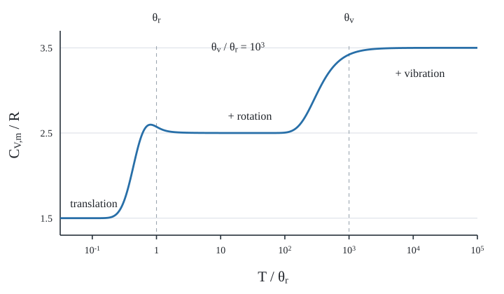
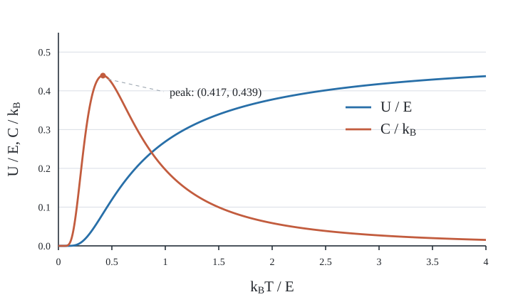

# 统计物理与统计力学：官方题库逐题解答

本解答逐张核对官方题库原图，按原文件编号排列。两门课共用49张题图，因此两科目录保留相同题解；这不表示官方另行划分了两科考点。公式中的$k_B$为玻尔兹曼常数，$\beta=1/(k_BT)$，未特别说明时$N$为粒子数。每题注明模型、推导、全部小问及必要的极限检查。

## 2-3T1419：单层吸附的巨配分函数

[查看原题](官方题库/2-3T1419.png)

**题意。** 表面有$M$个等价格点，每点至多吸附一个原子，占据能为$\epsilon$、空点能为零；与温度$T$、化学势$\mu$的蒸气库交换粒子。证明巨配分函数并求平均吸附数。

固定$N$时，从$M$点中选$N$点占据，故$Z_N=\binom MN e^{-\beta N\epsilon}$。巨正则系综还要乘粒子库权重$e^{\beta\mu N}$并对所有$N$求和：
$$
\Xi=\sum_{N=0}^M\binom MN[e^{-\beta(\epsilon-\mu)}]^N
=\boxed{[1+e^{-\beta(\epsilon-\mu)}]^M}.
$$
从定义求导，$\partial_\mu\ln\Xi=\beta\langle N\rangle$，于是
$$
\boxed{\langle N\rangle=\frac{M}{1+e^{\beta(\epsilon-\mu)}}}.
$$
$\mu\ll\epsilon$时吸附稀少，$\mu\gg\epsilon$时趋近满层$M$，不会超过格点数。形式像费米函数，来源是“每点最多一个”的占据约束，不要求吸附原子本身是费米子。题面最后一句只列$M,\epsilon,T$，但未给蒸气化学势或压强时，答案必须保留$\mu$。

## 2-3T1420：由总熵极大推出玻尔兹曼比值

[查看原题](官方题库/2-3T1420.png)

**题意。** 两能级$E_1<E_2$分别有$n_1,n_2$个粒子，系统与温度$T$热库接触。一个粒子由2跃迁到1，求系统和热库熵变，再导出平衡布居比。

**(a)** 等概率微观态的玻尔兹曼熵为$\boxed{S=k_B\ln\Omega}$。$\Omega$是满足给定宏观约束的可及微观态数；熵越大，宏观状态可由越多微观安排实现。非等概率情况推广为$S=-k_B\sum_r p_r\ln p_r$。

**(b)** 按可区分或稀薄经典粒子的布居计数，$\Omega=N!/(n_1!n_2!)$。一次跃迁后
$$
\frac{\Omega'}{\Omega}=\frac{n_2}{n_1+1},\qquad
\boxed{\Delta S_{\rm sys}=k_B\ln\frac{n_2}{n_1+1}
\simeq k_B\ln\frac{n_2}{n_1}}.
$$
最后一步用$n_1,n_2\gg1$。

**(c)** 热库吸收能量$E_2-E_1$，温度变化可忽略：
$$
\boxed{\Delta S_{\rm res}=\frac{E_2-E_1}{T}}.
$$

**(d)** 平衡时把布居作无穷小变化，总熵的一阶变化为零：
$$
k_B\ln\frac{n_2}{n_1}+\frac{E_2-E_1}{T}=0,
\quad
\boxed{\frac{n_1}{n_2}=e^{(E_2-E_1)/(k_BT)}}.
$$
这是两个非简并能级的经典布居比；若各能级简并度不同，要再乘$g_1/g_2$。低温低能级占优、高温布居趋等，符号正确。

## 2-3T1421：态能量的体积依赖与压强

[查看原题](官方题库/2-3T1421.png)

**题意。** 非相对论自由粒子在边长$L$、体积$V=L^3$的立方盒中。求能级、单态压强，证明三种统计都有$p=2U/(3V)$，并说明与光子气体的不同。

**(a)** 取硬壁边界，$n_x,n_y,n_z=1,2,\ldots$：
$$
\boxed{\epsilon_{\boldsymbol n}=\frac{\pi^2\hbar^2}{2mL^2}
(n_x^2+n_y^2+n_z^2)
=\frac{\pi^2\hbar^2}{2m}V^{-2/3}(n_x^2+n_y^2+n_z^2)}.
$$
周期边界改变允许量子数和前因子，但$V^{-2/3}$标度不变。

**(b)** 固定量子数改变盒大小：
$$
\boxed{p_r=-\left(\frac{\partial\epsilon_r}{\partial V}\right)_r
=\frac{2\epsilon_r}{3V}}.
$$

**(c)** 若第$r$态平均占据$\bar n_r$，独立粒子压强与动能均可按态相加：
$$
p=\sum_r\bar n_rp_r
=\frac2{3V}\sum_r\bar n_r\epsilon_r
=\boxed{\frac{2U}{3V}}.
$$
MB、FD、BE只改变$\bar n_r$，不改变逐态关系。$U$在这里是平动动能，不包括可有的内部能级或相互作用势能；弱相互作用近似被忽略。

**(d)** 光子$\epsilon=cp$且动量量子化使$p\propto L^{-1}$，所以$\epsilon\propto V^{-1/3}$，相同求导给$\boxed{p_{\rm rad}=U/(3V)}$。系数区别来自色散关系的幂次，而非来自玻色或费米统计。

## 2-3T1422：外势中的零温费米气体

[查看原题](官方题库/2-3T1422.png)

**题意。** 三维自旋$1/2$理想费米气体在只依赖$z$的外势$U(z)$中，局域密度缓变，$z>0$、$n(0)=n_0$。求底部费米能和使总能最小的密度分布。

**(a)** 含两种自旋，每单位体积费米球态数
$$
n_0=\frac2{(2\pi\hbar)^3}\frac{4\pi p_F^3}{3},
$$
故
$$
\boxed{\epsilon_F(0)=\frac{\hbar^2}{2m}(3\pi^2n_0)^{2/3}}.
$$
这里是相对局地势底的动能费米能。

**(b)** 零温均匀气体动能密度$e_{\rm kin}=(3/5)n\epsilon_F(n)$。在固定总粒子数下极小化
$$
E-\mu N=\int d^3r\left[
\frac35\frac{\hbar^2}{2m}(3\pi^2)^{2/3}n^{5/3}
+U(z)n-\mu n\right].
$$
对$n$变分给$\epsilon_F[n(z)]+U(z)=\mu$，于是
$$
\boxed{n(z)=\frac1{3\pi^2}\left[
\frac{2m}{\hbar^2}(\mu-U(z))\right]_+^{3/2}},
\qquad
\mu=\epsilon_F(0)+U(0).
$$
其中$[x]_+=\max(x,0)$。等价写成$n(z)=n_0[1-(U(z)-U(0))/\epsilon_F(0)]_+^{3/2}$。密度降至零后不能继续取负数的分数幂；转折边缘局域密度近似也需更仔细处理。该平衡条件是总化学势处处相同。

## 2-3T1423：线性势场中盒内粒子的正则系综

[查看原题](官方题库/2-3T1423.png)

**题意。** 一个质量$m$的非相对论粒子位于$0\le x,y,z\le L$，势能$V=kx$。在经典极限求配分函数、平均能量及落在$0\le x,y,z\le L/2$区域的概率。为免混淆，下面仍以$k$表示题给力常数，用$k_B$表示玻尔兹曼常数。

**(a)** 动量与位置积分分离：
$$
Z_1=\frac1{h^3}\int d^3p\,e^{-\beta p^2/(2m)}
L^2\int_0^L e^{-\beta kx}dx
=\boxed{\frac{L^2}{\lambda_T^3}\frac{1-e^{-\beta kL}}{\beta k}},
$$
$\lambda_T=h/\sqrt{2\pi mk_BT}$。

**(b)** $U=-\partial_\beta\ln Z_1$，得到
$$
\boxed{U=\frac52k_BT-\frac{kL}{e^{\beta kL}-1}}.
$$
其中动能固定为$3k_BT/2$，平均势能为$k_BT-kL/(e^{\beta kL}-1)$。弱势$kL\ll k_BT$时$U\simeq3k_BT/2+kL/2$；强正势且仍经典时粒子靠近$x=0$，势能贡献趋$k_BT$。

**(c)** $y,z$均匀，各取半区概率$1/2$；$x$按玻尔兹曼权重：
$$
\boxed{\mathcal P=\frac14
\frac{1-e^{-\beta kL/2}}{1-e^{-\beta kL}}
=\frac1{4(1+e^{-\beta kL/2})}}.
$$
$k\to0$时恢复八分之一；强正势时$x$半区概率趋1，总概率趋四分之一。

## 2-3T1424：混合熵导致凝固点降低

[查看原题](官方题库/2-3T1424.png)

**题意。** 稀溶质使液相溶剂化学势改变，凝固时溶质不进入固体。求化学势变化、解释相边界移动，并导出熔点改变量。

**(a)** 理想混合物的混合自由能为$k_BT(N_s\ln x_s+N_i\ln x_i)$，因此溶剂
$$
\mu_s(c)=\mu_s(0)+k_BT\ln x_s.
$$
若$c$为溶质摩尔分数，$x_s=1-c$，原题定义的降低量为
$$
\boxed{\Delta\mu_s=\mu_s(0)-\mu_s(c)
=-k_BT\ln(1-c)\simeq k_BTc}.
$$
若$c=N_i/N_s$，则精确式为$k_BT\ln(1+c)$，一阶结果相同。这里比较相同$T,P$下纯溶剂与理想溶液；仅在固定体积理想气体中添加别的粒子不会改变原组分分压，因此必须明确采用相平衡需要的恒压混合比较。

**(b)** 平衡要求液、固中溶剂化学势相等。混合只降低液相$\mu_\ell$，固相仍为纯溶剂，原本相等的两化学势不再相等，需要移动温度或压强来恢复平衡。液相被混合熵稳定，凝固温度降低。

**(c)** 令纯物质熔点$T_m$，新熔点$T=T_m+\delta T$。恒压$d\mu=-s\,dT$，因此
$$
\mu_\ell^0(T)-\mu_s^0(T)\simeq-(s_\ell-s_s)\delta T.
$$
新平衡为$-(s_\ell-s_s)\delta T+k_BT\ln(1-c)=0$。若每原子熔化潜热$\ell=T(s_\ell-s_s)>0$，则
$$
\boxed{\delta T=\frac{k_BT^2}{\ell}\ln(1-c)
\simeq-\frac{k_BT^2c}{\ell}}.
$$
若将$\Delta T=T_m-T$定义为正的降低量，就有$\Delta T\simeq k_BT^2c/\ell=k_BTc/\Delta s_{\rm fus}$。潜热与熔化熵差单位不同，二者相差因子$T$，不能直接等同。

## 2-3T1425：单原子气体的大气模型

[查看原题](官方题库/2-3T1425.png)

**题意。** 对$N$个单原子理想气体原子，推导$S(T,p)$微分与绝热温压关系、等温静力大气和绝热温度梯度。

**(a)** $G$的麦克斯韦关系$(\partial S/\partial p)_T=-(\partial V/\partial T)_p$和$V=Nk_BT/p$给出
$$
\boxed{dS=\frac{C_P}{T}dT-\frac{Nk_B}{p}dp
=\frac{5Nk_B}{2T}dT-\frac{Nk_B}{p}dp}.
$$
可逆绝热$dS=0$，所以$\boxed{dT=(2T/5p)\,dp}$。若只有绝热而存在熵产生，不能令$dS=0$。

**(b)** 设单原子质量$m$，静力平衡
$$
\boxed{dp=-\rho g\,dh=-\frac{mgp}{k_BT}dh}.
$$
$T=T_0$恒定时积分并用地面边界$p(0)=p_0$：
$$
\boxed{p(h)=p_0e^{-mgh/(k_BT_0)}}.
$$

**(c)** 将(b)代入(a)，假设对流气团近似等熵且大气采用同一关系，
$$
\boxed{\frac{dT}{dh}=-\frac{2mg}{5k_B}},
\qquad T(h)=T_0-\frac{2mg}{5k_B}h.
$$
题设是单原子模型；真实空气的转动自由度使定压热容增加，递减率系数由$2/5$变为$2/7$，不能在本题偷偷换成双原子。

## 2-3T1426：悬挂椭圆链的平均长度

[查看原题](官方题库/2-3T1426.png)

**题意。** $N$个无质量链环，每个只能以长轴$l+a$或短轴$l-a$竖直，下挂质量$M$并与温度$T$热库平衡。求配分函数和平均链长。

令$s_i=\pm1$分别代表长、短轴竖直，则$L=Nl+a\sum_i s_i$。向下为长度正方向，重物的重力势能$E=-MgL$（另加常数不影响平均长度）。

**(a)** 不同位置链环可区分，各取向独立：
$$
Z=\sum_{\{s_i\}}\exp\{\beta Mg[Nl+a\sum_i s_i]\}
=\boxed{e^{\beta MgNl}[2\cosh(\beta Mga)]^N}.
$$
若以$-MgNl$为能量零点，前面的指数因子去掉即可。

**(b)** 力$F=Mg$与$L$在能量中以$-FL$耦合，故$\langle L\rangle=k_BT\,\partial_F\ln Z$：
$$
\boxed{\langle L\rangle=N[l+a\tanh(Mga/(k_BT))]}.
$$
低温重力选出最长构型，$\langle L\rangle\to N(l+a)$；高温两取向近等概率，$\langle L\rangle\to Nl$。$a\to0$时链环取向不再影响长度。不能为位置不同的链环再除以$N!$。

## 2-3T1427：内部等间距能级与混合熵

[查看原题](官方题库/2-3T1427.png)

**题意。** 理想气体分子能量为$p^2/(2m)+\epsilon_j$，内部能级$\epsilon_j=j\epsilon_0$，$j=0,1,\ldots$。求自由能和熵；再讨论两等体积、等粒子数、等压气体的绝热混合以及相同气体情况。

**(a)** 在平动经典稀薄极限，单分子配分函数
$$
q=\frac V{\lambda_T^3}\sum_{j=0}^\infty e^{-\beta j\epsilon_0}
=\frac V{\lambda_T^3(1-e^{-\beta\epsilon_0})},\qquad Z_N=\frac{q^N}{N!}.
$$
所以精确经典计数式$F=-Nk_BT\ln q+k_BT\ln N!$；用Stirling公式：
$$
\boxed{F\simeq-Nk_BT\left[
\ln\frac{V}{N\lambda_T^3(1-e^{-\beta\epsilon_0})}+1\right]}.
$$
体积依赖只在$-Nk_BT\ln V$中，因此内部能级不改变$pV=Nk_BT$。

**(b)** 先算$U=N[3k_BT/2+\epsilon_0/(e^{\beta\epsilon_0}-1)]$，再用$S=(U-F)/T$：
$$
\boxed{S=Nk_B\left[
\ln\frac{V}{N\lambda_T^3(1-e^{-x})}
+\frac52+\frac{x}{e^x-1}\right]},\qquad x=\frac{\epsilon_0}{k_BT}.
$$
$x\gg1$时内部激发冻结，恢复单原子平动熵；$x\ll1$时内部梯级贡献趋一个$k_B$的热容。

**(c)** 两气体有相同$p,V,N$，由理想气体定律初温相同，即使内部谱不同也如此。刚性隔热总容器中无功无热，每种理想气体的内能仅依赖温度，$T_f=T$满足能量守恒，正热容保证唯一。因此$\boxed{\Delta T=0}$。每一种不同气体可用体积由$V$扩展到$2V$，总熵增
$$
\boxed{\Delta S_{\rm mix}=2Nk_B\ln2}.
$$

**(d)** 若分子同种，隔板两侧所有强度量原已相同。移去隔板没有新的物理组分可混合，$S(2N,2V,T)=2S(N,V,T)$，所以宏观热力学上$\boxed{\Delta T=0,\ \Delta S=0}$。$N!$计数消除了把同种粒子人为贴标签带来的假混合熵；有限粒子数下粒子数约束解除可有非广延修正，不是$2Nk_B\ln2$的混合熵。

## 2-3T1428：由基本关系推出理想气体方程

[查看原题](官方题库/2-3T1428.png)

**题意。** 基本关系$E=C\,N(N/V)^\alpha\exp[\alpha S/(Nk_B)]$，$C$为常数。求状态方程、绝热指数及摩尔热容。

**(a)** 自然变量为$S,V,N$，由$dE=T\,dS-P\,dV+\mu\,dN$分别求导：
$$
T=\left(\frac{\partial E}{\partial S}\right)_{V,N}
=\frac{\alpha E}{Nk_B},\qquad
P=-\left(\frac{\partial E}{\partial V}\right)_{S,N}
=\frac{\alpha E}{V}.
$$
消去$E$得到$\boxed{PV=Nk_BT}$。物理正温正热容分支需$\alpha>0$；形式上的$\alpha=0$使$T=P=0$，不能当作普通有限温理想气体。

**(b)** 固定$S,N$时$E\propto V^{-\alpha}$，所以$P\propto V^{-(1+\alpha)}$：
$$
\boxed{\gamma=1+\alpha}.
$$
由$E=Nk_BT/\alpha$得每摩尔
$$
\boxed{c_V=\frac R\alpha,\qquad
c_P=c_V+R=\frac{(1+\alpha)R}{\alpha}}.
$$
检查$c_P/c_V=1+\alpha$与绝热指数一致；三维单原子$\alpha=2/3$时恢复$c_V=3R/2$、$\gamma=5/3$。

## 2-3T1429：零温费米气体自由膨胀至经典区

[查看原题](官方题库/2-3T1429.png)

**题意。** $N$个质量$M$、自旋$1/2$的理想费米子初在体积$V_i$、温度零，求费米能与总能；再自由绝热膨胀到足够大的$V_f$，使末态可用经典极限，求末温。

**(a)** 两种自旋占据动量球：
$$
N=\frac{2V_i}{(2\pi\hbar)^3}\frac{4\pi p_F^3}{3},
\qquad
\boxed{E_{F,i}=\frac{\hbar^2}{2M}
\left(\frac{3\pi^2N}{V_i}\right)^{2/3}}.
$$

**(b)** 三维态密度$g(\epsilon)\propto\sqrt\epsilon$，积分比值为
$$
\frac{U_i}{N}
=\frac{\int_0^{E_F}\epsilon^{3/2}d\epsilon}
{\int_0^{E_F}\epsilon^{1/2}d\epsilon}
=\frac35E_F,
\qquad \boxed{U_i=\frac35NE_{F,i}}.
$$

**(c)** 自由膨胀$Q=W=0$，所以末态能量仍为$U_i$，不是按新体积重算零温基态能量。末态经典气体$U_f=3Nk_BT_f/2$，于是
$$
\boxed{T_f=\frac{2E_{F,i}}{5k_B}}.
$$
初始零温并不意味着没有能量：费米填充动能在稀释后的平衡态表现为热能。需检查$n_f\lambda_{T_f}^3/2\ll1$，这由题设足够大的$V_f$保证。严格无相互作用的孤立量子气体不自动热化；题目求的是有微弱弛豫后、保持上述能量的热平衡末态。

## 2-3T1430：可束缚磁矩对的磁化

[查看原题](官方题库/2-3T1430.png)

**题意。** 晶体中磁矩可成对束缚，束缚时净磁矩为零，每原子结合能$\gamma$；未束缚时每个$J=1/2$磁矩可沿或逆外场$H$。共有$N_M$个原子，求每对状态及磁化。以下按单原子磁矩大小$\mu_B$、Zeeman能$-\mu_BH$的题目惯例书写；若$H$为SI磁场强度，应以$B=\mu_0H$替代能量中的$H$。

**(a) 先明确状态模型。** 把“束缚/未束缚”理解为可区分的结构状态，未束缚一对有四种自旋构型：

| 构型 | 能量（未束缚零场为零） | 总磁矩 |
|---|---:|---:|
| $\uparrow\uparrow$ | $-2\mu_BH$ | $2\mu_B$ |
| $\uparrow\downarrow$ | $0$ | $0$ |
| $\downarrow\uparrow$ | $0$ | $0$ |
| $\downarrow\downarrow$ | $2\mu_BH$ | $-2\mu_B$ |
| 束缚构型 | $-2\gamma$ | $0$ |

若束缚构型有$g_b$重简并，其统计权重为$g_b e^{2\beta\gamma}$。原题没有明确晶轴选择或束缚态的量子简并度，保留$g_b$可使计数条件透明；单一束缚态取$g_b=1$。

**(b)** 令$x=\beta\mu_BH$。每对配分函数和晶体总磁矩为
$$
z=g_be^{2\beta\gamma}+2+2\cosh(2x)
=g_be^{2\beta\gamma}+4\cosh^2x,
$$
$$
\boxed{\mathcal M=\frac{N_M}{2}k_BT\,\partial_H\ln z
=\frac{2N_M\mu_B\sinh(2x)}
{g_be^{2\beta\gamma}+2+2\cosh(2x)}}.
$$
单一束缚结构即取$g_b=1$；单位体积磁化强度再除以晶体体积。强场使$\mathcal M\to N_M\mu_B$，零场磁矩为零，强结合低温时磁化受抑制。

**若题目采用纯二自旋的单态—三重态模型。** 这时总Hilbert空间只有四态：结合的单态$|s\rangle$能量$-2\gamma$，未结合三重态$|1,m\rangle$能量$-2m\mu_BH$，$m=1,0,-1$。中间零磁矩态只有一个，应改为
$$
z_{\rm st}=e^{2\beta\gamma}+1+2\cosh(2x),\qquad
\boxed{\mathcal M_{\rm st}
=\frac{2N_M\mu_B\sinh(2x)}
{e^{2\beta\gamma}+1+2\cosh(2x)}}.
$$
两式对应不同的束缚态物理模型；题面只说明净磁矩为零，不能据此把额外结构束缚态与已有自旋单态无条件混同。

## 2-3T1431：电子—正电子对的化学平衡

[查看原题](官方题库/2-3T1431.png)

**题意。** 恒星中$\gamma+\gamma\leftrightarrow e^-+e^+$达到化学平衡，电子和正电子为经典理想气体，已知$T$和电子数密度$n_e$，求正电子密度$n_p$。

光子数不守恒，黑体辐射$\mu_\gamma=0$，所以$\mu_e+\mu_p=0$。化学势应包含静止能。非相对论稀薄极限下
$$
\mu_j=m_ec^2+k_BT\ln\frac{n_j\lambda_e^3}{g},
\qquad
\lambda_e=\frac h{\sqrt{2\pi m_ek_BT}},\quad g=2.
$$
代入平衡条件并指数化，
$$
n_en_p=\frac{g^2}{\lambda_e^6}e^{-2m_ec^2/(k_BT)},
\qquad
\boxed{n_p=\frac4{n_e}\left(\frac{m_ek_BT}{2\pi\hbar^2}\right)^3
e^{-2m_ec^2/(k_BT)}}.
$$
$m_e$为电子质量、$c$为光速、$\hbar=h/(2\pi)$。指数表示产生一对的两份静止能代价；若漏掉静止能，会错误预测低温大量成对产生。

“经典”本身并不必然表示非相对论。若$k_BT$与$m_ec^2$相当，保留MB统计但用相对论色散，定义
$$
q(T)=\frac{g}{2\pi^2\hbar^3}\int_0^\infty
p^2e^{-\beta\sqrt{p^2c^2+m_e^2c^4}}dp,
$$
则普遍的经典结果为$\boxed{n_p=q(T)^2/n_e}$；上面的显式式子是此积分的非相对论极限。

## 2-3T1432：电感中的热电流涨落

[查看原题](官方题库/2-3T1432.png)

**题意。** 电阻$R$接在电感$L$两端，整体温度$T$，求电感电流的均方根热涨落。

电感储能为$E=LI^2/2$，是一个关于电流的二次型自由度。经典正则平衡下$P(I)\propto e^{-LI^2/(2k_BT)}$，均分定理给
$$
\frac L2\langle I^2\rangle=\frac12k_BT,
\qquad
\boxed{I_{\rm rms}=\sqrt{\frac{k_BT}{L}}}.
$$
平均电流为零，均方不为零。电阻同时提供耗散与热噪声，$R$控制相关时间$L/R$，不改变平衡方差。也可把Johnson噪声谱经$R+i\omega L$滤波并积分验证。结果采用经典低频电路模型，$R$应非零以维持热化；零温不能继续用经典均分定理讨论量子涨落。

## 2-3T1433：线性势场粒子的配分函数（重复题独立列解）

[查看原题](官方题库/2-3T1433.png)

**题意。** 质量$m$的粒子在$[0,L]^3$盒中，势能$V=kx$，求经典正则配分函数、平均总能和在$[0,L/2]^3$中的概率。本题与1423数学内容相同，仍完整列出。

**(a)** Hamilton量$H=p^2/(2m)+kx$，故
$$
Z_1=\frac1{h^3}\int_{\mathbb R^3}d^3p\,e^{-\beta p^2/(2m)}
\int_0^Ldx\,dy\,dz\,e^{-\beta kx}
=\boxed{\frac{L^2}{\lambda_T^3}
\frac{1-e^{-\beta kL}}{\beta k}}.
$$
动量高斯积分为$(2\pi m/\beta)^{3/2}$；$\lambda_T=h/\sqrt{2\pi mk_BT}$使配分函数无量纲。

**(b)** 写$\ln Z_1={\rm 常数}-(5/2)\ln\beta+\ln(1-e^{-\beta kL})$并求负导数：
$$
\boxed{\langle E\rangle
=\frac52k_BT-\frac{kL}{e^{kL/(k_BT)}-1}}.
$$
其中$3k_BT/2$为动能，余下为势能；势场趋零时总能趋$3k_BT/2$。

**(c)** 空间概率正比$e^{-\beta kx}$。在$y,z$方向各保留一半，$x$方向按指数积分：
$$
\boxed{P=\frac14\frac{\int_0^{L/2}e^{-\beta kx}dx}
{\int_0^Le^{-\beta kx}dx}
=\frac1{4(1+e^{-\beta kL/2})}}.
$$
弱势时$P=1/8$，强正势时$P\to1/4$；后一极限仍有均匀的两个横向坐标。

## 2-3T1434：重力下固液界面的移动

[查看原题](官方题库/2-3T1434.png)

**题意。** 竖直材料柱恒温，界面高度$h$以下为固态、以上为液态，降温时界面上移。已知单位质量凝固潜热的正值$L$和$dh/dT$，用克拉珀龙方程求$\Delta\rho=\rho_s-\rho_\ell$。

使用熔化的熵差$L/T$和比体积差$v_\ell-v_s=1/\rho_\ell-1/\rho_s$：
$$
\frac{dp_m}{dT}
=\frac{L}{T(1/\rho_\ell-1/\rho_s)}
=\frac{L\rho_s\rho_\ell}{T\Delta\rho}.
$$
若上方液面高度$H$及其表面压强固定，忽略密度随温度的变化，界面压强$p_m=p_{\rm top}+\rho_\ell g(H-h)$，所以
$$
\frac{dp_m}{dT}=-\rho_\ell g\frac{dh}{dT},\qquad
\boxed{\Delta\rho=-\frac{L\rho_s}{Tg(dh/dT)}}.
$$
降温时界面上移意味着$dh/dT<0$，因此$\rho_s>\rho_\ell$，与高压的下部稳定为固体相符。潜热必须采用每质量单位，与比体积匹配。

原题没有规定液面边界。若是**固定截面、质量守恒的自由液面柱**，凝固密度变化会移动液面：$\rho_sh+\rho_\ell(H-h)$恒定，故$H'=-(\Delta\rho/\rho_\ell)h'$，此时$dp_m/dT=-\rho_sgh'$，结果改为
$$
\boxed{\Delta\rho=-\frac{L\rho_\ell}{Tg(dh/dT)}}.
$$
两式在$|\Delta\rho|\ll\rho$的一阶精度相同；要区分高阶差别，需指定顶部是固定液面储库还是固定质量自由液面。一般边界式为$\Delta\rho=L\rho_s/[Tg(H'-h')]$。

## 2-3T1436：含简并两能级的单原子气体比热

[查看原题](官方题库/2-3T1436.png)

**题意。** 原子有基态简并度$g_1$，激发态比基态高$E$、简并度$g_2$，求气体比热。假设平动为三维经典理想气体，原子之间不相互作用。

内部配分函数$q_{\rm int}=g_1+g_2e^{-\beta E}$，激发概率
$$
p_2=\frac{g_2e^{-\beta E}}{g_1+g_2e^{-\beta E}}.
$$
每粒子内能$u=3k_BT/2+Ep_2$。对温度求导，令$x=E/(k_BT)$：
$$
\boxed{C_V=Nk_B\left[\frac32+
x^2\frac{g_1g_2e^{-x}}{(g_1+g_2e^{-x})^2}\right]}.
$$
每摩尔定容热容把$Nk_B$换为$R$；定压摩尔热容再加$R$。若只问内部能级贡献，则取方括号第二项。低温激发被冻结，内部热容指数趋零；高温两级布居趋固定比值$g_2/g_1$，内部能量饱和，因此热容也趋零，中间出现Schottky峰。不能把有限两能级系统在高温当作谐振子一直贡献$k_B$。

## 2-3T1437：3 K黑体光子的数密度

[查看原题](官方题库/2-3T1437.png)

**题意。** 宇宙充满温度$T=3$ K的黑体光子，求光子数密度对温度和常数的解析依赖，并估计数值。

**(i)** 光子有两横向偏振，化学势为零。每单位体积动量态数为$2\,d^3p/(2\pi\hbar)^3$，所以
$$
n=\frac1{\pi^2\hbar^3}\int_0^\infty
\frac{p^2dp}{e^{cp/(k_BT)}-1}
=\boxed{\frac1{\pi^2}\left(\frac{k_BT}{\hbar c}\right)^3
\int_0^\infty\frac{x^2dx}{e^x-1}}.
$$
这明确给出$n\propto T^3$，且括号内量纲为逆长度。

**(ii)** 用$1/(e^x-1)=\sum_{j\ge1}e^{-jx}$，积分$\int_0^\infty x^2e^{-jx}dx=2/j^3$，故积分为$2\zeta(3)\simeq2.404$。于是
$$
n=\frac{2\zeta(3)}{\pi^2}\left(\frac{k_BT}{\hbar c}\right)^3
\simeq\boxed{5.5\times10^8\ {\rm m^{-3}}\simeq550\ {\rm cm^{-3}}}.
$$
即使仅记$k_BT/(\hbar c)\sim10^3$ m⁻¹，也能得到题目要求的数量级。这里按题给3 K计算，不擅自把温度改成实际宇宙微波背景的更精确值。

## 2-3T1438：零温费米气体的等温压缩系数

[查看原题](官方题库/2-3T1438.png)

**题意。** 已知三维无相互作用费米气体在$T=0$的数密度$n$与费米能$\epsilon_F$，求$K=-(1/V)(\partial V/\partial P)_T$。

零温总能量$E=3N\epsilon_F/5$，题给$PV=2E/3$，故
$$
P=\frac25n\epsilon_F.
$$
固定粒子数时$\epsilon_F\propto n^{2/3}$，从而$P\propto n^{5/3}\propto V^{-5/3}$，得到
$$
\left(\frac{\partial P}{\partial V}\right)_{N,T=0}
=-\frac53\frac PV.
$$
取倒数并代入定义：
$$
\boxed{K=\frac3{5P}=\frac3{2n\epsilon_F}}.
$$
相应体积模量$B=1/K=2n\epsilon_F/3$。单位$n\epsilon_F$为压强，$K$为压强倒数；正号表示压缩稳定性。低温刚性来自泡利填充能随密度上升，不需要经典热运动。

## 2-3T1439：异核双原子转动热容与绝对熵

[查看原题](官方题库/2-3T1439.png)

**题意。** 稀薄异核双原子分子转动惯量$I$，求高温$k_BT\gg\hbar^2/I$与低温$k_BT\ll\hbar^2/I$时，每摩尔转动热容和绝对熵的最低阶非零项。

刚性转子能级$\epsilon_l=B l(l+1)$、简并度$2l+1$，$B=\hbar^2/(2I)$，$\theta_r=B/k_B$。异核分子无需除以同核对称因子2：
$$
q_r=\sum_{l=0}^\infty(2l+1)e^{-\theta_rl(l+1)/T}.
$$

**(a) 高温。** 以积分近似求和，令$u=l(l+1)$、$du=(2l+1)dl$，得$q_r\simeq T/\theta_r$。所以$u_r=k_BT$，每摩尔
$$
\boxed{C_{r,m}\simeq R,\qquad
S_{r,m}\simeq R\left[1+\ln\frac{T}{\theta_r}\right]}.
$$
两个转动动能自由度各贡献$k_BT/2$；这是转动部分的绝对熵，不包括平动、振动和核自旋简并。

**(b) 低温。** 保留$l=0$和$l=1$，激发间隙$\Delta=2B=\hbar^2/I$，令$x=\Delta/(k_BT)\gg1$：
$$
q_r\simeq1+3e^{-x},\quad
u_r\simeq3\Delta e^{-x}.
$$
于是
$$
\boxed{C_{r,m}\simeq3R x^2e^{-x},\qquad
S_{r,m}\simeq3R(1+x)e^{-x}}.
$$
熵式来自$R(\ln q_r+\beta u_r)$，两项都保留才能给出正确的首激发贡献。基态$l=0$非简并，所以转动熵趋零；热容指数冻结。

## 2-3T1440：横向谐振、竖向重力阱的热容

[查看原题](官方题库/2-3T1440.png)

**题意。** $N$个质量$m$原子处于$V(x,y,z)=ax^2+by^2+mgz$、$z\ge0$的势阱，$z<0$为硬壁。求热容。

采用题目通常隐含的非相互作用、经典稀薄气体模型，且$a,b,g$固定。一个粒子的相空间积分各因子温度标度为：三维动量$T^{3/2}$，$x,y$两个高斯位置积分各$T^{1/2}$，半轴重力积分$\int_0^\infty e^{-\beta mgz}dz=(\beta mg)^{-1}\propto T$。因此
$$
q_1=\frac{(2\pi m/\beta)^{3/2}}{h^3}
\sqrt{\frac{\pi}{\beta a}}\sqrt{\frac{\pi}{\beta b}}\frac1{\beta mg}
\propto\beta^{-7/2}.
$$
由$Z_N=q_1^N/N!$，$U=-\partial_\beta\ln Z_N=7Nk_BT/2$，所以
$$
\boxed{C_{a,b,g,N}=\frac72Nk_B}.
$$
动能贡献$3/2$，两个谐振势各$1/2$，线性重力势贡献1。后者不是二次型，不能生搬“每项$k_BT/2$”。若进入量子简并区或阱能级不可忽略，仅给这些经典信息不足以使热容恒定，需按实际统计求和。

## 2-3T1441：谐振阱中两个自旋1玻色子

[查看原题](官方题库/2-3T1441.png)

**题意。** 两个相同自旋1玻色子位于三维各向同性谐振阱，求无相互作用最低两能级的能量与简并度，再加入$A\mathbf S_1\cdot\mathbf S_2$求分裂。

**(a)** 单粒子空间基态能量$3\hbar\omega/2$、空间简并度1；第一激发能量$5\hbar\omega/2$、空间简并度3。两个自旋1合成为$S=0,1,2$，简并度分别1、3、5；$S=0,2$交换对称，$S=1$交换反对称。总波函数须对称。

两粒子都在空间基态时空间部分对称，只能配对称自旋：
$$
\boxed{E_0=3\hbar\omega,\quad g_0=1+5=6}.
$$
一粒子基态一粒子第一激发时，每个激发方向有一个对称和一个反对称空间组合。前者配6个对称自旋态，后者配3个反对称自旋态：
$$
\boxed{E_1=4\hbar\omega,\quad g_1=3(6+3)=27}.
$$

**(b)** 用$\mathbf S_1\cdot\mathbf S_2=\tfrac12[\mathbf S^2-\mathbf S_1^2-\mathbf S_2^2]$，能量修正为
$$
\Delta E_S=\frac{A\hbar^2}{2}[S(S+1)-4].
$$

| 原空间能级 | 总自旋$S$ | 新能量 | 简并度 |
|---|---:|---:|---:|
| $3\hbar\omega$ | 0 | $3\hbar\omega-2A\hbar^2$ | 1 |
| $3\hbar\omega$ | 2 | $3\hbar\omega+A\hbar^2$ | 5 |
| $4\hbar\omega$ | 0 | $4\hbar\omega-2A\hbar^2$ | 3 |
| $4\hbar\omega$ | 1 | $4\hbar\omega-A\hbar^2$ | 9 |
| $4\hbar\omega$ | 2 | $4\hbar\omega+A\hbar^2$ | 15 |

若原题$\mathbf S$采用无量纲自旋矩阵，表中$A\hbar^2$整体换为$A$。表给的是(a)所列态的分裂；$A$很大时全谱最低能级的排序可能与无相互作用时不同。

## 2-3T1442：双原子理想气体热容的温度变化

[查看原题](官方题库/2-3T1442.png)

**题意。** 画出双原子理想气体摩尔比热随温度的变化，标出特征温度，并用分子质量$m$、转动惯量$I$、振动角频率$\omega_0$估计这些温度。

**(a)** 在平动已经经典化、分子未解离且电子激发冻结的区间，定容摩尔热容从$3R/2$（只有平动）过渡到$5R/2$（加两个转动自由度），再到$7R/2$（再加一个振动模式的动能与势能）：
$$
C_{V,m}=\frac32R+C_{{\rm rot},m}
+R\,\frac{x_v^2e^{x_v}}{(e^{x_v}-1)^2},
\qquad x_v=\frac{\hbar\omega_0}{k_BT}.
$$
振动项由$q_v=e^{-x_v/2}/(1-e^{-x_v})$求导而来，零点能不贡献热容。$C_{P,m}=C_{V,m}+R$，整条曲线向上平移$R$。实际量子转子在过渡区可有轻微峰形，不是严格折线台阶。

图以$\theta_v/\theta_r=10^3$展示分离的两个激发尺度；数值比值是示意参数，不是原题提供的特定分子。

**(b)** 刚性转子能级$\epsilon_l=\hbar^2l(l+1)/(2I)$，故
$$
\boxed{\theta_r=\frac{\hbar^2}{2Ik_B},\qquad
\theta_v=\frac{\hbar\omega_0}{k_B}}.
$$
转动首间隙为$2k_B\theta_r=\hbar^2/I$，因此按“首激发温度”定义时会差因子2。平动是否经典还需密度或盒尺寸：数密度$n$下的简并尺度约
$$
T_{\rm deg}\sim\frac{2\pi\hbar^2}{mk_B}n^{2/3},
$$
或有限盒的能级温度约$\hbar^2/(mk_BL^2)$。只有$m$不能唯一给出平动冻结温度。示意图不把$3R/2$平台外推到严格零温，也不把$7R/2$平台外推过解离温度。

## 2-3T1443：已知内能的绝热曲线斜率

[查看原题](官方题库/2-3T1443.png)

**题意。** 静水压系统$U=AP^2V$，$A$的单位为压强倒数，求$P$–$V$平面上绝热路径的斜率。

沿准静态、仅有体积功的绝热路径，第一定律为$dU=-P\,dV$。对给定内能关系微分：
$$
dU=2APV\,dP+AP^2\,dV=-P\,dV.
$$
对$P\ne0$整理得
$$
\boxed{\left.\frac{dP}{dV}\right|_{\delta Q=0}
=-\frac{1+AP}{2AV}}.
$$
$AP$无量纲，结果单位为压强/体积；$A>0,P>0$时膨胀降压。可再积分得$(1+AP)\sqrt V={\rm 常数}$作校验。这里使用的是可在平衡$P,V$图上表示的准静态路径；任意快速绝热过程中边界功涉及外压，不能只用内部$P$定义一条状态路径。

## 2-3T1500：三维铁磁自旋波的Bloch定律

[查看原题](官方题库/2-3T1500.png)

**题意。** Heisenberg磁体的低能自旋波满足$\omega(\mathbf k)=Dk^2$，磁振子为玻色准粒子；每个磁振子使总磁矩减少$\mu$。求三维低温磁化。

磁振子数不守恒，平衡化学势为零。一个声学自旋波分支的平均数为
$$
\langle n\rangle=\sum_{\mathbf k}
\frac1{e^{\beta\hbar Dk^2}-1}
\simeq\frac{V}{2\pi^2}\int_0^\infty
\frac{k^2dk}{e^{\beta\hbar Dk^2}-1}.
$$
低温仅占据小$k$，可将晶格截止延伸至无穷。令$x=\beta\hbar Dk^2$，得到
$$
\langle n\rangle
=\frac{V}{4\pi^2}\left(\frac{k_BT}{\hbar D}\right)^{3/2}
\Gamma(3/2)\zeta(3/2)
=\frac{V\zeta(3/2)}{8\pi^{3/2}}
\left(\frac{k_BT}{\hbar D}\right)^{3/2}.
$$
所以
$$
\boxed{\mathcal M(T)=\mathcal M(0)-
\frac{\mu V\zeta(3/2)}{8\pi^{3/2}}
\left(\frac{k_BT}{\hbar D}\right)^{3/2}}.
$$
这就是$T^{3/2}$磁化减少律。若$D$定义在能量色散$\epsilon=Dk^2$中，则将$\hbar D$换为$D$；题面给的是频率，必须保留$\hbar$。$N$个模式决定高能截止而非每模最多一个磁振子；低温要求激发数远小于总自旋数，且忽略各向异性开隙。

## 2-3T1501：动理论估计热导率

[查看原题](官方题库/2-3T1501.png)

**题意。** 热流密度$\mathbf j_Q=-\kappa\nabla T$。用分子平均速率$\bar v$、碰撞截面$\sigma_0$及比热$c$估计热导率。

设每粒子热容为$c_{\rm part}$，数密度$n$，平均自由程$\lambda\sim1/(n\sigma_0)$。穿越某平面的粒子携带其上一次碰撞处的能量；相距$\lambda$两侧每粒子热能差约$c_{\rm part}\lambda|\nabla T|$。各向同性方向平均给数量级为$1/3$的因子：
$$
\kappa\sim\frac13n c_{\rm part}\bar v\lambda
\sim\boxed{\frac{c_{\rm part}\bar v}{3\sigma_0}}.
$$
同种硬球精确自由程含$\sqrt2$，粗略公式相应改为$1/(3\sqrt2)$；真实输运系数需碰撞积分，不应把这个估算前因子当作精确值。

若题目$c$是通常每质量比热，则$c_{\rm part}=mc$，所以$\boxed{\kappa\sim mc\bar v/(3\sigma_0)}$；若是每体积热容量$c_{\rm vol}$，则$\kappa\sim c_{\rm vol}\bar v\lambda/3$。不说明比热按何种量归一化会造成量纲错误。稀薄气体中$n$在载能粒子数与自由程之间抵消，热导率近似与密度无关；这一结论不适用于自由程达到容器尺度的稀薄极限或强关联液体。

## 2-3T1502：二维费米气体的精确化学势

[查看原题](官方题库/2-3T1502.png)

**题意。** 二维自旋$1/2$理想电子气体满足$N=2\sum_{\mathbf k}[\exp\beta(\epsilon_{\mathbf k}-\mu)+1]^{-1}$，求$\mu(T)$精确表达式。采用自由非相对论色散$\epsilon_{\mathbf k}=\hbar^2k^2/(2m)$和面积$\mathcal A$的连续态极限。

二维含双自旋态密度为常数$g(\epsilon)=\mathcal A m/(\pi\hbar^2)$。令面密度$n=N/\mathcal A$：
$$
n=\frac{m}{\pi\hbar^2}\int_0^\infty
\frac{d\epsilon}{e^{\beta(\epsilon-\mu)}+1}
=\frac{mk_BT}{\pi\hbar^2}\ln(1+e^{\beta\mu}).
$$
定义二维零温费米能$E_F=\pi\hbar^2n/m$，可直接反解：
$$
\boxed{\mu(T)=k_BT\ln(e^{E_F/(k_BT)}-1)
=E_F+k_BT\ln(1-e^{-E_F/(k_BT)})}.
$$
低温$\mu\to E_F$且修正指数小；高温$\mu\simeq k_BT\ln[E_F/(k_BT)]$，恢复经典二维气体。此“精确”指抛物色散连续态密度模型，不包括有限盒离散能级修正。

## 2-3T1503：临界指数关系与所需标度假设

[查看原题](官方题库/2-3T1503.png)

**题意。** 二级相变附近，热容奇异部分$C_{\rm sing}\propto|t|^{-\alpha}$，$-1<\alpha<0$；自发序参量$\eta\propto(-t)^\beta$、响应率$\chi\propto|t|^{-\gamma}$，$\beta,\gamma>0$，$t=T-T_c$。外场足够弱使$\chi h$小于自发序参量，求指数关系。

常用临界标度理论的结果是
$$
\boxed{\alpha+2\beta+\gamma=2}.
$$
下面说明它的推导及假设。由$C_{\rm sing}=-T\partial_T^2g_{\rm sing}$，积分两次得非解析自由能尺度$g_{\rm sing}\sim|t|^{2-\alpha}$。采用单一临界场尺度的形式
$$
g_{\rm sing}(t,h)=|t|^{2-\alpha}
\Phi_\pm\left(\frac{h}{|t|^\Delta}\right).
$$
对场求一阶和二阶导数，
$$
\eta=-\partial_hg_{\rm sing}\sim|t|^{2-\alpha-\Delta},
\qquad
\chi=-\partial_h^2g_{\rm sing}\sim|t|^{2-\alpha-2\Delta}.
$$
因此$\beta=2-\alpha-\Delta$、$-\gamma=2-\alpha-2\Delta$，消去$\Delta$即得等式。又$\Delta=\beta+\gamma$，题给弱场条件$\chi h\ll\eta_{\rm sp}$恰为$h\ll|t|^{\beta+\gamma}$，与标度变量很小一致。

**证据边界。** 题给三条幂律和“弱场”条件本身不能在不加标度假设时严格证明等号。热力学稳定性可给
$$
C_h-C_\eta=\frac{T}{\chi}
\left(\frac{\partial\eta}{\partial T}\right)_h^2\ge0.
$$
当总热容由发散奇异项主导时可得到Rushbrooke型不等式；本题$\alpha<0$时奇异热容是趋零尖点，解析常数背景一般仍存在，不能直接将$C_{\rm sing}$代替正定性式中的总$C_h$。因此标准等式应作为上述单尺度临界标度结论给出，而非声称仅靠热容正性已证明。

## 2-3T1504：两个自旋1/2粒子占据两个能级

[查看原题](官方题库/2-3T1504.png)

**题意。** 两个相同自旋$1/2$粒子可占据单粒子能量0、$E$，求配分函数、平均能量和热容。按每个能级各有两个自旋态、无相互作用的两轨道模型理解。

**(a)** 粒子是费米子，每个完整单粒子态至多一个粒子。两粒子总能量0时只能填满两个低能自旋态，简并1；能量$E$时一高一低，有$2\times2=4$种；能量$2E$时填满两个高能自旋态，简并1。令$q=e^{-\beta E}$：
$$
\boxed{Z_2=1+4q+q^2}.
$$
总态数$1+4+1=6=\binom42$，这是直接计数检查。

**(b)** 按概率加权或求$-\partial_\beta\ln Z$：
$$
\boxed{U=E\frac{4q+2q^2}{1+4q+q^2}}.
$$
用$C=k_B\beta^2(\langle E_{\rm tot}^2\rangle-U^2)$，且$\langle E_{\rm tot}^2\rangle=E^2(4q+4q^2)/Z$，化简得
$$
\boxed{C=4k_B(\beta E)^2
\frac{q(1+q+q^2)}{(1+4q+q^2)^2}}.
$$
低温$U,C\to0$；高温六态等概率，$U\to E$，热容因能量饱和而趋零。不能用两个可区分两能级粒子的$(1+q)^2$替代。

## 2-3T1505：一维自由关节链的熵弹性

[查看原题](官方题库/2-3T1505.png)

**题意。** $N$个长度$a$的单体各可向左或向右，$N_++N_-=N$，端到端有向伸长$L=a(N_+-N_-)$。求固定伸长的构型熵，并在小伸长大$N$极限求伸展力系数。

固定$N_+,N_-$时的微观排列数为$\Omega=N!/(N_+!N_-!)$，故
$$
\boxed{S=k_B\ln\frac{N!}{N_+!N_-!}}.
$$
用$N_\pm=(N\pm L/a)/2$及Stirling公式，令$x=L/(Na)$：
$$
S\simeq Nk_B\ln2-\frac{Nk_B}{2}
[(1+x)\ln(1+x)+(1-x)\ln(1-x)].
$$
当$|L|\ll Na$，括号为$x^2+O(x^4)$，所以
$$
S(L)\simeq Nk_B\ln2-\frac{k_BL^2}{2Na^2}.
$$
构型内能不依赖$L$，恒温外拉力由自由能导数$f=(\partial F/\partial L)_T=-T(\partial S/\partial L)_T$给出：
$$
\boxed{f\simeq\frac{k_BT}{Na^2}L}.
$$
因此弹性系数$k_{\rm ent}=k_BT/(Na^2)$。精确大$N$式为$f=(k_BT/2a)\ln[(1+x)/(1-x)]$，当接近完全伸直$|x|\to1$时发散；线性式仅在小伸长有效。回复力来自拉伸减少构型数，而非此模型中单体被拉长。

## 2-3T1506：层状晶格的低温热容

[查看原题](官方题库/2-3T1506.png)

**题意。** 石墨层内结合强、层间耦合弱，用有效维数预测低温晶格热容的温度幂次。

题目采用近似独立层、面内线性色散声学声子$\omega=v_sk$的二维Debye图像。二维波矢壳层态数$dN\propto k\,dk$，所以$g(\omega)\propto\omega$，热能
$$
U_{\rm th}=\int_0^\infty d\omega\,
g(\omega)\frac{\hbar\omega}{e^{\hbar\omega/(k_BT)}-1}
\propto T^3\int_0^\infty\frac{x^2dx}{e^x-1}.
$$
对温度求导：
$$
\boxed{C_{\rm lattice}\propto T^2}.
$$
一般线性声学模在$d$维给$C\propto T^d$，这解释与三维$T^3$律的差别。

此结论对应层间耦合可忽略、面内声学模主导的有效二维温区。真实层状晶体在足够低温仍可因有限层间耦合恢复三维行为；自由薄层的弯曲声子若$\omega\propto k^2$则可给$C\propto T$。仅从“层状”不能对所有最低温区断言唯一幂次，本题的标准答案是二维线性声子模型的$T^2$。

## 2-3T1507：单热库循环为何不可能

[查看原题](官方题库/2-3T1507.png)

**题意。** 图中一条等温线与一条等熵线两次相交，沿所标箭头构成缓慢平衡循环。系统只接一个热库及无熵机械负载，判断机器性质、总熵变化和可行性。

按图示方向，在上支膨胀、下支压缩，循环为顺时针，故
$$
W_{\rm out}=\oint P\,dV>0,
$$
等于所围面积。等熵段在所设可逆准静态条件下不交换热；唯一热交换来自温度$T_0$热库。循环后工质内能复原，第一定律要求$Q=W_{\rm out}>0$。工质熵复原，机械负载仅储功，因此
$$
\boxed{\Delta S_{\rm total}
=\Delta S_{\rm reservoir}=-\frac Q{T_0}
=-\frac{W_{\rm out}}{T_0}<0}.
$$
所以图示机器声称是**从单热库吸热并全部变功的热机**，违反第二定律，不能实现；不应投资其物理主张。

也可从状态函数直接看出矛盾：两交点在同一等熵线上，熵相同；若可逆等温段连接这两点，应有$Q=T_0\Delta S=0$，便不能提供非零循环功。因此所画两条平衡路径及其围成面积不能同时对应所宣称的稳定物质。反向运行会消耗功并向一个热库放热，也不是从冷库搬热的冰箱。

## 2-3T1508：四个微观态的能量涨落

[查看原题](官方题库/2-3T1508.png)

**题意。** 系统有能量$+\epsilon$、$0$、$-\epsilon$，其中零能级二重简并，与温度$T$热库接触。求能量方差，并检验零温和高温极限。

**(a) 从配分函数求方差。** 令$x=\beta\epsilon$、$\beta=1/(k_BT)$。求和时应数微观态，而不仅数能量值，故
$$
Z=e^{-x}+2+e^x=2+2\cosh x=4\cosh^2(x/2).
$$
平均能量为
$$
U=-\frac{\partial\ln Z}{\partial\beta}
=-\epsilon\tanh(x/2).
$$
正则系综中的能量方差为
$$
\boxed{\langle(E-U)^2\rangle
=\frac{\partial^2\ln Z}{\partial\beta^2}
=\frac{\epsilon^2}{2}\operatorname{sech}^2(x/2)}.
$$
也可直接算$\langle E^2\rangle=\epsilon^2\cosh x/(1+\cosh x)$再减去$U^2$。若用“涨落”表示标准差，则为上式平方根$\Delta E=\epsilon\operatorname{sech}(x/2)/\sqrt2$。两者量纲分别是能量平方和能量，不能混用。

**(b) 极限。** 当$T\to0^+$，唯一基态$-\epsilon$的概率趋于1，所以$U\to-\epsilon$、方差趋于0。当$T\to\infty$，四个微观态各占$1/4$，于是
$$
U\to0,\qquad
\langle E^2\rangle\to\frac{\epsilon^2+0+0+\epsilon^2}{4}
=\frac{\epsilon^2}{2}.
$$
高温方差不趋于零；这是一个只有有限能级的系统，高温使占据均匀。热容却满足$C=\operatorname{Var}(E)/(k_BT^2)\to0$。

## 2-3T1509：各向异性有效质量与费米能

[查看原题](官方题库/2-3T1509.png)

**题意。** 三维电子的色散为
$$
\epsilon(\mathbf k)=\frac{\hbar^2}{2}
\left(\frac{k_x^2+k_y^2}{m_1}+\frac{k_z^2}{m_2}\right).
$$
利用每个波矢态的占据体积及自旋二重简并，求粒子数密度$n$对应的零温费米能。

零温时占满$\epsilon(\mathbf k)\le E_F$的椭球。三个半轴为
$$
k_{Fx}=k_{Fy}=\frac{\sqrt{2m_1E_F}}{\hbar},\qquad
k_{Fz}=\frac{\sqrt{2m_2E_F}}{\hbar}.
$$
周期边界条件下每一自旋的波矢态密度是$V/(2\pi)^3$。包括两种自旋，电子数为
$$
N=\frac{2V}{(2\pi)^3}\frac{4\pi}{3}
k_{Fx}k_{Fy}k_{Fz},
$$
即
$$
n=\frac1{3\pi^2}\left(\frac{2E_F}{\hbar^2}\right)^{3/2}
(m_1^2m_2)^{1/2}.
$$
反解得
$$
\boxed{E_F=\frac{\hbar^2}{2m_{\rm DOS}}(3\pi^2n)^{2/3},
\qquad m_{\rm DOS}=(m_1^2m_2)^{1/3}}.
$$
这里$m_{\rm DOS}$是控制态密度的有效质量；直接用$m_1,m_2$的算术平均会错误。检验$m_1=m_2=m$，立即回到球形费米面的标准公式。题目已包含自旋二重简并，不应再额外乘2；若另有$g_v$个等价能谷，则$n$还需在单谷公式中换为$n/g_v$。

## 2-3T1510：恒温恒压系综

[查看原题](官方题库/2-3T1510.png)

**题意。** 粒子数固定的小系统与大环境交换能量和体积，推导温度$T$、外压$P$给定时的概率权重，并建立配分函数与Gibbs自由能的联系。

**(a) 环境状态数决定权重。** 设复合系统孤立，小系统处在体积$V$、能量$E_i(V)$的微观态时，环境熵为
$$
S_R(E_{\rm tot}-E_i,V_{\rm tot}-V)
\simeq S_R(E_{\rm tot},V_{\rm tot})
-\frac{E_i}{T}-\frac{PV}{T}.
$$
其中使用环境基本关系$dS_R=dE_R/T+P\,dV_R/T$。该微观态的概率正比于环境状态数$\exp(S_R/k_B)$，所以
$$
\boxed{p_i(V)\,dV
=\frac{e^{-\beta[E_i(V)+PV]}}{\mathcal X}\frac{dV}{V_*}},
$$
$$
\mathcal X(T,P,N)=\int_0^\infty\frac{dV}{V_*}\,
e^{-\beta PV}Z(T,V,N).
$$
$V_*$是固定参考体积，用来让积分与配分函数无量纲；若教材将它并入体积积分测度，可直接写$dV$。$E_i+PV$出现，是因为环境既付出能量又让出体积。

**(b) 自由能。** 在上述固定测度约定下，由概率熵得到
$$
S=k_B\ln\mathcal X+
\frac{\langle E\rangle+P\langle V\rangle}{T}.
$$
故相应热力学势为
$$
\boxed{G=\langle E\rangle+P\langle V\rangle-TS
=-k_BT\ln\mathcal X,\qquad \mathcal X=e^{-\beta G}}.
$$
在热力学极限，它与通常以平衡体积表示的Gibbs自由能一致。一个检验是
$$
-\frac{\partial\ln\mathcal X}{\partial\beta}
=\langle E+PV\rangle,\qquad
-\frac1\beta\frac{\partial\ln\mathcal X}{\partial P}
=\langle V\rangle.
$$
此处第一式保持$P$固定；若把正则系综的$-\partial_\beta\ln Z$直接理解成这里的内能，就会漏掉$P\langle V\rangle$。

## 2-3T1511：三角形上三个Ising自旋

[查看原题](官方题库/2-3T1511.png)

**题意。** 三个经典自旋$s_i=\pm1/2$位于三角形顶点，哈密顿量
$$
H=-J(s_1s_2+s_2s_3+s_3s_1)+B(s_1+s_2+s_3).
$$
求配分函数、平均自旋和平均能量。注意原题磁场项前是正号。

**(a) 列出八种构型。** 记总自旋$S=s_1+s_2+s_3$。同向的两种构型各有一态；“两个同向、一个反向”各有三态：

| $S$ | $\sum_{\langle ij\rangle}s_is_j$ | 能量 | 简并度 |
|---|---|---|---|
| $+3/2$ | $3/4$ | $-3J/4+3B/2$ | $1$ |
| $-3/2$ | $3/4$ | $-3J/4-3B/2$ | $1$ |
| $+1/2$ | $-1/4$ | $J/4+B/2$ | $3$ |
| $-1/2$ | $-1/4$ | $J/4-B/2$ | $3$ |

令$x=\beta B/2$、$a=e^{3\beta J/4}$、$b=e^{-\beta J/4}$，则
$$
\boxed{Z=2a\cosh(3x)+6b\cosh x}.
$$

**(b) 平均自旋。** 因$H$中是$+BS$，有$\langle S\rangle=-\beta^{-1}\partial_B\ln Z$，所以
$$
\boxed{\langle S\rangle
=-\frac{3a\sinh(3x)+3b\sinh x}{Z}},
$$
$$
\boxed{\langle s_i\rangle=\frac{\langle S\rangle}{3}
=-\frac{a\sinh(3x)+b\sinh x}{Z}}.
$$
三个顶点等价，因此每个自旋平均值相同。$B>0$偏好负自旋，答案负号符合原哈密顿量。

**(c) 平均能量。** 按上表加权，或计算$-\partial_\beta\ln Z$：
$$
\boxed{
U=\frac{
-\frac{3J}{2}a\cosh(3x)
+\frac{3J}{2}b\cosh x
-3B\,a\sinh(3x)-3B\,b\sinh x
}{Z}}.
$$
也可将其拆成交换能和磁场能：
$$
\left\langle\sum_{\langle ij\rangle}s_is_j\right\rangle
=\frac{\frac32a\cosh(3x)-\frac32b\cosh x}{Z},
\qquad U=-J\left\langle\sum_{\langle ij\rangle}s_is_j\right\rangle+B\langle S\rangle.
$$
检验：$J=0$时，恒等式$\cosh3x=4\cosh^3x-3\cosh x$给$Z=(2\cosh x)^3$，从而$\langle s_i\rangle=-\tfrac12\tanh x$，恰是三个独立自旋。$B=0$时有限系统$\langle S\rangle=0$；不能把某一全同向基态的自旋当作无场热平均。

## 2-3T1512：自旋1粒子的顺磁响应

[查看原题](官方题库/2-3T1512.png)

**题意。** 固定位置的自旋1粒子处在沿$z$方向的磁场$B$中，其磁矩为$\mu_z=g\mu_Bs_z$，$s_z=-1,0,1$。求单粒子配分函数和平均磁矩。

**(a) 配分函数。** 磁偶极能是$E=-\mu_zB$。令$\mu=g\mu_B$、$x=\beta\mu B$，三个能量为$+\mu B,0,-\mu B$，因此
$$
\boxed{Z_1=e^{-x}+1+e^x=1+2\cosh x}.
$$
这里不包含平动配分函数，因为粒子位置固定；$s_z$是以$\hbar$为单位的无量纲自旋量子数。

**(b) 平均磁矩。** 直接按Boltzmann权重加权：
$$
\boxed{\langle\boldsymbol\mu\rangle
=\hat{\mathbf z}\,\mu\frac{2\sinh x}{1+2\cosh x}}.
$$
$x$很小时$\sinh x\simeq x$、$\cosh x\simeq1$，故
$$
\langle\mu_z\rangle\simeq
\frac{2(g\mu_B)^2}{3k_BT}B.
$$
这就是自旋1的Curie响应；若有$N$个独立同类粒子，总磁矩为$N$倍。$B/T\to+\infty$时磁矩饱和到$g\mu_B$，$B=0$时三个态等概率、平均磁矩为零。总磁矩、磁化强度（单位体积磁矩）和单粒子磁矩应按题目需要区分。

## 2-3T1513：黑体角频率谱及其峰值

[查看原题](官方题库/2-3T1513.png)

**题意。** 已给光子角频率态密度$D(\omega)=V\omega^2/(\pi^2c^3)$。求辐射能量谱、小孔出射谱的形状、峰值条件，并估计$2.7\,{\rm K}$宇宙背景辐射的峰值频率。

**(a) 能量密度。** 光子数不守恒，化学势为零，每个模式的平均热激发数为
$$
\bar n_\omega=\frac1{e^{\beta\hbar\omega}-1}.
$$
将每模热能$\hbar\omega\bar n_\omega$乘态密度再除以体积：
$$
\boxed{u_\omega\,d\omega=
\frac{\hbar\omega^3}{\pi^2c^3}
\frac{d\omega}{e^{\hbar\omega/(k_BT)}-1}}.
$$
这里是相对真空的热辐射能，零点能不计入黑体出射热谱。给定的态密度已含两种横向偏振。

**(b) 小孔出射。** 腔内方向各向同性，穿过单位面积小孔的单位时间能量为
$$
I_\omega=\frac{c}{4}u_\omega
=\frac{\hbar}{4\pi^2c^2}
\frac{\omega^3}{e^{\hbar\omega/(k_BT)}-1}.
$$
$c/4$来自对向外半球积分：$\int_{\rm hem}\cos\theta\,d\Omega/(4\pi)=1/4$。因而题目所需形状是
$$
\boxed{I_\omega=I_0\frac{\omega^3}{e^{\beta\hbar\omega}-1}}.
$$
若“强度”指单位立体角的辐亮度，常数改为$c/(4\pi)$乘$u_\omega$，但峰值与谱形不变。

**(c) 谱峰。** 令$x=\hbar\omega/(k_BT)$，求$x^3/(e^x-1)$的极值。非零正根满足
$$
3(e^x-1)-xe^x=0
\quad\Longleftrightarrow\quad
3(1-e^{-x})=x.
$$
$x=0$不是内部峰；所需正根为$x_*=2.821439\ldots$，所以
$$
\boxed{\omega_{\rm peak}=2.821439\,\frac{k_BT}{\hbar}}.
$$

**(d) 数值和波段。** 普通频率$\nu=\omega/(2\pi)$，故
$$
\boxed{\nu_{\rm peak}=2.821439\,\frac{k_BT}{h}
\simeq1.59\times10^{11}\ {\rm Hz}=159\ {\rm GHz}
\quad(T=2.7\ {\rm K})}.
$$
这处于微波中的毫米波区域，$c/\nu_{\rm peak}\simeq1.89\,{\rm mm}$。这里求的是“按频率分箱”的能量谱峰；转成按波长分箱时还必须乘Jacobian，波长谱峰不等于直接把此频率取倒数所得到的位置。

## 2-3T1514：金属密度电子何时能作经典气体

[查看原题](官方题库/2-3T1514.png)

**题意。** 假设物质不会熔化，电子数密度$n=10^{22}\,{\rm cm^{-3}}$。估计温度达到什么尺度后电子可用经典Boltzmann分布。

判断“经典”应比较相空间占据，而不是只比较温度与室温。电子有两种自旋，热德布罗意波长
$$
\lambda_T=\frac{h}{\sqrt{2\pi m_ek_BT}},
\qquad \frac{n\lambda_T^3}{2}\ll1
$$
是非简并条件。等价地，温度需远高于费米温度
$$
T_F=\frac{\hbar^2}{2m_ek_B}(3\pi^2n)^{2/3}.
$$
先换单位$n=10^{28}\,{\rm m^{-3}}$，代入得
$$
E_F\simeq1.69\ {\rm eV},\qquad
\boxed{T_F\simeq1.96\times10^4\ {\rm K}}.
$$
所以经典近似要求
$$
\boxed{T\gg2\times10^4\ {\rm K}}.
$$
若把相空间参数刚好等于1当作交叉尺度，则$T\simeq1.62\times10^4\,{\rm K}$；它与$T_F$的数值差来自定义，不代表两个不同相变。真正“远小于1”的误差标准还要再提高温度。例如$T=10^5\,{\rm K}$时$n\lambda_T^3/2\simeq0.065$，已较为非简并。题目特意排除熔化限制，考查的就是量子简并尺度，而非材料能否承受该温度。

## 2-3T1515：谐振子的配分函数与显著占据能级

[查看原题](官方题库/2-3T1515.png)

**题意。** 粒子被无限延伸的抛物势束缚，振动角频率为$\omega$。写出能谱、配分函数，并在对应红外波长$100\,\mu{\rm m}$、室温下数出占据概率大于$1\%$的能级。

**(a) 能谱。** 一维量子谐振子
$$
H=\frac{p^2}{2m}+\frac12m\omega^2x^2,
\qquad
\boxed{E_n=\hbar\omega(n+\tfrac12),\quad n=0,1,2,\ldots}.
$$
每级非简并，级差是$\hbar\omega$，不是$\hbar\omega/2$。

**(b) 配分函数与归一化概率。** 令$x=\beta\hbar\omega$、$q=e^{-x}$，求几何级数：
$$
\boxed{Z=\frac{e^{-x/2}}{1-e^{-x}}=\frac1{2\sinh(x/2)}},
\qquad
\boxed{p_n=(1-q)q^n}.
$$
共同零点能在归一化概率中约掉，故不能仅用未经归一化的$e^{-\beta E_n}$与$0.01$比较。

**(c) 室温数值。** 取通常室温$T=300\,{\rm K}$，由$\omega=2\pi c/\lambda$得
$$
x=\frac{\hbar\omega}{k_BT}
=\frac{hc}{\lambda k_BT}
=0.47959,\qquad q=0.61904.
$$
条件$(1-q)q^n>0.01$给
$$
n<\frac{\ln[0.01/(1-q)]}{\ln q}=7.590\ldots.
$$
因此
$$
\boxed{n=0,1,\ldots,7,\quad\text{共有8个能级}}.
$$
边界检验$p_7\simeq1.327\%$、$p_8\simeq0.822\%$，满足题意。若题目采用略有不同的室温数值，应重新代入同一不等式；本答案明确使用$300\,{\rm K}$。

## 2-3T1516：全同粒子的计数与熵的广延性

[查看原题](官方题库/2-3T1516.png)

**题意。** 给定三维无自旋自由粒子的态密度
$$
n(\epsilon)=\frac{V}{4\pi^2}
\left(\frac{2m}{\hbar^2}\right)^{3/2}\epsilon^{1/2},
$$
求单粒子配分函数，检验朴素$Z_N=Z_1^N$给出的熵，并作全同粒子修正。

**(a) 单粒子积分。** 态密度乘Boltzmann因子后积分：
$$
Z_1=\int_0^\infty n(\epsilon)e^{-\beta\epsilon}\,d\epsilon.
$$
利用题给$\int_0^\infty x^{1/2}e^{-ax}dx=\sqrt\pi/(2a^{3/2})$，
$$
\boxed{Z_1=V\left(\frac{mk_BT}{2\pi\hbar^2}\right)^{3/2}
=\frac{V}{\lambda_T^3}},\qquad
\lambda_T=\frac{h}{\sqrt{2\pi mk_BT}}.
$$
$\lambda_T$是长度，所以配分函数无量纲；题中没有自旋简并因子。

**(b) 朴素计数的问题。** 若错误地把全同粒子逐个标号，就得到
$$
Z_N^{\rm naive}=\left(\frac V{\lambda_T^3}\right)^N,\qquad
F_{\rm naive}=-Nk_BT\ln\frac V{\lambda_T^3}.
$$
在固定$N,V$下对温度求导，注意$\lambda_T^{-3}\propto T^{3/2}$：
$$
\boxed{S_{\rm naive}=Nk_B
\left[\ln\frac V{\lambda_T^3}+\frac32\right]}.
$$
在温度不变时把系统放大$a$倍，即$N\mapsto aN,V\mapsto aV$，
$$
S_{\rm naive}(aN,aV)
=aS_{\rm naive}(N,V)+aNk_B\ln a.
$$
多出的最后一项说明熵不是广延量。错误来源是交换两个相同粒子并没有产生新物理微观态，而朴素计数把它们当成不同态。

**(c) Gibbs因子。** 在稀薄经典极限作修正
$$
\boxed{Z_N=\frac{Z_1^N}{N!}}.
$$
用$\ln N!\simeq N\ln N-N$得到
$$
\boxed{S=Nk_B\left[
\ln\frac V{N\lambda_T^3}+\frac52\right]}.
$$
同时放大$N,V$保持$V/N$不变，故主导热力学熵严格随$N$线性增长。这就是Sackur–Tetrode式的温度表达。有限$N$的精确阶乘还保留次广延修正，不影响热力学极限。$1/N!$解决经典态计数问题，但不能在$n\lambda_T^3\gtrsim1$时替代完整Bose或Fermi统计。

## 2-3T1517：两能级系统的能量与Schottky热容峰

[查看原题](官方题库/2-3T1517.png)

**题意。** 每个系统只有两个非简并能级，间隔为$E>0$。在同一图上画出平均能量与热容随温度的变化。

选低能级为零，高能级为$E$；若原能量零点为$E_1$，只需把平均能量加$E_1$，热容不变。配分函数与高能级概率为
$$
Z=1+e^{-\beta E},\qquad
p_{\rm high}=\frac1{1+e^{\beta E}}.
$$
因此
$$
\boxed{U(T)=\frac{E}{1+e^{E/(k_BT)}}},
$$
$$
\boxed{C(T)=k_B\left(\frac{E}{k_BT}\right)^2
\frac{e^{E/(k_BT)}}{[1+e^{E/(k_BT)}]^2}}.
$$
两条量纲不同的曲线应在图上画无量纲量$U/E$与$C/k_B$，横轴取$t=k_BT/E$。

低温$x=E/(k_BT)\gg1$时，激发概率被指数压低：
$$
U\simeq Ee^{-x},\qquad C\simeq k_Bx^2e^{-x}\to0.
$$
高温$x\ll1$时，两态各占一半：
$$
U\simeq\frac E2-\frac{E^2}{4k_BT},\qquad
C\simeq\frac{E^2}{4k_BT^2}\to0.
$$
所以$U$从零单调升向$E/2$，$C$先增后减，出现一个Schottky峰。由
$$
\frac{d}{dx}\ln(C/k_B)=\frac2x-\tanh(x/2)=0
$$
得$x_*=2.39936\ldots$，即
$$
\boxed{\frac{k_BT_{\rm peak}}E=0.41678,\qquad
C_{\rm peak}=0.43923\,k_B}.
$$
高温热容趋零的原因是系统总能量有上界，不能像经典谐振子那样不断吸收能量。

## 2-3T1518：等间隔无穷能级

[查看原题](官方题库/2-3T1518.png)

**题意。** 非简并能级$E_n=nE_0$，$n=0,1,\ldots$，系统与温度$T$热库接触。求配分函数、平均能量及高低温主导项。

令$x=\beta E_0$、$q=e^{-x}$。由于$E_0>0,T>0$，$0<q<1$，几何级数收敛：
$$
\boxed{Z=\sum_{n=0}^\infty q^n
=\frac1{1-e^{-\beta E_0}}}.
$$
对$\beta$求导得到
$$
\boxed{U=-\partial_\beta\ln Z
=\frac{E_0}{e^{E_0/(k_BT)}-1}}.
$$
这与去掉零点能的谐振子相同。不能把这里的$U$额外加上$E_0/2$，因为原题已经规定基态为零。

**低温。** $x\gg1$时，基态占主导，第一激发态给最低阶修正：
$$
\boxed{U\simeq E_0e^{-E_0/(k_BT)}}.
$$
下一项为$E_0e^{-2E_0/(k_BT)}$。

**高温。** 用$1/(e^x-1)=1/x-1/2+x/12+\cdots$，
$$
U=k_BT-\frac{E_0}{2}
+\frac{E_0^2}{12k_BT}+\cdots,\qquad
\boxed{U\sim k_BT}.
$$
高温热容趋于$k_B$，对应经典谐振子的一个动能和一个势能二次项；低温热容则指数趋零。

## 2-3T1519：只透氦的玻璃球

[查看原题](官方题库/2-3T1519.png)

**题意。** 刚性玻璃球内初装$1\,{\rm atm}$氧气，置于很大的$1\,{\rm atm}$氦气环境中。玻璃透氦而不透氧，长时间后求球内压强并说明原因。

采用题目通常的等温理想气体条件。氧分子数与球体积不变，所以球内氧的**分压**始终是
$$
P_{{\rm O}_2,\rm in}=1\,{\rm atm}.
$$
氦可交换，平衡条件是球内外氦的化学势相等。理想气体$\mu_{\rm He}(T,P_{\rm He})=\mu_{\rm He}^0(T)+k_BT\ln P_{\rm He}$，同温时意味着
$$
P_{{\rm He},\rm in}=P_{{\rm He},\rm out}\simeq1\,{\rm atm}.
$$
大环境使氦流入后外部压强变化可忽略。由Dalton分压定律，
$$
\boxed{P_{\rm in}=P_{{\rm O}_2,\rm in}+P_{{\rm He},\rm in}
\simeq2\,{\rm atm}}.
$$
氦并不要求总压强相等才停止渗透；它由自身化学势或分压决定流动方向。内外总压差由刚性玻璃壁承受。若外界是有限封闭氦容器，氦的最终共同分压会略低于$1\,{\rm atm}$，但仍用相同的分压平衡和粒子数守恒求解。

## 2-3T1520：热运动引起的Doppler展宽

[查看原题](官方题库/2-3T1520.png)

**题意。** 质量$m$的发光原子在温度$T$下运动，静止发射频率$\nu_0$。沿视线方向速度$v_x$造成一阶Doppler频移$\nu=\nu_0(1+v_x/c)$。求平均频率及题目定义的均方根线宽。

平衡气体无整体漂移，一维Maxwell分布为
$$
f(v_x)=\sqrt{\frac m{2\pi k_BT}}
e^{-mv_x^2/(2k_BT)},\qquad
\langle v_x\rangle=0,\quad
\langle v_x^2\rangle=\frac{k_BT}{m}.
$$

**(a) 平均频率。**
$$
\boxed{\langle\nu\rangle=\nu_0
\left(1+\frac{\langle v_x\rangle}{c}\right)=\nu_0}.
$$
迎面和远离的原子频移互相抵消；有整体流速$u_x$时平均频率才偏移$\nu_0u_x/c$。

**(b) 均方根线宽。**
$$
\boxed{\Delta\nu=
\sqrt{\langle(\nu-\nu_0)^2\rangle}
=\frac{\nu_0}{c}\sqrt{\frac{k_BT}{m}}}.
$$
这是单个速度分量的方差，不能用三维均方速率$\sqrt{3k_BT/m}$替换。频谱线型为Gaussian，
$$
f_\nu(\nu)=\frac1{\sqrt{2\pi}\Delta\nu}
\exp\left[-\frac{(\nu-\nu_0)^2}{2(\Delta\nu)^2}\right].
$$
若另问半高全宽，它为$2\sqrt{2\ln2}\,\Delta\nu$，与题中均方根定义不同。结果适用于$\sqrt{k_BT/m}\ll c$的一阶Doppler近似，且忽略自然展宽、碰撞展宽和仪器展宽。

## 2-3T1521：谐振子陷阱中的Bose凝聚

[查看原题](官方题库/2-3T1521.png)

**题意。** 单粒子基态能已移为零。一维陷阱$\epsilon_n=n\hbar\omega$，求态密度并判断非相互作用无自旋Bose气体能否凝聚；再用三维态密度$D(\epsilon)=\epsilon^2/[2(\hbar\omega)^3]$求凝聚温度。

**(a) 一维态密度。** 每隔$\hbar\omega$有一个轨道，故在覆盖许多能级的平滑近似下
$$
\boxed{D_{1D}(\epsilon)=\frac1{\hbar\omega}}.
$$
它不是每单位体积的态密度；量纲是能量的倒数。若保留离散谱，精确态密度是$\sum_{n\ge0}\delta(\epsilon-n\hbar\omega)$。凝聚判据中应将$n=0$基态单独拿出，用积分统计激发态。

**(b) 一维的低能发散。** 当化学势从负值趋于零，激发态最大占据数在连续近似下为
$$
N_{\rm ex}^{\rm max}
=\frac1{\hbar\omega}\int_0^\infty
\frac{d\epsilon}{e^{\beta\epsilon}-1}.
$$
低能区分母约为$\beta\epsilon$，积分含$\int_0 d\epsilon/\epsilon$，对数发散。因此激发态在任意非零温度都没有有限的饱和容量，不能由“多余粒子只能进入基态”形成有限温相变：
$$
\boxed{\text{一维谐振子陷阱在标准热力学极限中没有非零温度的Bose凝聚转变。}}
$$
这里的极限取$N\to\infty,\omega\to0$且$N\omega$固定。有限陷阱的能级间隔不能置零，精确求和
$$
N_{\rm ex}^{\rm max}=\sum_{n=1}^\infty
\frac1{e^{n\hbar\omega/(k_BT)}-1}
$$
在固定$\omega,T$下是有限的；有限粒子数可发生明显基态占据的平滑交叉。大$k_BT/(\hbar\omega)$时该和约为
$$
N_{\rm ex}^{\rm max}\sim
\frac{k_BT}{\hbar\omega}
\ln\frac{k_BT}{\hbar\omega},
$$
故交叉尺度$T_*\sim N\hbar\omega/(k_B\ln N)$在上述热力学极限趋零。这样既说明连续判据的答案，也说明它不否认有限实验样品出现大量基态粒子。

**(c) 三维临界温度。** 三维低能态密度多出$\epsilon^2$，消除了低能发散。在临界点$\mu\to0,N_0/N\to0$，
$$
N=\frac1{2(\hbar\omega)^3}
\int_0^\infty\frac{\epsilon^2\,d\epsilon}{e^{\epsilon/(k_BT_E)}-1}.
$$
令$x=\epsilon/(k_BT_E)$，
$$
\boxed{
T_E=\frac{\hbar\omega}{k_B}
\left[\frac{2N}{\displaystyle\int_0^\infty
x^2/(e^x-1)\,dx}\right]^{1/3}
=\frac{\hbar\omega}{k_B}
\left[\frac N{\zeta(3)}\right]^{1/3}}.
$$
题目不要求求积分；写到第一式已完整。用$\zeta(3)\simeq1.20206$可写$T_E\simeq0.9405\,\hbar\omega N^{1/3}/k_B$。检验：以$\omega^{-3}$作有效体积，$T_E\propto(N\omega^3)^{1/3}$是固定有效密度下有限的温度。低于临界点有$N_0/N=1-(T/T_E)^3$，在理想气体、连续态密度近似内成立。

## 2-3T1522：一维聚合物的熵弹性

[查看原题](官方题库/2-3T1522.png)

**题意。** 聚合物链含$N$根长$l$的杆，每根可沿$x$轴正向或反向，两种方向能量相同。一端固定于原点，另一端在$L$。求构型数、熵、自由能、维持伸长的外力与小伸长弹簧常数。

**(a) 构型数。** 设正反向杆数为$N_+,N_-$：
$$
N_++N_-=N,\qquad (N_+-N_-)l=L,
$$
$$
N_\pm=\frac12\left(N\pm\frac Ll\right).
$$
从链上$N$个依次相连的位置中选$N_+$个朝右：
$$
\boxed{\Omega(N,L)=
\frac{N!}{[(N+L/l)/2]!\,[(N-L/l)/2]!}}.
$$
必须满足$|L|\le Nl$，且$N\pm L/l$均为非负偶整数；否则$\Omega=0$。虽然杆相同，它们在链中的顺序位置仍区分构型，不能再除以$N!$。固定$N$时允许端点坐标相隔$2l$，由上述奇偶条件明确给出。

**(b) 熵。** 记无量纲伸长$u=L/(Nl)$。用Stirling公式，
$$
S=k_B\ln\Omega
\simeq k_B[N\ln N-N_+\ln N_+-N_-\ln N_-],
$$
即
$$
\boxed{S\simeq Nk_B\left[
\ln2-\frac{1+u}{2}\ln(1+u)
-\frac{1-u}{2}\ln(1-u)\right]}.
$$
在$u=0$附近构型最多，拉直会减少熵。完全伸直$|u|=1$时只有一个构型，精确熵为零；公式的主导项也给此极限，但Stirling近似本身在某一$N_\pm$很小时不再精确。

**(c) Helmholtz自由能。** 全部允许构型能量相同，可将这个与$L$无关的能量常数选为零，故
$$
\boxed{F=-TS
\simeq Nk_BT\left[
\frac{1+u}{2}\ln(1+u)+
\frac{1-u}{2}\ln(1-u)-\ln2\right]}.
$$
如果保留共同能量$U_0$，只需加$U_0$，后面的拉力不受影响。

**(d) 外部维持力。** 取正力使链沿正$x$方向伸长，基本关系$dF=-S\,dT+f\,dL$。于是
$$
\boxed{f=\left(\frac{\partial F}{\partial L}\right)_T
=\frac{k_BT}{2l}\ln\frac{1+u}{1-u}
=\frac{k_BT}{l}\operatorname{artanh}u}.
$$
$L>0$时外力为正，链对外的回复力为$-f$。回复力来自偏离最大熵构型的代价，称为熵弹性；相同伸长下温度越高，所需力越大。

**(e) 小伸长。** $|u|\ll1$时$\operatorname{artanh}u=u+u^3/3+\cdots$：
$$
\boxed{f\simeq\frac{k_BT}{Nl^2}L,\qquad
k_{\rm eff}=\frac{k_BT}{Nl^2}}.
$$
量纲是能量/长度平方，正确为弹簧常数。相应自由能$F(L)-F(0)\simeq k_BT\,L^2/(2Nl^2)$。当$L\to Nl$时连续近似下$f$发散，反映不可伸长杆组成的链不能被拉到超过其轮廓长度。

## 2-3T1523：极端相对论经典理想气体

[查看原题](官方题库/2-3T1523.png)

**题意。** 三维非相互作用气体含固定$N$个经典粒子，单粒子能量$\epsilon=c|\mathbf p|$。求$U,F,P,C_V$。

先统一计算单粒子配分函数。取未给出的内部简并度为1，相空间测度为$d^3x\,d^3p/h^3$：
$$
Z_1=\frac V{h^3}\int d^3p\,e^{-\beta cp}
=\frac{4\pi V}{h^3}\int_0^\infty p^2e^{-\beta cp}\,dp.
$$
用$\int_0^\infty p^2e^{-ap}dp=2/a^3$，
$$
\boxed{Z_1=\frac{8\pi V(k_BT)^3}{h^3c^3}
=\frac{V(k_BT)^3}{\pi^2\hbar^3c^3}}.
$$
全同粒子的经典配分函数为$Z_N=Z_1^N/N!$。

**(a) 内能。** $Z_1\propto\beta^{-3}$，因此
$$
\boxed{U=-\partial_\beta\ln Z_N=\frac{3N}{\beta}=3Nk_BT}.
$$
能量正比于动量大小，不能套用每个二次自由度$k_BT/2$的结论。

**(b) 自由能。** 精确经典计数下$F=-k_BT[N\ln Z_1-\ln N!]$。对大$N$使用Stirling公式，
$$
\boxed{F\simeq-Nk_BT\left[
\ln\left(\frac{V(k_BT)^3}{N\pi^2\hbar^3c^3}\right)+1\right]}.
$$
对数中无量纲。若每粒子有$g$个等能内部态，$Z_1$乘$g$，自由能相应减去$Nk_BT\ln g$，其余三问不变。

**(c) 压强。**
$$
\boxed{P=-\left(\frac{\partial F}{\partial V}\right)_{T,N}
=\frac{Nk_BT}{V}=\frac{U}{3V}}.
$$
经典理想气体状态方程$PV=Nk_BT$仍成立；改变的是$U(T)$和$P$与能量密度的比例。

**(d) 定容热容。**
$$
\boxed{C_V=\left(\frac{\partial U}{\partial T}\right)_{V,N}
=3Nk_B}.
$$
此处固定粒子数且采用Boltzmann统计。黑体光子气体粒子数可变并服从Bose统计，不能把其$U\propto VT^4$直接搬来替换本题答案。

## 2-3T1524：带线性项的抛物势与能量均分

[查看原题](官方题库/2-3T1524.png)

**题意。** 三维经典粒子的能量为
$$
E=\frac{p_x^2+p_y^2+p_z^2}{2m}+ax^2+bx+c,
$$
$a,b,c>0$，求温度$T$下每粒子的平均能量。

先完成平方，确定势阱中心与能量零点：
$$
ax^2+bx+c=a\left(x+\frac b{2a}\right)^2+
c-\frac{b^2}{4a}.
$$
令$X=x+b/(2a)$、$E_{\min}=c-b^2/(4a)$。当$x$可在整条实轴取值、$y,z$的容器边界不引入额外势能时，三个动量二次项各贡献$k_BT/2$，$aX^2$也贡献$k_BT/2$。因此
$$
\boxed{\langle E\rangle=2k_BT+c-\frac{b^2}{4a}}.
$$
也可用Gaussian积分直接核验：
$$
\langle x\rangle=-\frac b{2a},\qquad
\langle x^2\rangle=\frac{k_BT}{2a}+\frac{b^2}{4a^2},
$$
$$
a\langle x^2\rangle+b\langle x\rangle+c
=\frac{k_BT}{2}+c-\frac{b^2}{4a}.
$$
线性项不新增一个独立自由度；它移动势阱中心并改变最低能量。$y,z$自由坐标只贡献与温度无关的容积因子，不能各计入另一个$k_BT/2$势能。结果还给每粒子热容$2k_B$。若另行限制$x$只能在半轴或把边界放入热分布宽度内，就应采用截断Gaussian积分；原题未给此类限制，使用完整抛物阱。
